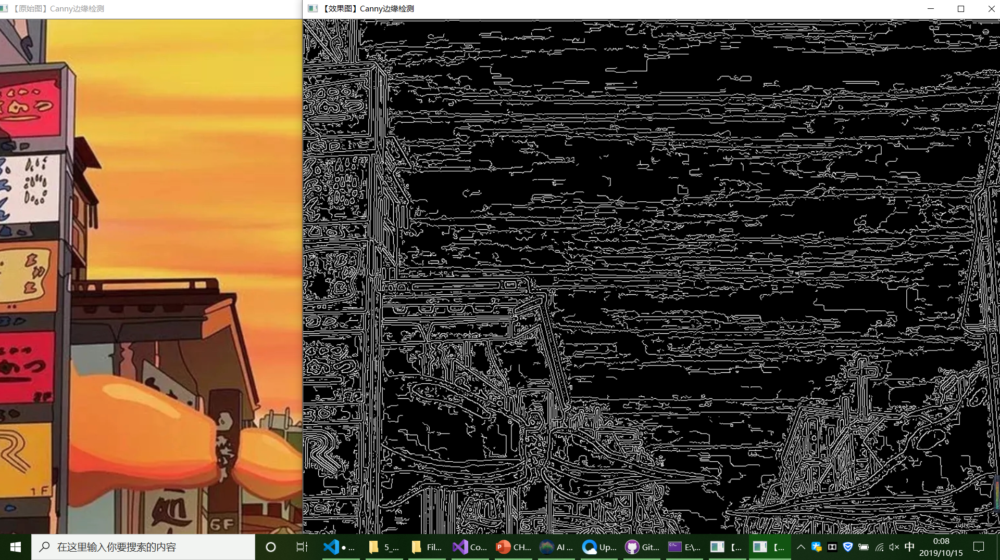

今天学习了openCV的基本数据结构
# 1.图像容器—Mat类：
    Mat是一个类，由两个数据部分组成：矩阵头（包含矩阵尺寸、存储方法、存储地址等信息）和一个指向储存所有像素值的矩阵（根据所选存储方式的不同，矩阵可以是不同的维数）的指针。
# 2.常用的数据结构和函数：
## 1.点的表示：point类
    Point point=Point（12，4）；
## 2.颜色的表示：Scalar类
     Scalar（）表示具有4个元素的数组，如果用不到第四个参数则不需要写出来
     Scalar（a，b，c）
## 3.尺寸的表示：Size类
     size（5，5）；
# 3.图像模糊处理

# 4.边缘检测

# 5. 总结
   了解openCV的基本数据结构让我对图像处理技术有了初步的认识，但还是不能自主的做出效果出来，对着书上的实验代码边写边理解，锻炼自己的编程能力。
