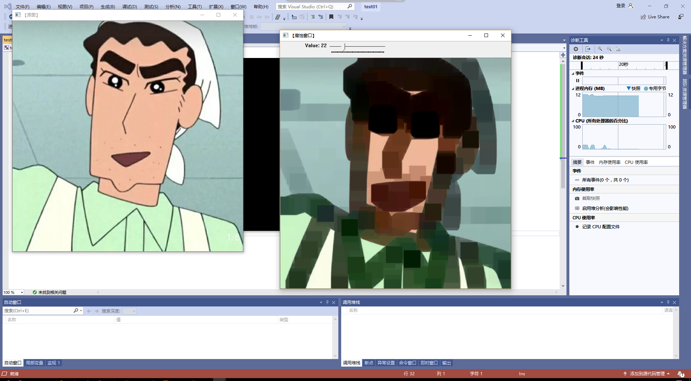
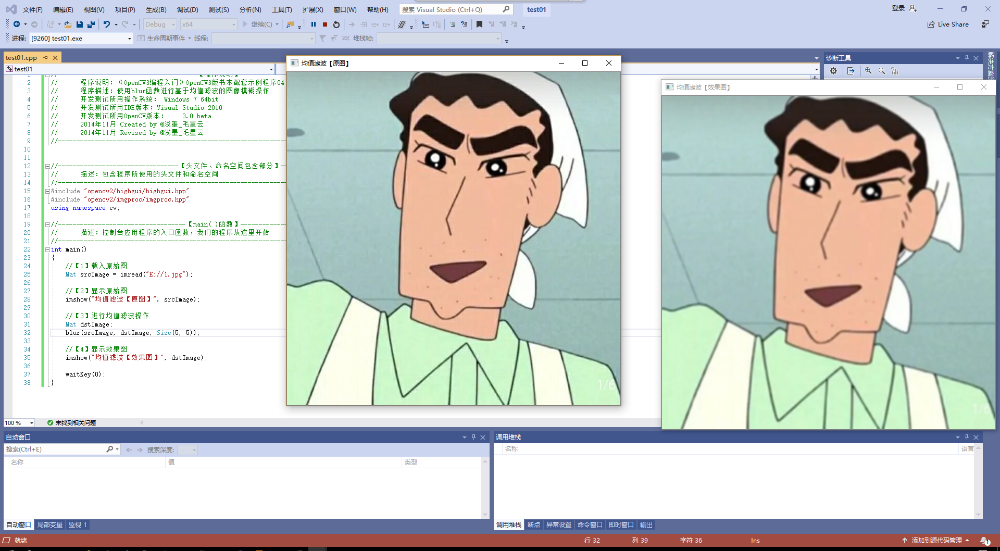

                                                                                                                                                                                                  ## 第二次作业
### 一.图像显示
  我知道了最简单的图像载入和显示只需要两句代码，这两句代码分别对应了两个函数，他们分别是imread()以及imshow()

  imread()函数用于文件中的图片到OpenCV中，可以在OpenCV官方文档中插到它的原型，在小括号内填入图片的路径。OpenCV的imread函数支持*jpg类型的图像载入

  inshow()函数用于在指定的窗口中显示一副图像，函数为imshow("【原始图】", srcImage)；如果窗口是用默认值标创建的，那么显示图像原始大小，否则，将图像进行缩放以适合窗口。而imshow函数缩放图像，取决于图像的深度

 
 ### 二.图像腐蚀
   将最基本的图像显示出来之后，我们学习了图像的腐蚀,腐蚀是形态学处理中最基本的操作，它可以分割独立图像元素。

   用element函数来获取结构化元素，需要输入两个参数，一是原始图像，另一个被称为结构化元素，它是用来决定操作的性质，具体函数表达式为：
   Mat element = getStructuringElement(MORPH_RECT, Size(15, 15));

   再运用腐蚀函数erode 显示效果图

   
   ### 三.blur图像模糊
     模糊操作是图像处理中最简单和常用的操作之一，均值滤波是典型的线性滤波算法，它是指在图像上对目标像素给一个模板，该模板包括了其周围的临近像素（以目标像素为中心的周围8个像素，构成一个滤波模板，即去掉目标像素本身），再用模板中的全体像素的平均值来代替原来像素值。运用blur函数进行均值滤波操作，
      
    函数表达为：blur(srcImage, dstImage, Size(7, 7));
   
   ### 四.canny边缘检测
     Canny 边缘检测算法被很多人认为是边缘检测的 最优算法, 最优边缘检测的三个主要评价标准是:低错误率，高定位性，最小响应。，先载入原始图片，在工程目录下存张素材图，再创建与src同类型和大小的矩阵，再将原图像转换为灰度图像，使用3*3内核来降噪，即运用blur函数，再运用Canny算子，函数表达式为：Canny(edge, edge, 3, 9, 3);Canny 边缘检测算法被很多人认为是边缘检测的 最优算法, 最优边缘检测的三个主要评价标准是:低错误率，高定位性，最小响应。
   
 ### 五.总结
   通过本次课程的学习，我掌握了图像的最基本的处理以及形态学操作。OpenCV为进行图像的形态学变换提供了快捷方便的函数，最基本的形态学操作是膨胀和腐蚀。图像的模糊也是基本操作之一，学会了这些内容，以后可以处理任何图像。 