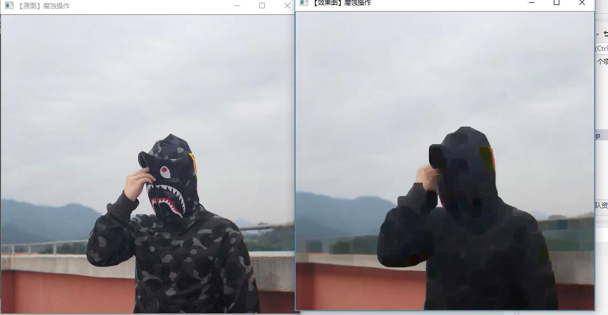
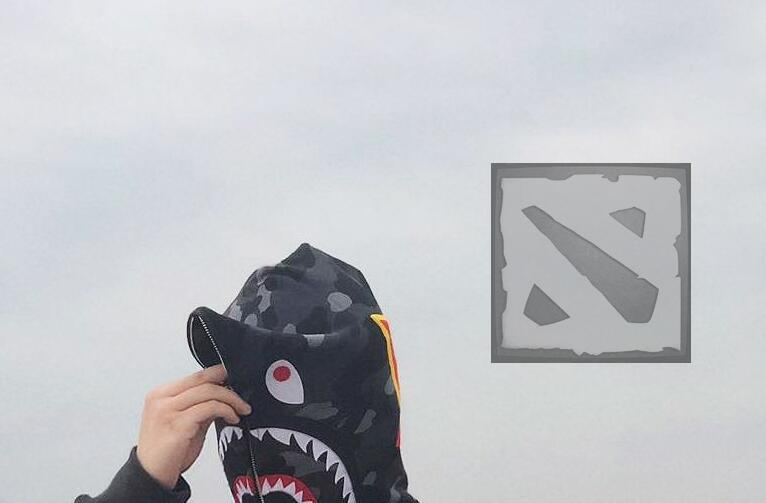

# 第二次作业
##  **腐蚀操作**

**代码如下**

    int main(){
        Mat srcImage = imread("a.jpg");
        imshow("原图", srcImage);
        Mat detimage;
        blur(srcImage, detimage, Size(5, 10));
        imshow("模糊", detimage);
        waitKey(0);
    }

**截图如下**

1. imread()函数是抓取图片内容
2. imshow() 函数是现实图片，第一个参数是窗口名称，第二个参数是定义的图片对象。
3. blur()函数就是模糊处理函数，实质为均值滤波函数。

## **添加操作**
`主要操作`
1. 首先要去定义两个图片**Mat image = imread("a.jpg");
	Mat logo = imread("dota_logo.jpg");**
2. 定义image一个区域给logo放图**imageROI = image(Rect(800, 350, logo.cols, logo.rows));**
3. 将logo加到指定区域**addWeighted(imageROI, 0.5, logo, 0.3, 0., imageROI);**
4. 效果图

## 总结
1. 对于图片的一些处理都是大同小异，我们至于要应用opencv的库。
2. 对于函数的应用并没有追求原理，我们只是运用，开源的库大大的减少了开发的困难。
3.在