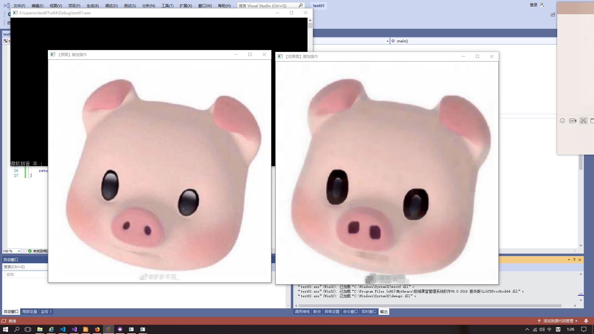

###20191010第二次作业

姓名：卞忻然       &nbsp;  学号：201702061

#####< 第二次车载信息处理课程学习———vs code，markdawn的下载及使用，简单的程序编程和测试，github的注册及使用>  
   
      在第二次课程的学习中，对我来说共分为三大部分。vs code，markdawn的下载及使用，简单的程序编程和测试，github的注册。
      在这里我为这三项内容进行一一讲解。
######一. vs code，markdawn的下载及使用
将官网中的vc code下载到电脑上，打开vs code，点击左边框栏第五项，在里面搜索markdawn并下载。
在顶栏选择新建文件，以.md格式保存到文件夹中，然后就可以开始写啦。
这里总结几个我会经常用到的语法：
1.标题 ：在标题前输入#表示添加标题，用#的数量来决定标题字的大小
2.字体 ：要加粗的文字左右分别用两个 * 号包起来
3.引用 ：在引用的文字前加>
4.分割线 ：三个或者三个以上的 - 或者 *
5.增加图片 ：!+[]+(网址)  （添加网络图片）
            !+[]+(路径)  （添加本地图片）
            其中有非常重要的一点在于，如果你的markdown在一个文件目录下，需要添加另一个目录下的图片，绝对路径是不可行的。需要 “迂回”。所谓迂回，即需要先用../../命令返回上一文件目录，直至可以顺利找到要添加图片的目录。
            再添加图片的过程中我尝试了很多路径，最后发现我保存的图片和mark dawn并不在同一个文件夹下，所以造成图片无法打开，后来加了../../后终于成功了。
6.代码 ：单行代码：代码之间分别用一个反引号包起来'代码'
        多行代码：代码之间分别用三个反引号包起来，且两边的反引号单独占一行


#####二. 三个简单的程序编程和测试
**1.图像显示**
运行结果 
在一开始调试的过程中，我遇到的错误是没有将图片放在对应的路径下，造成图片无法显示出来。后来将图片移在和源文件相同的路径。但还是报错了，经过查找，发现是图片名字不相同，修改了之后，运行成功！如图所示

**2.图像腐蚀**
运行结果
有了第一次的经验后，第二次的测试就相对容易了很多，将代码敲入后，就运行处了如图所示的结果。这也算是我第一次用opencv做出如图这样的效果。从图片中可以看出小猪整体变得模糊，图中黑色的部分变大。而这一切都是仅仅通过两行代码就实现了。
```C++
Mat element = getStructuringElement(MORPH_RECT, Size(15, 15));
	Mat dstImage;
```

   通过定义一个Mat类型的变量来获得getStructuringElement函数的返回值，这里getStructuringElement函数的返回值为指定形状和尺寸的结构元素。我将这里的15做出修改后，出来图像的腐蚀程度也有所不同。
腐蚀的原理在于它提取的是内核覆盖下的相素最小值。进行腐蚀操作时，将内核划过图像,将内核覆盖区域的最小相素值提取，并代替锚点位置的相素。

**3.图像模糊**
运行结果
这一次运行成功后，经过对比发现图像和原图相比更加模糊。观察代码发现，这一步与上一步的不同在于这两行代码：
```C++
Mat dstImage;
	blur(srcImage, dstImage, Size(7, 7));
```
	
这比上一个效果，这段代码就很好理解了，调用一次blur函数，修改参数，就获得如图所示的效果。
图像模糊的原理在于给图像预处理时减低噪声。


         做完这三项测试，让我对opencv的应用有了更加深刻的理解，通过代码，
         对函数的调用，对参数的修改就可以实现想要的效果。但这一切的基础源于
         数学的卷积等等思想，想要真正弄清，还要知道每种效果对应的数学公式。想要更加深入，
         还要多加练习。
 
#####三. github的注册及使用
一开始觉得所以全英文的网站非常陌生，凭着一些词组和个人感觉完成了github的注册。我觉得要去使用github首先要弄懂github这个网站是做什么的，根据龚老师的介绍和我自己的搜索查询，GitHub是一个面向开源及私有软件项目的托管平台，因为只支持git 作为唯一的版本库格式进行托管，故名GitHub。随着越来越多的应用程序转移到了云上，Github已经成为了管理软件开发以及发现已有代码的首选方法。
在找到了龚老师的库之后 ，我下载了客户端，填写仓库的信息，添加readme文件，也新建了自己的库。但对于github这个工具的探索还不止于此，在学习的过程中我体会到了学好英语的重要性。

    
    课堂总结：本次课上学到的内容很多，掌握了opencv图像处理的基本知识，摸索markdawn，摸索github，在这过程中，我深深感受到计算机网络世界的强大和丰富，要学的东西需要掌握的东西还有很多，希望自己继续加油！


