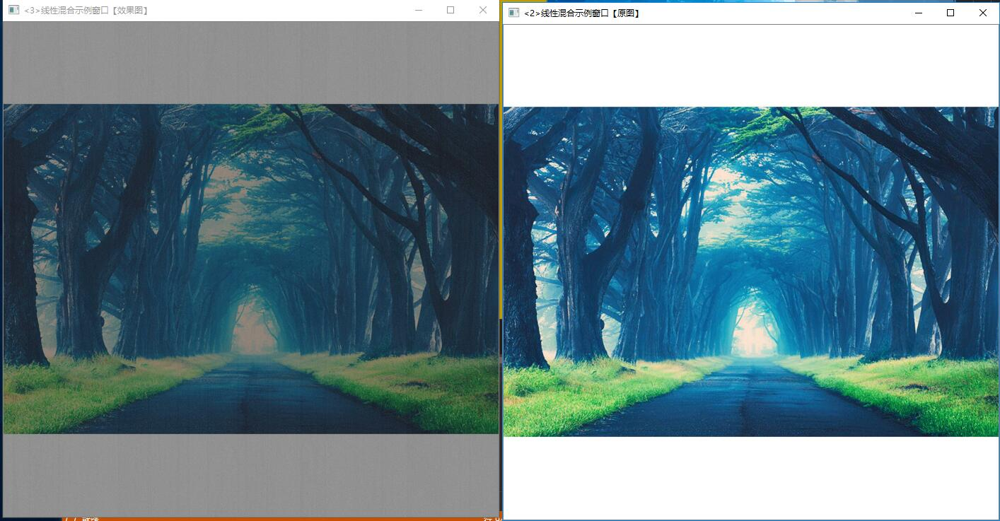

# 学习体会
在第一天配好的环境下，第二天的学习主要先完成昨天未完成的图像模糊，效果图如下

然后做了初级图像混合以及离散傅里叶变换，同时也学习了github。
具体如下：
  1. 第一个是ROI图像叠加，利用感兴趣区域ROI实现图像叠加先读入图像，再定义一个Mat类型并给其设定ROI区域，加载另一张图，将这张图放入ROI区域，显示图片，可以根据自己的需要改变掩模的位置，位置为0，0时在左上角，效果图如下：
    
2.  第二个是利用cv::addWeighted（）函数实现图像线性混合原函数如下
        void (InputArray srcl, double alpha, InputArray src2, double beta, doublegamma, OutputArray dst, int dtype=-1);

    1. 第一个参数，InputArray类型的src1，表示需要加权的第一个数组，常常填一个Mat。
    2. 第二个参数，alpha，表示第一个数组的权重
    3. 第三个参数，src2，表示第二个数组，它需要和第一个数组拥有相同的尺寸和通道数。
    4. 第四个参数，beta，表示第二个数组的权重值。
    5. 第五个参数，dst，输出的数组，它和输入的两个数组拥有相同的尺寸和通道数。
    6. 第六个参数，gamma，一个加到权重总和上的标量值。看下面的式子自然会理解。
    7. 第七个参数，dtype，输出阵列的可选深度，有默认值-1。;当两个输入数组具有相同的深度时，这个参数设置为-1（默认值），即等同于src1.depth（）。
   
3.  第三个线性混合实现函数,指定区域线性图像混合.利用cv::addWeighted（）函数结合定义感兴趣区域ROI，实现自定义区域的线性混合,具体图像如下

4. 最后进行了傅里叶级数的变换，上课没有时间做完，课下做了一下。
# 总结
今天对opencv的认识更加深入，同时也了解到github，对之后的学习很有帮助。
201702042 傅思康