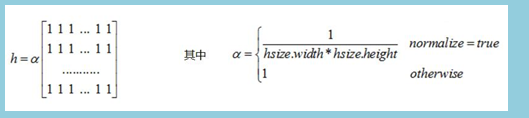
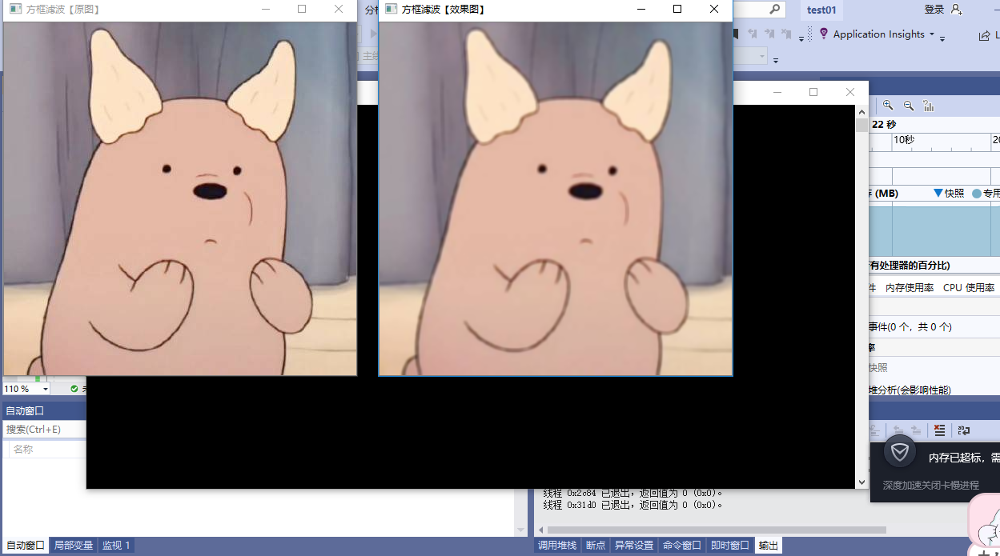
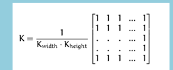
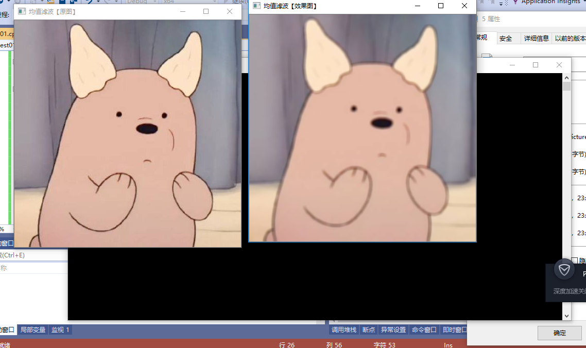
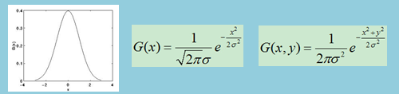
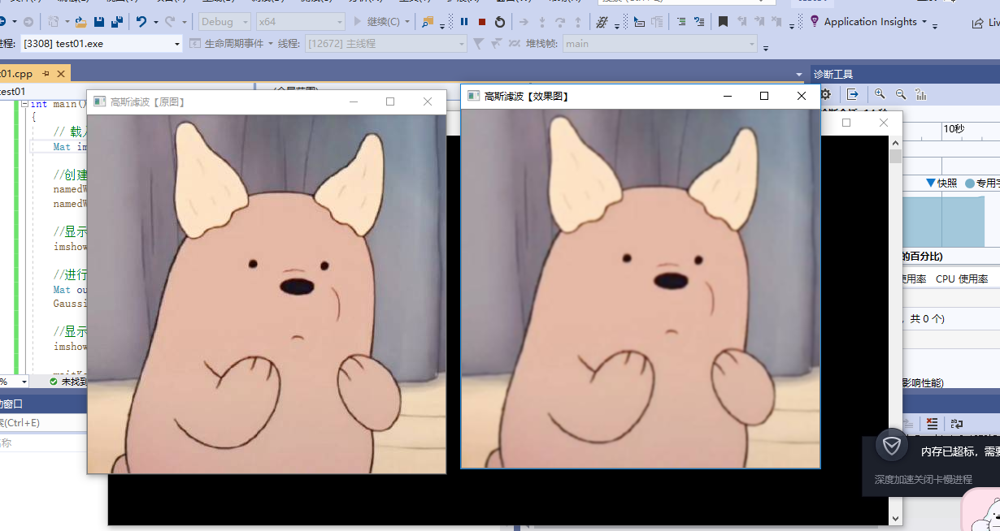
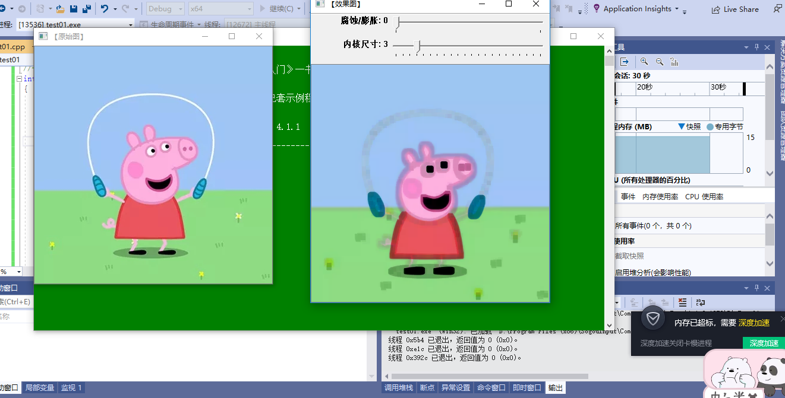
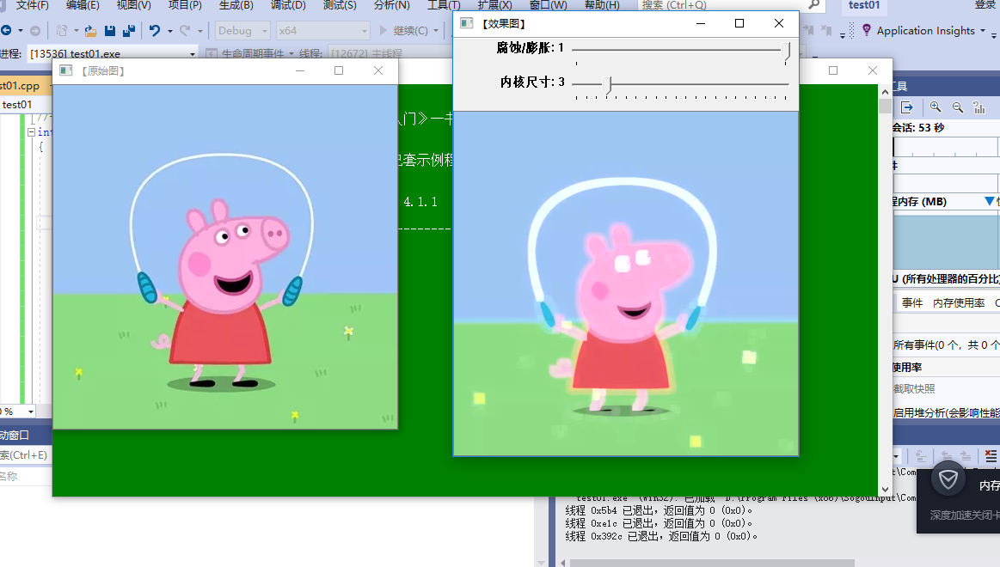
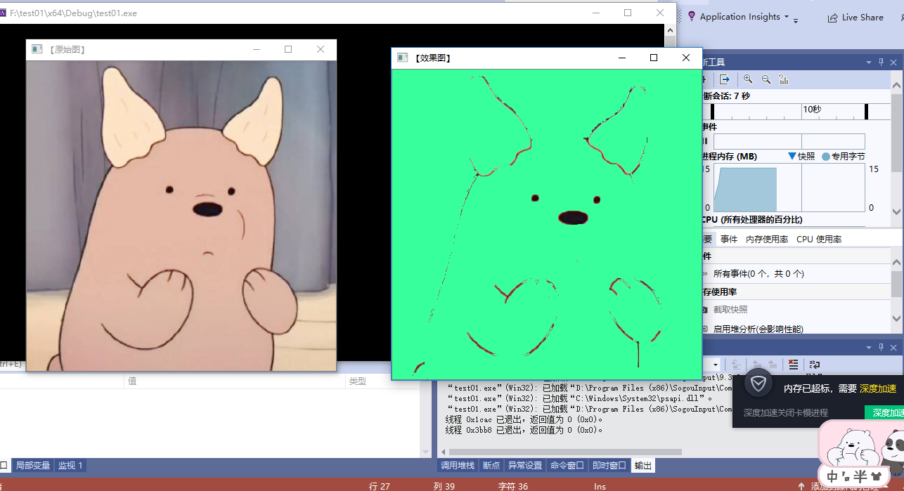

# 第三次作业
本次课学习图像处理
## 一.  线性滤波：方框滤波，均值滤波，高斯滤波
线性滤波器的原始数据与滤波结果是一种算术运算，即用加减乘除等运算实现，如均值滤波器（模板内像素灰度值的平均值）、高斯滤波器（高斯加权平均值）等。由于线性滤波器是算术运算，有固定的模板，因此滤波器的转移函数是可以确定并且是唯一的（转移函数即模板的傅里叶变换）。
### 1.方框滤波：boxFilter函数
boxFilter函数的作用是使用方框滤波（box filter）来模糊一张图片。

方框滤波用到的核：

当normalize为true时，方框滤 波也就成了均值滤波。也就是说均值滤波是方框滤波归一化后的特殊情况。归一化就是将要处理的量缩放到一定范围，比如(0, 1)。

函数原型：

C++: void boxFilter(InputArray src,OutputArray dst,int ddepth,Size ksize,Point anchor=Point(-1,-1),boolnormalize=true,int borderType=BORDER_DEFAULT)

ddepth:输出图像的深度，-1代表使用原图像深度，即src.depth()

ksize: Size类型表示内核大小,一般用Size(w,h)表示内核大小，Size(3,3)表示3x3的核大小

anchor:表示锚点(即被平滑的那个点)，默认值Point(-1, -1),表示锚点在核中心

normalize:认值true, 标识符，表示内核是否被归-化
borderType:图像像素边界模式，一般用默认值即可

运行结果：

### 2.均值滤波
blur函数的作用是对输入的图像均值滤波后用dst输出。

均值滤波用到的核：

均值滤波即方框滤波归一化特例，就是用邻域内像素均值来代替该点像素值，均值滤波在去噪的同时也破坏了图像细节部分函数原型。

函数原型：

C++:  void blur(InputArray src,OutputArray,dst,Size ksize,Point anchor=Point(-1,-1),int borderType=BORDER_DEFAULT)

ksize: Size类型表示内核大小，一般用Size(w.h)表 示内核大小，Size(3,3)表示3x3的核大小

anchor:表示锚点(即被平滑的那个点)，默认值Point(-1,-1),表示锚点在核中心

borderType: 图像像素边界模式，一般用默认值
即可

运行结果：

### 3.高斯滤波
 GaussianBlur函数的作用是用高斯滤波来模糊一张图片。
 高斯滤波器被称为最有用的滤波器每个像素点都是由本身和邻域内的其他像素值经过加权平均后得到的，加权系数越靠近中心越大，越远离中心越小，能够很好的滤除噪声。

 函数原型：

 C++: void GaussianBlur(InputArray src,OutputArray dst,Size ksize,double sigmaX,double,sigmaY=0,int borderType=BORDER_DEFAULT)

ksize:高斯内核大小，一般用Size(w.h)表示内核大小，w,h可以不同，但是必须为正奇数或者0,由sigma计算得来

siamaX:表示高斯函数在X方向上的标准偏差

sigmaY:表示高斯函数在Y方向上的标准偏差，若sigmaY=0,就将它设置为sigmaX;
若sigmaY=0 &&sigmaX=0则 由ksize.width和ksize.heiaht计算出来

borderType:图像像素边界模式，般用默认值即可

运行结果：

## 二.形态学滤波：腐蚀与膨胀
### 1.形态学的概述
1.形态学操作就是基于形状的 系列图像处理操作。

2.最基本的形态学操作有两种:膨胀和腐蚀。这里需要注意的是:形胀和腐蚀是对白色部分而言的，不是黑色部分。
### 2.腐蚀
腐蚀在形态学操作家族里是膨胀操作的孪生姐妹。它提取的是内核覆盖下的相素最小值。进行腐蚀操作时，将内核划过图像,将内核覆盖区域的最小相素值提取，并代替锚点位置的相素。以与膨胀相同的图像作为样本,我们使用腐蚀操作。
### 3.膨胀
此操作将图像与任意形状的内核，通常为正方形或圆形,进行卷积。内核有一个可定义的锚点, 通常定义为内核中心点。进行膨胀操作时，将内核划过图像,将内核覆盖区域的最大相素值提取，并代替锚点位置的相素。显然，这一最大化操作将会导致图像中的亮区开始”扩展” (因此有了术语膨胀 dilation )

运行结果：

## 三.漫水填充
### 1.概念
将与种子点相连的像素相近的连通域替换成指定颜色。如果存在mask，不会填充mask的非零像素。比如边缘检测输出图像可作为mask图
### 2.作用
1、标记或分离目标区域；
2、获取掩码区域，只处理掩码指定的像素点，加速处理过程。
### 3.实现漫水填充算法：floodFill函数
第一个函数原型：

int cv::floodFill( InputOutputArray _image, Point seedPoint,Scalar newVal, Rect* rect,   Scalar loDiff, Scalar upDiff, int flags )

floodFill(InputOutputArray image）：1/3通道8位或浮点图像

Point seedPoint：种子点，起始点

Scalar newVal：指定颜色

Rect* rect=0：设定重绘区域的最小边界矩形

Scalar loDiff=Scalar()：当前观察象素值与其部件领域象素或者待加入该部件的种子象素之负差(Lower difference)的最大值。低于这个差距的不属于重绘区域

Scalar upDiff=Scalar(),当前观察象素值与其部件领域象素或者待加入该部件的种子象素之正差(upper difference)的最大值。高于这个差距的不属于重绘区域
int flags=4)

对于单通道图、8位图，flag可取4邻域（默认）或8邻域

第二个函数原型：

int cv::floodFill( InputOutputArray _image, InputOutputArray _mask,Point seedPoint, Scalar newVal, Rect* rect, Scalar loDiff, Scalar upDiff, int flags )

lags组合可以用“|”或符号8|FLOODFILL_FIXED_RANGE|FLOODFILL_MASK_ONLY|(38<<8)

意思是8邻域填充固定范围的掩模图像，填充值为38。  38<<8意思是38左移8位

Mask图长和宽上都比输入图像 image 大两个象素点

运行结果：

## 总结
本次课中，我们学习了各种利用OpenCV进行图像处理的方法。包括属于线性滤波的方框滤波、均值滤波与高斯滤波，其实还有属于非线性滤波的，还学习了各种形态学基本操作，这里主要学习了膨胀与腐蚀。也学习了漫水填充方法。在这些中，我学习了对于各个方法所用到的函数，比如boxFilter，blur，GaussianBlur，等等函数。用这些函数调用运行调试出结果。在之前，我并没有接触过这些知识，因为初步接触这些，对这些充满好奇。在学习的过程中，我充分认识到opencv的魅力，对于图像的处理有了基本的认识，虽然还有些不懂的地方，但是经过百度搜索，大概了解这些，但还有好多学习的地方。其次，我在学习中，认识自己的不足，直接将代码提取，没有仔细了解和学习，对此我反思自己。对于图像处理，实际上还是一个重复学习的过程，很多在以前学习过程中一笔带过，或者看不懂就拉倒的地方，现在就必须认真仔细地来看，因为这门课很重要。这个过程中，反思走过的路，悟出了一些东西，也努力改掉自己的不足，当然也在这门课，学习到很多东西，收获颇多。

