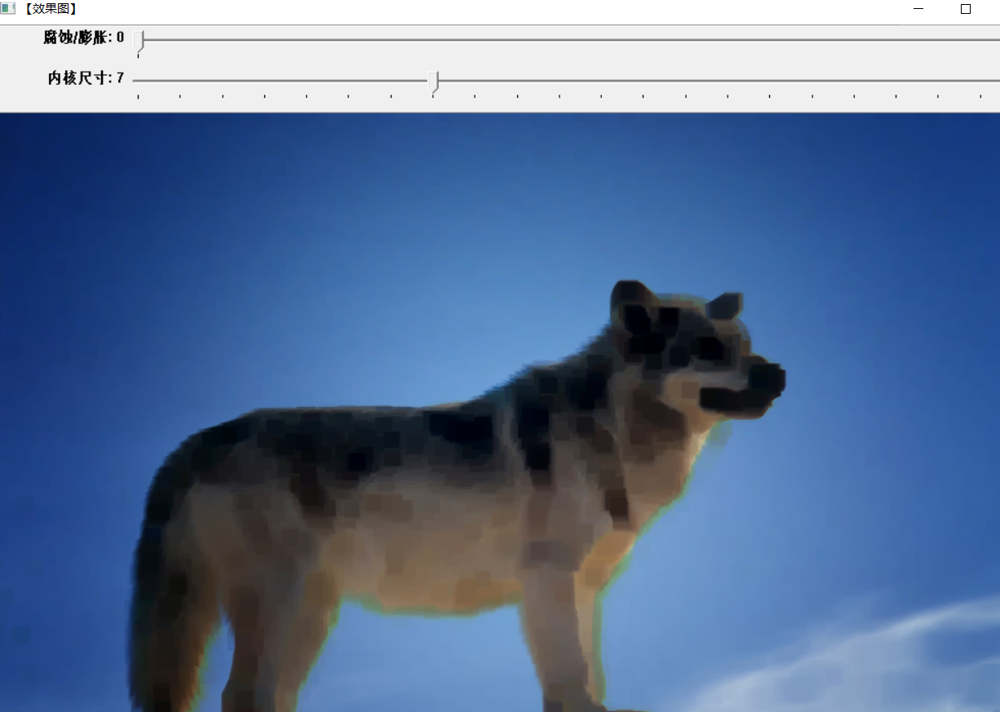
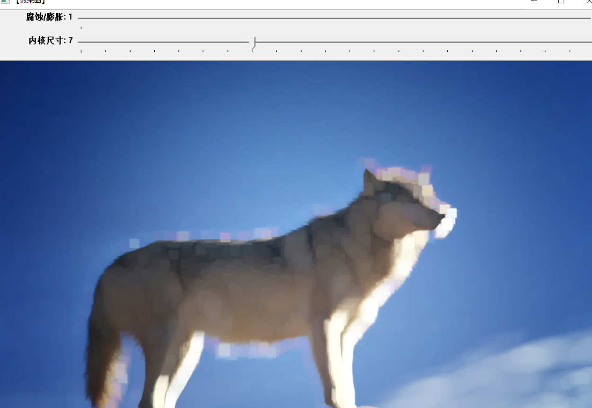
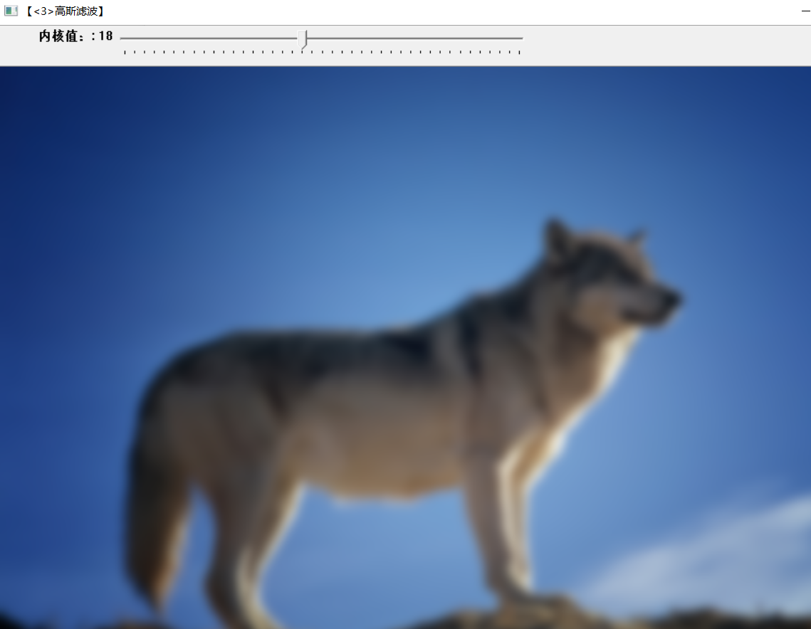
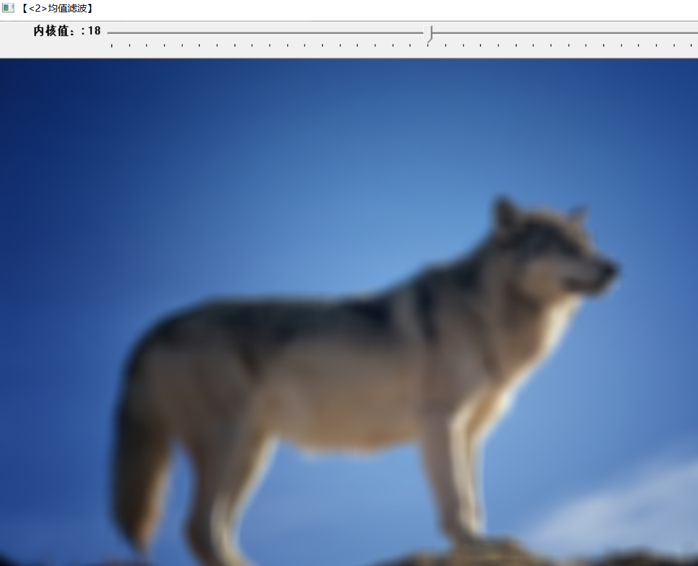
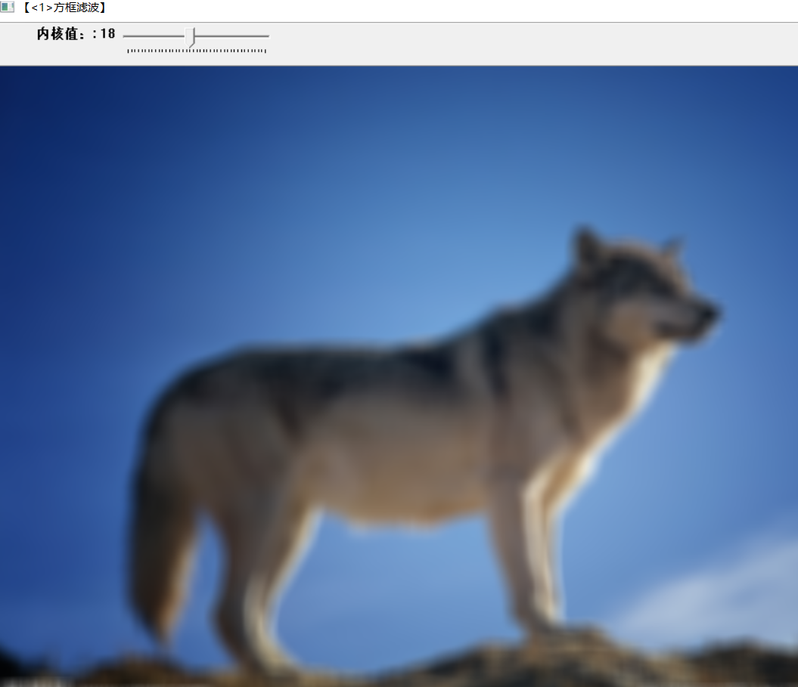

# 第三次作业

## 模糊和膨胀处理
1. 用createTrackbar()函数来设置轨迹条
2. erode()是模糊处理
3. dilate()是膨胀处理
>模糊处理

>>**进行腐蚀操作时，将内核 B 划过图像,将内核 B 覆盖区域的最小相素值提取，并代替锚点位置的相素。**

>膨胀处理

>>**超出图像边界的像素值定义为该数据类型允许的最小值，对于二进制图像，这些像素值设置为0；对于灰度图像，unit8类型的最小值也为0。**

## 方框滤波，均值滤波，高斯滤波比较
>高斯滤波

高斯滤波的优点可以集中在高斯函数的特点上来看
1. 二维高斯函数是旋转对称的，在各个方向上平滑程度相同，不会改变原图像的边缘走向。
2. 高斯函数是单值函数，高斯卷积核的锚点为极值，在所有方向上单调递减，锚点像素不会受到距离锚点较远的像素影响过大，保证了特征点和边缘的特性。
3. 在频域上，滤波过程中不会被高频信号污染。

>均值滤波

>>**均值滤波是一种线性滤波器，处理思路也很简单，就是将一个窗口区域中的像素计算平均值，然后将窗口中计算得到的均值设置为锚点上的像素值。**

>方框滤波

>>**方框滤波（box Filter）被封装在一个名为boxblur的函数中，即boxblur函数的作用是使用方框滤波器（box filter）来模糊一张图片，从src输入，从dst输出。**

**若色彩度高的图片可以看出高斯滤波的效果最好**