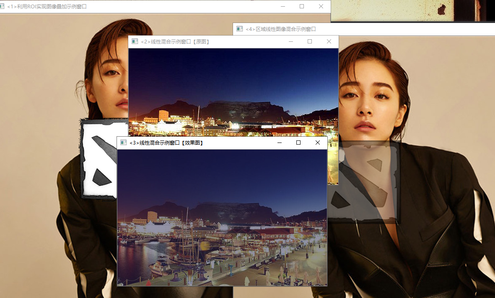
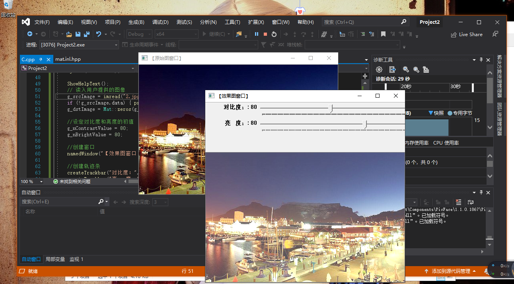

学习小结：
1，安装VScode，Markdown。这个很有必要，因为这是我们进行总结和作业的软件，软件并不大，安装也很快。
2，安装Github,并完成注册。这是本课程中进行作业上交的最后一步，在Markdown中完成的作业将通过这一平台进行提交。
3，初级图像混合。在配置好的VS环境下建立项目，将所需的混合图像全部放到项目文件夹当中，载入测试代码，反复进行错误修改、调试，最后得出混合效果图。
4，图像对比度、亮度值调整。这个应该十分常见了，平时常用的手机电脑都可以见到对比度，亮度等。同样载入代码并锁定我们想调整的图片路径，然后进行调试过程，最后得出效果图。
注意：
1，Github的注册过程可能会稍显麻烦，在发送注册请求后我们还得按软件方所发邮件进行验证。验证成功后表明你拥有了一个GitHub账号，用这个属于你的账号就可以登录空间进行工作了。
2，在步骤3,4中，调试过程可能会十分麻烦，错误可能会很多，这就要我们有足够的耐心去一层层的修改。而这一过程恰好可以培养我们的程序调试能力，相当水平的调试能力于我们来说是十分重要的。
3，如果想获得更多不同的效果，将对应路径下图片进行替换即可。

