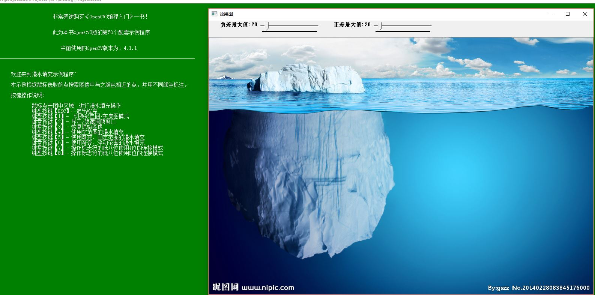
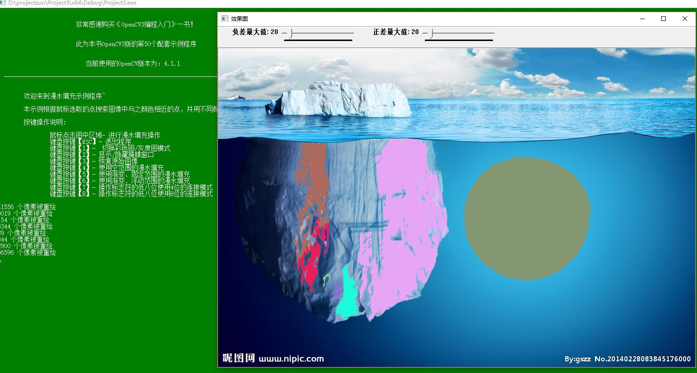
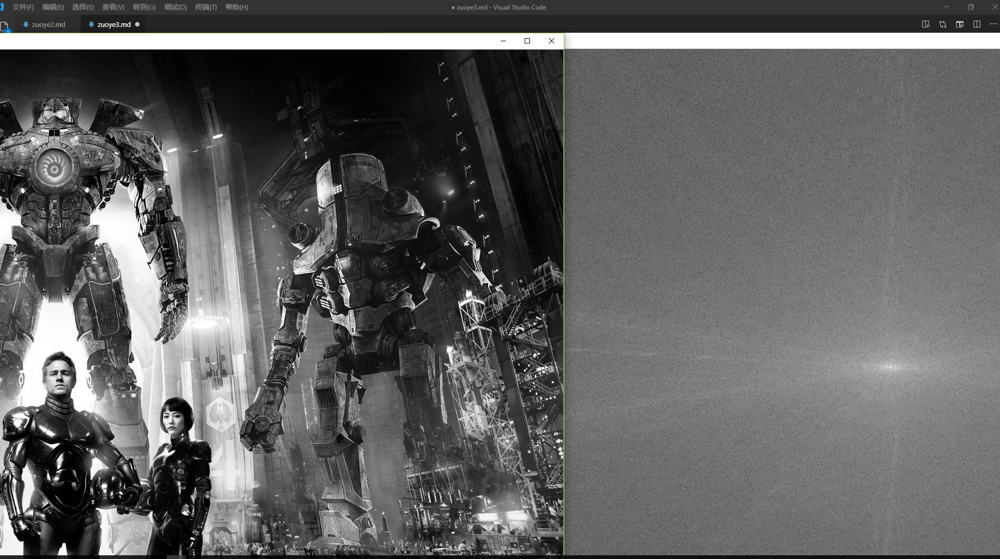

#Canny边缘检测、漫水填充及离散傅里叶变换
##一、实验主题：
###Canny边缘检测、漫水填充及离散傅里叶变换
##二、实验目的：
###1.如何使用opencv处理最基本的形态操作：canny边缘检测，漫水填充的处理以及离散傅里叶变换的函数基本了解；
###2.掌握opencv运行环境及函数的基本处理；
###3.编写程序以及对程序的深入了解。
##三、实验代码及相关知识点：
###1.Canny边缘检测代码：
using namespace cv;
	int main()
	{
		//【0】载入原始图  
		Mat srcImage = imread("C:\\Users\\Windows10\\Desktop\\004.jpg");  //工程目录下应该有一张名为1.jpg的素材图
		imshow("【原始图】Canny边缘检测", srcImage); 	//显示原始图 
		Mat dstImage, edge, grayImage;	//参数定义
		dstImage.create(srcImage.size(), srcImage.type());
		cvtColor(srcImage, grayImage, COLOR_BGR2GRAY);

		//【3】先用使用 3x3内核来降噪
		blur(grayImage, edge, Size(3, 3));

		//【4】运行Canny算子
		Canny(edge, edge, 3, 9, 3);

		//【5】显示效果图 
		imshow("【效果图】Canny边缘检测", edge);

		waitKey(0);

		return 0;
	}
###2.漫水填充代码及应用函数：
略
（1）theRNG():int b=(unsigned)theRNG() &255; //随即返回一个0~255之间的值 
（2）threshold() :阈值函数 
（3）Scalar():Scalar定义可存放1—4个数值的数值。
###3.离散傅里叶变换代码及应用的类和函数
略
###应用到的类和函数
copyMakeBorder：
功能：扩充图像边界
结构：
void copyMakeBorder(InputArray src, OutputArray dst, int top, int bottom,int left, int right, int borderType, const Scalar& value=Scalar() )
src ：原图像.
dst ：输出图像，和src有同样的类型，并且size应该是(src.cols+left+right,src.rows+top+bottom)
top 、bottom、left 、right ： 这四个参数风别表示在源图像的四个方向上分别扩充多少像素，例如top=1, bottom=1, left=1, right=1 意味着在源图像的上下左右各扩充一个像素宽度的边界。
borderType – 边界类型
value – 边界值，如果borderType==BORDER_CONSTANT .
getOptimalDFTSize：
功能：返回给定向量尺寸的傅里叶最优尺寸大小，意思就是为了提高离散傅立叶变换的运行速度，需要扩充图像，需要扩充多少，就由这个函数计算得到。
结构：
int getOptimalDFTSize(int vecsize)
vecsize：向量尺寸，即图片的rows，cols
merge：
功能：合并多个单通道图像到一个多通道图像
结构：
void merge(const Mat*mv, size_t count, OutputArray dst)
mv：被合并的图像指针，所有的图像必须要相同的size和depth
count：被合并图像的数目
dst：输出图像，图像的size和depth和mv[0]相同，通道数为被合并图像通道数的总和
dft：
功能：进行傅里叶变换
##四、实验效果：
###1.Canny边缘检测效果

###2.漫水填充效果显示

###3.离散傅里叶变换

##五、实验总结
本次实验了解到的知识，一方面是对Canny边缘检测的基本操作。另一个也对漫水填充有了深刻的认识。漫水填充是一种用特定的颜色填充连通区域，通过设置可连通像素的上下限以及连通方式来达到不同的填充效果的方法。漫水填充经常被用来标记或者分离图像的一部分，以便对其进行进一步处理或者分析，也可以用来从输入图像获取掩码区域，掩码会加速处理过程，或只处理掩码指定的像素点，操作的结果总是某个连续的区域。另外，离散傅立叶变换的一个应用是决定图片中物体的几何方向，其中应用的函数众多，做实验的过程中同时也学到了不少的函数知识。总之，我们只有理论与实践相结合，才能有更加深刻的印象，学的更加扎实。

