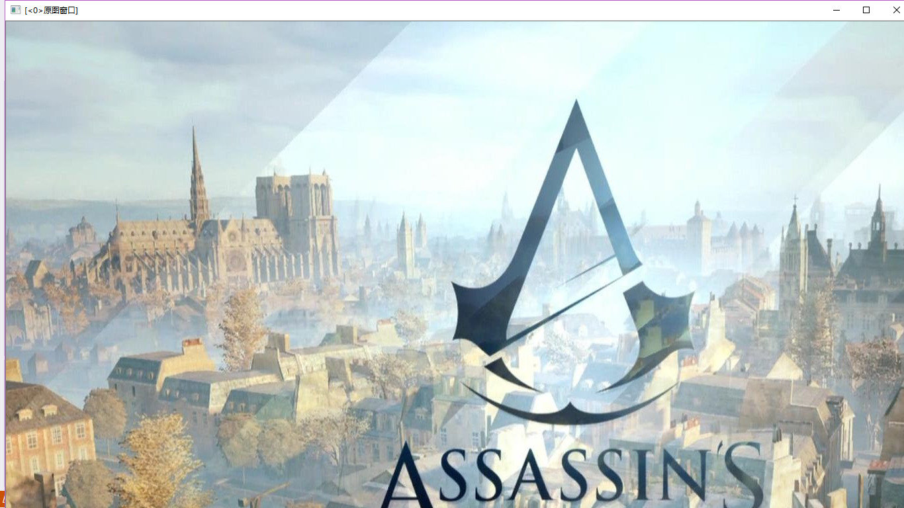
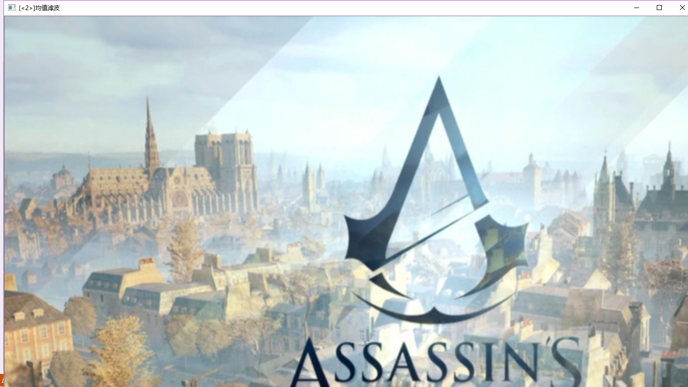

>>>>>>>>># 第三次作业
#### 包括第二次作业的对图片的处理成功后，进行了OpenCV3编程入门的书本学习。

>>> #### 第六章 图像处理
*  这节课我们主要学了6.1章：线型滤波：方框滤波、均值滤波、高斯滤波。
*  5种常用的图像平滑处理操作方法： 
+  方框滤波：BoxBlur函数
+  均值滤波（领域平均滤波）：Blur函数
+  高斯滤波：GaussianBlur函数
+  中值滤波：medianBlur函数
+  双边滤波：bilateralFilter函数
主要讲解了线性滤波的方框滤波，均值滤波和高斯滤波。

*  线性滤波：可以剔除输入型号中不想要的频率或者选中一个自己想要的程序。以下为几种常见的线性滤波器：
*  低通滤波器：允许低频率通过。
*  高通滤波器：允许高频率通过。
*  带通滤波器：允许一定范围频率通过。
*  带阻滤波器：阻止一定范围频率通过并且允许其他频率通过。
*  全通滤波器：允许所有频率通过，仅仅改变相位关系。
*  陷波滤波器：阻止一个狭窄频率范围通过，是特殊的带阻滤波器。
*  我们现在用到的是低通、高通、带通多一些。

#### 核心API函数：
本节的内容是为了大家能快速上手boxFilter（方框滤波）、blur（均值滤波）和GaussianBlur（高斯滤波）

### 1. 方框滤波：
* 方框滤波：boxblur函数的作用是使用方框滤波器（box filter）来模糊一张图片。
  void boxFilter(InputArray src,OutputArray dst, int ddepth, Size ksize, Point anchor=Point(-1,-1), boolnormalize=true, int borderType=BORDER_DEFAULT )  

参数详解：
* 第一个参数，InputArray类型的src，输入图像，即源图像，填Mat类的对象即可。该函数对通道是独立处理的，且可以处理任意通道数的图片，但需要注意，待处理的图片深度应该为CV_8U, CV_16U, CV_16S, CV_32F 以及 CV_64F之一。
  
* 第二个参数，OutputArray类型的dst，即目标图像，需要和源图片有一样的尺寸和类型。
  
* 第三个参数，int类型的ddepth，输出图像的深度，-1代表使用原图深度，即src.depth()。
  
* 第四个参数，Size类型（对Size类型稍后有讲解）的ksize，内核的大小。一般这样写Size( w,h )来表示内核的大小( 其中，w 为像素宽度， h为像素高度)。
  
* 第五个参数，Point类型的anchor，表示锚点（即被平滑的那个点），注意他有默认值Point(-1,-1)。如果这个点坐标是负值的话，就表示取核的中心为锚点，所以默认值Point(-1,-1)表示这个锚点在核的中心。
  
* 第六个参数，bool类型的normalize，默认值为true，一个标识符，表示内核是否被其区域归一化（normalized）了。
  
* 第七个参数，int类型的borderType，用于推断图像外部像素的某种边界模式。

### 2.均值滤波

* 均值滤波：blur函数（对输入的图像src进行均值滤波后用dst输出）在2.md中对blur函数进行了讲解，但是不是完全版，是缩减版。
  
* 缩减版 blur(srcImage,dstImage,Size(7,7));
  srcImage：是原图片src。进行均值滤波处理。
  dstImage：是经过均值滤波处理的照片，用dst输出。
  Size( w,h )：来表示内核的大小( 其中，w 为像素宽度， h为像素高度)。

* 完整版： void blur(InputArray src, OutputArraydst, Size ksize, Point anchor=Point(-1,-1), int borderType=BORDER_DEFAULT ) 
  
* 第一个参数，InputArray类型的src，输入图像，即源图像，填Mat类的对象即可。该函数对通道是独立处理的，且可以处理任意通道数的图片，但需要注意，待处理的图片深度应该为CV_8U, CV_16U, CV_16S, CV_32F 以及 CV_64F之一。
* 
* 第二个参数，OutputArray类型的dst，即目标图像，需要和源图片有一样的尺寸和类型。
  
* 第三个参数，Size类型（对Size类型稍后有讲解）的ksize，内核的大小。一般这样写Size( w,h )来表示内核的大小( 其中，w 为像素宽度， h为像素高度)。
* 第四个参数，Point类型的anchor，表示锚点（即被平滑的那个点），注意他有默认值Point(-1,-1)。如果这个点坐标是负值的话，就表示取核的中心为锚点，所以默认值Point(-1,-1)表示这个锚点在核的中心。
* 第五个参数，int类型的borderType，用于推断图像外部像素的某种边界模式。

### 3.高斯滤波
* 高斯滤波：是一种线性平滑滤波，对整幅图画进行加权平均的过程，每一个像素点的值，都由其本身和领域内的其他像素值经过加权平均后得到。
* 高斯模糊技术生成的图像，其视觉效果就像是经过一个半透明屏幕在观察图像，高斯平滑也用于计算机视觉算法中的预先处理阶段，以增强图像在不同比例大小下的图像效果。从数学的角度来看，图像的高斯模糊过程就是图像与正态分布做卷积。由于正态分布又叫作高斯分布，所以这项技术就叫作高斯模糊。
图像与圆形方框模糊做卷积将会生成更加精确的焦外成像效果。由于高斯函数的傅立叶变换是另外一个高斯函数，所以高斯模糊对于图像来说就是一个低通滤波操作。
* 高斯滤波器是一类根据高斯函数的形状来选择权值的线性平滑滤波器。
* GaussianBlur函数：是用高斯滤波器来模糊一张图片，对输入的图像src进行高斯滤波后用dst输出。它将源图像和指定的高斯核函数做卷积运算，并且支持就地过滤
* void GaussianBlur(InputArray src,OutputArray dst, Size ksize, double sigmaX, double sigmaY=0, intborderType=BORDER_DEFAULT ); 
  
* 第一个参数，InputArray类型的src，输入图像，即源图像，填Mat类的对象即可。它可以是单独的任意通道数的图片，但需要注意，图片深度应该为CV_8U,CV_16U, CV_16S, CV_32F 以及 CV_64F之一。
  
* 第二个参数，OutputArray类型的dst，即目标图像，需要和源图片有一样的尺寸和类型。比如可以用Mat::Clone，以源图片为模板，来初始化得到如假包换的目标图。
  
* 第三个参数，Size类型的ksize高斯内核的大小。其中ksize.width和ksize.height可以不同，但他们都必须为正数和奇数。或者，它们可以是零的，它们都是由sigma计算而来。
  
* 第四个参数，double类型的sigmaX，表示高斯核函数在X方向的的标准偏差。
  
* 第五个参数，double类型的sigmaY，表示高斯核函数在Y方向的的标准偏差。若sigmaY为零，就将它设为sigmaX，如果sigmaX和sigmaY都是0，那么就由ksize.width和ksize.height计算出来。
为了结果的正确性着想，最好是把第三个参数Size，第四个参数sigmaX和第五个参数sigmaY全部指定到。

* 第六个参数，int类型的borderType，用于推断图像外部像素的某种边界模式。
  

####  这三个函数其实原图像src、以dst输出，Size(w,h)，int类型的borderType，都是相同的，只是中间的处理方式不同，中间有一两个参数代表不同，这样执行不同方向的操作，对图片进行不同方面的滤波。
三个函数集合后的运算后果
#### 1.第一个

#### 2.第二个

##### 下回就会在课堂上跟上老师的节奏，就不至于下来写作业的时候特别的麻烦，要自己去敲代码然后进行运行，报错修改，在课堂上可以问同学问老师快速解决，这回对于后来运行出来的代码结果蛮开心的。因为昨晚写的很晚，意识有点疲倦，所以在敲代码的时候就是经常串行，倒是一直报错，不停地对照修改，确保自己没有打串行，没有打错。最终结果出来的时候特别欣喜，就觉得自己的熬夜也是有结果的，就睡得也心安理得的。

