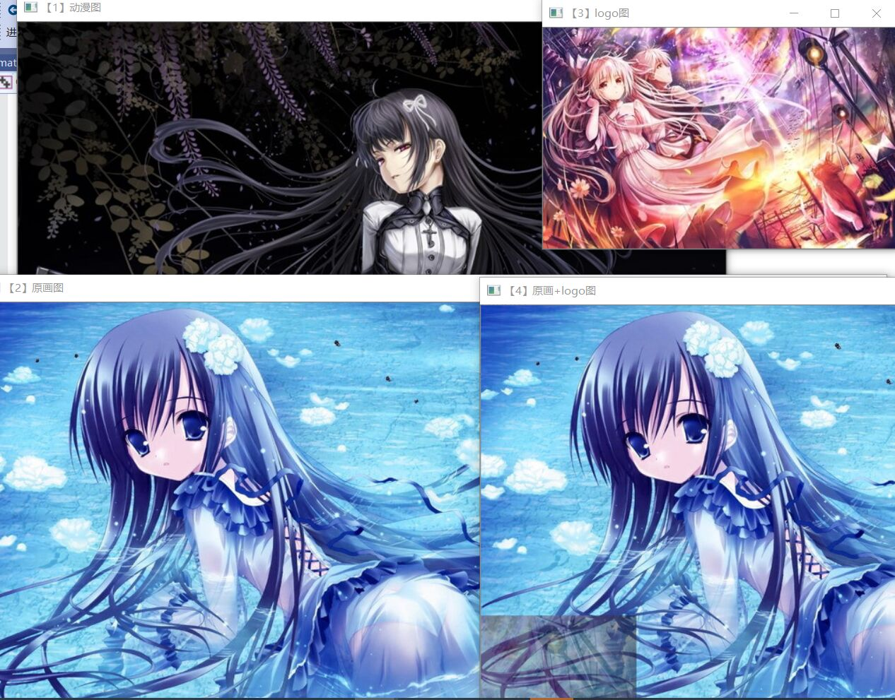
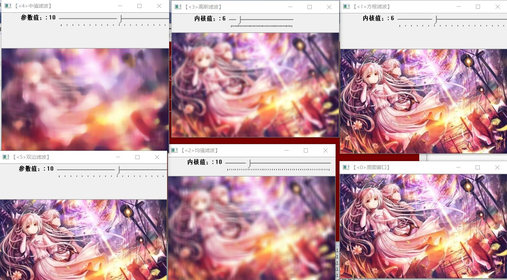
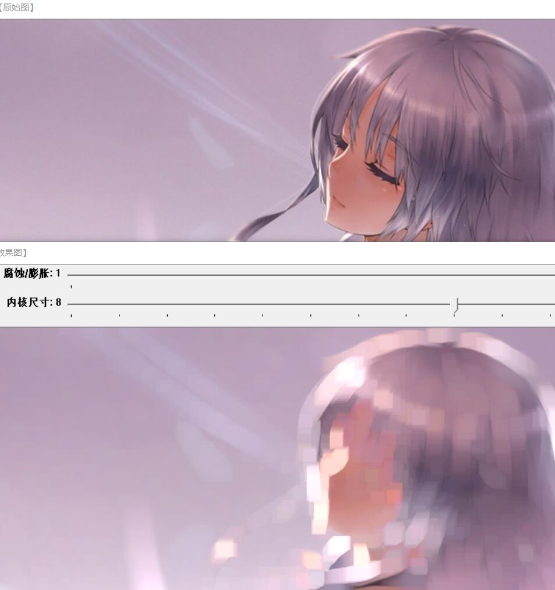
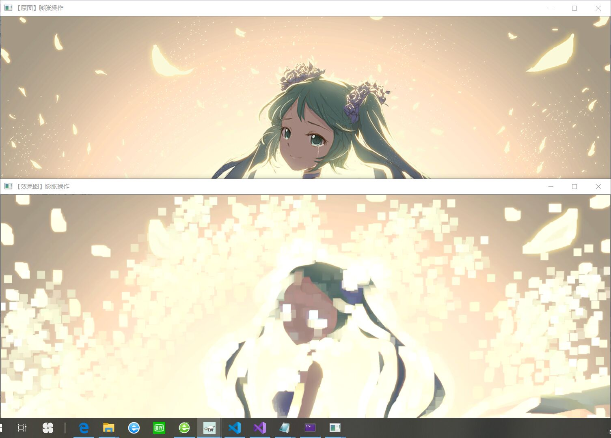
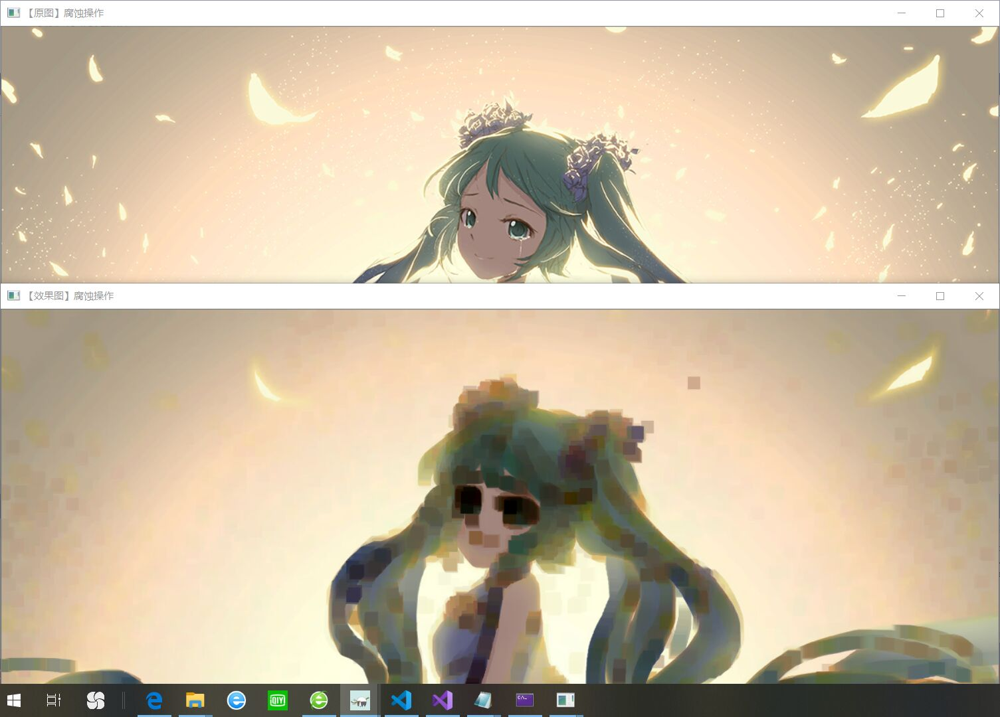

# 第三次作业
1. 学习图像的载入，显示和输出，这是一个图片处理的混合实验，首先和之前一样需要更改图片的路径，但还需要在里面删掉199，否则会报错，同时要注意图片的大小，不然也会报错。实验结果如下：

2. 学习图像滤波综合，滤波有方框滤波，均值滤波，高斯滤波，中值滤波，双边滤波。在实验中没做什么具体的改动，只改了些基础变化，实验结果如下：
 
3. 学习图像的腐蚀和膨胀，腐蚀和膨胀是一对相反的操作，腐蚀采用erode函数，膨胀采用dilate函数，还有一种两者结合的，实验改动跟之前差不多，实验结果如下：

4. 
今天，相较于之前两次，这次做的实验比较多，有综合的，也有单一的，让我学的很充实。在这次实验中，也讲到了傅里叶的变换。傅里叶变换有六种滤波器————低通滤波器，高通滤波器，带通滤波器，带阻滤波器，全通滤波器，陷波滤波器。同时，傅里叶变换的目的并不是为了观察图像的频率分布（至少不是最终目的），更多情况下是为了对频率进行过滤，通过修改频率以达到图像增强、图像去噪、边缘检测、特征提取、压缩加密等目的。

