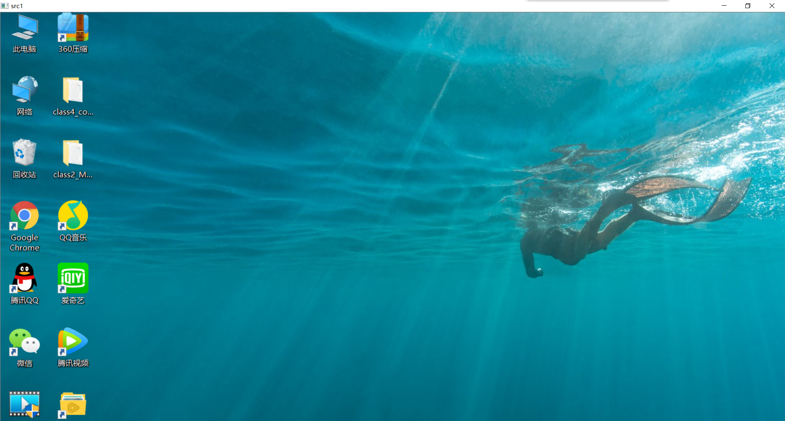
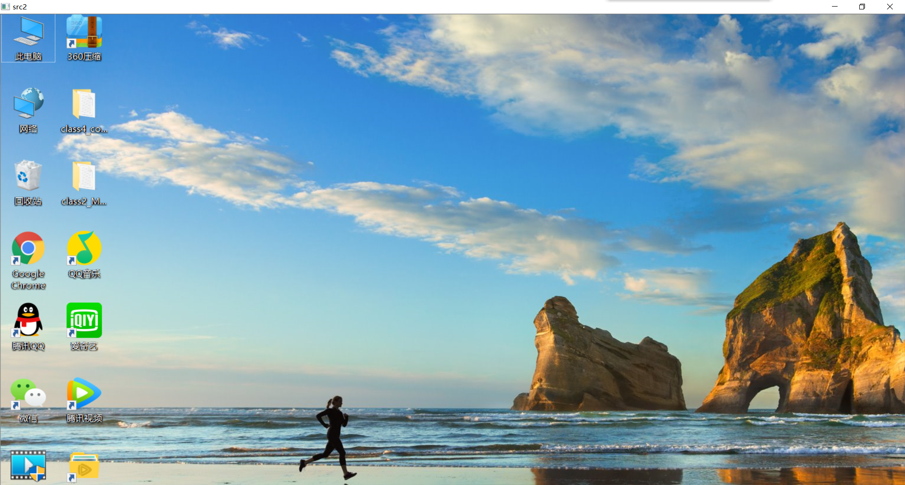
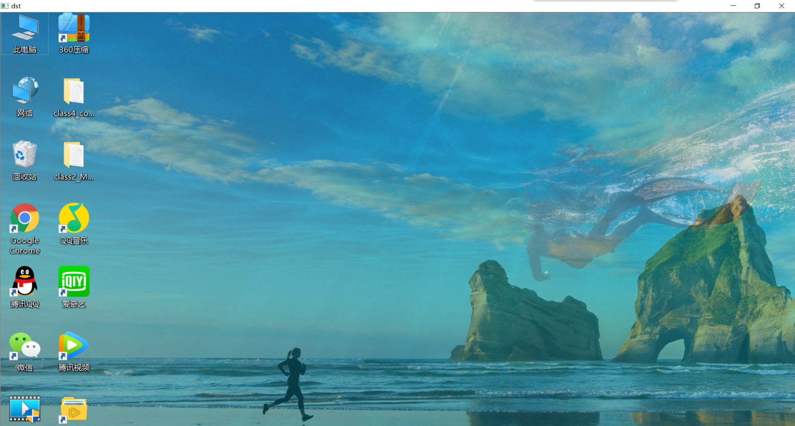
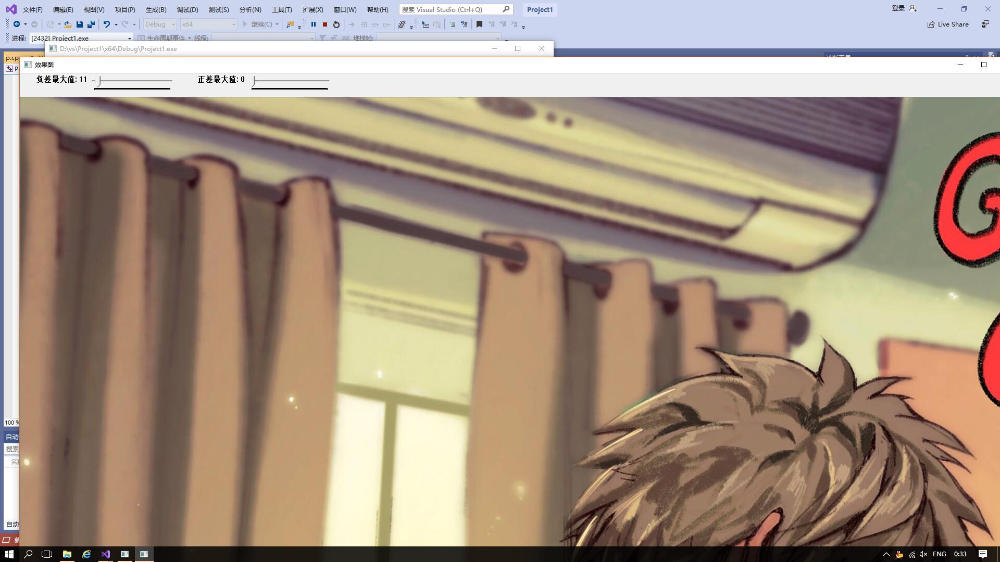

# 图层混合

# 漫水填充

# 总结：
      主要是学习了openCV的一些函数的用法和图像处理方法，了解到漫水填充法是一种用特定的颜色填充连通区域，通过设置可连通像素的上下限以及连通方式来达到不同的填充效果的的方法。离散傅里叶变换，是指傅里叶变换在时域和频域上都呈现离散的形式，将时域信号的采样变换为在离散时间傅里叶变换的频域的采样。通过将书上的代码敲到电脑上去，提高了动手能力，但对代码还是一知半解，不能做出改进，需要加强学习。