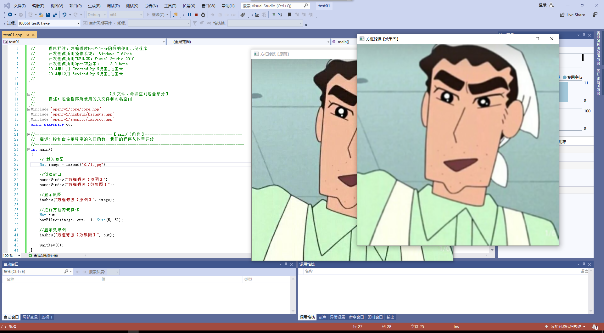

                                                                                                                                                                                                                                                                 ## 第三次作业
### 离散傅里叶变化
  本次课程，我们学习了离散傅里叶变化，即在傅里叶变换在时域和频域上都呈现离散的形式，将时域信号的采样变换为在离散时间傅里叶变换频域的采样。
  
  对一张图像使用傅里叶变换就是将它分解成正弦和余弦两个部分，转换的理论基础为：任一函数都可以表示成无数个正弦和余弦函数的和的形式，傅里叶变换就是一个用来将函数分解的工具。

  我还学习到了dft函数，他的作用是对一维或二维浮点数数组进行正向或反向离散傅里叶变换。返回DFT最优尺寸大小的函数：getOptimalDFTSize()函数,扩充图像边界的函数：copyMakeBorder()函数。magnitude()函数用于计算二维矢量的幅值，log函数用于计算每个数组元素绝对值的自然对数，normalize（）函数作用是进行矩阵归一化。

  ### 线性图像滤波
   线性滤波包括方框滤波，均值滤波和高斯滤波。图像滤波的目的是抽出对象的特征作为图像识别的特征模式，以及为适应图像处理的要求，消除图像数字化时所混入的噪声。

   将平滑处理操作方法分别封装在单独的函数中：

   均值滤波--Blur函数，高斯函数--GaussianBlur函数

   中值滤波--medianBlur
   
   运行程序为：  

### boxFilter函数
  方框滤波被封装在一个boxblur的函数中，该函数的作用是使用方框滤波来模糊一张图片，从src输入，从dst输出。
  函数表达为：
  boxFilter(image, out, -1, Size(5, 5));
size类型表示内核的大小，-1代表使用原图的深度。

### Blur函数
均值滤波是最简单的滤波操作，输出图像的每一个像素是核窗口内输入图像对应像素的平均值，可以说是归一化的方框滤波，blur函数内部中就是调用了下bosFilter.
均值滤波是典型的线性滤波算法，主要方法为领域平均法，用一片图像区域的各个像素的均值来代替原图像中的各个像素值。

### GaussianBlur函数
GaussianBlur函数的作用是用高斯滤波器来模糊一张图片，对输入的图像src进行高斯滤波后用dst输出。它将源图像和指定的高斯核函数做卷积运算，并且我支持就地过滤。
 高斯滤波是一种线性平滑滤波。可以消除高斯噪声，应用于图像处理的减噪过程。
 函数表达为：
 GaussianBlur(image, out, Size(5, 5), 0, 0);
 

 ### 总结
   本节课我学习了线性图像滤波，掌握了很多知识。滤波的目的是消除图像混入的噪声，为图像识别抽取出图像的特征，但不能损坏图像轮廓及边缘，图像的视觉效果也很好。为了得到干净清晰的图像，常用到高斯滤波，均值滤波，方差滤波，中值滤波等。