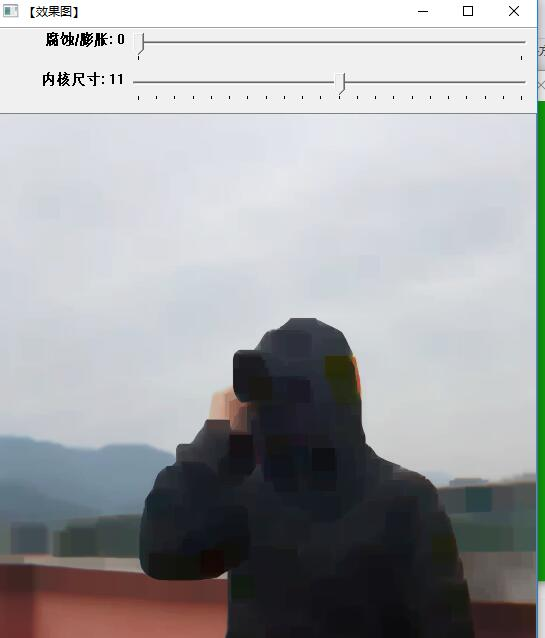
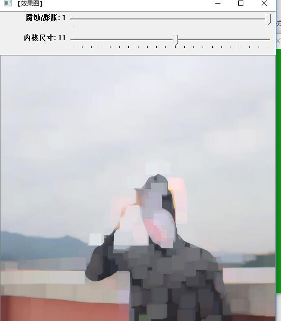
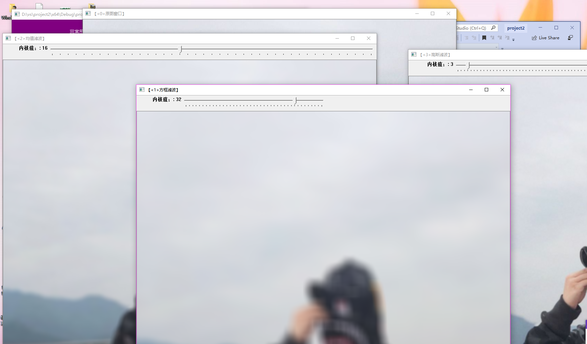

# 第三次作业
平滑处理（smoothing）也称模糊处理（布鲁日你个），是一种简单且使用频率很高的图像处理方法。常用来减少图像上的噪点或者失真，在涉及到降低图像分辨率时，平滑处理是非常好用的方法。

图像滤波与滤波器

   图像滤波的两个目的：一是抽出对象的特征作为图像识别的特征模式；另一个是为适应图像处理的要求，消除图像数字化时所混入的噪声。滤波处理的两个要求是：一是不能损坏图像的轮廓及边缘等重要信息；二是使图像清晰视觉效果好。

   关于滤波器，形象地将它比喻成一个包含加权系数的窗口，当使用这个滤波器平滑处理图像时，就把这个窗口放到图像上，透过这个窗口来看我们得到的图像 。

   滤波器的种类：
   方框滤波——BoxBlur函数
   均值滤波（领域平均滤波）——Blur函数
   高斯滤波——GaussianBlur函数
   中值滤波——medianBlur函数
   双边滤波——bilateralFilter函数
线型滤波器的简介

  线型滤波器经常用于剔除输入信号中不想要的频率或者从许多频率中选择一个想要的频率。

  常见的线型滤波器如下：
  低通滤波器：允许低频率通过；
  高通滤波器：允许高频率通过；
  带通滤波器：允许一定范围频率通过；
  带阻滤波器：阻止一定范围频率通过并且允许其他频率通过；
  全通滤波器：允许所有频率通过，仅仅改变相位关系；
  陷波滤波器：阻止一个狭窄频率范围通过，是一种特殊的带阻滤波器。
## 模糊和膨胀处理
1. 用createTrackbar()函数来设置轨迹条
2. erode()是模糊处理
3. dilate()是膨胀处理
滤波和模糊
滤波可分低通滤波和高通滤波两种。而高斯滤波是指用高斯函数作为滤波函数的滤波操作，至于是不是模糊，要看是高斯低通还是高斯高通，低通就是模糊，高通就是锐化。

高斯滤波是指用高斯函数作为滤波函数的滤波操作。
高斯模糊就是高斯低通滤波。

均值滤波，是最简单的一种滤波操作，输出图像的每一个像素是核窗口内输入图像对应像素的像素的平均值( 所有像素加权系数相等)，其实说白了它就是归一化后的方框滤波。
均值滤波是典型的线性滤波算法，主要方法为邻域平均法，即用一片图像区域的各个像素的均值来代替原图像中的各个像素值。一般需要在图像上对目标像素给出一个模板（内核），该模板包括了其周围的临近像素（比如以目标像素为中心的周围8（3x3-1）个像素，构成一个滤波模板，即去掉目标像素本身）。
均值滤波本身存在着固有的缺陷，即它不能很好地保护图像细节，在图像去噪的同时也破坏了图像的细节部分，从而使图像变得模糊，不能很好地去除噪声点。

方框滤波（box Filter）被封装在一个名为boxblur的函数中，即boxblur函数的作用是使用方框滤波器（box filter）来模糊一张图片，从src输入，从dst输出。

>模糊处理

>膨胀处理

## 方框滤波，均值滤波，高斯滤波比较
>高斯滤波和均值滤波

>方框滤波

**若色彩度高的图片可以看出高斯滤波的效果最好**