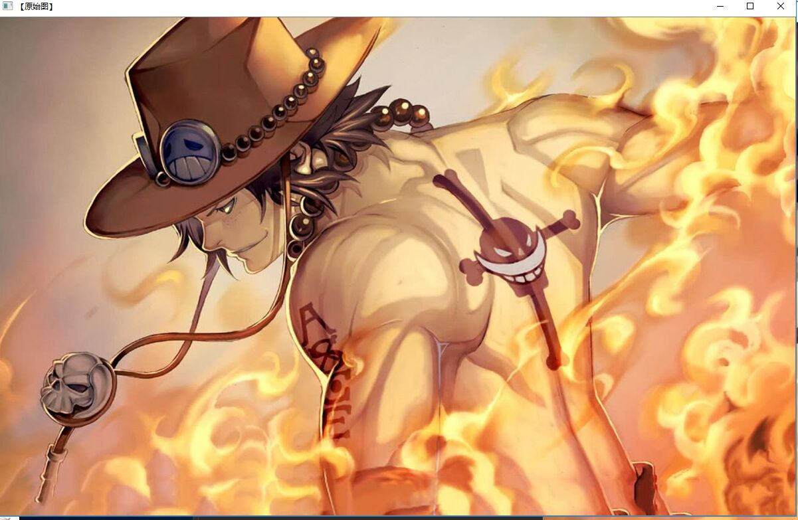

# 学习体会
今天首先学习了几种滤波，主要为 
方框滤波：Boxblur函数
均值滤波（邻域平均滤波）：Blur函数
高斯滤波：GaussianBlur函数
图像如下

之后学习了图像的载入，显示和输出跟第二天的那个学习初级图像混合是一样的

最后也学了图像腐蚀与膨胀综合示例
原图为

效果图为

同时还学习了GitHub的Desktop，虽然软件还不是太懂，但是还是弄会了如何clone，为之后的学习打下基础。
# 总结
通过半天的学习，弄了很多图像的处理，尽管大部分都是改了图片路径，但是还是学了代码，看懂了几个函数，对c++的学习很有帮助。
