# 第四次作业
本次课学习关于图像预处理技术
## 一.基本概念
图像分析中，图像质量的好坏直接影响识别算法的设计与效果的精度，因此在图像分析（特征提取、分割、匹配和识别等）前，需要进行预处理。图像预处理的主要目的是消除图像中无关的信息，恢复有用的真实信息，增强有关信息的可检测性、最大限度地简化数据，从而改进特征提取、图像分割、匹配和识别的可靠性。
### 1.邻域、邻接、区域和连通
邻域:附近像素形成的区域。常见四邻域，八邻域。
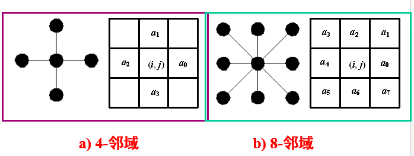
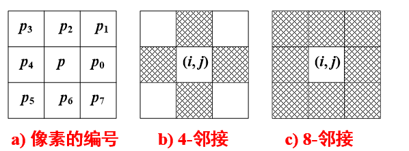

区域，相邻相似性质点组成的集合。像素的连通集(连通集：同一区域中，任意两个像素点至少存在一条连通路径。)
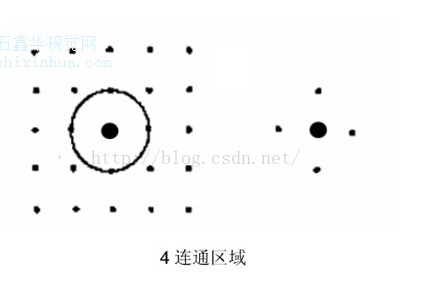

四连通区域或四邻域，是指对应像素位置的上、下、左、右，是紧邻的位置。共4个方向，所以称之为四连通区域，又叫四邻域。
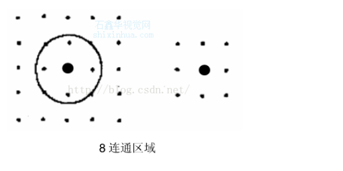

八连通域或八邻域，对应位置的上、下、左、右、左上、右上、左下、右下，是紧邻的位置和斜向相邻的位置。共8个方向，所以称之为8连通区域或八邻域。
### 2.模板运算
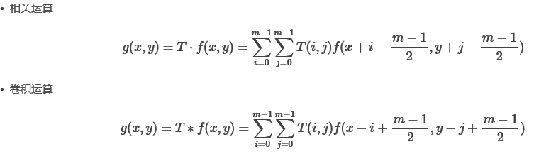

1. 锐化
锐化就是通过增强高频分量来减少图象中的模糊，因此又称为高通滤波。锐化处理在增强图象边缘的同时增加了图象的噪声。常用的锐化模板是拉普拉斯(Laplacian)模板。
Laplacian算子是n维欧几里德空间中的一个二阶微分算子， 定义为梯度grad的散度div.因此如果f是二阶可微的实函数，则f的拉普拉斯算子定义如下：

f的拉普拉斯算子也是简卡儿坐标系xi中的所有非混合二阶偏导数求和。

调用示例结果：
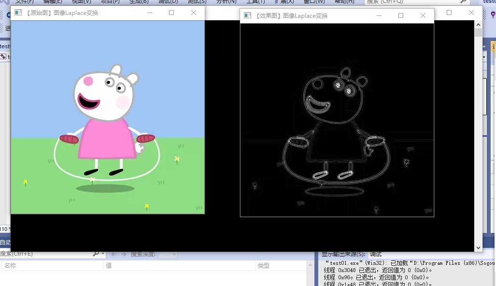
2. 平滑与锐化相反，就是滤掉高频分量，从而达到减少图象噪声，使图片变得有些模糊。
## 二.图像增强
### 1.基本概念
增强图像中的有用信息，它可以是一个失真的过程，其目的是要改善图像的视觉效果，针对给定图像的应用场合，有目的地强调图像的整体或局部特性，将原来不清晰的图像变得清晰或强调某些感兴趣的特征，扩大图像中不同物体特征之间的差别，抑制不感兴趣的特征，使之改善图像质量、丰富信息量，加强图像判读和识别效果，满足某些特殊分析的需要。图像增强算法可分成两大类：空间域法和频率域法。
### 2.基于点操作的图像增强
#### 1.灰度级变换
灰度变换函数描述了输入灰度值和输出灰度值之间变换关系，一旦灰度变换函数确定下来了，那么其输出的灰度值也就确定了。可见灰度变换函数的性质就决定了灰度变换所能达到的效果。

应用：
1. 亮度调整——加亮、减暗图像。
2. 对比度拉伸——提高、降低对比。
3. 灰度级切片

获取方法：
1. 固定函数：指数函数、正弦函数、分段直线、对数函数。
2. 交互样点插值：用过点的三次样条插值曲线，获得变换函数
#### 2.直方图均衡化
灰度直方图用来表示数字图像中各灰度级（横坐标）与其出现的频数（纵坐标）（处于该灰度级的像素数目）间的统计关系。图像灰度值的分布函数定义为：
1. 直方图修正也是常用的图像增强方法。
2. 直方图均衡化是一种通过重新均匀地分布各灰度值来增强图像对比度的方法，经过直方图均衡化的图像对二值化阈值选取十分有利。
3. 直方图均衡化处理的中心思想是把原始图像的灰度直方图从比较集中的某个灰度区间变成在全部灰度范围内的均匀分布。

主要四个步骤：
1. 生成直方图
2. 得到累加分布直方图
3. 规则化
4. 反向映射回源图像

示例程序：直方图均衡化，调试结果：
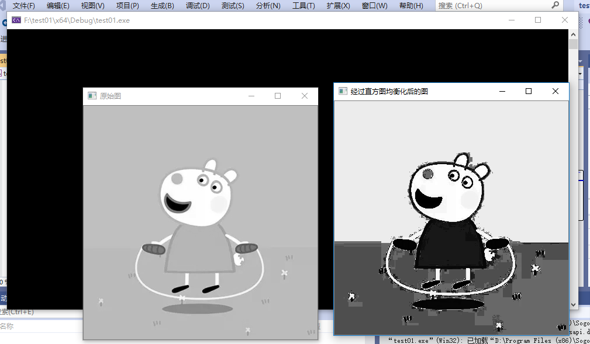
## 三.图像复原
### 1.基本概念
在成像过程中，由于成像系统各种因素的影响，可能使获得的图像不是真实景物的完善影像。图像在形成、传播和保存过程中使图像质量下降的过程，称为图像退化。图像复原就是重建退化的图像，使其最大限度恢复景物原貌的处理

与图像增强区别：图像增强是主观的过程，图像复原是客观的过程.

图像退化的一般过程：
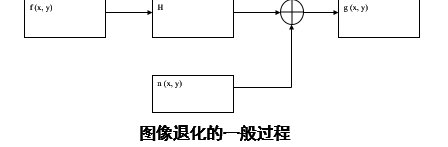
### 2.非约束复原
图像复原的主要目的是在假设具备退化图像g及H和n的某些知识的前提下，估计出原始图像f  的估计值，估计值应使准则为最优（常用最小）。仅仅要求某种优化准则为最小，不考虑其它任何条件约束，这种复原方法为非约束复原方法。
### 3.逆滤波
逆滤波复原法也叫做反向滤波法，其主要过程是首先将要处理的数字图像从空间域转换到傅立叶频率域中，进行反向滤波后再由频率域转回到空间域，从而得到复原的图像信号。
### 4.维纳滤波
维纳滤波也称最小均方误差滤波，它能处理被退化函数退化和噪声污染的图像。
### 5.有约束复原
有约束图像复原技术是指除了要求了解关于退化系统的传递函数之外，还需要知道某些噪声的统计特性或噪声与图像的某些相关情况。
## 四。图像变换
### 1.基础知识
目的：
1. 使图像处理问题简化；
2. 有利于图像特征提取；3.
3. 有助于从概念上增强对图像信息的理解。

图像变换通常是一种二维正交变换。正交变换广泛应用在图像增强、图像恢复、特征提取、图像压缩编码和形状分析等方面。
#### 1.点源和狄拉克函数
点源可以用狄拉克δ函数来表示，二维δ函数定义为： 
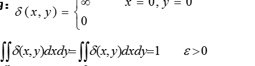
#### 2.二维线性位移不变系统
二维线性运算:
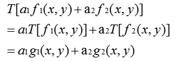
### 2.傅里叶变换
#### 1.一维连续函数的傅立叶变换 
定义式：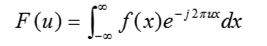
反变换：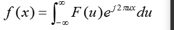
#### 2.二维连续函数的傅立叶变换    
二维傅立叶变换对为 
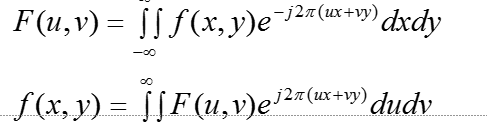
#### 3.离散傅里叶变换
简单来说，对张图像使用傅里叶变换就是将它分解成正弦和余弦两部分，就是将图像从空间域( spatial domain) 转换到频域( frequency domain).

这转换的理论基础为:任函数 都可以表示成无数个正弦和余弦函数的和形式。傅里叶变换就是一个用来将函数分解的工具。

数学表达式：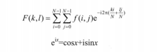
其中f是空间域值，F是频域值。转换之后的频域值是复数，因此，显示傅里叶变换之后的结果需要使用实数图像加虚数图像，或者幅度图像加相位图像

#### dft（）函数详解

先看一下opencv提供的傅里叶变换函数dft()，其定义如下：

C++: void dft(InputArray src, OutputArray dst, int flags=0, int nonzeroRows=0);

参数讲解：
1. InputArray src: 输入图像，可以是实数或虚数 
2. OutputArray dst: 输出图像，其大小和类型取决于第三个参数flags 
3. int flags = 0: 转换的标识符，有默认值0.其可取的值如下所示： 
4. DFT_INVERSE: 用一维或二维逆变换取代默认的正向变换 
5. DFT_SCALE: 缩放比例标识符，根据数据元素个数平均求出其缩放结果，如有N个元素，则输出结果以1/N缩放输出，常与DFT_INVERSE搭配使用。
6. DFT_ROWS: 对输入矩阵的每行进行正向或反向的傅里叶变换；此标识符可在处理多种适量的的时候用于减小资源的开销，这些处理常常是三维或高维变换等复杂操作。 
7. DFT_COMPLEX_OUTPUT: 对一维或二维的实数数组进行正向变换，这样的结果虽然是复数阵列，但拥有复数的共轭对称性（CCS），可以以一个和原数组尺寸大小相同的实数数组进行填充，这是最快的选择也是函数默认的方法。你可能想要得到一个全尺寸的复数数组（像简单光谱分析等等），通过设置标志位可以使函数生成一个全尺寸的复数输出数组。 
8. DFT_REAL_OUTPUT: 对一维二维复数数组进行逆向变换，这样的结果通常是一个尺寸相同的复数矩阵，但是如果输入矩阵有复数的共轭对称性（比如是一个带有DFT_COMPLEX_OUTPUT标识符的正变换结果），便会输出实数矩阵。 
9. int nonzeroRows = 0: 当这个参数不为0，函数会假设只有输入数组（没有设置DFT_INVERSE）的第一行或第一个输出数组（设置了DFT_INVERSE）包含非零值。这样的话函数就可以对其他的行进行更高效的处理节省一些时间，这项技术尤其是在采用DFT计算矩阵卷积时非常有效。
#### getOptimalDFTSize()解析
返回给定向量尺寸经过DFT变换后结果的最优尺寸大小。其函数定义如下：
C++: int getOptimalDFTSize(int vecsize);
参数解释： 
1. int vecsize: 输入向量尺寸大小(vector size) 
2. DFT变换在一个向量尺寸上不是一个单调函数，当计算两个数组卷积或对一个数组进行光学分析，它常常会用0扩充一些数组来得到稍微大点的数组以达到比原来数组计算更快的目的。一个尺寸是2阶指数（2,4,8,16,32…）的数组计算速度最快，一个数组尺寸是2、3、5的倍数（例如：300 = 5*5*3*2*2）同样有很高的处理效率。 
3. getOptimalDFTSize()函数返回大于或等于vecsize的最小数值N，这样尺寸为N的向量进行DFT变换能得到更高的处理效率。在当前N通过p,q,r等一些整数得出N = 2^p*3^q*5^r. 
4. 这个函数不能直接用于DCT（离散余弦变换）最优尺寸的估计，可以通过getOptimalDFTSize((vecsize+1)/2)*2得到。
#### magnitude()
计算二维矢量的幅值，其定义如下：

C++: void magnitude(InputArray x, InputArray y, OutputArray magnitude)；
#### copyMakeBorder() 
扩充图像边界，其函数定义如下：

C++: void copyMakeBorder(InputArray src, OutputArray dst, int top, int bottom, int left, int right, int borderType, const Scalar& value=Scalar() )；

示例结果：
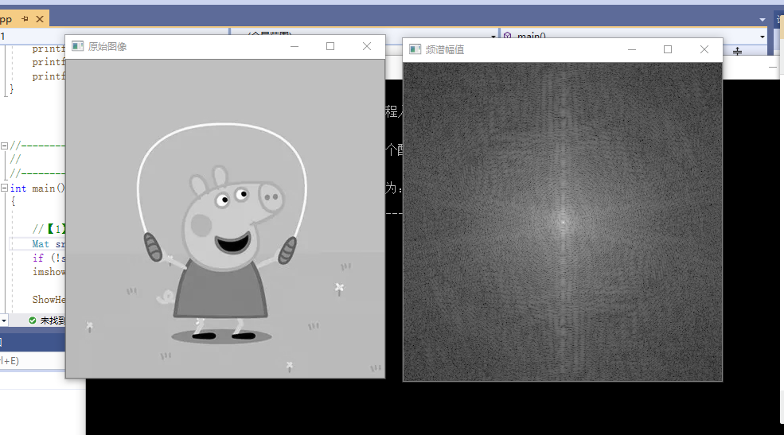
## 总结
经过这一次的学习，我从一个什么都不了解的小白，变成了一个明白这门课程的意义的初学者，觉得学到了不少有用同时又很有趣的知识，也对opencv有了新的理解，同时也学习到了图像预处理技术的概念，还有图像增强，图像复原，图像变换等等。图像预处理，是将每一个文字图像分检出来交给识别模块识别，这一过程称为图像预处理。在图像分析中，对输入图像进行特征抽取、分割和匹配前所进行的处理。在学习的过程中，很容易发现这些图像处理跟很多数学知识息息相关，这些数学知识看起来有些复杂，但只要努力理解，就会发现那些看上去很难的各种数学公式在你的努力之下就会轻易明白。而且还要理解各种函数还有算法，这些知识相对于我来说有点困难，毕竟都是概念性问题，不过多多看几遍就应该了解了。此次学习收获还是挺多的，开始了解了图像各个方面的处理方法，为以后学习打基础。