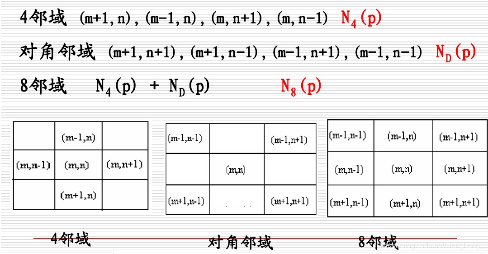
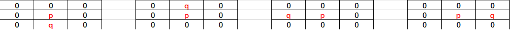
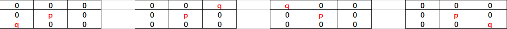
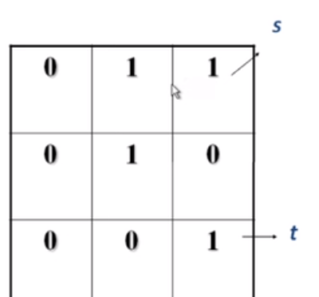
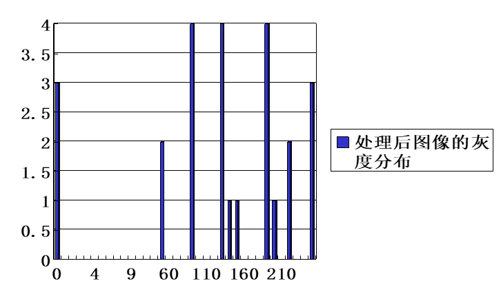
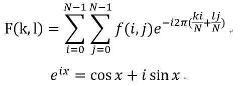
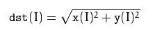
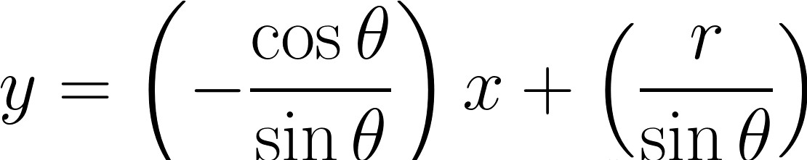
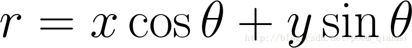

# 20191015第四次作业

# OpenCV数字图像处理
## **一、图像预处理技术**
## A、基本概念
### 1、邻域、邻接、区域和连通
（1）邻域

邻域是像素和空间之间的关系。数字图像中，邻域分为4邻域和8邻域，4邻域就是某个（x,y）点的上下左右四个点，8邻域再加上左上右上左下右下四个点。如果p在q周围的8个点内，就是p在q的8邻域内。

(2)邻接

邻接算是包含了邻域，如果说p和q是邻接，那么p和q必须互在邻域内，而且这两个的像素还要都在同一个集合V1内。（什么叫都在集合V1内：假如集合V1包含{012345}，这五个数代表的是像素值，而p值为2，q值为6，那它们两个就不在同一个集合V1内，当然如果有个集合V2，它俩可能也在另一个集合V2内）数字图像中常见的邻接有三种，4邻接、8邻接和m邻接。如果p在q的4邻域内，且q和p的值都在V中，那么p和q是4邻接的，8邻接概念一样。m邻接不太一样，如果q和p互在8邻域内，p和q都在V内，且q的4邻域和p的4邻域的共同覆盖的点不在V内，则p和q是m邻接的。m邻接是为了消除8邻接的二义性而引进的。比如有个3*3矩阵{0,1，1；0,1,0；0,0,1}，假设对于V={1}的集合而言，如果两个点能构成邻接，就算有一条路可以通过，那么右上角的1走到右下角的1，如果按照8邻接有两条路，而按照m邻接，只有一条路，这就是m邻接提出的意义。
邻接是两个元素之间的关系。
如下图所示，q和p是4邻接的：



如下图所示，q和p是对角邻接的：


如下图所示，p和周围的八个数都是邻接的：


（3）连通

对于图像中的某一个像素子集U和其中的两个点p和q，如果p和q之间有一个有U中全部元素构成的通路，那就说p和q是连通的。连通即通路上的所有像素灰度值满足相似准则，即(xi,yi)与(xi-1,yi-1)邻接。
种类：4-连通，8-连通，m-连通
实例：



如果要从像素s到像素t：
在4连通的条件下：s不能到t，因为中心像素和右下角像素不满足4邻接关系。
在8连通的条件下：s可以到t
在m连通的条件下：s可以到t
### 2、图像增强
图像增强的主要目标是通过对图像的处理，使图像比处理前更适合一个特定的应用。
处理策略：空域策略、频域策略。
可能的处理：去除噪声、边缘增强、提高对比度、增加亮度、改善颜色效果、改善细微层次等，通常与改善视觉效果相一致。

（1）基于点操作的图像增强：直方图均衡化
基本思想是对在图像中像素个数多的灰度级进行展宽，而对像素个数少的灰度级进行缩减，从而达到清晰图像的目的。
（2）直方图均衡化举例：



3、图像复原

**图像复原的目标：**

  --- 对退化的图像进行处理

  --- 趋向于复原没有退化的理想图像

**图像复原的效果：**

  --- 可能只起修饰作用

  --- 非常关键的作用：月球或行星图像

（1）图像退化的一般模型
图像恢复处理的关键问题在于建立退化模型。
在缺乏足够的先验知识的情况下，可利用已有的知识和经验对模糊或噪声等退化过程进行数学模型的建立及描述，并针对此退化过程的数学模型进行图像复原。图像退化过程的先验知识在图像复原技术中起着重要作用。在滤波器设计时，就相当于寻求点扩展函数。 点扩展函数是成像系统的脉冲响应

### 3、图像变换
图像变换的目的在于：①使图像处理问题简化；②有利于图像特征提取；③有助于从概念上增强对图像信息的理解。图像变换通常是一种二维正交变换。一般要求： ①正交变换必须是可逆的； ②正变换和反变换的算法不能太复杂； ③正交变换的特点是在变换域中图像能量将集中分布在低频率成分上，边缘、线状信息反映在高频率成分上，有利于图像处理。
因此正交变换广泛应用在图像增强、图像恢复、特征提取、图像压缩编码和形状分析等方面。

(1)傅里叶变换的图像理解

a、从纯粹的数学意义上看，傅立叶变换是将一个函数转换为一系列周期函数来处理的。从物理效果看，傅立叶变换是将图像从空间域转换到频率域，其逆变换是将图像从频率域转换到空间域。 

b、图像的频率是表征图像中灰度变化剧烈程度的指标，是灰度在平面空间上的梯度。如：大面积的沙漠在图像中是一片灰度变化缓慢的区域，对应的频率值很低；而对于地表属性变换剧烈的c、边缘区域在图像中是一片灰度变化剧烈的区域，对应的频率值较高。
对图像进行二维傅立叶变换得到频谱图就是图像梯度的分布图，频谱图上的各点与图像上各点并不存在一一对应的关系。傅立叶频谱图上看到的明暗不一的亮点，实际是图像上某一点与邻域点差异的强弱，即梯度的大小，也即该点的频率大小。
d、傅里叶变换后的图像，四角对应于低频成分，中央部位对应于高频部分。

### 4、其他可分离图像变换
a、离散余弦变换 

离散余弦变换(Discrete Cosine Transform，DCT)是傅里叶变换的一种特殊情况。在傅里叶级数展开式中，被展开的函数是实偶函数时，其傅里叶级数中只包含余弦项，称之为余弦变换。其变换核是为实数的余弦函数，因而DCT的计算速度比DFT快得多。 DCT计算复杂性适中，又具有可分离特性，还有快速算法，所以被广泛地用在图像数据压缩编码算法中。 

（1）一维DCT的变换核为:
 

式中，x,  u=0,  1,  2,  …,  N－1； 

 
 （2）二维DCT逆变换定义如下： 

 

式中：x, u, y,  v =0,  1,  2,  …,  N－1。


DCT的性质：

- 余弦变换是实数、正交的；

- DCT可由傅里叶变换的实部求得；

- 对高度相关数据，DCT有非常好的能量紧凑性；

- 对于具有一阶马尔可夫过程的随机信号，DCT是K-L变换的最好近似。

离散余弦变换在图像处理中的应用

- 在图像的变换编码中有着非常成功的应用；

- 离散余弦变换是傅里叶变换的实数部分，比傅里叶变换有更强的信息集中能力。对于大多数自然图像，离散余弦变换能将大多数的信息放到较少的系数上去，提高编码的效率。

b、哈达玛变换
一维哈达玛变换核为：


该式就是一维离散哈达玛变换。其中bk(z)是z的二进制表示的第k位值。

## B、示例分析
### **直方图均衡程序**
### 1、直方图程序分析：

直方图是对图像像素的统计分布，它统计了每个像素（0到L-1）的数量。直方图均衡化就是将原始的直方图拉伸，使之均匀分布在全部灰度范围内，从而增强图像的对比度。直方图均衡化的中心思想是把原始图像的的灰度直方图从比较集中的某个区域变成在全部灰度范围内的均匀分布。
在一幅图像中，明亮图像的直方图倾向于灰度级高的一侧，灰暗图像的直方图倾向于灰度级低的一侧，如果一副图像占有全部可能的灰度级并且分布均匀，则这样的图像有高对比度和多变的灰度色调。直方图均衡化这种方法通常用来增加图像的局部对比度。所以这种方法对于图像前景和背景都太亮或者太暗的情况非常有用，使目标区域从背景脱离出来。
讲到这里不得不引入累计分布函数 CDF，其定义为：对于连续函数，所有小于等于a的值，其出现概率的和。F(a) = P(x<=a)。针对于灰度级从[0,L-1]的图像，则是统计各个灰度级的累计分布概率，灰度值k(0<k<L-1)的累计概率是P(0), p(1),P(2).....P(K)之和。
### 2、主要函数说明：qualizeHist函数

```C++ 
qualizeHist( InputArray src,//输入图像，必须是8-bit的单通道图像 
OutputArray dst// 输出结果 )
```

**参数详解**

- 第一个参数，InputArray src，8位单通道的图像；
- 第二个参数，OutputArray dst，目标图像，与原图像具有同样的大小与类型；
### 3、运行的效果图如下：


## **离散傅里叶变换**
### 1、离散傅里叶变换程序分析
对一张图像使用傅立叶变换就是将它分解成正弦和余弦两部分。也就是将图像从空间域(spatial domain)转换到频域(frequency domain)。这一转换的理论基础来自于以下事实：任一函数都可以表示成无数个正弦和余弦函数的和的形式。傅立叶变换就是一个用来将函数分解的工具。
2维图像的傅立叶变换可以用以下数学公式表达:



式中f是空间域(spatial domain)值，
 F则是频域(frequency domain)值。 转换之后的频域值是复数， 因此，显示傅立叶变换之后的结果需要使用实数图像(real image) 加虚数图像(complex
 image), 或者幅度图像(magitude image)加相位图像(phase image)。 在实际的图像处理过程中，仅仅使用了幅度图像，因为幅度图像包含了原图像的几乎所有我们需要的几何信息。然而，如果你想通过修改幅度图像或者相位图像的方法来间接修改原空间图像，你需要使用逆傅立叶变换得到修改后的空间图像，这样你就必须同时保留幅度图像和相位图像了。
### 2、主要函数说明
【1】dft()
opencv提供的傅里叶变换函数dft()，其定义如下：

```C++ 
void dft(InputArray src, OutputArray dst, int flags=0, int nonzeroRows=0);
```
参数解释：
- InputArray src: 输入图像，可以是实数或虚数 
- OutputArray dst: 输出图像，其大小和类型取决于第三个参数flags 
- int flags = 0: 转换的标识符，有默认值0.其可取的值如下所示： 
  - DFT_INVERSE: 用一维或二维逆变换取代默认的正向变换 
  - DFT_SCALE: 缩放比例标识符，根据数据元素个数平均求出其缩放结果，如有N个元素，则输出结果以1/N缩放输出，常与DFT_INVERSE搭配使用。 
  - DFT_ROWS: 对输入矩阵的每行进行正向或反向的傅里叶变换；此标识符可在处理多种适量的的时候用于减小资源的开销，这些处理常常是三维或高维变换等复杂操作。 
  - DFT_COMPLEX_OUTPUT: 对一维或二维的实数数组进行正向变换，这样的结果虽然是复数阵列，但拥有复数的共轭对称性（CCS），可以以一个和原数组尺寸大小相同的实数数组进行填充，这是最快的选择也是函数默认的方法。你可能想要得到一个全尺寸的复数数组（像简单光谱分析等等），通过设置标志位可以使函数生成一个全尺寸的复数输出数组。 
  - DFT_REAL_OUTPUT: 对一维二维复数数组进行逆向变换，这样的结果通常是一个尺寸相同的复数矩阵，但是如果输入矩阵有复数的共轭对称性（比如是一个带有DFT_COMPLEX_OUTPUT标识符的正变换结果），便会输出实数矩阵。 

- int nonzeroRows = 0: 当这个参数不为0，函数会假设只有输入数组（没有设置DFT_INVERSE）的第一行或第一个输出数组（设置了DFT_INVERSE）包含非零值。这样的话函数就可以对其他的行进行更高效的处理节省一些时间，这项技术尤其是在采用DFT计算矩阵卷积时非常有效。

【2】getOptimalDFTSize()
返回给定向量尺寸经过DFT变换后结果的最优尺寸大小。其函数定义如下：

```C++
int getOptimalDFTSize(int vecsize);
 ```
 参数解释： 
 - int vecsize: 输入向量尺寸大小(vector size) 
 - DFT变换在一个向量尺寸上不是一个单调函数，当计算两个数组卷积或对一个数组进行光学分析，它常常会用0扩充一些数组来得到稍微大点的数组以达到比原来数组计算更快的目的。一个尺寸是2阶指数（2,4,8,16,32…）的数组计算速度最快，一个数组尺寸是2、3、5的倍数（例如：300 = 5*5*3*2*2）同样有很高的处理效率。 
getOptimalDFTSize()函数返回大于或等于vecsize的最小数值N，这样尺寸为N的向量进行DFT变换能得到更高的处理效率。在当前N通过p,q,r等一些整数得出N = 2^p*3^q*5^r. 
这个函数不能直接用于DCT（离散余弦变换）最优尺寸的估计，可以通过getOptimalDFTSize((vecsize+1)/2)*2得到。

【3】magnitude()
计算二维矢量的幅值，其定义如下：
```C++
void magnitude(InputArray x, InputArray y, OutputArray magnitude)；
```
参数解释：
- InputArray x: 浮点型数组的x坐标矢量，也就是实部; 
- InputArray y: 浮点型数组的y坐标矢量，必须和x尺寸相同; 
- OutputArray magnitude: 与x类型和尺寸相同的输出数组。
其计算公式如下：

【4】copyMakeBorder() 
扩充图像边界，其函数定义如下：
```C++
void copyMakeBorder(InputArray src, OutputArray dst, int top, int bottom, int left, int right, int borderType, const Scalar& value=Scalar() )；
```
参数解释： 

- InputArray src: 输入图像;
- OutputArray dst: 输出图像，与src图像有相同的类型，其尺寸应为Size(src.cols+left+right, src.rows+top+bottom); 
- int类型的top、bottom、left、right: 在图像的四个方向上扩充像素的值; 
- int borderType: 边界类型，由borderInterpolate()来定义，常见的取值为BORDER_CONSTANT;
- const Scalar& value = Scalar(): 如果边界类型为BORDER_CONSTANT则表示为边界值;

【5】normalize() 
归一化就是把要处理的数据经过某种算法的处理限制在所需要的范围内。首先归一化是为了后面数据处理的方便，其次归一化能够保证程序运行时收敛加快。归一化的具体作用是归纳同意样本的统计分布性，归一化在0-1之间是统计的概率分布，归一化在某个区间上是统计的坐标分布，在机器学习算法的数据预处理阶段，归一化也是非常重要的步骤。其定义如下：
```C++
void normalize(InputArray src, OutputArray dst, double alpha=1, double beta=0, int norm_type=NORM_L2, int dtype=-1, InputArray mask=noArray() )
```
参数解释： 

 - InputArray src: 输入图像 
 - OutputArray dst: 输出图像，尺寸大小和src相同 
 - double alpha = 1: range normalization模式的最小值 
 - double beta = 0: range normalization模式的最大值，不用于norm normalization(范数归一化)模式 
	 int norm_type = NORM_L2: 归一化的类型，主要有 
   - NORM_INF: 归一化数组的C-范数（绝对值的最大值） 
   - NORM_L1: 归一化数组的L1-范数（绝对值的和） 
   - NORM_L2: 归一化数组的L2-范数（欧几里得） 
   - NORM_MINMAX: 数组的数值被平移或缩放到一个指定的范围，线性归一化，一般较常用。
 - int dtype = -1: 当该参数为负数时，输出数组的类型与输入数组的类型相同，否则输出数组与输入数组只是通道数相同，而depth = CV_MAT_DEPTH(dtype) 
- InputArray mask = noArray(): 操作掩膜版，用于指示函数是否仅仅对指定的元素进行操作。
### 3、运行的效果图如下：

## **二、OpenCV特征提取与分析**
## A、基本概念
### 1、特征及颜色特征、纹理特征、形状特征的提取与表示 
【1】特征
- 从广义上讲，图像的特征包括基于文本的特征（如关键字、注释等）和视觉特征（如色彩、纹理、形状、对象表面等）两类。视觉特征分类：颜色(color)、形状(shape)、纹理(texture)等。

【2】颜色特征

 在图像处理中，我们可以将一个具体的像素点所呈现的颜色分多种方法分析，并提取出其颜色特征分量。比如通过手工标记区域提取一个特定区域（region）的颜色特征，用该区域在一个颜色空间三个分量各自的平均值表示，或者可以建立三个颜色直方图等方法。下面我们介绍一下颜色直方图和颜色矩的概念。计算机视觉的特征提取算法研究至关重要。在一些算法中，一个高复杂度特征的提取可能能够解决问题（进行目标检测等目的），但这将以处理更多数据，需要更高的处理效果为代价。而颜色特征无需进行大量计算。只需将数字图像中的像素值进行相应转换，表现为数值即可。因此颜色特征以其低复杂度成为了一个较好的特征。
在图像处理中，我们可以将一个具体的像素点所呈现的颜色分多种方法分析，并提取出其颜色特征分量。比如通过手工标记区域提取一个特定区域（region）的颜色特征，用该区域在一个颜色空间三个分量各自的平均值表示，或者可以建立三个颜色直方图等方法。下面我们介绍一下颜色直方图和颜色矩的概念。

（1）颜色直方图：
    颜色直方图用以反映图像颜色的组成分布，即各种颜色出现的概率。Swain和Ballard最先提出了应用颜色直方图进行图像特征提取的方法[40]，首先利用颜色空间三个分量的剥离得到颜色直方图，之后通过观察实验数据发现将图像进行旋转变换、缩放变换、模糊变换后图像的颜色直方图改变不大，即图像直方图对图像的物理变换是不敏感的。因此常提取颜色特征并用颜色直方图应用于衡量和比较两幅图像的全局差。另外，如果图像可以分为多个区域，并且前景与背景颜色分布具有明显差异，则颜色直方图呈现双峰形。
    颜色直方图也有其缺点：由于颜色直方图是全局颜色统计的结果，因此丢失了像素点间的位置特征。可能有几幅图像具有相同或相近的颜色直方图，但其图像像素位置分布完全不同。因此，图像与颜色直方图得多对一关系使得颜色直方图在识别前景物体上不能获得很好的效果。
    考虑到颜色直方图的以上问题，主色调直方图便产生了。所谓主色调直方图基于假设少数几个像素的值能够表示图像中的绝大部分像素，即出现频率最高的几个像素被选为主色，仅用主色构成的主色调直方图描述一幅图像。这样的描述子并不会降低通过颜色特征进行匹配的效果，因为从某种角度将，频度出现很小的像素点可以被视为噪声。

（2）颜色矩：
     颜色矩是一种有效的颜色特征，由Stricker和Orengo提出[41]，该方法利用线性代数中矩的概念，将图像中的颜色分布用其矩表示。利用颜色一阶矩（平均值Average）、颜色二阶矩（方差Variance）和颜色三阶矩（偏斜度Skewness）来描述颜色分布。与颜色直方图不同，利用颜色矩进行图像描述无需量化图像特征。由于每个像素具有颜色空间的三个颜色通道，因此图像的颜色矩有9个分量来描述。由于颜色矩的维度较少，因此常将颜色矩与其他图像特征综合使用。

（3）颜色集：
    以上两种方法通常用于两幅图像间全局或region之间的颜色比较、匹配等，而颜色集的方法致力于实现基于颜色实现对大规模图像的检索。颜色集的方法由Smith和Chang提出[42]，该方法将颜色转化到HSV颜色空间后，将图像根据其颜色信息进行图像分割成若干region，并将颜色分为多个bin，每个region进行颜色空间量化建立颜色索引，进而建立二进制图像颜色索引表。为加快查找速度，还可以构造二分查找树进行特征检索。

【3】纹理特征

- 一幅图像的纹理是在图像计算中经过量化的图像特征。图像纹理描述图像或其中小块区域的空间颜色分布和光强分布。纹理特征的提取分为基于结构的方法和基于统计数据的方法。一个基于结构的纹理特征提取方法是将所要检测的纹理进行建模，在图像中搜索重复的模式。该方法对人工合成的纹理识别效果较好。但对于交通图像中的纹理识别，基于统计数据的方法效果更好。

（1）LBP特征
    LBP方法（Local binary patterns）是一个计算机视觉中用于图像特征分类的一个方法。对LBP特征向量进行提取的步骤如下：

    首先将检测窗口划分为16×16的小区域（cell），对于每个cell中的一个像素，将其环形邻域内的8个点（也可以是环形邻域多个点，如图 3‑4. 应用LBP算法的三个邻域示例所示）进行顺时针或逆时针的比较，如果中心像素值比该邻点大，则将邻点赋值为1，否则赋值为0，这样每个点都会获得一个8位二进制数（通常转换为十进制数）。然后计算每个cell的直方图，即每个数字（假定是十进制数）出现的频率（也就是一个关于每一个像素点是否比邻域内点大的一个二进制序列进行统计），然后对该直方图进行归一化处理。最后将得到的每个cell的统计直方图进行连接，就得到了整幅图的LBP纹理特征，然后便可利用SVM或者其他机器学习算法进行分类了。

（2）灰度共生矩阵
     灰度共生矩阵是另一种纹理特征提取方法，首先对于一幅图像定义一个方向（orientation）和一个以pixel为单位的步长(step)，灰度共生矩阵T（N×N），则定义M(i,j)为灰度级为i和j的像素同时出现在一个点和沿所定义的方向跨度步长的点上的频率。其中N是灰度级划分数目。由于共生矩阵有方向和步长的组合定义，而决定频率的一个因素是对矩阵有贡献的像素数目，而这个数目要比总共数目少，且随着步长的增加而减少。因此所得到的共生矩阵是一个稀疏矩阵，所以灰度级划分N常常减少到8级。如在水平方向上计算左右方向上像素的共生矩阵，则为对称共生矩阵。类似的，如果仅考虑当前像素单方向（左或右）上的像素，则称为非对称共生矩阵。

【4】形状特征

特点：各种基于形状特征的检索方法都可以比较有效地利用图像中感兴趣的目标来进行检索，但它们也有一些共同的问题，包括：①目前基于形状的检索方法还缺乏比较完善的数学模型；②如果目标有变形时检索结果往往不太可靠；③许多形状特征仅描述了目标局部的性质，要全面描述目标常对计算时间和存储量有较高的要求；④许多形状特征所反映的目标形状信息与人的直观感觉不完全一致，或者说，特征空间的相似性与人视觉系统感受到的相似性有差别。另外，从 2-D 图像中表现的 3-D 物体实际上只是物体在空间某一平面的投影，从 2-D 图像中反映出来的形状常不是 3-D 物体真实的形状，由于视点的变化，可能会产生各种失真。
### 2、边界描述 
【1】Hough变换
霍夫变换(Hough Transform)是图像处理中的一种特征提取技术，它通过一种投票算法检测具有特定形状的物体。Hough变换是图像处理中从图像中识别几何形状的基本方法之一。Hough变换的基本原理在于利用点与线的对偶性，将原始图像空间的给定的曲线通过曲线表达形式变为参数空间的一个点。这样就把原始图像中给定曲线的检测问题转化为寻找参数空间中的峰值问题。也即把检测整体特性转化为检测局部特性。比如直线、椭圆、圆、弧线等。

OpenCV支持三种不同的霍夫线变换，它们分别是：标准霍夫变换(Standard Hough Transform，SHT)和多尺度霍夫变换（Multi-Scale Hough Transform，MSHT）累计概率霍夫变换(Progressive Probabilistic Hough Transform ，PPHT)。 其中，多尺度霍夫变换（MSHT）为经典霍夫变换（SHT）在多尺度下的一个变种。累计概率霍夫变换(PPHT）算法是标准霍夫变换（SHT）算法的一个改进，它在一定的范围内进行霍夫变换，计算单独线段的方向以及范围，从而减少计算量，缩短计算时间。之所以称PPHT为“概率”的，是因为并不将累加器平面内的所有可能的点累加，而只是累加其中的一部分，该想法是如果峰值如果足够高，只用一小部分时间去寻找它就够了。这样猜想的话，可以实质性地减少计算时间。 在OpenCV中，我们可以用HoughLines函数来调用标准霍夫变换SHT和多尺度霍夫变换MSHT。而HoughLinesP函数用于调用累计概率霍夫变换PPHT。累计概率霍夫变换执行效率很高，所有相比于HoughLines函数，我们更倾向于使用HoughLinesP函数。 
OpenCV中的霍夫线变换有如下三种：

<1>标准霍夫变换（StandardHough Transform，SHT），由HoughLines函数调用。

<2>多尺度霍夫变换（Multi-ScaleHough Transform，MSHT），由HoughLines函数调用。

<3>累计概率霍夫变换（ProgressiveProbabilistic Hough Transform，PPHT），由HoughLinesP函数调用。 
- 霍夫线变换的原理

【1】众所周知, 一条直线在图像二维空间可由两个变量表示. 如:
 

<1>在笛卡尔坐标系: 可由参数: 斜率和截距(m,b) 表示。

<2>在极坐标系: 可由参数: 极径和极角表示。

对于霍夫变换, 我们将采用第二种方式极坐标系来表示直线. 因此, 直线的表达式可为:
 
化简便可得到:



【2】一般来说对于点, 我们可以将通过这个点的一族直线统一定义为:


这就意味着每一对代表一条通过点的直线。
 
【3】如果对于一个给定点我们在极坐标对极径极角平面绘出所有通过它的直线, 将得到一条正弦曲线. 例如, 对于给定点X_0= 8 和Y_0= 6 我们可以绘出下图 (在平面):

这三条曲线在平面相交于点 (0.925, 9.6), 坐标表示的是参数对  或者是说点, 点和点组成的平面内的的直线。 【5】以上的说明表明，一般来说, 一条直线能够通过在平面  寻找交于一点的曲线数量来检测。而越多曲线交于一点也就意味着这个交点表示的直线由更多的点组成. 一般来说我们可以通过设置直线上点的阈值来定义多少条曲线交于一点我们才认为检测到了一条直线。 【6】这就是霍夫线变换要做的. 它追踪图像中每个点对应曲线间的交点. 如果交于一点的曲线的数量超过了阈值, 那么可以认为这个交点所代表的参数对在原图像中为一条直线。
## B、示例分析
### **HoughLines函数用法示例**
### 1、HoughLines变换程序分析：


### 2、主要函数说明：HoughLines函数

此函数可以找出采用标准霍夫变换的二值图像线条。在OpenCV中，我们可以用其来调用标准霍夫变换SHT和多尺度霍夫变换MSHT的OpenCV内建算法。
```C++
void HoughLines(InputArray image, OutputArray lines, double rho, double theta, int threshold, double srn=0, double stn=0 )
```
- 第一个参数，InputArray类型的image，输入图像，即源图像，需为8位的单通道二进制图像，可以将任意的源图载入进来后由函数修改成此格式后，再填在这里。
- 第二个参数，InputArray类型的lines，经过调用HoughLines函数后储存了霍夫线变换检测到线条的输出矢量。每一条线由具有两个元素的矢量表示，其中，是离坐标原点((0,0)（也就是图像的左上角）的距离。 是弧度线条旋转角度（0~垂直线，π/2~水平线）。
- 第三个参数，double类型的rho，以像素为单位的距离精度。另一种形容方式是直线搜索时的进步尺寸的单位半径。PS:Latex中/rho就表示 。
- 第四个参数，double类型的theta，以弧度为单位的角度精度。另一种形容方式是直线搜索时的进步尺寸的单位角度。
- 第五个参数，int类型的threshold，累加平面的阈值参数，即识别某部分为图中的一条直线时它在累加平面中必须达到的值。大于阈值threshold的线段才可以被检测通过并返回到结果中。
- 第六个参数，double类型的srn，有默认值0。对于多尺度的霍夫变换，这是第三个参数进步尺寸rho的除数距离。粗略的累加器进步尺寸直接是第三个参数rho，而精确的累加器进步尺寸为rho/srn。
- 第七个参数，double类型的stn，有默认值0，对于多尺度霍夫变换，srn表示第四个参数进步尺寸的单位角度theta的除数距离。且如果srn和stn同时为0，就表示使用经典的霍夫变换。否则，这两个参数应该都为正数。

### 3、运行的效果图如下：

##  **三、总结** 
       通过这次课的学习我学到了很多图像预处理和图像特征提取的知识，我明白了傅里叶变换和霍夫变换的原理及代码实现原理。其中，傅里叶变换的物理意义是将图像的灰度分布函数变换为图像的频率分布函数，而霍夫变换主要用来从图像中分离出具有某种同样特征的几何形状（如，直线，圆等）。图像的特征提取指的是使用计算机提取图像信息，决定每个图像的点是否属于一个图像特征，它是处理图像中比较重要的一步，如果连图像的特征都提取不了，那么我们做图像分析就没有意义了。所以学好这次课对我们今后的学习具有很大的意义，但是在学习的过程中我也要反思自己在运行程序中遇到的错误，我要认真总结，让自己在下次学习中不再犯同样的错误。
      通过查阅资料我也重新认识了傅里叶和霍夫，以前我只知道他们在数学中的成就，没想到他们在图像处理也有重大的影响，他们的数学理论用到OpenCV上有重大的意义。让·巴普蒂斯·约瑟夫·傅里叶是傅里叶的原名，他是法国欧塞尔人，著名数学家、物理学家，他创立的一套数学理论，对19世纪的数学和物理学的发展都产生了深远影响。paul hough是霍夫的原名，他在1962年首次提出霍夫变换。这两个人都在图像处理方面有着重大的贡献，作为学生的我应该向他们学习，认真总结每一天的学习内容，让自己每一天都有收获。


