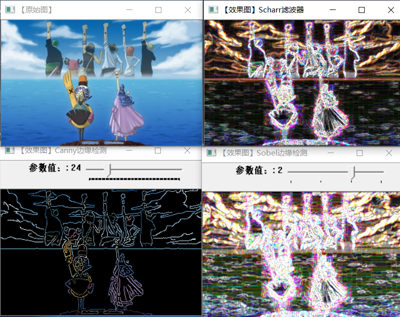
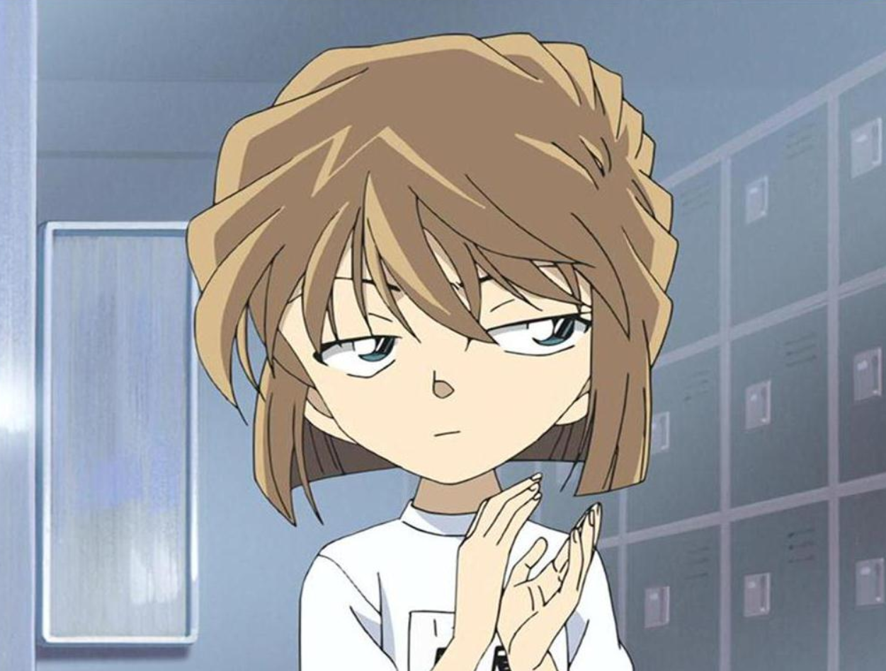
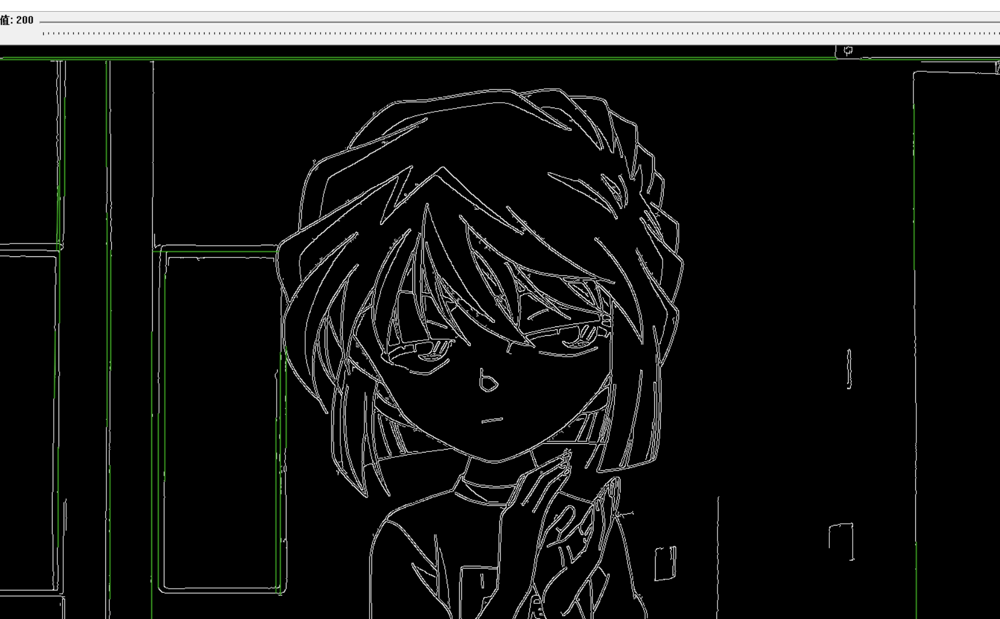
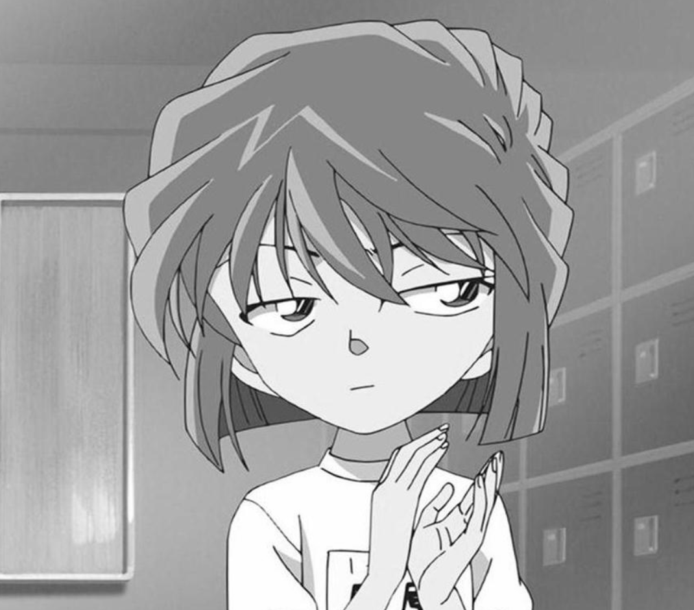
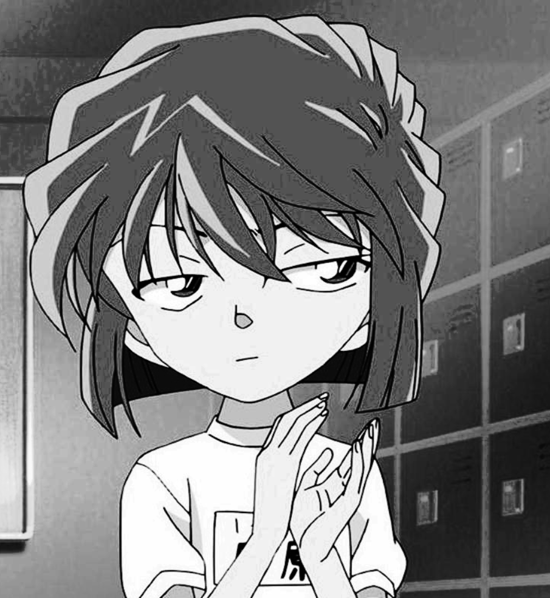
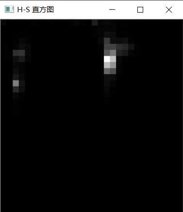
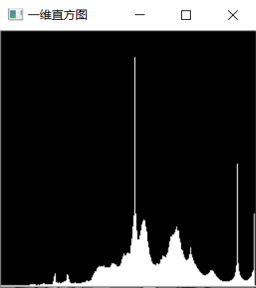

# 第四次作业

## 边缘检测

>边缘检测这里有三种，分别是scharr,canny,sobel三种边缘检测，根据滑动条的调整他们的图像会有大变化。

**我看不出哪种边缘检测的效果最好，通过滑动条的改变都可以调处最清晰的边缘图样**
## 霍夫线性变换

>Hough变换主要优点是能容忍特征边界描述中的间隙，并且相对不受图像噪声的影响。
## 直方图均衡化

>第一个是原图，第二个是均化过后的图片。直方图均衡化就是利用图像直方图对对比度进行调整的方法。前后图对比，均衡化后的图片对比明显，更加的舒服。但同时噪点也多了。
## H-S二维直方图的绘制

>二维直方图的维度为2，基于x,y轴，是双通道的。
## 一维直方图

>一维和二维的又有不同，一维直方图就是一条线。
## RGB三色直方图的绘制

## 总结
如果深入的研究数学原理是非常复杂的，没有好的数学功底可能连算法都看不懂，以前班主任说世界上最厉害的程序员是数学家，我一直都没有感觉到。但是我最近感觉到了，我用的很厉害的一些库，一些工具都是别人写好的，都是一些数学的算法。看来每当一个人达到一种高度才能看见一些东西，看见下面的人看不见的东西，也体现了我进步了，哈哈哈哈！