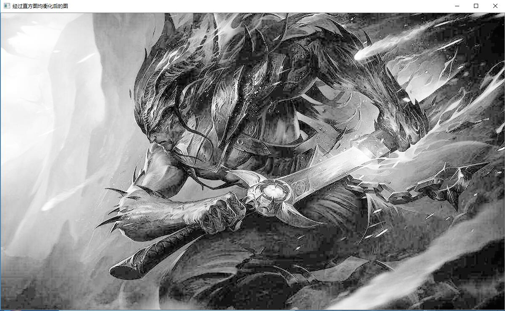
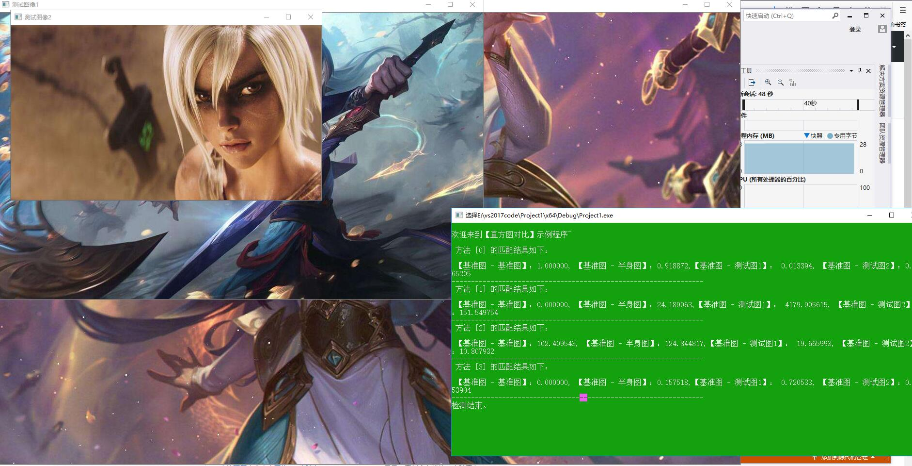
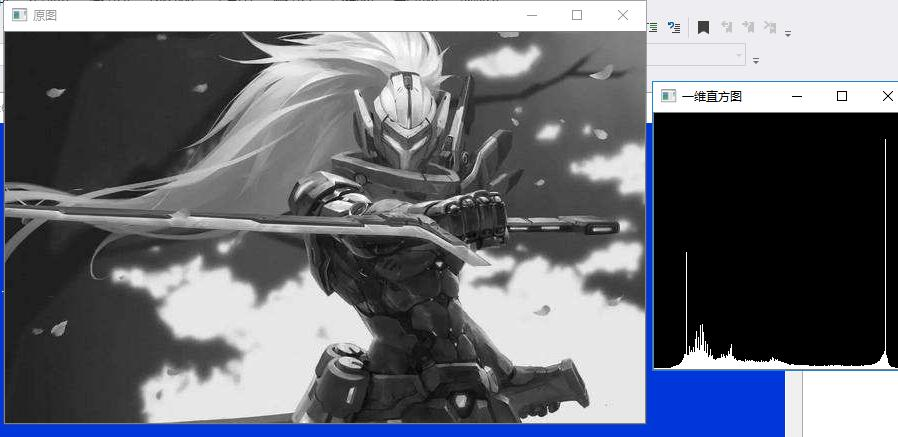
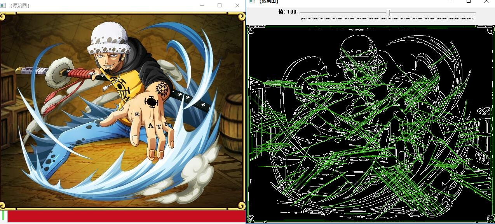
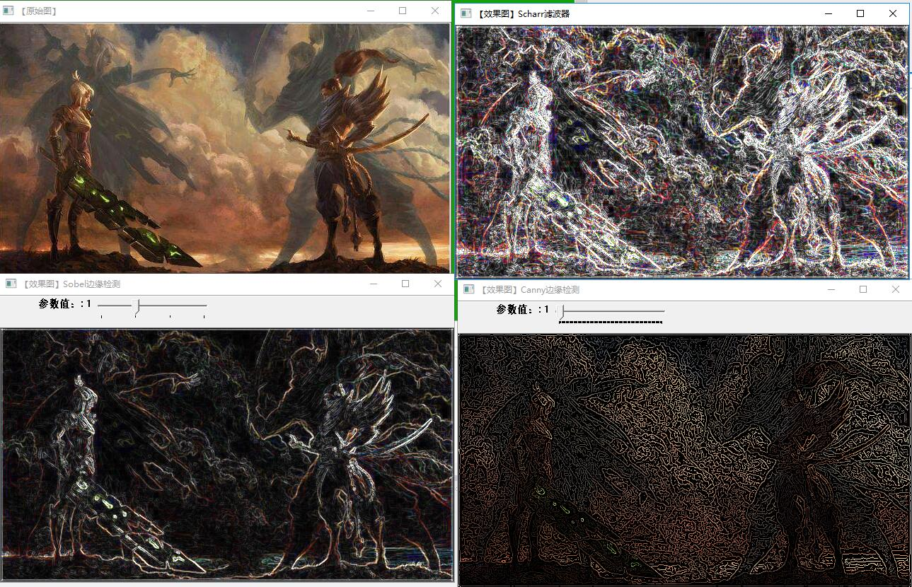

# 第四次作业
## 学习内容
    主要学习了图像预处理技术和图像特征提取与分析
### 图像预处理技术
1. 基本概念
2. 图像增强
   图像增强的主要目标是通过对图像的处理，使图像比处理前更适合一个特定的应用。
   直方图均衡化的效果图

可以看出效果图比原图清晰了不少。

3. 图像的复原   
   
    图像复原是一种改善图像质量的处理技术
    消除或减轻在图像获取及传输过程中造成的图像品质下降即退化现象.
4. 图像变换  
直方图对比

### 图像特征提取与分析
1. 颜色特征的提取与表示   
一维灰度直方图示例

2. 纹理特征的提取与表示   
  纹理基本上是区域特性，图像中的区域对应景物中的表面，纹理基元在尺寸和方向上的变化，可以反映出景物中表面相对于照相机的转动倾斜。
  效果图如下
  
3. 形状特征的提取与表示  
 当给定图像空间中的一些边缘点时，可以通过Hough变换确定连接这些点的直线方程。把在图像空间中的直线检测问题转换到参数空间中对点的检测问题，通过在参数空间里进行简单的累加统计即可完成检测任务。  
效果图如下：

# 总结
通过半天的学习掌握了数字图像处理，同时也学习了github的一些基本类容，知道如何规范上传作业，如何拉取请求等一些基本操作。
