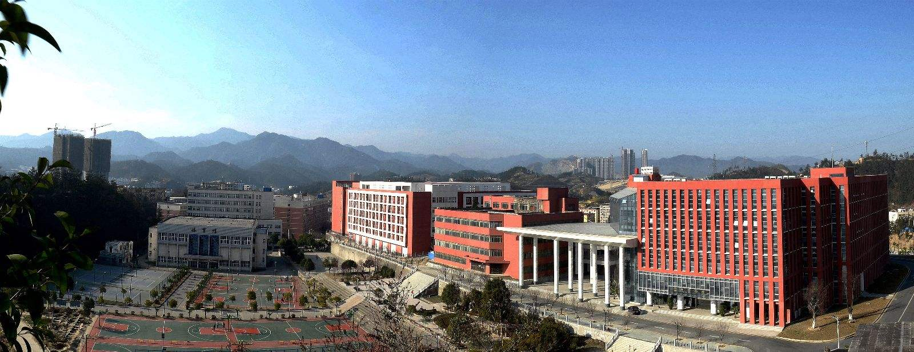
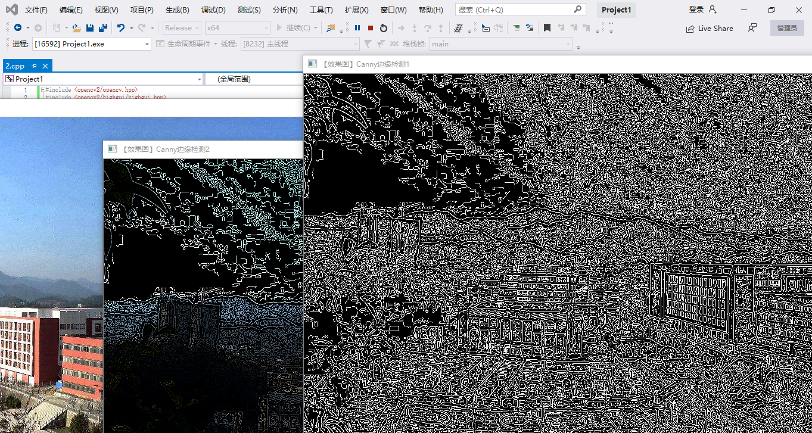
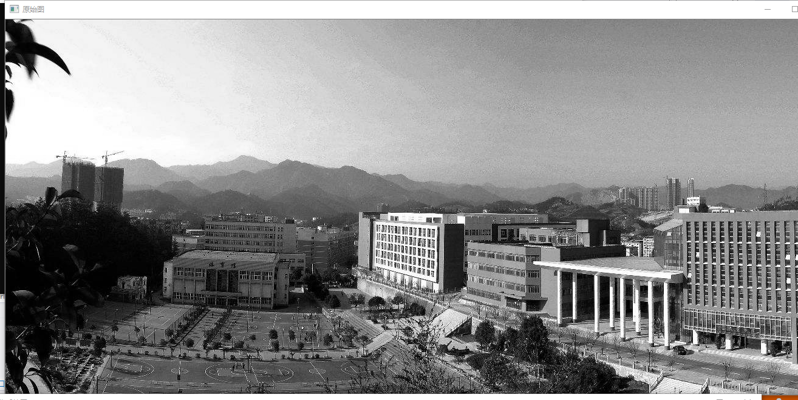
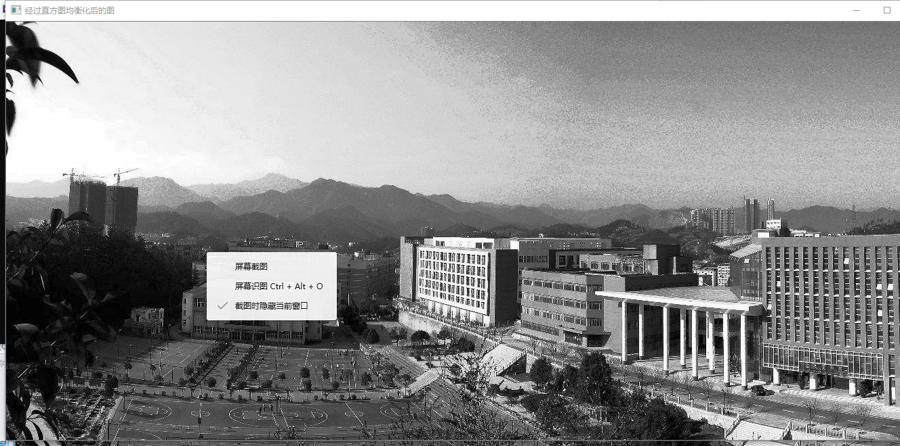
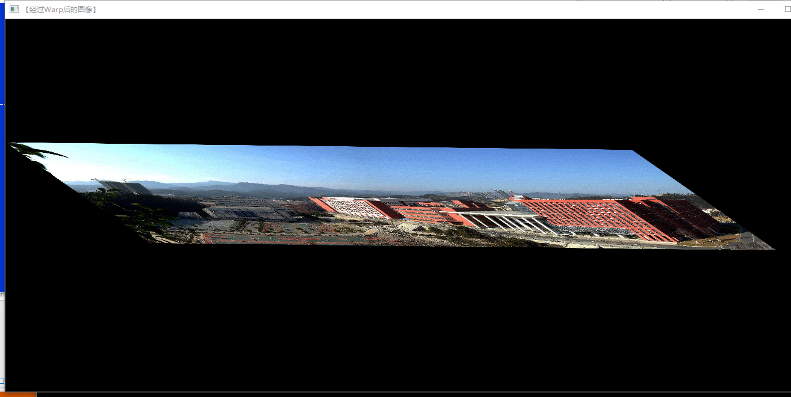
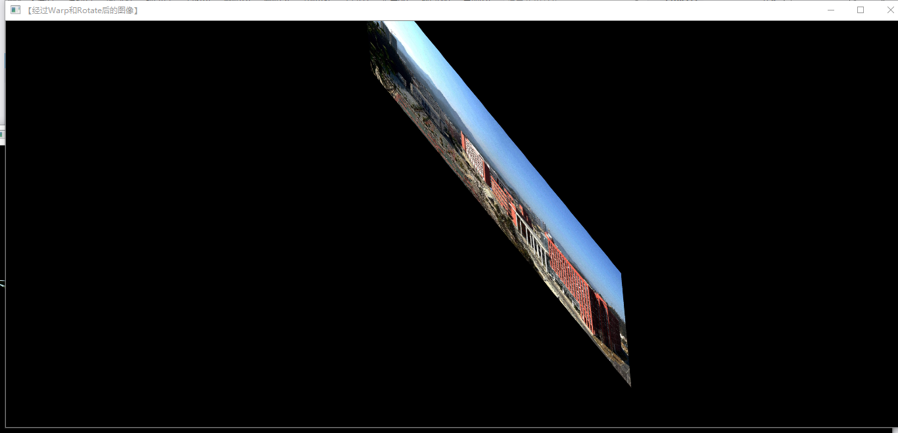

# 第四次
>姜玉辉  

>图像预处理技术  
边缘检测  
原图  

效果图
  
直方图均衡化
  
   
实现多种重映射

仿射变换  
  

图像修补
   

总结今天老师讲了图像预处理技术的相关知识和基本操作还有
邻域、邻接、区域和连通和模板运算的基本概念。此外我还了解到了图像增强和图像复原的相关原理和技巧。以下是我了解到的高通滤波器和低通滤波器

>高通滤波器（High Pass Filter，HPF）是检测图像的某个区域，然后根据像素与周围像素的亮度差值来提升（boost）该像素的亮度的滤波器。
高通滤波器是根据像素与邻近像素的亮度差值来提升该像素的亮度。低通滤波器（Low Pass Filter，LPF）则是在像素与周围像素的亮度差值小于一个特定值时，平滑该像素的亮度。它主要用于去噪和模糊化，例如，高斯模糊是最常用的模糊滤波器（平滑滤波器）之一，它是一个削弱高频信号强度的低通滤波器。

3.图像复原的原理是
设原始图像f(x,y)f(x,y)，则退化后的图像可以表示为
g(x,y)=H[f(x,y)]+η(x,y)g(x,y)=H[f(x,y)]+η(x,y) 
其中HH为退化函数，η(x,y)η(x,y)为加性噪声，复原的目标是得到基于退化图像的一个估计f^(x,y)f^(x,y)，使得图像能够尽可能地贴近原始图像。 
* 若H是线性的、空间不变的过程，则退化图像在空间频域中可以表示为
g(x,y)=h(x,y)∗f(x,y)+η(x,y)g(x,y)=h(x,y)∗f(x,y)+η(x,y) 
进行傅立叶变换，有 
G(u,v)=H(u,v)F(u,v)+N(u,v)G(u,v)=H(u,v)F(u,v)+N(u,v) 
* 噪声模型有很多种，包括高斯噪声、椒盐噪声、泊松噪声等
* 
# 三、心得体会
 此次课老师给我们讲解了图片复原相关的知识，图片复原修复的功能十分好用，帮我们解决了不少因为照片保存问题而引起的损坏，在了解这方便的同时，我知道了其原理，将照片进行数字化处理，然后进行傅里叶变换，这和我们前面学期学信号与系统的知识相结合，是傅里叶变换的实例，我知道了书本上所学的那些知识的具体实用价值，同时也不应该轻视学习的过程，要学以致用，不可轻视学习。还有opencv对图片的处理技术愈发成熟，而这是为我们学习计算机视觉打下的基础。从易到难我们要逐渐加深对知识的理解，温故知新，多预习书本上opencv的知识，同时不会的知识去请教老师，同学，在课下多探索。
  
