          Hough变换原理

一、简单介绍

Hough变换是图像处理中从图像中识别几何形状的基本方法之一。Hough变换的基本原理在于利用点与线的对偶性，将原始图像空间的给定的曲线通过曲线表达形式变为参数空间的一个点。这样就把原始图像中给定曲线的检测问题转化为寻找参数空间中的峰值问题。也即把检测整体特性转化为检测局部特性。比如直线、椭圆、圆、弧线等。

二、Hough变换的基本思想

设已知一黑白图像上画了一条直线，要求出这条直线所在的位置。我们知道，直线的方程可以用y=k*x+b 来表示，其中k和b是参数，分别是斜率和截距。过某一点(x0,y0)的所有直线的参数都会满足方程y0=kx0+b。即点(x0,y0)确定了一族直线。方程y0=kx0+b在参数k--b平面上是一条直线，(你也可以是方程b=-x0*k+y0对应的直线)。这样，图像x--y平面上的一个前景像素点就对应到参数平面上的一条直线。我们举个例子说明解决前面那个问题的原理。设图像上的直线是y=x, 我们先取上面的三个点：A(0,0), B(1,1), C(22)。可以求出，过A点的直线的参数要满足方程b=0, 过B点的直线的参数要满足方程1=k+b, 过C点的直线的参数要满足方程2=2k+b, 这三个方程就对应着参数平面上的三条直线，而这三条直线会相交于一点(k=1,b=0)。　同理，原图像上直线y=x上的其它点(如(3,3),(4,4)等)　对应参数平面上的直线也会通过点(k=1,b=0)。这个性质就为我们解决问题提供了方法，就是把图像平面上的点对应到参数平面上的线，最后通过统计特性来解决问题。假如图像平面上有两条直线，那么最终在参数平面上就会看到两个峰值点，依此类推。

简而言之，Hough变换思想为：在原始图像坐标系下的一个点对应了参数坐标系中的一条直线，同样参数坐标系的一条直线对应了原始坐标系下的一个点，然后，原始坐标系下呈现直线的所有点，它们的斜率和截距是相同的，所以它们在参数坐标系下对应于同一个点。这样在将原始坐标系下的各个点投影到参数坐标系下之后，看参数坐标系下有没有聚集点，这样的聚集点就对应了原始坐标系下的直线。

在实际应用中，y=k*x+b形式的直线方程没有办法表示x=c形式的直线(这时候，直线的斜率为无穷大)。所以实际应用中，是采用参数方程p=x*cos(theta)+y*sin(theta)。这样，图像平面上的一个点就对应到参数p---theta平面上的一条曲线上，其它的还是一样。

三、Hough变换推广

1、已知半径的圆

         其实Hough变换可以检测任意的已知表达形式的曲线，关键是看其参数空间的选择，参数空间的选择可以根据它的表达形式而定。比如圆的表达形式为，所以当检测某一半径的圆的时候，可以选择与原图像空间同样的空间作为参数空间。那么圆图像空间中的一个圆对应了参数空间中的一个点，参数空间中的一个点对应了图像空间中的一个圆，圆图像空间中在同一个圆上的点，它们的参数相同即a，b相同，那么它们在参数空间中的对应的圆就会过同一个点（a，b），所以，将原图像空间中的所有点变换到参数空间后，根据参数空间中点的聚集程度就可以判断出图像空间中有没有近似于圆的图形。如果有的话，这个参数就是圆的参数。

2、未知半径的圆

         对于圆的半径未知的情况下，可以看作是有三个参数的圆的检测，中心和半径。这个时候原理仍然相同，只是参数空间的维数升高，计算量增大。图像空间中的任意一个点都对应了参数空间中的一簇圆曲线。 ，其实是一个圆锥型。参数空间中的任意一个点对应了图像空间中的一个圆。

3、椭圆

椭圆有5个自由参数，所以它的参数空间是5维的，因此他的计算量非常大，所以提出了许多的改进算法。

四、图像显示

霍夫变换综合：
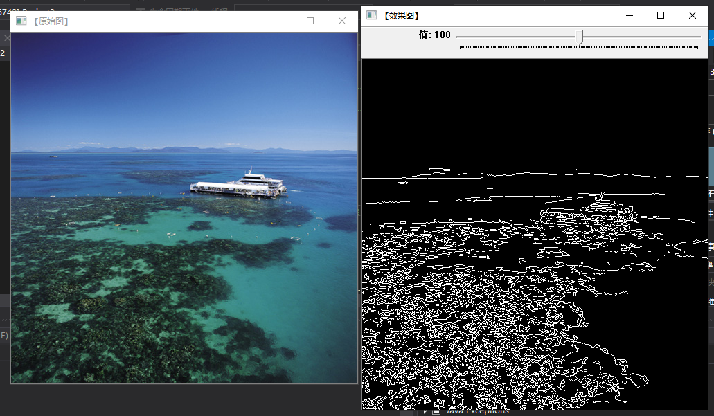

HoughLinesP：
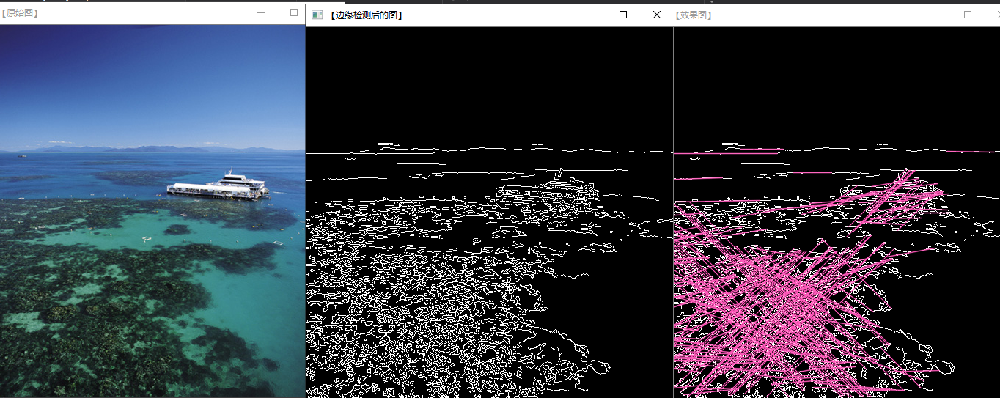

HoughLines：
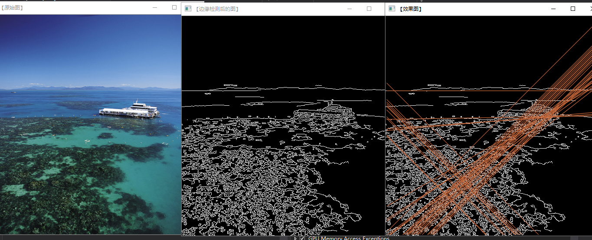

HoughCircles：
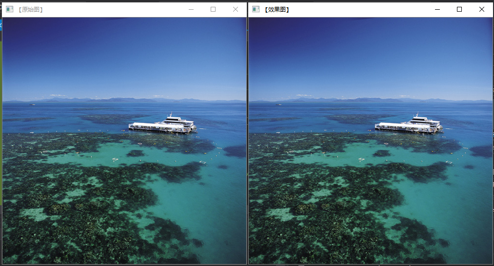

五、总结

        
图像空间中的在同一个圆，直线，椭圆上的点，每一个点都对应了参数空间中的一个图形，在图像空间中这些点都满足它们的方程这一个条件，所以这些点，每个投影后得到的图像都会经过这个参数空间中的点。也就是在参数空间中它们会相交于一点。所以，当参数空间中的这个相交点的越大的话，那么说明元图像空间中满足这个参数的图形越饱满。越象我们要检测的东西。

Hough变换能够查找任意的曲线，只要你给定它的方程。Hough变换在检验已知形状的目标方面具有受曲线间断影响小和不受图形旋转的影响的优点，即使目标有稍许缺损或污染也能被正确识别。

直方图

直方图均衡化

作用是图像增强。

有两个问题比较难懂，一是为什么要选用累积分布函数，二是为什么使用累积分布函数处理后像素值会均匀分布。
第一个问题。均衡化过程中，必须要保证两个条件：① 像素无论怎么映射，一定要保证原来的大小关系不变，较亮的区域，依旧是较亮的，较暗依旧暗，只是对比度增大，绝对不能明暗颠倒；②如果是八位图像，那么像素映射函数的值域应在	0 和 255 之间的，不能越界。综合以上两个条件，累积分布函数是个好的选择，因为累积分布函数是单调增函数（控制大小关系），并且值域是 0 到 1（控制越界问题），所以直方图均衡化中使用的是累积分布函数。

第二个问题。 累积分布函数具有一些好的性质，那么如何运用累积分布函数使得直方图均衡化？比较 概率分布函数 和累积分布函数 ，前者的二维图像是参差不齐的，后者是单调递增的。

算法
经典算法

下面以一幅3*2像素的简单图片（图C）为例，来说明灰度直方图均衡化的算法。

（图C）

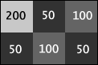

图C的直方图：

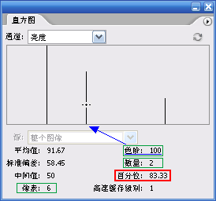

注意看百分位(Percentile)这一项。一般软件的百分位是当前色阶的像素数量÷总像素数量，而Photoshop不同，Photoshop显示的是 当前色阶与前面色阶的所有像素数量÷总像素数量。因此图C色阶为100时的百分位就是(3+2)/6=5/6=83.33%，这个百分位其实就是我们要求的灰度值(范围0~1)，把它转换成0~255的范围，要再乘255。

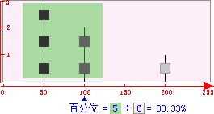

求出每个色阶的百分位之后，再乘255，就可以求出与其对应的灰度值来。

根据每个色阶的 色阶->255*百分位 的对应关系组成一个灰度映射表，然后根据映射表来修改原来图片每个像素的灰度值。对于图C，用128替换50，用212替换100，用255替换200。这样，灰度直方图的均衡化就完成了。

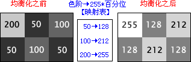

Photoshop的算法
经过经典算法均衡化的图片，最亮的像素值总是255，因为最后一级色阶(255)的百分位一定是100%。而最暗的是由色阶0的数量决定的，像素值不一定是0。
Photoshop通过对比度拉伸的方法使最暗的像素值变为0，其它像素也相应变暗，最亮的像素保持255不变。对比度拉伸后的效果可能会比经典算法稍显偏暗。
对比度拉伸的算法，类似于使用色阶调整命令把黑场设成Min时的效果，Min是指像素数量不为0的第一个色阶。

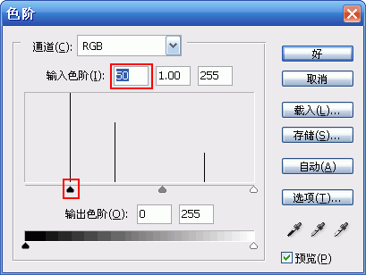
对比度拉伸的公式：C = (Level - Min) * Scale = (Level - Min) * 255 / (255-Min)
图C均衡化之后的灰度值分别是128、212、255，为了精确，我们使用保留2位小数的形式(127.50、212.42、255.00)来进行对比度拉伸的计算。

经典算法和Photoshop算法的直方图比较。
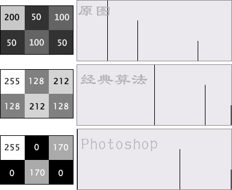

1、均衡化
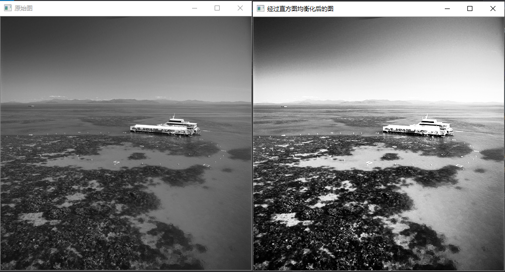

彩色算法

彩色的直方图均衡化其实就是对图像某个或多个颜色通道进行灰度直方图均衡化运算，常见的有以下几种方法：
统计所有RGB颜色通道的直方图的数据并做均衡化运算，然后根据均衡化所得的映射表分别替换R、G、B通道颜色值。
分别统计R、G、B颜色通道的直方图的数据并做均衡化运算，然后根据R、G、B的映射表分别替换R、G、B通道颜色值。
用亮度公式或求RGB的平均值的方式计算亮度通道，然后统计亮度通道的直方图的数据并做均衡化运算，然后根据映射表分别替换R、G、B通道颜色值。
Photoshop用的是第一种方法。

2、RGB直方
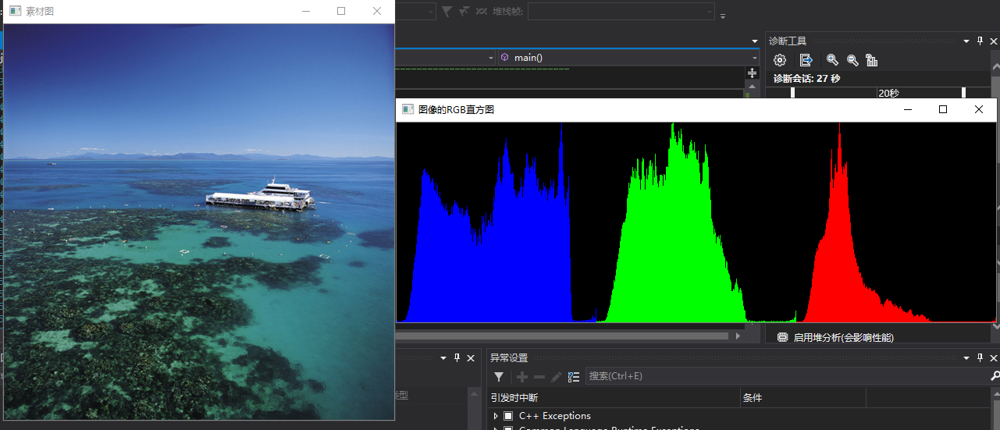

其它：

一维直方
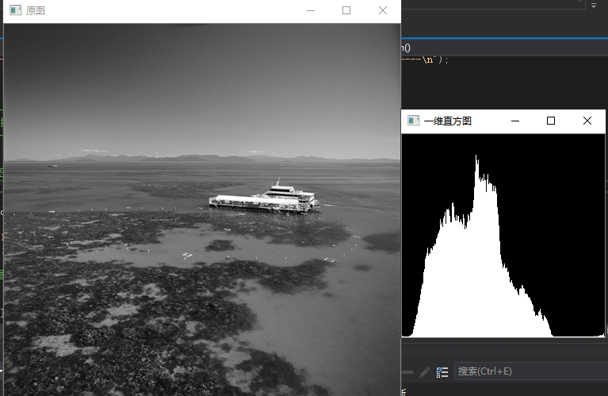

H-S直方
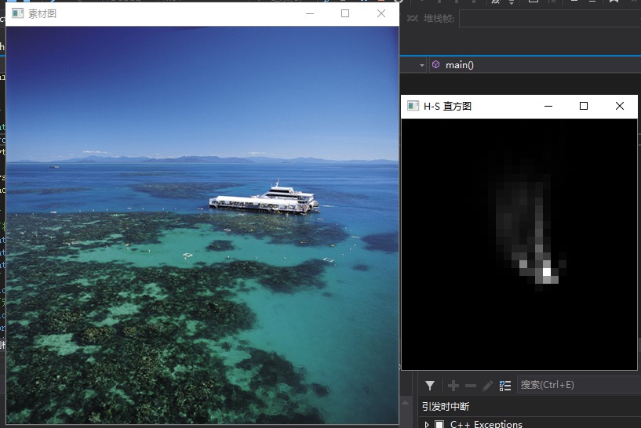

直方对比
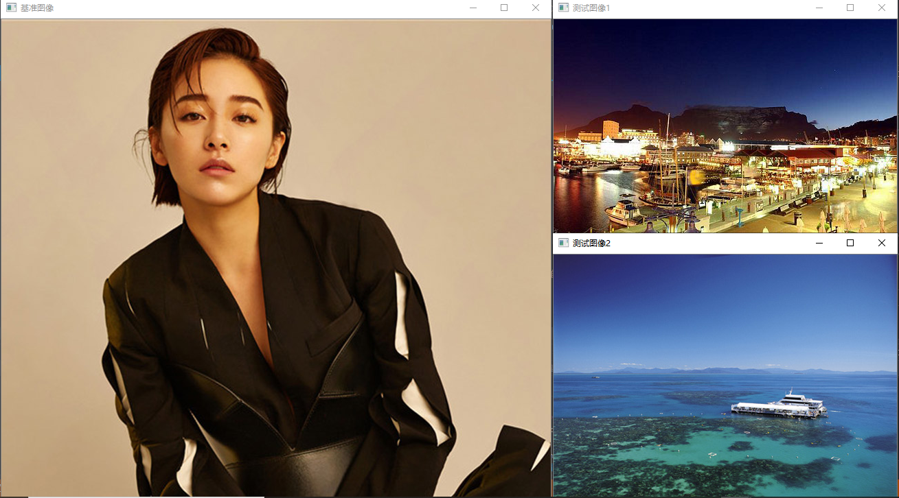

总结
直方图均衡化是灰度变换的一个重要应用，它高效且易于实现，广泛应用于图像增强处理中。图像的像素灰度变化是随机的，直方图的图形高低不齐，直方图均衡化就是用一定的算法使直方图大致平和。
均衡化处理后的图象只能是近似均匀分布。均衡化图象的动态范围扩大了，但其本质是扩大了量化间隔，而量化级别反而减少了，因此，原来灰度不同的象素经处理后可能变的相同，形成了一片的相同灰度的区域，各区域之间有明显的边界，从而出现了伪轮廓。
如果原始图像对比度本来就很高，如果再均衡化则灰度调和，对比度降低。在泛白缓和的图像中，均衡化会合并一些象素灰度，从而增大对比度。均衡化后的图片如果再对其均衡化，则图像不会有任何变化。
灰度直方图均衡化的算法，简单地说，就是把直方图的每个灰度级进行归一化处理，求每种灰度的累积分布，得到一个映射的灰度映射表，然后根据相应的灰度值来修正原图中的每个像素。
经典的直方图均衡化算法可能存在以下一些不足：
输出图像的实际灰度变化范围很难达到图像格式所允许的最大灰度变化范围。          
输出图像的灰度分布直方图虽然接近均匀分布, 但其值与理想值1/n仍有可能存在较大的差异, 并非是最佳值。          
输出图像的灰度级有可能被过多地合并。由于灰度的吞噬也易造成图像信息的丢失。   

