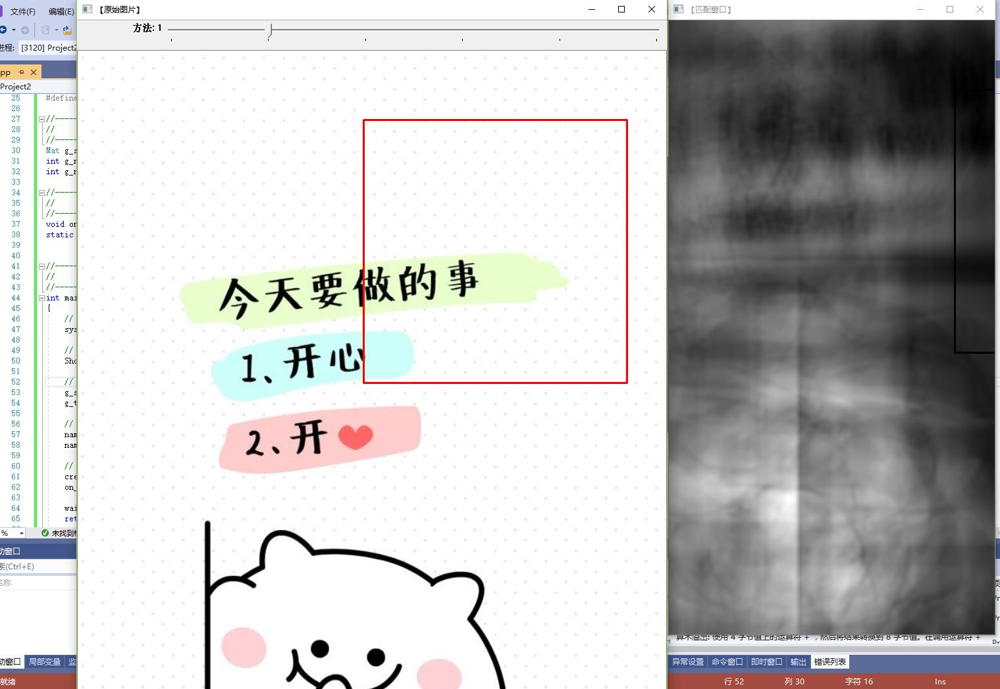
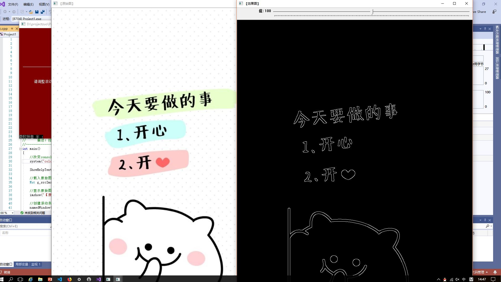

#学习笔记及心得体会
#一、图像预处理技术
##1.基本操作
###邻域、邻接、区域和连通
###模板运算
##2.图象增强
基于点操作的图像增强
应用：亮度调整、对比度拉伸、灰度级切片
获取变换函数的方法：固定函数、交互样点插值、直方图
##3.图像复原
图像增强是主观的过程
图像复原是客观的过程
利用退化现象的某种先验知识来恢复图像.
退化模型化采用相反的过程处理,复原出原图像
#二、图像特征提取与分析
##1.直方图
优点：计算简单,对平移和旋转不敏感,能简单描述一幅图像中颜色的全局分布。
缺点：无法捕捉颜色组成之间的空间关系,丢失了图像的空间信息。
###直方图效果显示：
  
##2.颜色集        
设BM是M维的二值空间，在BM空间的每个轴对应唯一的索引m。一个颜色集就是BM二值空间中的一个二维矢量，它对应着对颜色{m}的选择，即颜色m出现时，c[m]=1,否则，c[m]=0。
##3.纹理
纹理指的是图像像素灰度或颜色的某种变化。
##4.纹理特征的提取与匹配 
形状特征的表达必须以对图像中物体或区域的分割为基础；
形状特征必须满足对变换、旋转和缩放无关；
形状特征的表示方法：基于边界和基于区域。
###提取代码（略）
###效果图如下：

#三、心得体会
  **通过今天的学习，主要了解到了图像预处理的相关操作，以及程序的编写。与此同时，也对图像特征提取与分析有了一定的了解。图像处理有很多种，其中包括几何处理，算术处理，图像增强，图像复原。图像处理可以改变图像的质量，另外也可以使计算机或者机器自动识别图像，现在也被应用与人工智能之中。虽然不能完全掌握图像处理，但是对数字图像有了更加深入的了解，同时，也了解到了数字图像的本质。让我以后的学习有了更加深入的切入。**