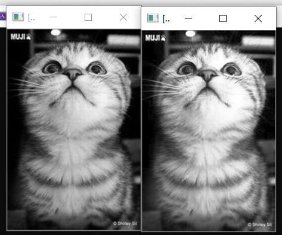
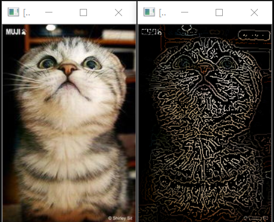
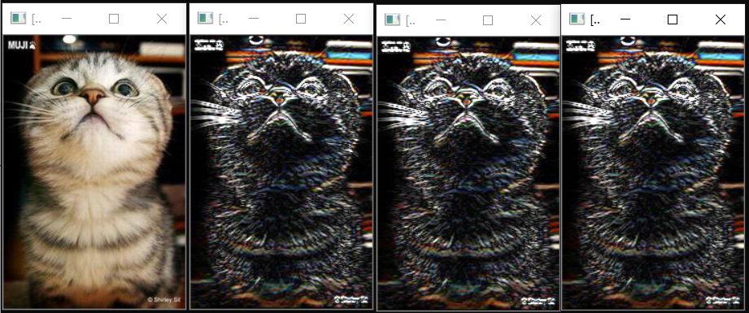
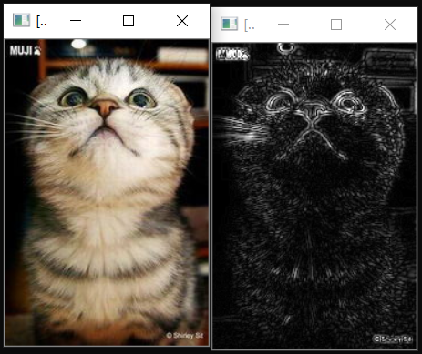
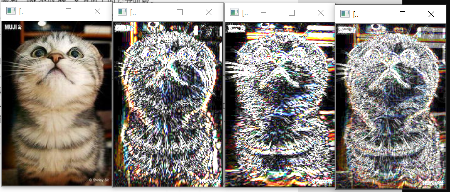
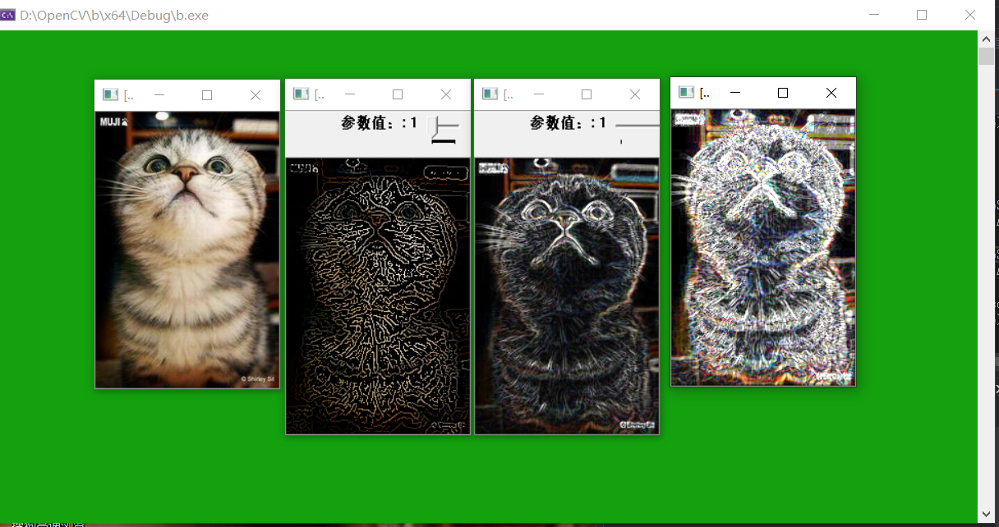

# 图像预处理技术
## 1. 基本概念
## 2. 图像增强
### 2.1 图像增强的概念

* 图像增强的定义

  * 图像增强的主要目标是通过对图像的处理，使图像比处理前更合适一个特定的应用。
  *  处理策略：空域策略、频域策略。
  *  可能的处理：去除噪声、边缘增强、提高对比度、增加亮度、改善颜色效果、改善席位层次等，通常与改善视觉效果相一致。
* 图像增强的空域法

  * 点云算法——灰度级变换 寻找一个合适的变换T
  * 模板运算法——空域过滤器 寻找一个合适的模板
  * 几何变换法——变形矫正
  * 基于色彩的处理
### 2.2 基于点操作的图像增强

* 灰度级变换

  * 应用：亮度调整、对比度拉伸、灰度级切片
  * 获取变换函数的方法：固定函数、交互杨点插值、直方图

* 直方图均衡化
  
  基本思想是对图像中像素个数多的灰度级进行展宽，而对像素少的灰度级进行缩减，从而达到清晰图像的目的。用以改变图像整体偏暗或偏亮，灰度层次不丰富的情况，将直方图的分布变成均匀分布
   
  直方图均衡化是灰度变换的一个重要应用，高效且易于实现，广泛应用于图像增强处理中。图像的像素灰度变换是随机的，直方图的图形高低不齐，直方图均衡化就是用一定的算法使直方图大致平和的方法。简而言之，直方图均衡化是通过拉伸像素强度分布范围来增强图像对比度的一种方法

  均衡化处理后的图像只能是近似均匀分布。均衡化图像的动态范围扩大了，但其本质是扩大了量化间隔，而量化级别反而减少了。因此，原来灰度不同的像素经处理后可能变得相同
  
* 直方图均衡化的算法实现：equalizeHist()函数
在OpenCV中，直方图均衡化的功能实现由equalizeHist函数完成。其函数描述如下

c++:void equalizeHist(InputArray src,OutoutArray dst)
对输入图像进行直方图均衡化：
  1. 计算输入图像的直方图H
  2. 进行直方图归一化，直方图的组距的和为255
  3. 计算直方图积分
  4. 以H'作为查询表进行图像变换 
* 示例：直方图均衡化

## 3. 图像复原
### 3.1 基本概念
图像复原是一种改善图像质量的处理技术——消除或减轻在图像获取及传输过程中造成的图像品质下降即退化现象。

退化包括由成像系统光学特性造成的歧变、噪声和相对运动造成的图像模糊、源自电路和光度学因素的噪声等。
  * 图像复原的目标

    对退化图像进行处理
    趋向于复原没有退化的理想图像
  * 图像复原的效果

    可能只起修饰作用
    非常关键的作用:月球或行星图像
  * 图像复原中的数学问题：连续或离散数学、空间域或频域、卷积或频域乘积
  * 与图像增强的区别：图像增强是主观过程，图像复原是客观过程
### 3.2 图像退化的一般模型
  图像恢复处理的关键问题在于建立退化模型。在缺乏足够的先验知识的情况下，可利用已有的知识和经验对模糊或噪声等退化过程进行数学模型的建立及描述，并针对此退化过程的数学模型进行图像复原。
  
  图像退化过程的先验知识在图像复原技术中起着重要作用。在滤波器设计时，就相当于寻求点扩展函数，即成像系统的脉冲响应。
### 3.3 非约束复原
图像复原的主要目的是在假设具备退化图像g及H和n的某些知识的前提下，估计出原始图像f的估计值，估计值应使准则为最优。如果仅仅要求某种优化准则为最小，不考虑其他任何条件约束，这种复原方法为非约束复原方法。非约束复原方法仅将图像看作一个数字矩阵，从数学角度进行处理而不考虑恢复后图像应受到的物理约束。
### 3.4 逆滤波
逆滤波复原法也叫反向滤波法，其主要过程是首先将要处理的数字图像从空间域转到傅里叶频率域中，进行反向滤波后再由频率域转回到空间域，从而得到复原的图像信号。
### 3.5 维纳滤波
维纳滤波是假设图像信号可近似看成平稳随机过程的前提下，按照使原图像和估计图像之间的均方误差达到最小的准则函数来实现图像复原的。
### 3.6 有约束复原
有约束图像复原技术是指除了要求了解关于退化系统的传递函数之外，还需要知道某些噪声的统计特性或噪声与图像的某些相关情况。最常见的是有约束的最小二乘图像复原技术。
## 4. 图像变换
* 图像变换的目的：1.使图像处理问题简化；2.有利于图像特征提取；3.有助于从概念上增强对图像信息的理解
  
* 图像变换的一般要求 ：1.正交变换必须是可逆的；2.正变换和反变换的算法不能太复杂；3.正交变换的特点是在变换域中图像能量将集中分布在低频率成分上，边缘、线状信息反映在高频率成分上，有利于图像处理。

因此正交变换广泛应用在图像增强、图像恢复、特征提取、图像压缩编码和形状分析等方面。
### 1. 基于OpenCV边缘检测
* 边缘检测的一般步骤
* canny算子
    * canny算子简介
    * Canny边缘检测的步骤
    * Canny边缘检测：Canny（）函数
    * 示例：Canny边缘检测

* sobel算子
    * sobel算子的基本概念
    * sobel孙子的计算过程
    * 使用sobel算子：sobel（）函数
    * 示例：sobel算子的使用

* Laplacian算子
    * Laplacian算子简介
    * 计算拉普拉斯变换：Laplacian（）函数
    * 示例：Laplacian算子使用

* scharr滤波器
    * 计算图像差分：Scharr（）函数
    * 示例：Scharr滤波器

* 综合示例：边缘检测

### 4.1 傅里叶变换
  1. 一维连续函数的傅立叶变换
  2. 二维连续函数的傅立叶变换
  3. 一维离散函数的傅立叶变换
  4. 二维离散函数的傅立叶变换

* 从纯粹的数学意义上看，傅立叶变换是将一个函数转换为一系列周期函数来处理的。从物理效果看，傅立叶变换是将图像从空间域转换到频率域，其逆变换是将图像从频率与转换到空间域。图像的频率是表征图像中灰度变化剧烈程度的指标，是灰度在平面空间上的梯度
* 对图像进行二维傅立叶变换得到频谱图就是图像梯度的分布图，频谱图上的各点并不存在一一对应关系。傅立叶频谱图上看到的明暗不一的亮点，实际是图像上某点与领域点差异的强弱，即梯度的大小，该点的频率大小。傅立叶变换后的图像，四角对应低频成分，中央部位对应高频部分。
# 小结
经过这几天的学习，我逐渐学到了 不少有用同时有趣的知识，也对数字图像处理有了新的理解。
数字图像处理是对图像进行分析、加工、和处理，使其满足视觉、心理以及其他要求的技术。图像处理是信号处理在图像域上的一个应用。目前大多数的图像是以数字形式存储，因而图像处理很多情况下指数字图像处理。此外，基于光学理论的处理方法依然占有重要的地位。 数字图像处理是信号处理的子类， 另外与计算机科学、人工智能等领域也有密切的关系。 传统的一维信号处理的方法和概念很多仍然可以直接应用在图像处理上，比如降噪、量化等。然而，图像属于二维信号，和一维信号相比，它有自己特殊的一面，处理的方式和角度也有所不同。大多数用于一维信号处理的概念都有其在二维图像信号领域的延伸，它们中的一部分在二维情形下变得十分复杂。同时图像处理也具有自身一些新的概念，例如，连通性、旋转不变性，等等。这些概念仅对二维或更高维的情况下才有非平凡的意义。图像处理中常用到快速傅立叶变换，因为它可以减小数据处理量和处理时间。以上是对本次学习的总结。