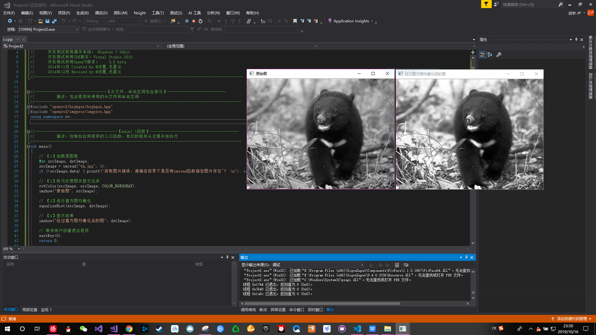
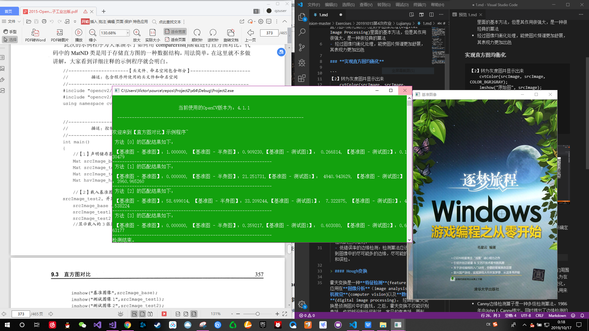
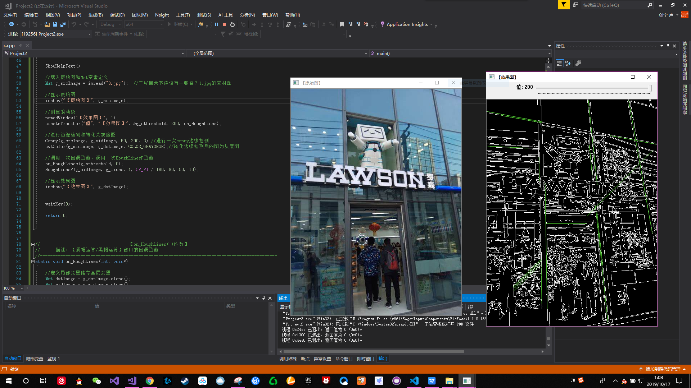

#
## **第四次课堂总结**
>### 直方图
- **直方图** 是可以对整幅图的灰度分布进行整体了解的图示，通过直方图我们可以对图像的对比度、亮度和灰度分布等有一个直观了解
- **直方图均衡化** 均衡化(Histogram Equalization)是一种增强图像对比度(Image Contrast)的方法，其主要思想是将一副图像的直方图分布变成近似均匀分布，从而增强图像的对比度。直方图均衡化虽然只是数字图像处理(Digital Image Processing)里面的基本方法，但是其作用很强大，是一种很经典的算法
- 经过图像均衡化处理，能使图片频谱更加舒展，其表现力更加出色

### **实现直方图均衡化**

```
【2】转为灰度图并显示出来
	cvtColor(srcImage, srcImage, COLOR_BGR2GRAY);
	imshow("原始图", srcImage);

【3】进行直方图均衡化
	equalizeHist(srcImage, dstImage);

【4】显示结果
	imshow("经过直方图均衡化后的图", dstImage);
```
**结果如图**：

### **直方图与匹配**
对于直方图的应用，通过标记帧与帧之间的统计来确定变化，以此检测图像中的兴趣点--AOI

  ```
  // 对hue通道使用30个bin,对saturatoin通道使用32个bin
	int h_bins = 50; int s_bins = 60;
	int histSize[] = { h_bins, s_bins };
	// hue的取值范围从0到256, saturation取值范围从0到180
	float h_ranges[] = { 0, 256 };
	float s_ranges[] = { 0, 180 };
	const float* ranges[] = { h_ranges, s_ranges };
	// 使用第0和第1通道
	int channels[] = { 0, 1 };

	// 【6】创建储存直方图的 MatND 类的实例:
	MatND baseHist;
	MatND halfDownHist;
	MatND testHist1;
	MatND testHist2;

	// 【7】计算基准图像，两张测试图像，半身基准图像的HSV直方图:
	calcHist(&hsvImage_base, 1, channels, Mat(), baseHist, 2, histSize, ranges, true, false);
	normalize(baseHist, baseHist, 0, 1, NORM_MINMAX, -1, Mat());
  ```  
结果如图

> #### 边缘检测
  - **边缘检测** 是检测图像中的一些像素点，它们周围的像素点的灰度发生了急剧的变化，我们认为在这过程中，图像中的物体不同导致了这一变化，因此可以将这些像素点作为一个集合，可以用来标注图像中不同物体的边界
  - Canny边缘检测算子是一种多级检测算法。1986年由John F. Canny提出，同时提出了边缘检测的三大准则：
  - 低错误率的边缘检测：检测算法应该精确地找到图像中的尽可能多的边缘，尽可能的减少漏检和误检。

> #### Hough变换

* 霍夫变换是一种**特征检测**(feature)，被广泛应用在**图像分析**（image analysis）、**计算机视觉**(computer vision)以及**数位影像处理**(digital image processing)。 经典的霍夫变换是侦测图片中的直线，之后，霍夫变换不仅能识别直线，也能够识别任何形状，常见的有直线、圆形、椭圆形  
* 对于Houge变换，让我映像最深的还是用它来车道检测，对于辅助驾驶真的是大有用处
* 自动驾驶系统主要由三部分组成：算法端、Client端和云端，其中算法端包括面向传感、感知和决策等关键部分的算法，传感可以理解为使用各种设备如摄像头、传感器、雷达等进行外界信息的传入，而感知即将这些信息处理为让机器可以理解的信息
* 如我们接下来要实现的车道线检测，利用霍夫变换来使汽车知道车道线的具体位置，为后续决策等操作提供支持将图像转换为灰度图，用CANNY提取信息，利用MASK掩模降低计算代价，最后封装函数，再根据函数绘制车道线，再将绘制出的车道线与原图像结合

> #### 霍夫线变换
  
   ```
  //创建滚动条
	namedWindow("【效果图】", 1);
	createTrackbar("值", "【效果图】", &g_nthreshold, 200, on_HoughLines);

	//进行边缘检测和转化为灰度图
	Canny(g_srcImage, g_midImage, 50, 200, 3);//进行一次canny边缘检测
	cvtColor(g_midImage, g_dstImage, COLOR_GRAY2BGR);//转化边缘检测后的图为灰度图

	//调用一次回调函数，调用一次HoughLinesP函数
	on_HoughLines(g_nthreshold, 0);
	HoughLinesP(g_midImage, g_lines, 1, CV_PI / 180, 80, 50, 10);
```

利用霍夫变换检测线条并绘制出来，得到结果如图

> #### 总结
- 对于今天的课，印象最深的还是Hough变换，特别仔细的去看了一下Hough应用于自动驾驶上的方面，真的很有趣，也开拓了视野，第一次真正了解到与无人车有关的项目与实践，收获很多问题也很多  
- 车道标志线向人类驾驶员指示了车道的位置，并作为导向参考来引导车辆的方向，无人驾驶汽车是要依赖于它们识别和追踪车道的能力。这项能力对于开发无人驾驶车辆的算法来说至关重要