RobotVision
----
# 第四次总结

### 图像边缘检测

canny边缘检测：

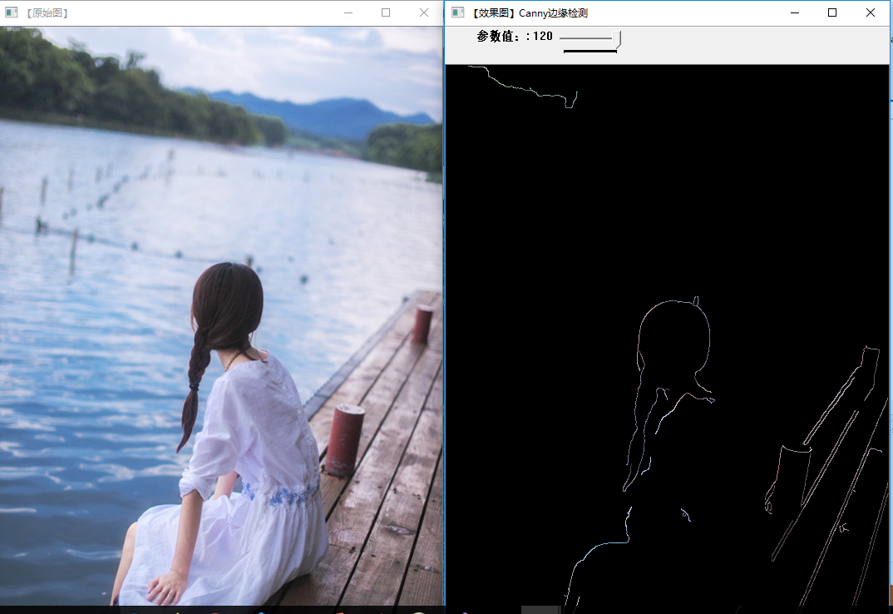

作为对比：

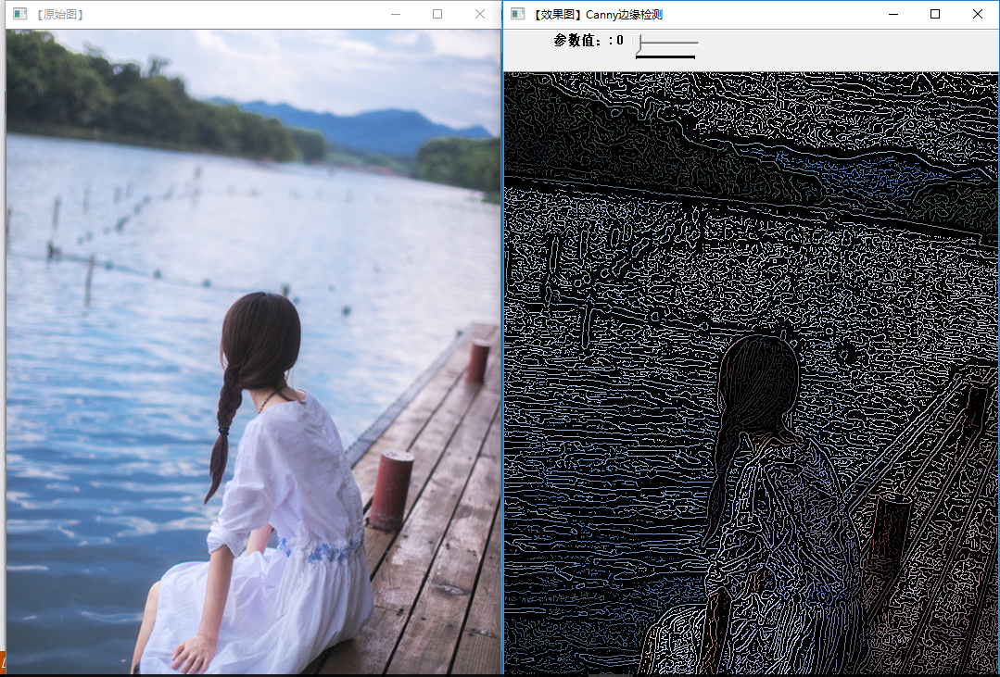

sobel边缘检测：

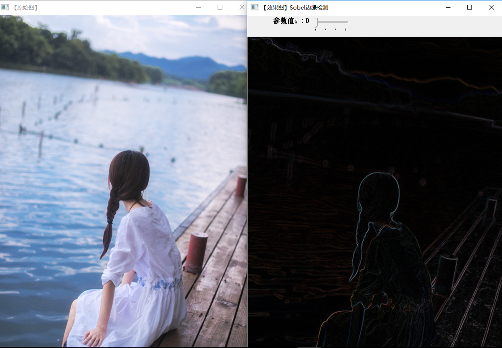

作为对比：

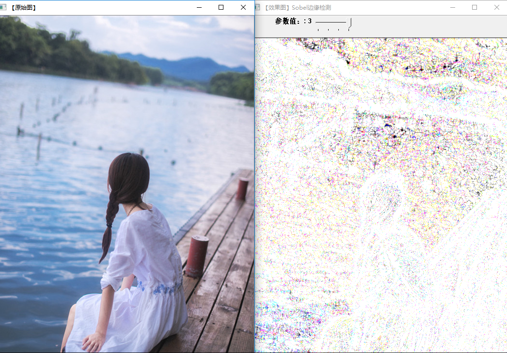

scharr边缘检测：

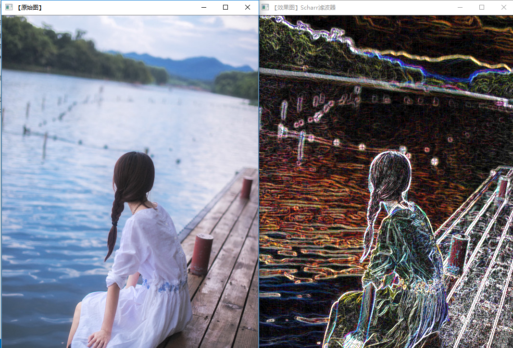

### 霍夫变换

霍夫变换是图像处理中用来从图像中分离出具有某种相同特征的几何形状（通常，直线，圆等）的常用方法。经典的霍夫变换常用来检测直线，圆，椭圆等。

霍夫变换是利用图像全局特性而将边缘像素连接起来组成区域封闭边界的一种方法。在预先知道区域形状的条件下，利用霍夫变换可以方便地得到边界曲线而将不连续的边缘像素点连接起来。

霍夫变换的主要优点是受噪声和曲线间断的影响小。利用霍夫变换还可以直接检测某些已知形状的目标。

霍夫变换的基本思想是点 —— 线的对偶性(duality)
我们可以用截距和斜率来表示直线。如果研究在参数空间中的直线，我们在数学中也使用(r，θ)这样一个参数对来表示参数空间中任意的一条直线，其中r为该直线到参数空间原点的距离，过原点往该直线做垂线，那么垂线的长度即为这个距离r，该垂线与x轴的夹角即为θ。我们就采用这样一个参数对来描述参数空间的任意一条直线。

这样的一个参数空间也被称为霍夫空间。

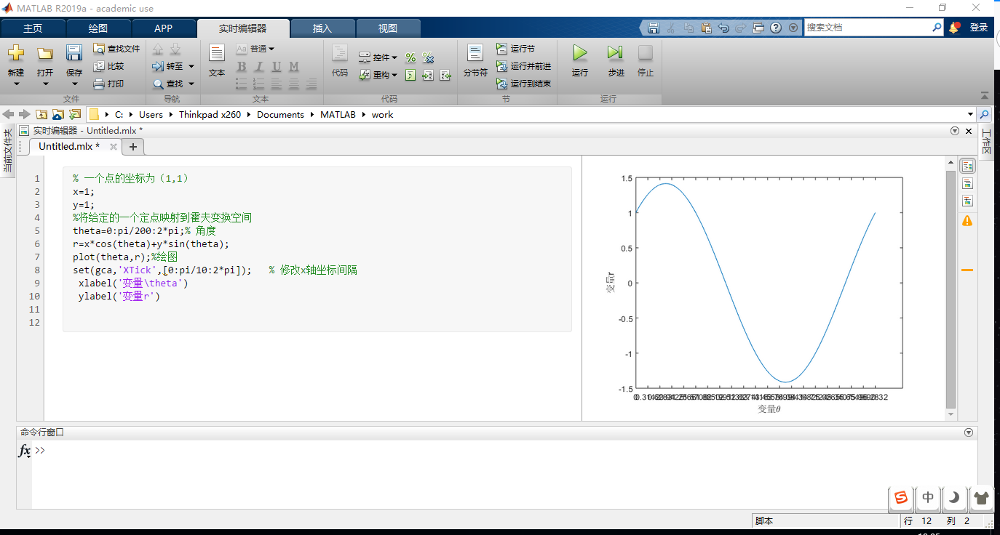

    % 一个点的坐标为（1,1）
    x=1;
    y=1;
    %将给定的一个定点映射到霍夫变换空间
    theta=0:pi/200:2*pi;% 角度
    r=x*cos(theta)+y*sin(theta);
    plot(theta,r);%绘图
    set(gca,'XTick',[0:pi/10:2*pi]);   % 修改x轴坐标间隔
    xlabel('变量\theta')
    ylabel('变量r')

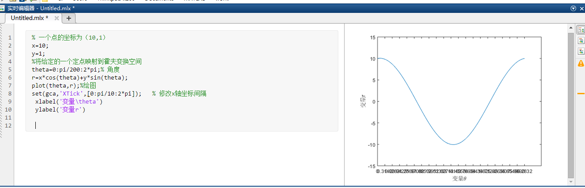

    % 一个点的坐标为（10,1）
    x=10;
    y=1;
    %将给定的一个定点映射到霍夫变换空间
    theta=0:pi/200:2*pi;% 角度
    r=x*cos(theta)+y*sin(theta);
    plot(theta,r);%绘图
    set(gca,'XTick',[0:pi/10:2*pi]);   % 修改x轴坐标间隔
     xlabel('变量\theta')
     ylabel('变量r')

上图显示了经过定点（1，1）时(r,θ)的关系。显示了在极坐标对极径极角平面绘出所有通过该定点的直线, 将得到一条正弦曲线。正弦曲线的形状取决于，点到所定义原点的距离r。

**通常，r越大，正弦曲线的振幅越大，反之则会越小。**

我们可以得到一个结论，给定平面中的单个点，那么通过该点的所有直线的集合对应于(r,θ)平面中的正弦曲线，该正选曲线对于该点是独特的。一组两个或更多点形成一条直线将产生在该线的(r,θ)处交叉的一组正弦曲线。因此，检测共线点的问题可以转化为找到并发曲线的问题。

### 直方图的相关应用
#### 直方图均衡化
直方图均衡化处理的“中心思想”是把原始图像的灰度直方图从比较集中的某个灰度区间变成在全部灰度范围内的均匀分布。直方图均衡化就是对图像进行非线性拉伸，重新分配图像像素值，使一定灰度范围内的像素数量大致相同。直方图均衡化就是把给定图像的直方图分布改变成“均匀”分布直方图分布.

有关直方图数学定义的内容，详参：

https://blog.csdn.net/superjunenaruto/article/details/52431941

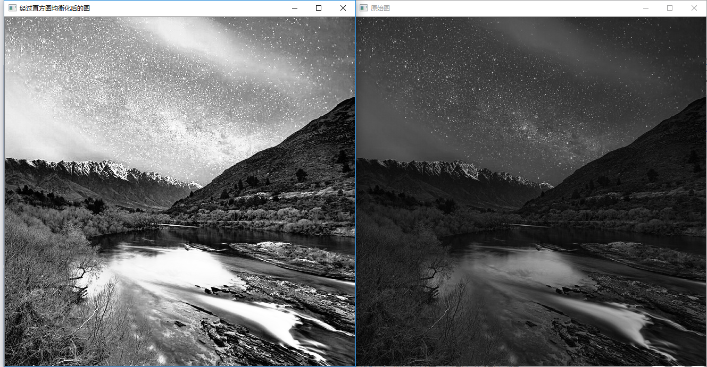

#### H-S直方图的绘制

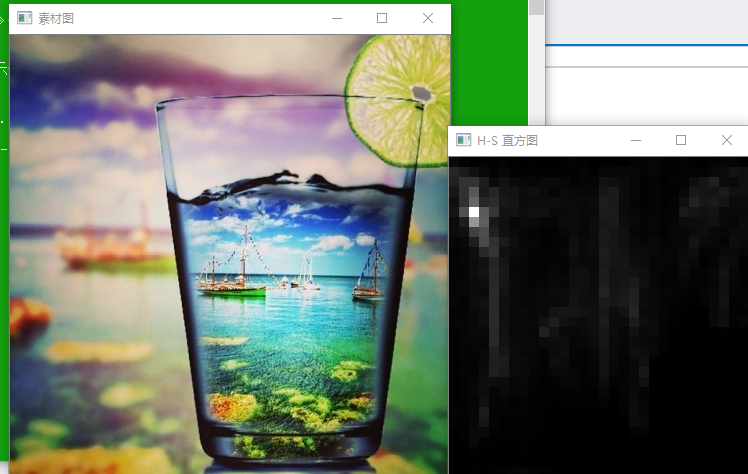

#### 一维直方图的绘制

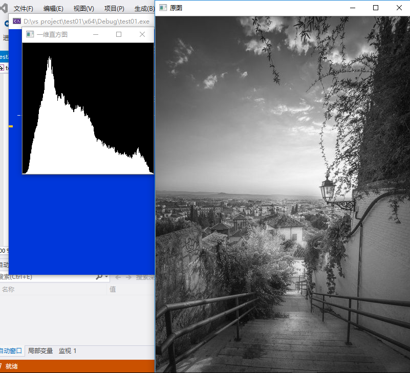

#### RGB直方图的获取

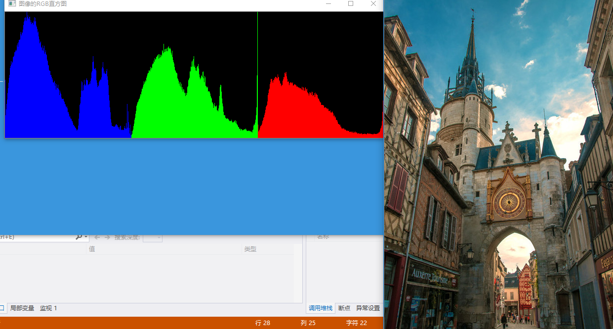

### 总结
对图像处理OpenCV3为期一周的学习，通过大量的实验操作，我对图像处理产生了浓厚的兴趣。有那么多了不起的算法，可以将客观世界的各种各样的图像由时域转变到频域去做处理。无论是卷积、傅里叶变换、拉普拉斯变换等，都离不开我们的数学。我想我此时此刻所面临的瓶颈正是在于如何通过数学这一工具来加深我对数字图像处理的理解。如果只是一个普通的数码爱好者，他会站在美颜的角度来看待图像处理；如果是一位程序员，他会将这些图像处理看做是c、c++实现的一系列算法；如果是一位数学家，他看到的则是一个个数字、一个个数学符号、一个个美妙绝伦的数学公式。不同的人，由于阅历等不同，所见事物也不同，看到的高度和深度也不同。正所谓：横看成岭侧成峰，远近高低各不同。为了了解客观世界的真面目，必须站在更高的角度来审视。
感谢龚老师为我们讲授这门课，时间虽短，寓教于乐，学有所获。我想最理想的课堂莫过于此。
希望能够积累经验，以后能够从事一些算法层面的研究。甚至是发明创造一些新的算法。
