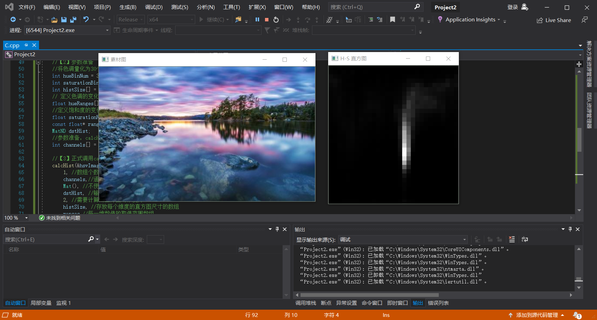
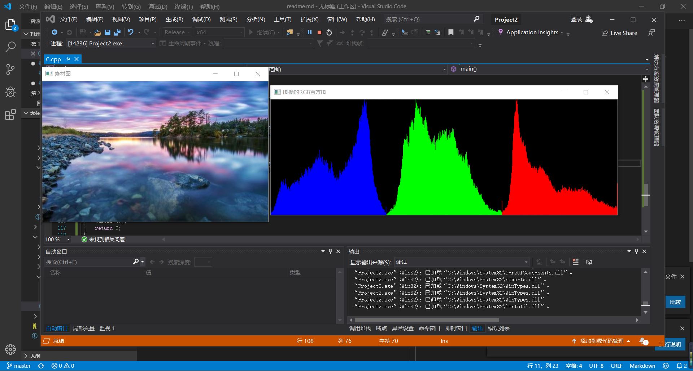
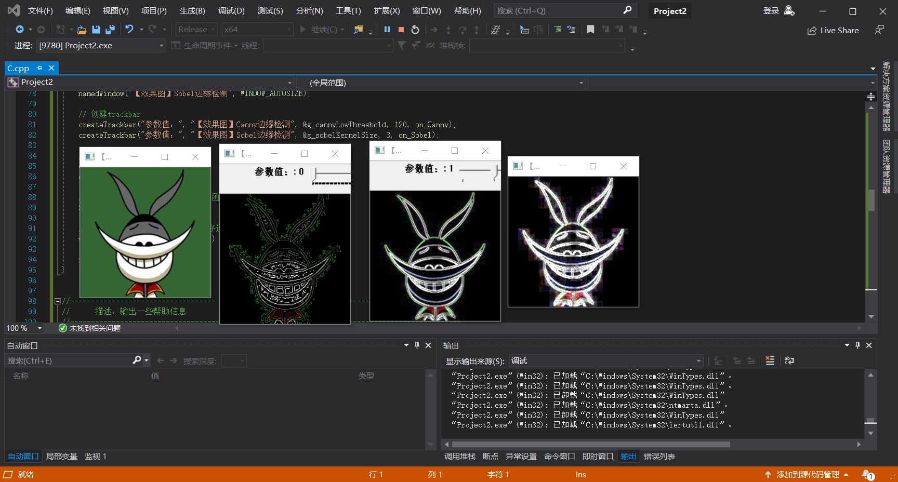
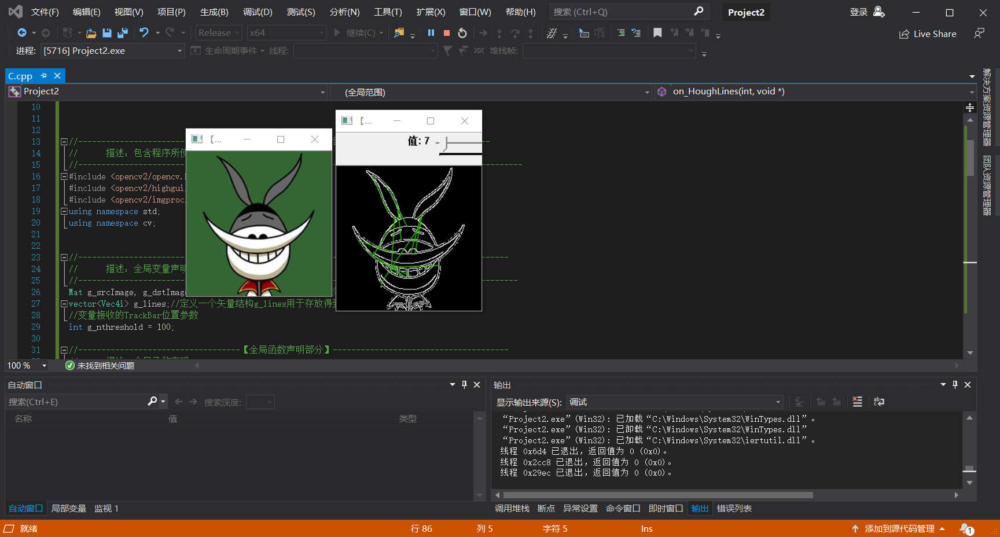
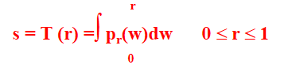
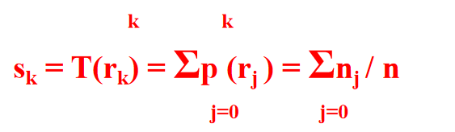

# 数字图像处理总结
&emsp;本次课老师从图像预处理技术和图像特征提取与分析两个方面讲解了数字图像处理，其中图像预处理技术又从直方图和直方图均衡化进行了具体的讲解，图像特征提取与分析从边缘检测和Hough变换进行了详细的说明，以下是代码的调试与运行结果:
## 图像预处理技术
直方图:

直方图均衡化:
## 图像特征提取与分析
边缘检测:
Hough变换:
结果分析:
1. 直方图:calcHist( const Mat* images,int nimages,
const int* channels,InputArray mask,OutputArray hist, int dims,const int* histSize,const float*ranges,bool uniform = true,bool accumulate = false );

images:是要求的Mat的指针，这里可以传递一个数组，可以同时求很多幅图片的直方图，前提是他们的深度相同，CV_8U或者CV_32F，尺寸相同。通道数可以不同；

nimages:源图像个数；

channels:传递要加入直方图计算的通道。该函数可以求多个通道的直方图。通道序号从0开始依次递增。假如第一幅图像有3个通道，第二幅图像有两个通道。则：images[0]的通道序号为0、1、2，images[1]的通道序号则为3、4；如果想通过5个通道计算直方图，则传递的通道channels为int channels[5] = {0, 1, 2, 3, 4, 5}。

mask:掩码矩阵，没有掩码，则传递空矩阵就行了。如果非空则掩码矩阵大小必须和图像大小相同，在掩码矩阵中非空元素将被计算到直方图内。

hist:输出直方图;

dims:直方图维度，必须大于0，并小于CV_MAX_DIMS(32);

histSize:直方图中每个维度级别数量，比如灰度值（0-255），如果级别数量为4，则灰度值直方图会按照[0, 63],[64,127,[128,191],[192,255]，也称为bin数目，这里是4个bin。如果是多维的就需要传递多个。每个维度的大小用一个int来表示。所以histSize是一个数组;

ranges:一个维度中的每一个bin的取值范围。如果uniform == true，则range可以用一个具有2个元素（一个最小值和一个最大值）的数组表示。如果uniform == false，则需要用一个具有histSize + 1个元素（每相邻的两个元素组成的取值空间代表对应的bin的取值范围）的数组表示。如果统计多个维度则需要传递多个数组。所以ranges，是一个二维数组。
uniform:表示直方图中一个维度中的各个bin的宽度是否相同或，详细解释见ranges中介绍;

accumulate:在计算直方图时是否清空传入的hist。true，则表示不清空，false表示清空。该参数一般设置为false。只有在想要统计多个图像序列中的累加直方图时才会设置为true。

2. 直方图均衡化:基本思想是对在图像中像素个数多的灰度级进行展宽，而对像素个数少的灰度级进行缩减，从而达到清晰图像的目的。用以改变图像整体偏暗或整体偏亮，灰度层次不丰富的情况，将直方图的分布变成均匀分布。

直方图均衡化的技术要点：
公理：直方图p(rk )，为常数的图像对比度最好。
目标：寻找一个灰度级变换T(r)，使结果图像的直方图p(sk )为一个常数。
实现：强制认为累积分布函数CDF是我们要找的变换函数T(r)。

直方图均衡化的算法实现:

>1. 累积分布函数的计算:
用累积分布函数的离散形式来计算

>2. 算法实现：
>>1. 求出灰度级变换T 
>>2. 用T对图像进行灰度级变换

3. 边缘检测：边缘检测的一般步骤：
>1.  滤波:边缘检测的算法主要是基于图像强度的一阶和二阶导数，但导数通常对噪声很敏感，因此必须采用滤波器来改善与噪声有关的边缘检测器的性能。常见的滤波方法主要有高斯滤波，即采用离散化的高斯函数产生一组归一化的高斯核，然后基于高斯核函数对图像灰度矩阵的每一点进行加权求和。
>2.  增强:增强边缘的基础是确定图像各店邻域强度的变化值。增强算法可以将图像灰度点邻域强度值有显著变化的点凸显出来。在具体编程实现时，可通过计算梯度幅值来确定。
>3.  检测:经过增强的图像，往往邻域中有很多的梯度值比较大，而在特定的应用中，这些点并不是要找的边缘点，所以采用某种方法来对这些点进行取舍。实际工程中，常用的方法是通过阈值化方法来检测。

Canny边缘检测用于检测图像中的边缘。它接受灰度图像作为输入，并使用多级算法。可以使用imgproc类的Canny()方法在图像上执行此操作：
Imgproc.Canny(image, edges, threshold1, threshold2)其中:

image:表示此操作的源(输入图像)的Mat对象。

edges:表示此操作的目标(边缘)的Mat对象。

threshold1:类型为double的变量表示滞后过程的第一个阈值。

threshold2:类型为double的变量表示滞后过程的第二个阈值。

4. Hough变换:cv2.HoughLines()

它返回(ρ, θ)值的序列，ρ单位像素，θ单位弧度。第一个参数，输入的图片是一个二进制图片，在使用hough变换之前，应用阈值或使用canny边缘检测。第二和第三个参数分别是ρ和θ的精度，第4个参数是阈值，指可以被认为是一个线条的最小计数值。由于计数值的多少取决于线上的点数，所以这代表了可以被识别当给定图像空间中的一些边缘点时，可以通过Hough变换确定连接这些点的直线方程。把在图像空间中的直线检测问题转换到参数空间中对点的检测问题，通过在参数空间里进行简单的累加统计即可完成检测任务为线的最小长度。

当给定图像空间中的一些边缘点时，可以通过Hough变换确定连接这些点的直线方程。把在图像空间中的直线检测问题转换到参数空间中对点的检测问题，通过在参数空间里进行简单的累加统计即可完成检测任务。

&emsp;心得体会：这次课上出现了许多数学公式，其中涉及到的知识对高数有很高的要求，之前数学的底子没有打好，在理解公式时有很大的压力，以后要加强对数学的学习，为接下来的学习打好基础，想要学好编程，数学能力是必不可少的一环，课上学到了直方图，直方图均衡化，边缘检测和Hough变换的原理与代码实现，进一步加深了对opencv的理解。