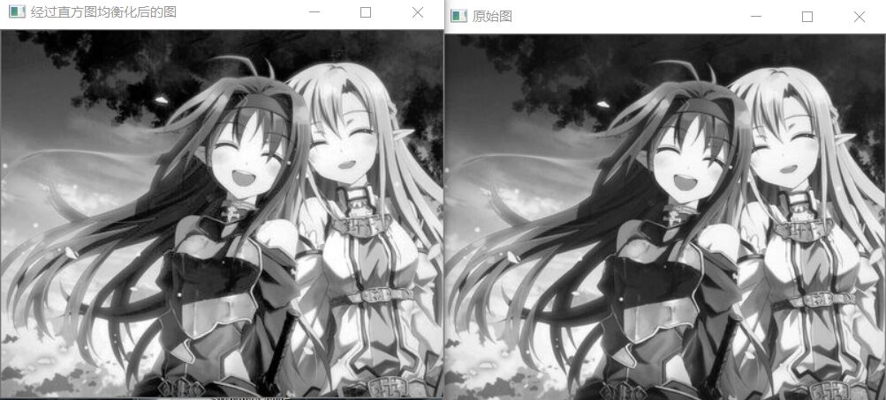
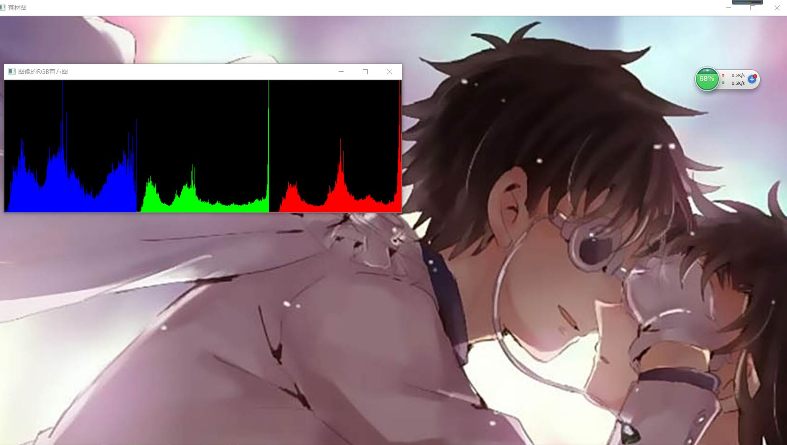
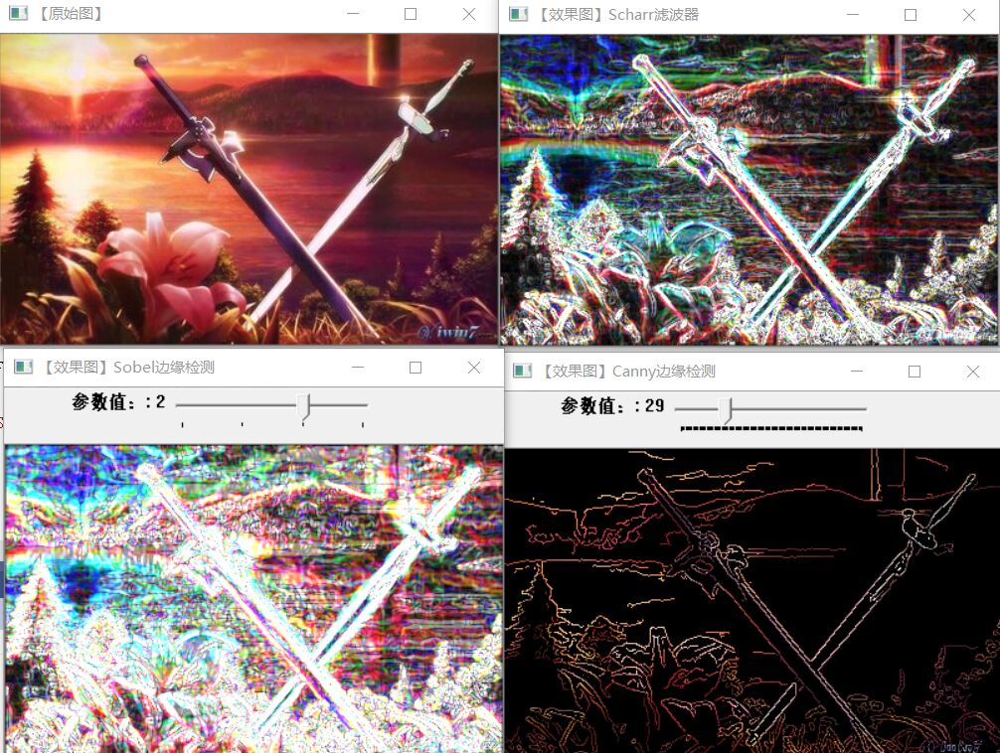

# 第四次作业
## 图像预处理技术
1. 图像增强，它的主要目标是通过对图像的处理，使图像比处理前更适合一个特定的应用。空域法包含点运算法，模板运算法，几何变换法。
其基于点操作的图像增强效果图——直方图均衡化如下：

其余直方图：

2. 傅里叶变换，傅里叶变换分离散和连续傅里叶变换。从物理效果看，傅立叶变换是将图像从空间域转换到频率域，其逆变换是将图像从频率域转换到空间域。对图像进行二维傅立叶变换得到频谱图就是图像梯度的分布图。
## 图像特征提取与分析
1. 特征选择的特点：可区别性，可靠性，独立性，数量少。其方法有低层次，中层次和高层次。
边缘检测：
 
2. 霍夫变换———— 是图像处理中从图像中识别几何形状的基本方法之一，应用很广泛，也有很多改进算法。主要用来从图像中分离出具有某种相同特征的几何形状(如，直线，圆等)。最基本的霍夫变换是从黑白图像中检测直线(线段)。
hough变化：

# 总结
通过这次实验，学会了实现灰度图像领域平滑处理方法和滤波处理方法，还明白了直方图均值化，并使用OpenCV实现它们，但在这次实验中，还是对霍夫线变换还是有些不了解，不过通过百度以及ppt对它有了大致了解，让我意识到我算法方面的不足，需要去弥补，期待下次比这次更好，自己有所提高。

