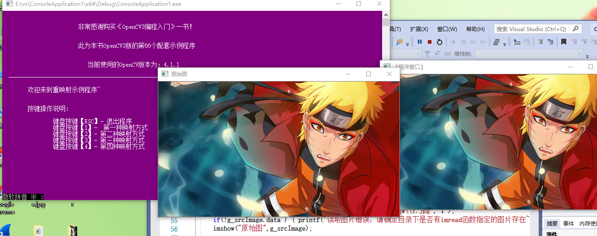
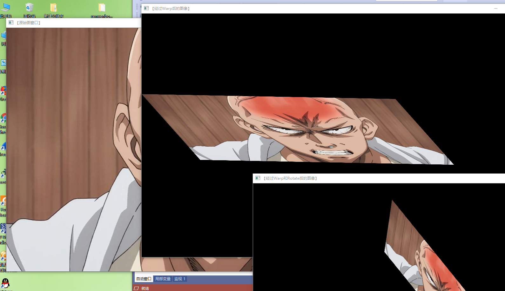
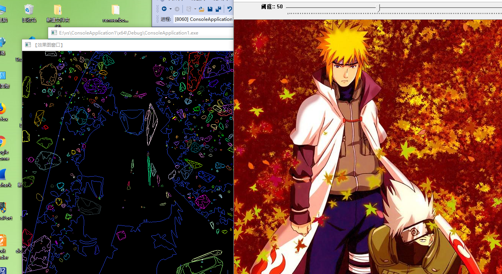
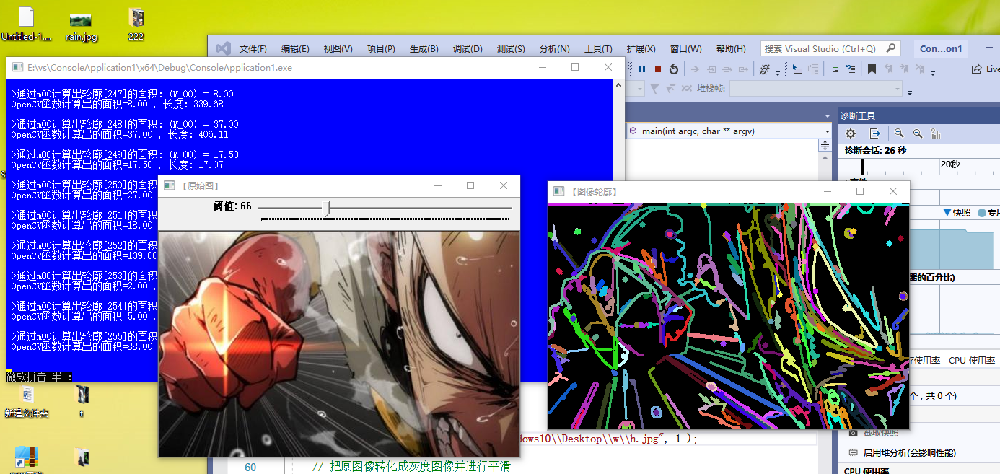
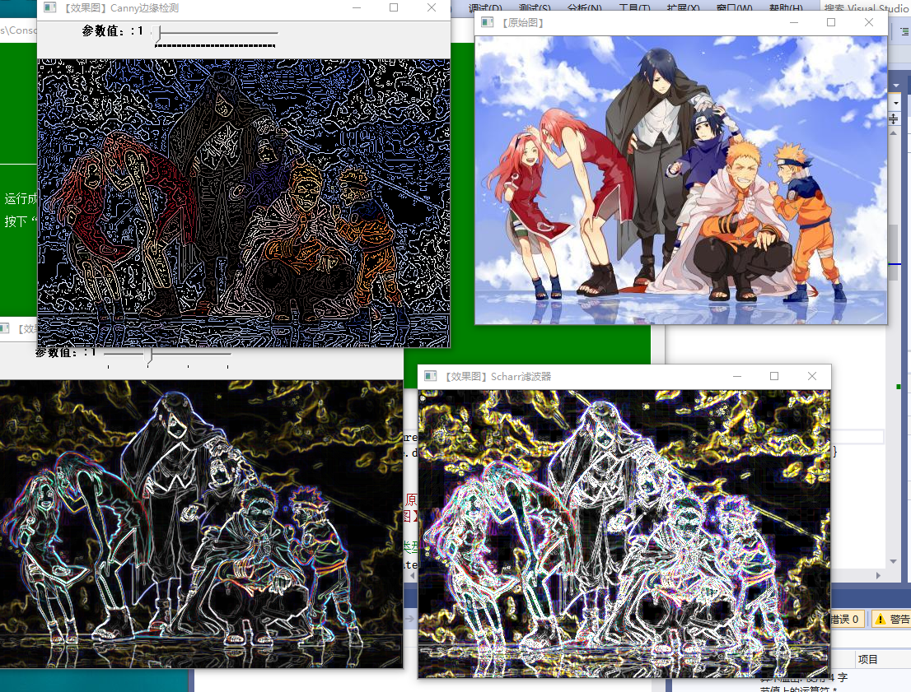

学习总结：
今天主要学习和理解图像预处理技术和图像特征提取与分析（还是利用opencv来处理进一部处理图像）
1. 图像预处理技术：图像预处理，是将每一个文字图像分检出来交给识别模块识别，这一过程称为图像预处理。在图像分析中，对输入图像进行特征抽取、分割和匹配前所进行的处理，图像预处理的主要目的是消除图像中无关的信息，恢复有用的真实信息，增强有关信息的可检测性和最大限度地简化数据，从而改进特征抽取、图像分割、匹配和识别的可靠性。
如图像的直方图均衡化：（图像增强）

多种重映射变换：

仿射变换：

2.  特征提取是计算机视觉和图像处理中的一个概念。它指的是使用计算机提取图像信息，决定每个图像的点是否属于一个图像特征。特征提取的结果是把图像上的点分为不同的子集，这些子集往往属于孤立的点、连续的曲线或者连续的区域。 
如图像的凸包处理：

图像轮廓处理：

图像修复：

图像滤波和边缘检测：

特征提取是图象处理中的一个初级运算，也就是说它是对一个图像进行的第一个运算处理。它检查每个像素来确定该像素是否代表一个特征。假如它是一个更大的算法的一部分，那么这个算法一般只检查图像的特征区域。作为特征提取的一个前提运算，输入图像一般通过高斯模糊核在尺度空间中被平滑。此后通过局部导数运算来计算图像的一个或多个特征。 
有时，假如特征提取需要许多的计算时间，而可以使用的时间有限制，一个高层次算法可以用来控制特征提取阶层，这样仅图像的部分被用来寻找特征。 
由于许多计算机图像算法使用特征提取作为其初级计算步骤，因此有大量特征提取算法被发展，其提取的特征各种各样，它们的计算复杂性和可重复性也非常不同。 