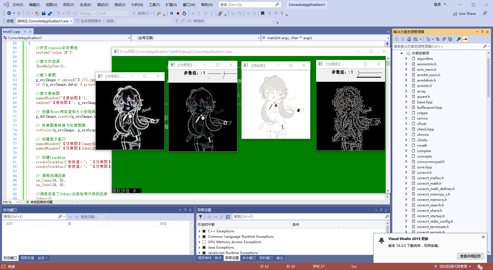
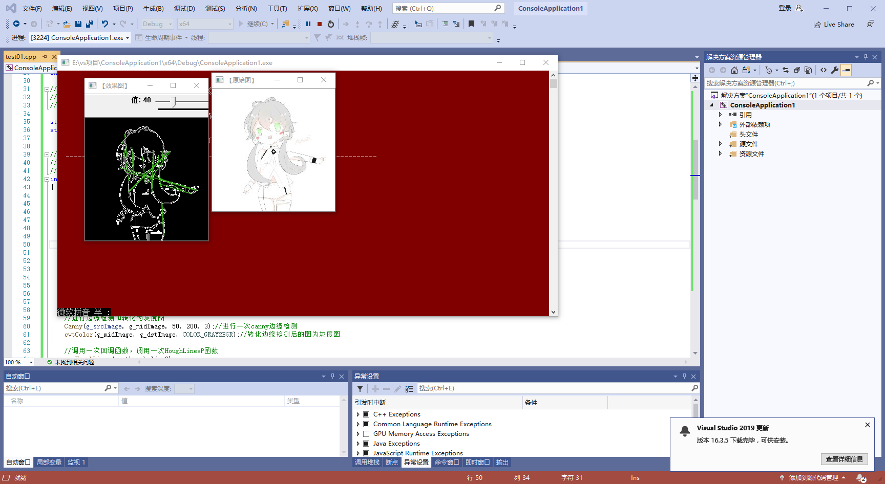

# 第四次作业
## 图像处理
### 基于opencv的边缘检测
#### 边缘检测的一般步骤
第一步 滤波：常见的滤波方法主要有高斯滤波，即采用离散化的高斯函数产生一组归一化的高斯核，然后基于高斯核函数对图像灰度矩阵的每一点进行加权求和

第二步 增强：增强边缘的基础是确定图像各点邻域强度的变化值

第三步 检测：实际的工程中，常用的方法是阈值化的方法来检测
#### Canny边缘检测的步骤
第一步 消除噪音

第二步 计算梯度幅值和方向

第三步 非极大值抑制

第四步 滞后阈值
#### sobel算子
solbel算子是一个主要用于边缘检测的离散微分子，它结合了高斯平滑和微分求导。用于计算图像灰度函数和函数的近似梯度
#### Laplacian算子
Laplacian算子是n维欧几里德中的一个二阶微分算子
#### 综合示例：边缘检测
运行效果图如下所示

### 霍夫变换
霍夫变换是图像处理中一种特征提取技术，该过程在一个参数空间中通过计算累计结果的局部最大值得到一个符合该特定形状的集合作为霍夫变换结果。
#### 标准霍夫变换
此函数可以找出采用标准霍夫变换的二值图像变换
##### 累计概率的霍夫变换：HoughLines P（）函数
此函数在HoughLines的基础上，在末尾加了一个代表Probabilistic的P，表明它可以采用累计概率霍夫变换来找出二值图像中的直线
#### 霍夫圆变换
霍夫圆变换的基本原理和霍夫线变换的基本原理大体类似，只是对应的二维极Σ(っ °Д °;)っ极角空间被三维圆心点和半径空间取代
#### 综合示例：霍夫变换
这次综合示例，我们在HoughLinesP函数的基础上，为其添加了控制其五个参数阈值的滚动条，运行效果图如下所示

### 直方图均衡化
很多时候，我们用相机拍摄的照片往往会不尽人意，这时，我们可以对图像进行一些处理，来扩大图像的动态范围，这是最常用的技术就是直方图均衡化，直方图均衡化是灰度变换的一个重要应用，它高效且易于实现，广泛运用于图像增强处理中，图像的灰度变换是随机的，直方图的图形高低不齐，直方图均衡化就是运用一定算法使直方图大致平和的方法
#### 实现直方图均衡化：equalizeHist（）函数
由equalizeHist（）函数实现的灰度直方图均衡化，就是把直方图的每个灰度级进行归一化处理，求每种灰度的累积分布，得到一个映射的灰度映射表，然后根据相应的灰度值来修正原图中的每个像素
#### 综合示例
运行效果图如下所示

## 总结
在本节课我们学习到了很多类型的图像变换方法，Robert算子定位比较精确，但由于不包括平滑，所以对于噪声比较敏感。Prewitt算子和Sobel算子都是一阶的微分算子，而前者是平均滤波，后者是加权平均滤波且检测的图像边缘可能大于2个像素。这两者对灰度渐变低噪声的图像有较好的检测效果，但是对于混合多复杂噪声的图像，处理效果就不理想了。LOG滤波器方法通过检测二阶导数过零点来判断边缘点。LOG滤波器中的a正比于低通滤波器的宽度，a越大，平滑作用越显著，去除噪声越好，但图像的细节也损失越大，边缘精度也就越低。所以在边缘定位精度和消除噪声级间存在着矛盾，应该根据具体问题对噪声水平和边缘点定位精度要求适当选取。