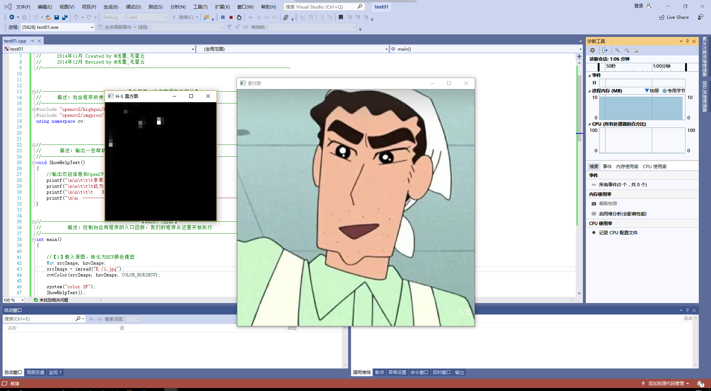
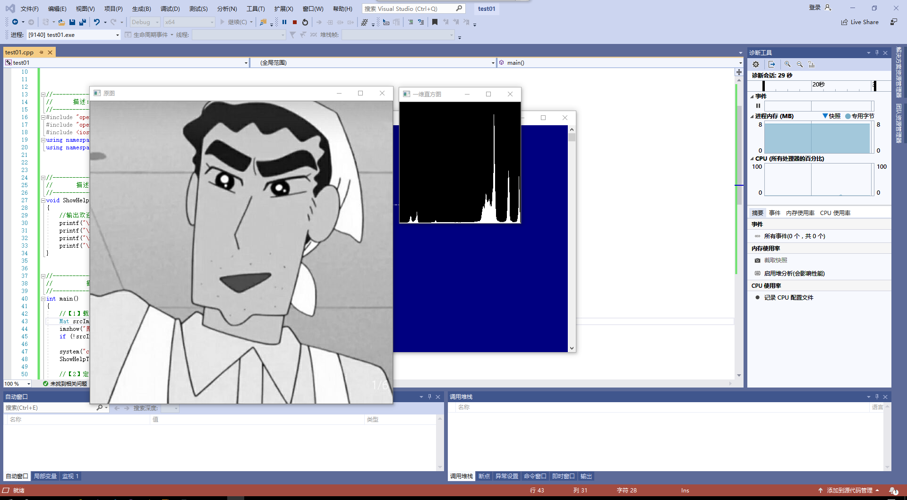
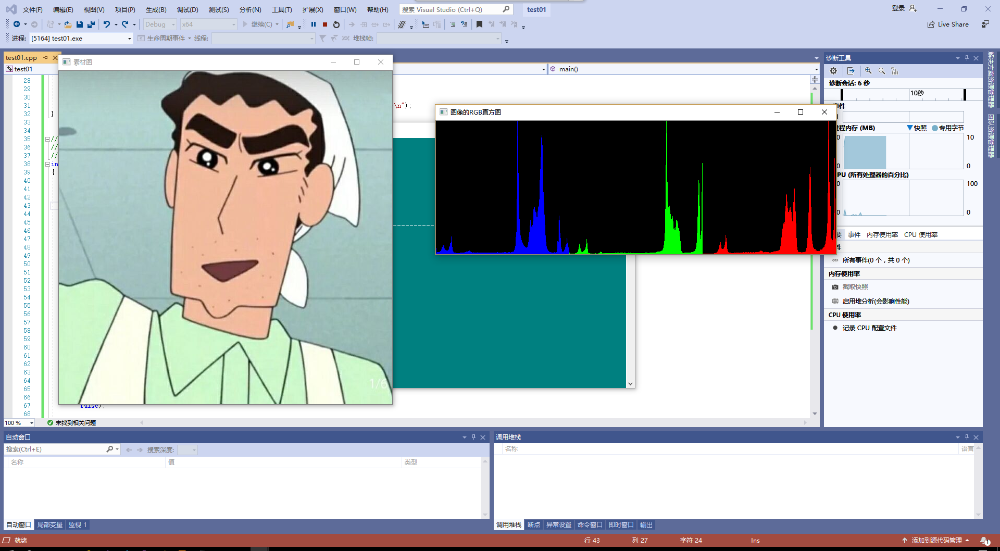

## 第四次作业
### 图像直方图
本节课我们学习了图像直方图的运用。直方图是对数据进行统计的一种方法，并且将统计值组织到一系列事先定义好的bin中图像直方图是用以表示数字图像中亮度分布的直方图，标绘了图像中每个亮度值的像素值。

直方图的意义在于直方图是图像中像素强度分布的图像表达式，他统计了每一个强度值所具有的像素个数。

### 图像二维直方图
二维直方图的绘制，先载入图片，将其转化为HSV颜色模型，再将色调量化为30个等级，将饱和度量化为32个等级，定义色调的变化范围为0到179，定义饱和度的变化范围为0（黑、白、灰）到255（纯光谱颜色），calcHist函数中将计算第0通道和第1通道的直方图，接下来，正式调用calcHist，进行直方图计算，再双层循环，进行直方图绘制。

for (int hue = 0; hue < hueBinNum; hue++)

		for (int saturation = 0; saturation < saturationBinNum; saturation++)

		{
			float binValue = dstHist.at<float>(hue, saturation);//直方图组距的值
			int intensity = cvRound(binValue * 255 / maxValue);//强度
}

运行出来的结果为：

## 一维直方图
一维直方图的绘制为，先载入图片，再定义变量，用const类型。再计算图像的直方图，获得最大值最小值，在运用函数绘制出直方图。
for (int i = 0; i < 256; i++)

	{
		float binValue = dstHist.at<float>(i); 
		int realValue = saturate_cast<int>(binValue * hpt / maxValue);
		rectangle(dstImage, Point(i * scale, size - 1), Point((i + 1) * scale - 1, size - realValue), Scalar(255));
	}

    运行结果为：

### RGB三色直方图的绘制
先进行参数准备，然后获取各个直方图中的最大值和最小值，得到三个分量的最大值也就是点数最多的像素点。再定义要显示的直方图，获取各个分量的实际数值，对每一个分量都要进行绘制高度。再运行函数绘制出三色直方图。

		//绘制红色分量的直方图
		rectangle(histImage, Point(i * scale, histHeight - 1),
			Point((i + 1) * scale - 1, histHeight - intensity_red),
			Scalar(255, 0, 0));

		//绘制绿色分量的直方图
		rectangle(histImage, Point((i + bins) * scale, histHeight - 1),
			Point((i + bins + 1) * scale - 1, histHeight - intensity_green),
			Scalar(0, 255, 0));

		//绘制蓝色分量的直方图
		rectangle(histImage, Point((i + bins * 2) * scale, histHeight - 1),
			Point((i + bins * 2 + 1) * scale - 1, histHeight - intensity_blue),
			Scalar(0, 0, 255));

	}

    运行结果为：

### 总结
通过本节课的学习，我掌握了基本的图像直方图的方法，观察了图像增强的效果，加深了对灰度化和均衡化后的直方图，并将灰度图和均衡化后的图片进行了图片对比。也对二维直方图，一维直方图和三色直方图的代码进行了调试。掌握了相关的函数，并能熟练运用。在进行物体图像和视频信息分析的过程中，我们常常习惯于将眼中看到的物体用直方图表示出来，得到比较直观的数据观感展示，直方图可以用来描述各种不同的参数和事物，这也是这堂课的意义所在。