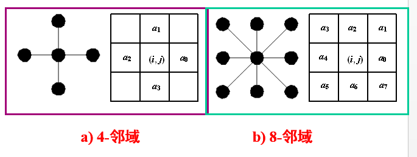
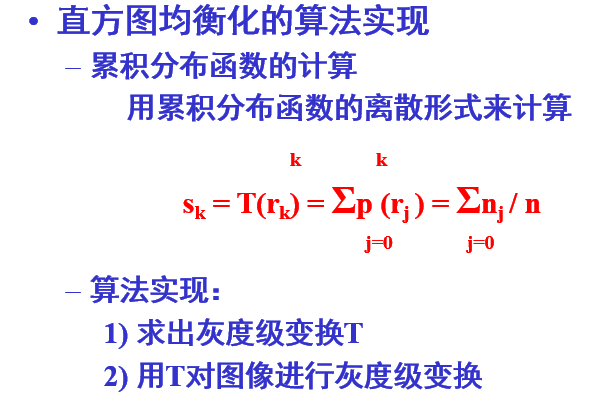
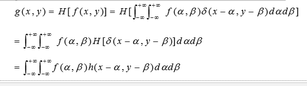
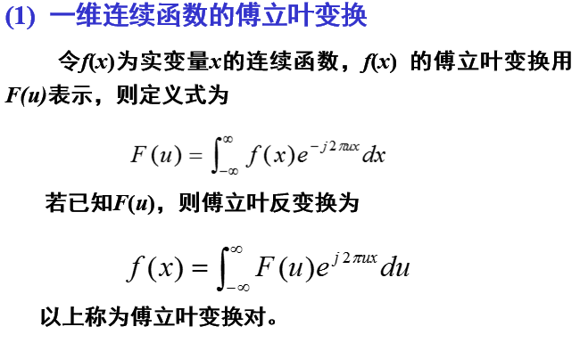
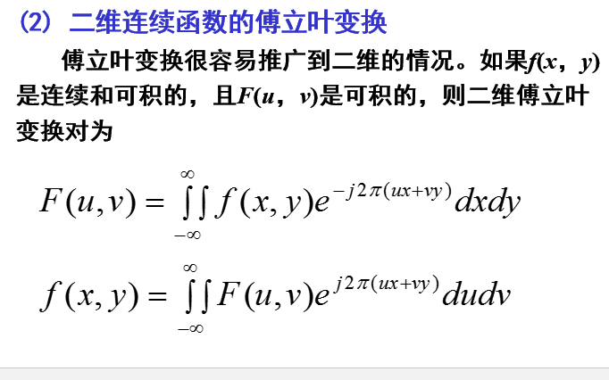
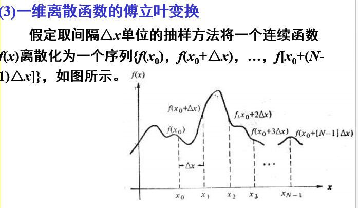
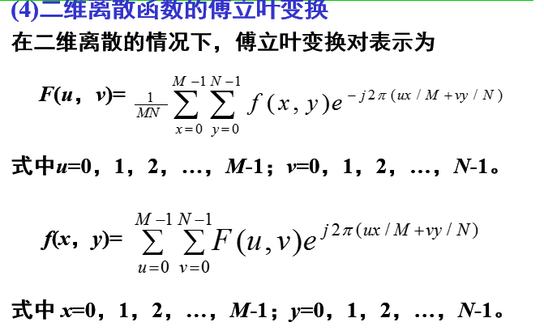
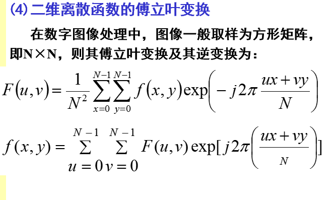

# 第四次作业  

## 图像预处理技术  

### 基本概念  

neighborhood:邻域,附近像素形成的区域。常见四邻域,八邻域。  
region:区域,相邻相似性质点组成的集合。像素的连通集( connectedness )。  
连通集:同-区域中,任意两个像素点至少存在一条连通路径。  
四连通区域或四邻域,是指应像素位置的上、下、左、右,是紧邻的位置。共个方向,所以称之为四连通区域,又叫四邻域。  
八连通域或八邻域,对应位置的上、下左右、左上、右上、左下、下,是紧邻的位置和斜向相邻的位置。共8个向,所以称之为8连通区域或八邻域。  
  

### 图像增强    

#### 图像增强的概念   

图像增强的主要目标是通过对图像的处理，使图像比处理前更适合一个特定的应用。可能的处理：去除噪声、边缘增强、提高对比度、增加亮度、改善颜色效果、改善细微层次等，通常与改善视觉效果相一致。  

图像增强可分成两大类：频率域法和空间域法。前者把图像看成一种二维信号，对其进行基于二维傅里叶变换的信号增强。采用低通滤波（即只让低频信号通过）法，可去掉图中的噪声；采用高通滤波法，则可增强边缘等高频信号，使模糊的图片变得清晰。后者空间域法中具有代表性的算法有局部求平均值法和中值滤波（取局部邻域中的中间像素值）法等，它们可用于去除或减弱噪声。  

#### 方法  

图像增强的方法是通过一定手段对原图像附加一些信息或变换数据，有选择地突出图像中感兴趣的特征或者抑制(掩盖)图像中某些不需要的特征，使图像与视觉响应特性相匹配。在图像增强过程中，不分析图像降质的原因，处理后的图像不一定逼近原始图像。图像增强技术根据增强处理过程所在的空间不同，可分为基于空域的算法和基于频域的算法两大类。
空域法是对图像中的像素点进行操作，用公式描述如下：g(x,y)=f(x,y)*h(x,y)。其中是f(x,y)是原图像；h(x,y)为空间转换函数；g(x,y)表示进行处理后的图像。基于空域的算法处理时直接对图像灰度级做运算，基于频域的算法是在图像的某种变换域内对图像的变换系数值进行某种修正，是一种间接增强的算法。基于空域的算法分为点运算算法 [1]  和邻域去噪算法 [2]  。点运算算法即灰度级校正、灰度变换和直方图修正等，目的或使图像成像均匀，或扩大图像动态范围，扩展对比度。

邻域增强算法分为图像平滑和锐化两种。平滑一般用于消除图像噪声，但是也容易引起边缘的模糊。常用算法有均值滤波、中值滤波。锐化的目的在于突出物体的边缘轮廓，便于目标识别。常用算法有梯度法、算子、高通滤波、掩模匹配法、统计差值法等。  
    

直方图均衡化不改变灰度出现的次数，改变的是出现次数所对应的灰度级。直方图均衡化力图使等长区间内出现的像素数接近相等。  
直方图规定化目的：把已知直方图的图像变为期望直方图的图像。若目标直方图分布均匀，即作了直方图均衡  

### 图像复原
图像复原是一种改善图像质量的处理技术，消除或减轻在图像获取及传输过程中造成的图像品质下降即退化现象.退化包括：由成像系统光学特性造成的歧变，噪声和相对运动造成的图像模糊，源自电路和光度学因素的噪声等。图象恢复处理的关键问题在于建立退化模型。

与图像增强的区别：图像增强是主观的过程，图像复原是客观的过程
  
逆滤波复原法也叫做反向滤波法，其主要过程是首先将要处理的数字图像从空间域转换到傅立叶频率域中，进行反向滤波后再由频率域转回到空间域，从而得到复原的图像信号。基本原理如下：如果退化图像为g(x,y)，原始图像为f(x ,y)，在不考虑噪声的情况下，其退化模型为
  
### 图像变换  
图像变换的目的在于：①使图像处理问题简化；②有利于图像特征提取；③有助于从概念上增强图像信息的理解。  

图像变换通常是一种二维正交变换。一般要求： ①正交变换必须是可逆的； ②正变换和反变换的算法不能太复杂； ③正交变换的特点是在变换域中图像能量将集中分布在低频率成分上，边缘、线状信息反映在高频率成分上，有利于图像处理。因此正交变换广泛应用在图像增强、图像恢复、特征提取、图像压缩编码和形状分析等方面。

#### 傅里叶变换  
对图像进行二维傅立叶变换得到频谱图就是图像梯度的分布图，频谱图上的各点与图像上各点并不存在一一对应的关系。傅立叶频谱图上看到的明暗不一的亮点，实际是图像上某一点与邻域点差异的强弱，即梯度的大小，也即该点的频率大小。傅里叶变换后的图像，四角对应于低频成分，中央部位对应于高频部分。
   
   
  
    
   
 
## 总结  
图像的预处理在数字图像中占了很重要的地位，图像质量的好坏，直接影响了后面我们的分析，例如分类、识别、分割等，但是大多数人往往只关注后面的核心部分，很少关心前面的预处理，以为只要简单的几个与处理步骤就行了，殊不知预处理才是我们建高楼大厦的基础，才是重中之重。而且预处理涉及的内容太多，要想充分掌握必须得花很大的功夫。要想之后能够熟练地运用呢，就一定得先把基础打好。学到的主要内容：图像预处理主要包括去噪、对比度增强。1，灰度化：让像素点矩阵中的每一个像素点都满足下面的关系：R=G=B（就是红色变量的值，绿色变量的值，和蓝色变量的值，这三个值相等，“=”的意思不是程序语言中的赋值，是数学中的相等），此时的这个值叫做灰度值。2、高斯滤波、均值滤波、中值滤波、双边滤波（去噪）3、gamma矫正4、直方图均衡化5、线性变换6、亮度、饱和度调整7、一种计算图像曝光度（Exposure）的方法