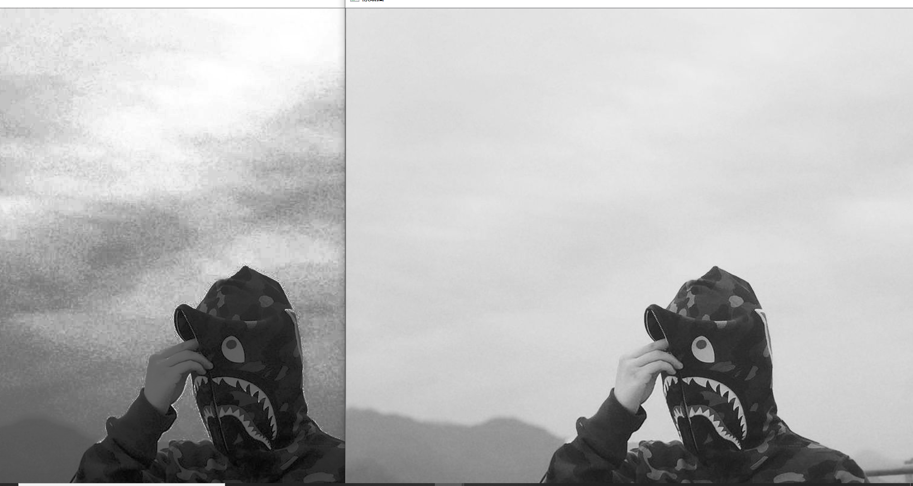
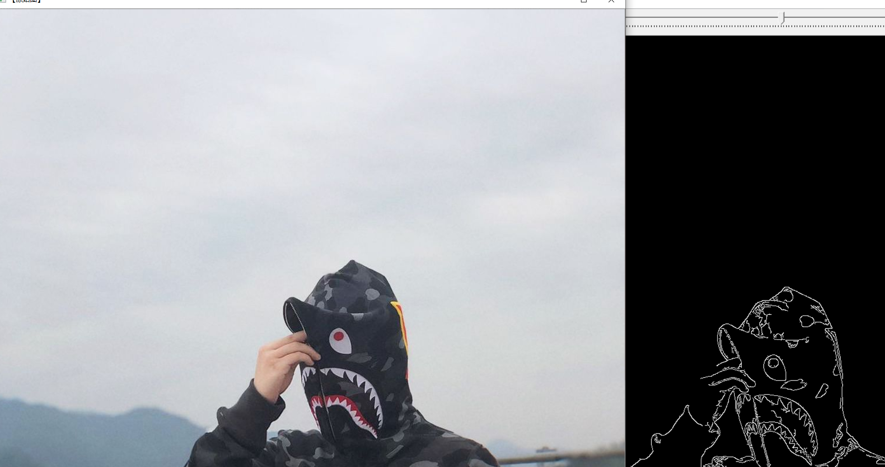
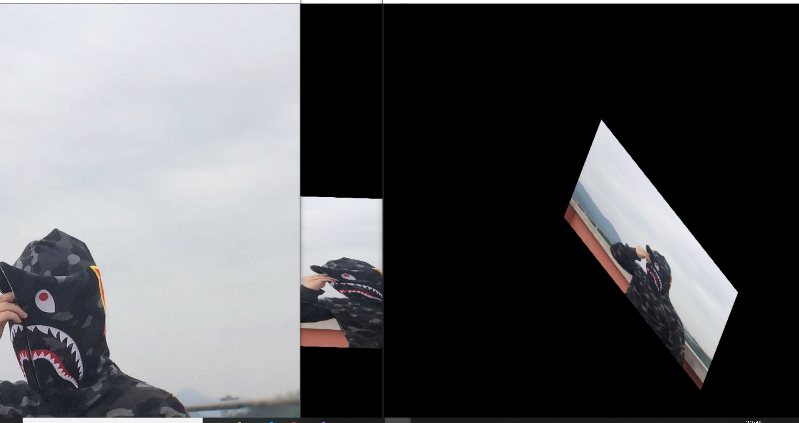
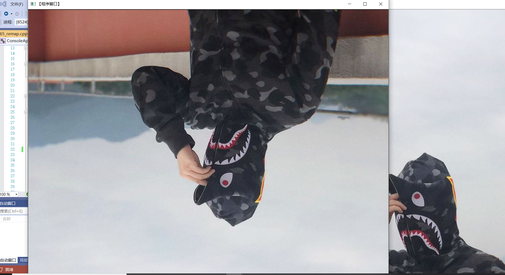
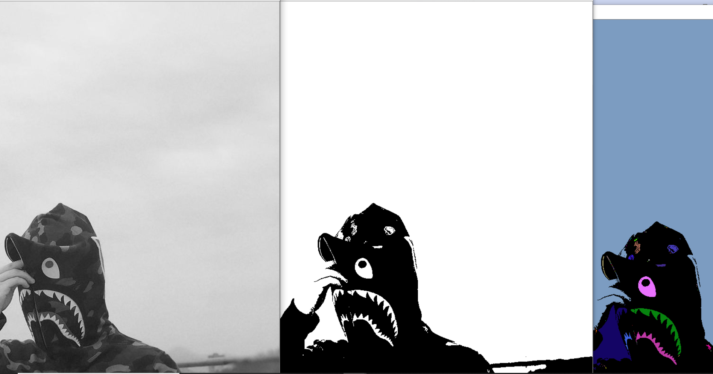
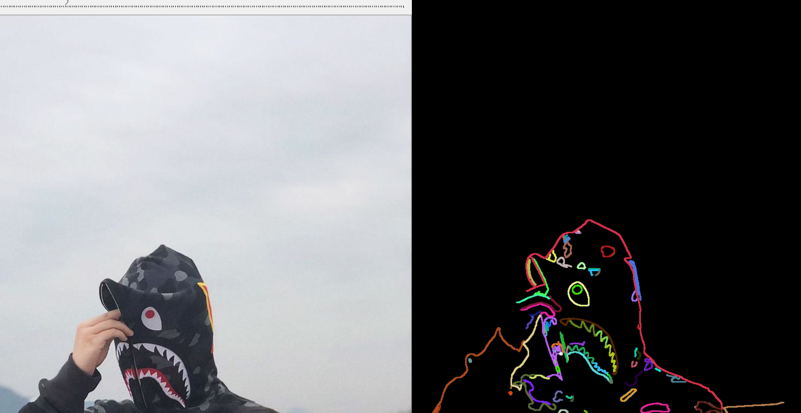
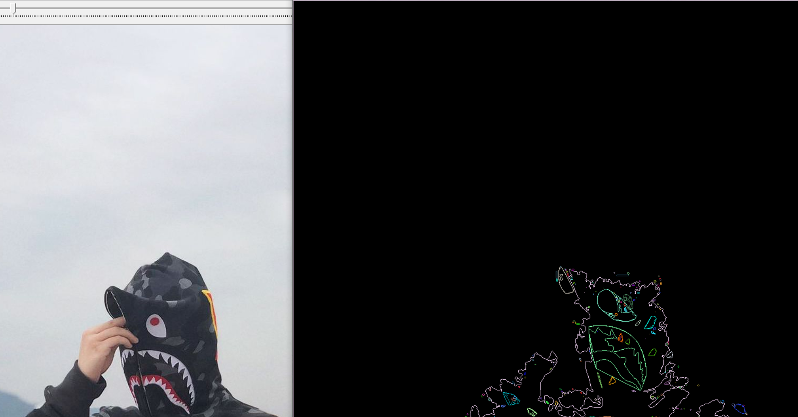

# 第四次作业：图像预处理技术
## 1. 基本概念
## 2. 图像增强
### 2.1 图像增强的概念

* 图像增强的定义

  * 图像增强的主要目标是通过对图像的处理，使图像比处理前更合适一个特定的应用。
  *  处理策略：空域策略、频域策略。
  *  可能的处理：去除噪声、边缘增强、提高对比度、增加亮度、改善颜色效果、改善席位层次等，通常与改善视觉效果相一致。
### 2.2 基于点操作的图像增强

* 灰度级变换

  * 应用：亮度调整、对比度拉伸、灰度级切片
  * 获取变换函数的方法：固定函数、交互杨点插值、直方图

* 直方图均衡化
  
  基本思想是对图像中像素个数多的灰度级进行展宽，而对像素少的灰度级进行缩减，从而达到清晰图像的目的。用以改变图像整体偏暗或偏亮，灰度层次不丰富的情况，将直方图的分布变成均匀分布直方图均衡化是灰度变换的一个重要应用，高效且易于实现，广泛应用于图像增强处理中。图像的像素灰度变换是随机的，直方图的图形高低不齐，直方图均衡化就是用一定的算法使直方图大致平和的方法。简而言之，直方图均衡化是通过拉伸像素强度分布范围来增强图像对比度的一种方法。均衡化处理后的图像只能是近似均匀分布。均衡化图像的动态范围扩大了，但其本质是扩大了量化间隔，而量化级别反而减少了。因此，原来灰度不同的像素经处理后可能变得相同
  
* 直方图均衡化的算法实现：equalizeHist()函数
在OpenCV中，直方图均衡化的功能实现由equalizeHist函数完成。其函数描述如下
c++:void equalizeHist(InputArray src,OutoutArray dst)
对输入图像进行直方图均衡化：
  1. 计算输入图像的直方图H
  2. 进行直方图归一化，直方图的组距的和为255
  3. 计算直方图积分
  4. 以H'作为查询表进行图像变换 
* 示例：直方图均衡化

* 霍夫线变换
* 霍夫直线变换原理
霍夫变换直线检测：是一种用来寻找直线的方法（还有霍夫圆检测）。把图像上的全部像素点变换到极坐标空间，每一点形成一条曲线，若某些曲线能相交于一点上，则这些像素点就在一条直线上。
原理：属于同一条直线上点在极坐标空(r, theta)必然在一个点上有最强的信号出现，根据此反算到平面坐标中就可以得到直线上各点的像素坐标，从而得到直线。
前提条件：先完成对图像的边缘检测（输出是8位单通道），也即霍夫线变换的直接输入只能是边缘二值图像。
平面空间（空域）到极坐标空间（霍夫空间）转换：一条直线在图像二维空间可由两个变量表示。例如:
在笛卡尔坐标系（直角坐标系和斜角坐标系的统称）: 可由参数(m,b)斜率和截距表示.
在极坐标系: 可由参数 (r,o)极径(r或p)和极角表示：
* 示例：霍夫线变换
  
  

* 仿射变换
* 在解析几何中，圆有很多很好的几何性质，比如圆中有垂径定理，可以很好地处理与弦长或者面积相关的问题．椭圆的标准方在形式上接近圆的标准方程我们可以通过仿射变换将椭圆变成圆，再利用圆的良好的几何性质解决问题．我们先来看看什么叫仿射变换？仿射变换是一种二维坐标到二维坐标的线性变换，变换保持二维图形间的相对位置关系不发生变化：平行线还是平行线、直线还是直线、并且同一条直线上的点的位置顺序和长度的比例关系不变．但向量的夹角可能会发现变化，垂直关系可能会发生变化．仿射变换可以通过一系列的基本变换的复合来实现，这些基本的变换包括平移、缩放、旋转、翻转和错切
* 示例：仿射变换

* remap函数
* 当ARM处理器上电或者Reset之后，处理器从0x0取指。因此，必须保证系统上电时，0x0处有指令可以执行。所以，上电的时候，0x0地址处必定是ROM或者Flash（NOR）。但是，为了加快启动的速度，也方便可以更改异常向量表，加快中断响应速度，往往把异常向量表映射到更快、更宽（32bit/16bit）的RAM中。但是异常向量表的开始地址是由ARM架构决定的，必须位于0x0处，因此，必须把RAM映射到0x0。
* 示例：remap函数

* 轮廓查找基础
* 程序方法
1.以二值图模式载入原始图
2.zeros初始化结果图
3.取srcImage大于阈值119的那部分
4.定义轮廓和层次结构
5.使用findContours函数查找轮廓
6.遍历所有顶层的轮廓， 以随机颜色绘制出每个连接组件颜色
代码code
* 示例：轮廓查找

* 查找并绘制轮廓综合
* 轮廓是构成任何一个形状的边界或外形。首先我们面对的问题是如何在图像中找到轮廓，我们的任务只是调用现成的函数而已。在查找之前，我们需要将彩色图像转换伟灰度图像，然后再将灰度图像转换成二值图像
* 示例：查找并绘制轮廓

* 凸包检测基础
* 凸包（Convex Hull）是一个计算几何（图形学）中常见的概念。简单来说，给定二维平面上的点集，凸包就是将最外层的点连接起来构成的凸多边形，它是能包含点集中所有点的。理解物体形状或轮廓的一种比较有用的方法便是计算一个物体的凸包，然后计算其凸缺陷（convexity defects）。判断：如果在集合A内连接任意两个点的直线段都在A的内部，则称集合A是凸形的。直观的理解，就是一个多边型，没有凹的地方。
* 示例：凸包检测

## 3. 图像复原
### 3.1 基本概念
图像复原是一种改善图像质量的处理技术——消除或减轻在图像获取及传输过程中造成的图像品质下降即退化现象。

退化包括由成像系统光学特性造成的歧变、噪声和相对运动造成的图像模糊、源自电路和光度学因素的噪声等。
### 3.2 图像退化的一般模型
  图像恢复处理的关键问题在于建立退化模型。在缺乏足够的先验知识的情况下，可利用已有的知识和经验对模糊或噪声等退化过程进行数学模型的建立及描述，并针对此退化过程的数学模型进行图像复原。图像退化过程的先验知识在图像复原技术中起着重要作用。在滤波器设计时，就相当于寻求点扩展函数，即成像系统的脉冲响应。
### 3.3 非约束复原
图像复原的主要目的是在假设具备退化图像g及H和n的某些知识的前提下，估计出原始图像f的估计值，估计值应使准则为最优。如果仅仅要求某种优化准则为最小，不考虑其他任何条件约束，这种复原方法为非约束复原方法。非约束复原方法仅将图像看作一个数字矩阵，从数学角度进行处理而不考虑恢复后图像应受到的物理约束。
### 3.4 逆滤波
逆滤波复原法也叫反向滤波法，其主要过程是首先将要处理的数字图像从空间域转到傅里叶频率域中，进行反向滤波后再由频率域转回到空间域，从而得到复原的图像信号。
### 3.5 维纳滤波
维纳滤波是假设图像信号可近似看成平稳随机过程的前提下，按照使原图像和估计图像之间的均方误差达到最小的准则函数来实现图像复原的。
### 3.6 有约束复原
有约束图像复原技术是指除了要求了解关于退化系统的传递函数之外，还需要知道某些噪声的统计特性或噪声与图像的某些相关情况。最常见的是有约束的最小二乘图像复原技术。
## 4. 图像变换
* 图像变换的目的：1.使图像处理问题简化；2.有利于图像特征提取；3.有助于从概念上增强对图像信息的理解

### 4.1 傅里叶变换
* 从纯粹的数学意义上看，傅立叶变换是将一个函数转换为一系列周期函数来处理的。从物理效果看，傅立叶变换是将图像从空间域转换到频率域，其逆变换是将图像从频率与转换到空间域。图像的频率是表征图像中灰度变化剧烈程度的指标，是灰度在平面空间上的梯度
* 对图像进行二维傅立叶变换得到频谱图就是图像梯度的分布图，频谱图上的各点并不存在一一对应关系。傅立叶频谱图上看到的明暗不一的亮点，实际是图像上某点与领域点差异的强弱，即梯度的大小，该点的频率大小。傅立叶变换后的图像，四角对应低频成分，中央部位对应高频部分。
# 小结
经过这几天的学习，我学到了不少有用的知识，也对数字图像处理有了跟之前不一样的理解。数字图像处理是对图像进行分析、加工、和处理，使其满足视觉、心理以及其他要求的技术。图像处理是信号处理在图像域上的一个应用。目前大多数的图像是以数字形式存储，因而图像处理很多情况下指数字图像处理。此外，基于光学理论的处理方法依然占有重要的地位。 在之后的学习中我要好好运用之前学到的知识，不断巩固。