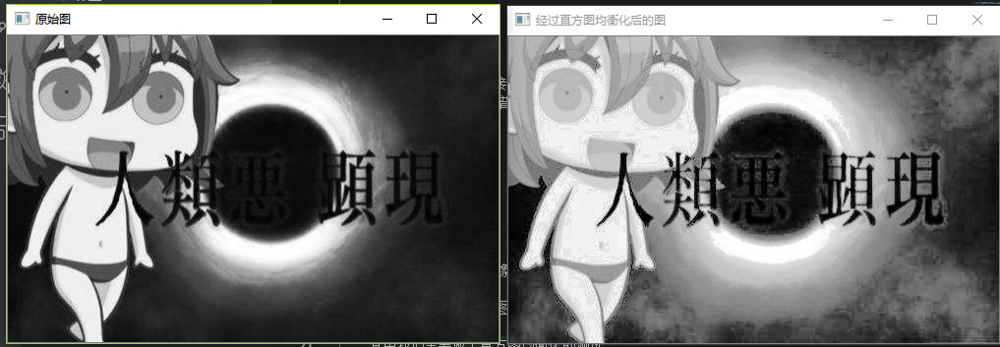
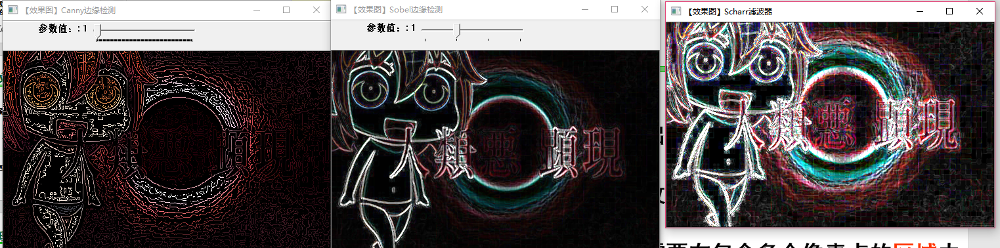

# 学习总结
  今天主要学习了图像预处理技术和图像的特征处理和分析的相关知识
  
 # 图像预处理技术 
    老师介绍了邻域、邻接、区域和连通得概念，以及对图像处理的各种模板包括Box模板， 
    高斯(Gauss)模板 拉普拉斯(Laplacian)模板 
   1. 图像增强
   
      1.1图像增强的概念

      1.2基于点操作的图像增强

      1.3基于模板操作的图像增强
      
      其中主要测试了直方图的均衡化
    2. 图像的复原
       与图像增强的区别：
       图像增强是主观的过程
       图像复原是客观的过程利用退化现象的某种先验知识来恢复图像。
       退化模型化采用相反的过程处理，复原出原图像的一种技术

       
     
3. 图像变换
        图像变换通常是一种二维正交变换，一般要求： ①正交变换必须是可逆的； ②正变换和反变换的 算法不能太复杂； ③正交变换的特点是在变换域中图像能量将集中分布在低频率成分上，边缘、线状信息反映在高频率成分上，有利于图像处理。
       因此正交变换广泛应用在图像增强、图像恢复、特征提取、图像压缩编码和形状分析等方面。

      # 图像特征特征的提取与分析
       图像特征特征的提取与分析的重点是掌握图像特征及特征提取的基本概念。常见的图像特征提取与描述方法，如颜色特征、纹理特征和几何形状特征 提取与描述方法
       
       其中图像的特征提取主要测试了边缘检测，和滤波处理
      

     关于图像特征分析的测试做了霍夫线变换

     # 总结和体会
     今天主要学习了图像预处理技术和图像的特征处理和分析相关的知识，在智能网联汽车中关于图像处理的技术以及图像特征处理和分析是非常重要的，学习好这门课的相关知识对以后的工作非常重要。

     
     

     
     
    

  

    
    

  

    
        
    
    
   
   
    