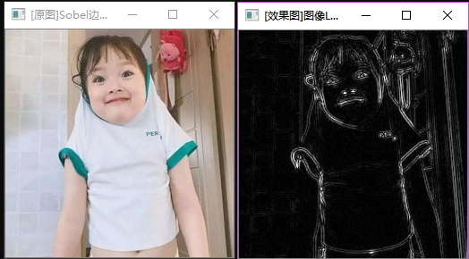
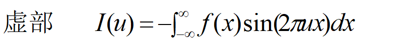

>>>>>>>>># 第四次作业
## 这次讲解了第七章的一些知识，在第七章我们将学到基于OpenCV的边缘检测、霍夫变换、重映射、仿射变换和直方图均衡化。本章的重点就是直方图均衡化。

## 一、图像预处理技术：拉普拉斯模板
#### 
   1. 图像增强的主要目标是通过对图像的处理，使图像比处理前更适合一个特定的应用。
   2. 处理策略：空域策略、频域策略。
   3. 可能的处理：去除噪声、边缘增强、提高对比度、增加亮度、改善颜色效果、改善细微层次等，通常与改善视觉效果相一致。
#### 图像增强的空域法
1. 点运算法——灰度级变换
   * 寻找一个合适的变换T
2. 模板运算法——空域过滤器
   * 寻找一个合适的模板
3. 几何变换法——变形矫正
   * 基于色彩的处理
4. 灰度级变换
   * 应用：亮度调整、对比度拉伸、灰度级切片
   * 获取变换函数的方法：固定函数、交互样点插值、直方图

### 1、边缘检测：滤波--增强--检测
#### (1)在第三次作业中我们讲解了Canny函数。这里有高级的Canny用法。我们展示一下高级用法的运行结果。

#### (2)Sobel()函数：使用扩展的Sobel算子，来计算一阶、二阶、三阶或混合图像差分。
  void Sobel(InputArray dst,OutputArray dst,int ddepth,int dx,int dy,int ksize = 3,double scale =1,double delta = 0,int borderType = BORDER_DEFAULT);
* 第一个参数：InputArray类型的src，为输入图像，填Mat类型即可。
* 第二个参数：OutputArray类型的dst，即目标图像，函数的输出参数，需要和源图片有一样的尺寸和类型。
* 第三个参数：int类型的ddepth，输出图像的深度，支持如下src.depth()和ddepth的组合：
   + 若src.depth()=CV_8U,取ddepth = -1/CV_16S/CV_32F/CV_64F
   + 若src.depth()=CV_16U/CV_16S,取ddepth = -1/CV_32F/CV_64F
   + 若src.depth()=CV_32F,取ddepth = -1/CV_32F/CV_64F
   + 若src.depth()=CV_64F,取ddepth = -1/CV_64F
* 第四个参数：int类型dx，x方向上的差分阶数。
* 第五个参数：int类型dy，y方向上的差分阶数。
* 第六个参数：int类型ksize，有默认值3，表示Sobel核的大小；必须取1、3、5、7.
* 第七个参数：double类型的scale，计算导数值时可选的缩放因子，默认值是1，表示默认情况下是没有应用缩放的。
* 第八个参数：double类型的delta，表示在结果存入目标如（第二个参数dst）之前可选的delta值，有默认值0.
* 第九个参数：int类型boderType，边界模式，默认值为BORDER_DEFAULT。
* 运行结果 

#### (3)计算拉普拉斯变换--Laplacian()函数：可以计算出图像经过拉普拉斯变换后的结果。
* Laplacian( src_gray, dst, ddepth, kernel_size, scale, delta, BORDER_DEFAULT );
* src_gray: 输入图像。
* dst: 输出图像
* ddepth: 输出图像的深度。 因为输入图像的深度是 CV_8U ，这里我们必须定义 ddepth = CV_16S 以避免外溢。
* kernel_size: 内部调用的 Sobel算子的内核大小，此例中设置为3。
* scale, delta 和 BORDER_DEFAULT: 使用默认值。
* 运算结果 

## 二、图像增强：直方图Histogram。
## 直方图均衡化的技术要点：
  * 公理：直方图p(rk )，为常数的图像对比度最好
  * 目标：寻找一个灰度级变换T(r)，使结果图像		的直方图p(sk )为一个常数
  * 实现：强制认为累积分布函数CDF是我们要找		的变换函数T(r)，
		      r
		    s = T (r) =∫ pr(w)dw      0  r  1
				    0	
  * 算法实现：
    1. 求出灰度级变换T 
    2. 用T对图像进行灰度级变换
 
### 1. 直方图
* 直方图的意义： 
    1. 直方图是图像中像素强度分布的图形表达方式。 
    2. 直方图统计了每一个强度值所具有的像素个数
* 直方图术语： 
    1. dims：需要统计的特征的数目。例如：dims=1，表示我们仅统计灰度值。 
    2. bins：每个特征空间子区段的数目。 
    3. range：每个特征空间的取值范围。
* calcHist()函数：

* void cv::calcHist():源输入（图像）数组，必须是相同深度的CV_8U或者CV_32F(即uchar或者float),相同大小，每一个可以是任意通道的;

* const cv::Mat* images：源输入数组中的元素个数;

* int nimages:用来计算直方图的通道维数数组,第一个数组的通道由0到arrays[0].channels()-1列出，第二个数组的通道从arrays[0].channels()到arrays[0].channels()+arrays[1].channels()-1以此类推;

* const int* channels:可选的掩膜，如果该矩阵不是空的，则必须是8位的并且与arrays[i]的大小相等，掩膜的非零值标记需要在直方图中统计的数组元素;

* cv::InputArray mask:输出直方图，是一个稠密或者稀疏的dims维的数组;

* cv::OutputArray hist:直方图的维数，必须为正，并且不大于CV_MAX_DIMS(当前的OpenCV版本中为32，即最大可以统计32维的直方图);

* int dims:用于指出直方图数组每一维的大小的数组，即指出每一维的bin的个数的数组;

* const int* histSize:用于指出直方图每一维的每个bin的上下界范围数组的数组，当直方图是均匀的(uniform =true)时，对每一维i指定直方图的第0个bin的下界,和最后一个即第histSize[i]-1个bin的上界(不包含的即))U_histSize[i]-1，也就是说对均匀直方图来说，每一个ranges[i]都是一个两个元素的数组【指出该维的上下界】。当直方图不是均匀的时，每一个ranges[i]数组都包含histSize[i]+1个元素: L0,U0=L1,U1=L1,...,U_histSize[i]-2 = L_histSize[i] - 1, U_histSize[i] - 1.不在L0到U_histSize[i] - 1之间的数组元素将不会统计进直方图中;

* const float** ranges:直方图是否均匀的标志;【指定直方图每个bin统计的是否是相同数量的灰度级】

* bool uniform = true:累加标志；为true，将在现有统计数据基础上继续计算

* bool accumulate = false 

### 2. 直方图均衡化：扩大图形的动态范围。

#### (1) 直方图均衡化的中心思想是把原始图像的的灰度直方图从比较集中的某个区域变成在全部灰度范围内的均匀分布。

#### (2) 实现过程
  1. 统计直方图个个灰度级出现的次数
  2. 累计归一化的直方图，
  3. 重新计算像素值

#### (3) equalizeHist()函数：
* void equalizeHist(InputArray src,OutputArray dst)
* 第一个参数：InputArray类型的src，输入图像，即源图像，填Mat类的对象即可，需为8位单通道的图像。
* 第二个参数：OutputArray类型的dst，函数调用后的运算结果存在这里，需和源图片有一样的尺寸和类型。
* 对输入图像进行直方图均衡化的步骤：
   1. 计算输入图像的直方图H。
   2. 进行直方图归一化，直方图距的和为255.
   3. 计算直方图积分。
   4. 为H'最为查询表进行图像变换。
* 运行结果 

## 三、图像复原
### 1.基本概念
* （1）图像复原是一种改善图像质量的处理技术
    * 消除或减轻在图像获取及传输过程中造成的图像品质下降即退化现象.
* （2）退化包括
    * 由成像系统光学特性造成的歧变
    * 噪声和相对运动造成的图像模糊
    * 源自电路和光度学因素的噪声等
* （3）图像复原中的数学问题
    * 连续数学或离散数学
    * 空间域或频域
    * 卷积或频域乘积
* （4）图像复原的方法由问题本身决定
* （5）与图像增强的区别：
    * 图像增强是主观的过程
    * 图像复原是客观的过程
* （6）利用退化现象的某种先验知识来恢复图像.
    * 退化模型化
    * 采用相反的过程处理,复原出原图像
### 2.图像变换的目的在于：
* (1) 使图像处理问题简化；
* (2)有利于图像特征提取；
* (3)有助于从概念上增强对图像信息的理解。
### 3.图像变换通常是一种二维正交变换。一般要求： 
* (1)正交变换必须是可逆的； 
* (2)正变换和反变换的算法不能太复杂； 
* (3)正交变换的特点是在变换域中图像能量将集中分布在低频率成分上，边缘、线状信息反映在高频率成分上，有利于图像处理。
* (4)因此正交变换广泛应用在图像增强、图像恢复、特征提取、图像压缩编码和形状分析等方面。

## 四、图像预处理技术：傅里叶变换
* (1)  一维连续函数的傅立叶变换 
    * 令f(x)为实变量x的连续函数，f(x) 的傅立叶变换用F(u)表示，则定义式为
    
    * 若已知F(u)，则傅立叶反变换为
    
     以上称为傅立叶变换对。
* (2)这里f(x)是实函数，它的傅立叶变换F(u)通常是复函数。F(u)的实部、虚部、振幅、能量和相位分别表示如下： 
  
  
  
  
  
  
傅立叶变换中出现的变量u 通常称为频率变量。 
* (3) 二维连续函数的傅立叶变换    
    傅立叶变换很容易推广到二维的情况。如果f(x，y)是连续和可积的，且F(u，v)是可积的，则二维傅立叶变换对为 
  
* (4)一维离散函数的傅立叶变换
        假定取间隔△x单位的抽样方法将一个连续函数f(x)离散化为一个序列{f(x0)，f(x0+△x)，…，f[x0+(N-1)△x]}。
        
* (5)傅里叶变换的图像理解
   + 从纯粹的数学意义上看，傅立叶变换是将一个函数转换为一系列周期函数来处理的。从物理效果看，傅立叶变换是将图像从空间域转换到频率域，其逆变换是将图像从频率域转换到空间域。 
   + 图像的频率是表征图像中灰度变化剧烈程度的指标，是灰度在平面空间上的梯度。如：大面积的沙漠在图像中是一片灰度变化缓慢的区域，对应的频率值很低；而对于地表属性变换剧烈的边缘区域在图像中是一片灰度变化剧烈的区域，对应的频率值较高。
   + 对图像进行二维傅立叶变换得到频谱图就是图像梯度的分布图，频谱图上的各点与图像上各点并不存在一一对应的关系。傅立叶频谱图上看到的明暗不一的亮点，实际是图像上某一点与邻域点差异的强弱，即梯度的大小，也即该点的频率大小。
   + 傅里叶变换后的图像，四角对应于低频成分，中央部位对应于高频部分。

## 四、 章节总结：
 
 
 
#### 这一次学习的是跟数学挂钩的傅里叶变换和对图像更深层的变换。其实就是看着代码还是可以写出来的，但是就是看着那些概念有点难，因为对于数学我的理解和学习都很难，数学很差。就不好理解，但是敲了代码吧，跟之前的各种比较比较，就能明白代码的作用，也能运用代码，其实在数学方面也要补习一下的，就多看看数学，高数书，这样也可以帮自己多提高一下代码。
#### 在上课的时候跟着老师走，这样对于写作业啊，包括运行，各方面都是特别好的。这样可以跟上老师的节奏，也可以空出课下的时间，多看看数学书。多看看PPT和PDF了解一下OpenCV的代码和操作。
#### 还是有待提高的，各个方面。下一个作业要更加透彻，更加详细的写出自己的领悟，而不是照着书来写了。

