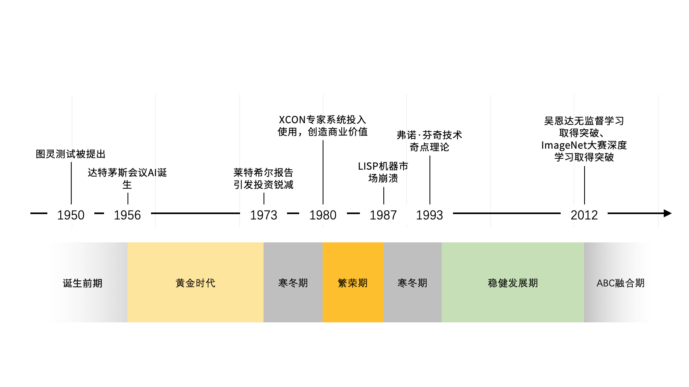
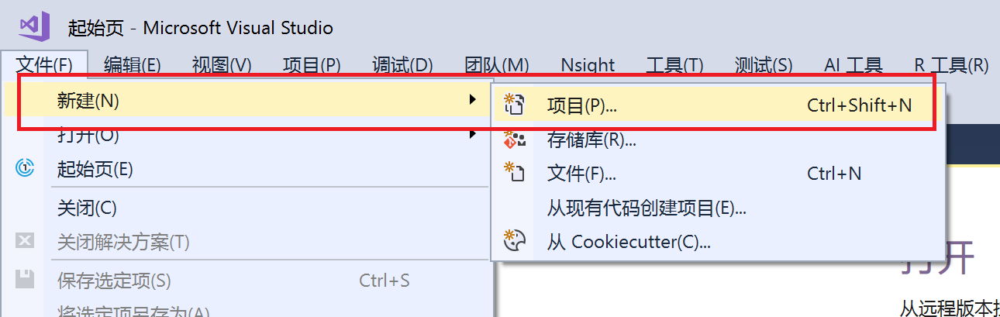
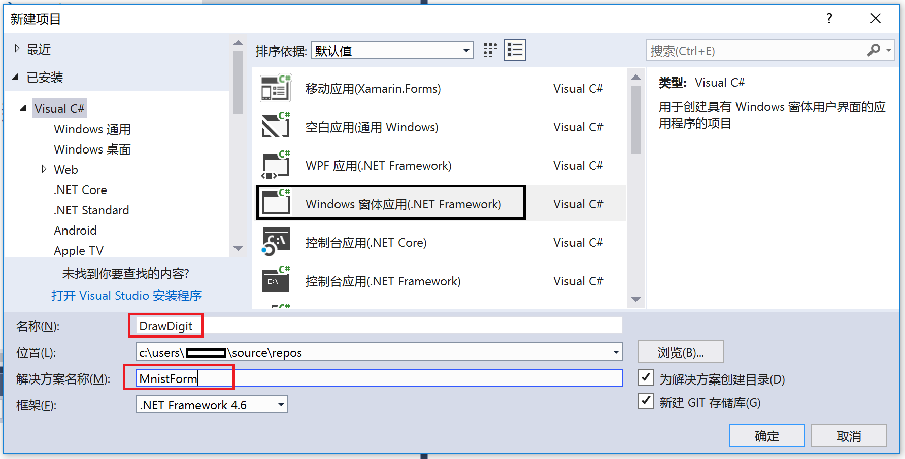
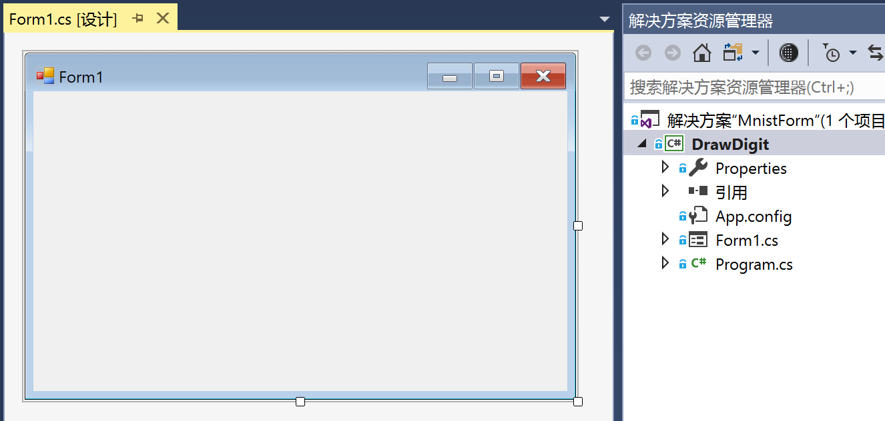
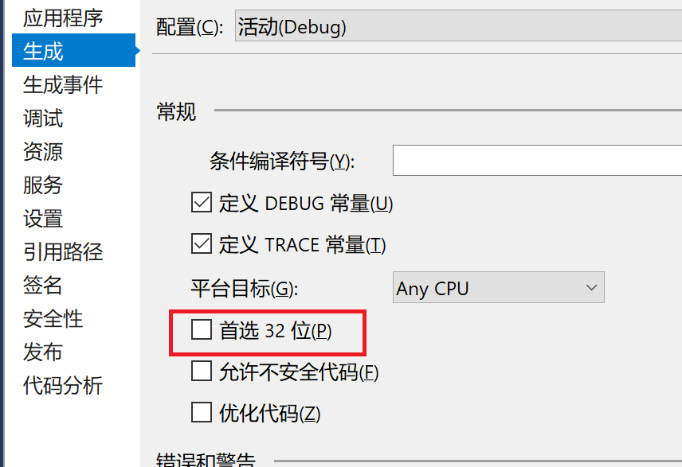
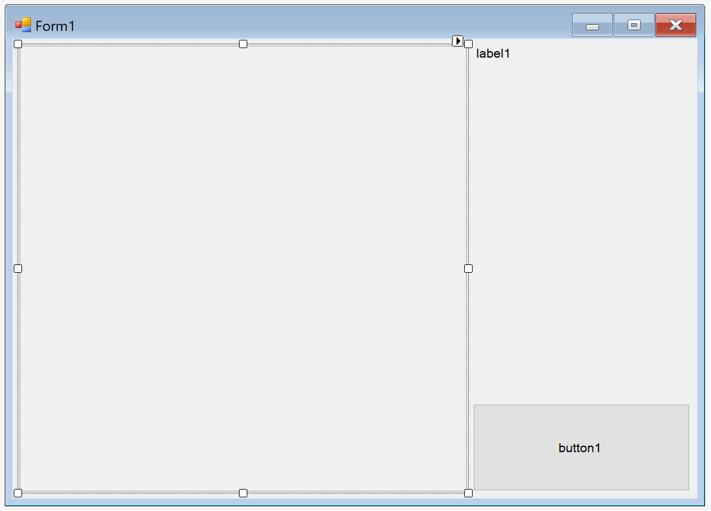
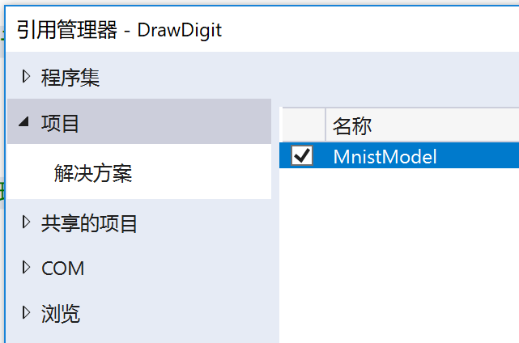
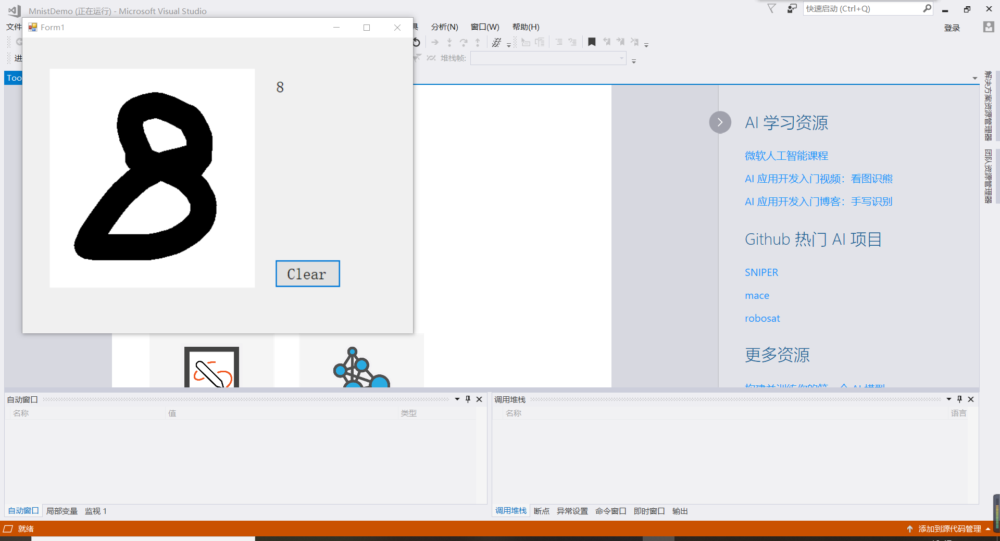

# 20191016  ----    第五次作业

# 微软AI学习
## 一、人工智能发展简史

人工智能经历很多起起伏伏，其中有两个AI 的冬天，我们从中学到什么规律呢？AI 的冬天来自于认识和期望值的巨大落差，外行对AI的效果有巨大的期望值，内行则挣扎于各种具体困难中。 正如Roy Amara 指出的那样，“我们总是高估一项科技所带来的短期效益，却又低估它的长期影响”。经过几十年积累下来的AI 技术，在计算机算力提高，数据大量丰富的背景下，终于找到了爆发的突破口，神经网络和反向传播这些“旧”技术重新找到了用武之地，在过去的10年中不断给我们带来惊喜。这些惊喜又导致了巨大的期望值。


参照维基百科，我们可以把整个人工智能的历史分为七个时期。
- 1956年达特茅斯会议之前，第二次世界大战促科学技术的快速发展，图灵、哥德尔、冯诺依曼、克劳德香农等伟大的先驱者奠定了人工智能和计算机技术的基础。
达特茅斯会议之后，人工智能相关研究进入了野蛮生长的黄金时代。一方面，马文闵斯基建立了沿用至今的神经网络的基本算法结构；约翰麦卡锡发布了主导人工智能研究几十年的LISP语言；亚瑟塞缪尔开发了第一个可以战胜人类的西洋跳棋程序；这些对后世都产生了关键性影响。另一方面，麻省理工开发了世界第一个聊天机器人ELIZA，还出现了第一个自主运动的机器人shakey，他们试图制造具有通用智能和移动能力的产品，这些疯狂的想法也推高了整个社会对AI的期望和幻想。
- 十多年过去之后，当人们发现人工智能曾经的那些美好承诺都没能兑现，或者实际产品和预期相差太多的时候，就会产生质疑甚至愤怒。1973年莱特希尔报告成为了导火索事件，人们开始认为人工智能技术只是科学家和科幻小说家们描绘的海市蜃楼，并不会产生实际的作用。社会舆论的否定和支持资金的撤离，让人工智能行业陷入第一个寒冬。
- 寒冬并没有让所有研究者止步，只是更努力的寻找如何让人工智能创造实用价值的方法。70年代末80年代初，专注小范围知识领域的专家系统开始崛起并创造了巨大价值，这引发了工业自动化信息化技术革命。日本发起了第五代计算机计划，其他国家也纷纷加入这场竞赛，资金和资源再一次涌入人工智能领域，80年代再次成为繁荣发展时期。
- 但好景不长。人工智能领域的疯狂投入让这个行业产生了冒进，尤其是人工智能专用硬件LISP机器的发展显得混乱且缓慢。计算机领域不进则退，IBM、苹果在这个时机发起了个人计算机革命，笨重的LISP机器在短短几年内就被完全击溃。整个行业似乎都被将被颠覆，这是一个沉痛又短暂的寒冬期。
- 通用计算机设备的胜利，让传统的人工智能程序技术逐渐被埋葬，但也让人工智能真正开始和现代计算机技术进行深入融合。在世纪相交的二十年内，人工智能技术似乎沉睡隐身了，除了1997年IMB炒作的国际象棋人机大战之外，几乎很少听到AI的声音。然而这也正是人工智能韬光养晦低调发展的时代，它利用计算机和互联网的发展机遇，变身商业智能、数据分析、信息化、自动化、知识工程等名称，渗透到社会生产和生活的每个角落。
- 计算机和互联网一方面为人工智能提供了创造商业价值的载体，让AI技术研究可以稳步推进，另一方面也为人工智能的爆发积累了强大的运算力和经验数据。芯片技术、数据库技术以及神经网络算法的不断发展，让人工智能在越来越多赛事上创造奇迹，甚至超越人类。2011年沃森在自然语言常识问答比赛中战胜人类选手，DARPA挑战赛无人驾驶汽车时速可以达到80公里以上，ImageNet挑战赛上图像识别算法准确度超越人类，同年吴恩达创造了具有完全自学习能力可以识别猫的神经网络模型...
- 21世纪第二个十年，随着移动互联、大数据、云计算、物联网技术的迸发，人工智能技术也迈入了新的融合时代，从AlphaGo战胜李世石，到微软语音识别技术超越人类，到谷歌自动驾驶、波士顿动力学机器人，到满布市场的智能音箱，到每个人手机中的神经网络芯片和智能程序，人工智能从无形发展到有形的陪伴每个人的生产生活，半个多世纪前科学家曾经描绘的美好图景正在一步一步被人工智能技术所实现。
# 二、人工智能的范围和难题
当人们谈论人工智能的时候，他们提到的各种上下文的范围很广， 广义的人工智能是指“通过计算机实现人类思维的效果，能从环境中获取感知并行动“ 的现象。我们大致可以把广义人工智能分为弱人工智能和强人工智能。
弱人工智能：
处理特定的问题，并不具有人类的感知能力。前两年名噪一时的AlphaGo 程序并不知道自己在下 “围棋”，它只是忙着处理矩阵运算…
弱人工智能包括了包含机器学习（Machine Learning)， 机器学习又包括了深度学习（Deep Learning）
强人工智能：
是具备与人类同等智慧、或超越人类的人工智能，能表现正常人类所具有的所有智能行为。

人工智能是机器学习的父类。深度学习则是机器学习的子类：


- “中文房间”的问题：


一个对汉语一窍不通，只说英语的人关在一封闭房间中。房间里有一本用英文写成的手册，指示该如何处理收到的汉语讯息及如何以汉语相应地回复。房外的人不断向房间内递进用中文写成的问题。房内的人便按照手册的说明，查找到合适的指示，将相应的中文字符组合成对问题的解答，并将答案递出房间。

约翰·希尔勒 （John Searle）认为，尽管房里的人可以以假乱真，让房外的人以为他确确实实说汉语，他却压根不懂汉语。在上述过程中，房外人的角色相当于程序员，房中人相当于计算机，而手册则相当于计算机程序：每当房外人给出一个输入，房内的人便依照手册给出一个答复（输出）。而正如房中人不可能通过手册理解中文一样，计算机也不可能通过程序来获得理解力。既然计算机没有理解能力，所谓“计算机于是便有智能”便更无从谈起了。

读者在网上经常碰到一些聊天机器人，你给它一个中文句子， 它回答你一个中文句子，有些时候的对答很有意思，用户也乐此不疲，那么，这个聊天机器人是真的有“智能”呢？还是一个在中文房间里的翻书很快的程序？

**这个思维实验提出后，长达三十余年的时间里，各方都提供了各种回复与反驳。Searle 最初只是希望借助于这个思维实验，来指出图灵测试在验证智能方面并不是完备的，即我们该如何辨别智能。不过，随着论战的升级，它实际上指向着一个历史更悠久的路线之争：智能是可计算的吗？其实，所谓路线之争，本来就没有绝对的对错，关键在于你持有什么立场和信念。**
# 三、目前人工智能的专业领域
## 目前要打造一个人工智能的系统和应用，需要很多知识，我们分层次来看， 从离用户最近的，到离机器最近的。

- 交叉应用层：和其他学科的交叉融合。

- 人工智能要和其他学科的知识结合起来，才能发挥实际的作用，例如，如果要做智能驾驶，我们就要和汽车工业，交通，规划等行业有很深的了解。人工智能可以看病，那么，我们就要和医药行业做融合，医生要了解人工智能工具需要什么数据，人工智能专家也要了解各种医学数据和流程。
- 平台系统：机器学习平台，工具，AI 程序设计。
我们需要一个平台来支撑机器学习的训练，程序开发，测试，以及各种探索工作，新的程序设计语言说不定会发明出来（例如Julia语言），我们也要学习并让这个语言和平台上的其它模块一起工作。
- 支撑技术：模式识别，计算机视觉，语音信息处理，启发式搜索，自动规划，多智能体系统
人工智能以及有很多比较成熟的子领域，这些技术能让我们在其基础上构建更复杂和丰富的应用。
- 核心基础：机器学习，知识表示与处理。
- 人工智能的核心还是我们如何有效地表达知识，如何表达在客观世界中我们习以为常的“常识”，如何把把知识，规律转化为机器能掌握的形式，并能逐步提高。
怎么样达到人工智能呢？历史上有不少努力，大致可以分为下面三个方向：
- 方法论 - 逻辑
- 如果程序可以用逻辑解决一切问题， 那么我们能否用逻辑表达人类的智能呢？
- 方法论 - 仿人类智能

  人的大脑经过千万年的进化，它可以学习，那我们能否模拟人类大脑（以及神经）的交流方式，从而构造出一个能学习的程序呢？目前的深度学习的方法模拟了一些神经元交流信息的方式，但是人类对于人脑如何处理信息，如何形成概念，如何做决定还是没有明确的结论，我们的人工智能的算法是基于统计模型的结论，所以有precision/recall等概念。

- 方法论 - 智慧基础设施（Intelligent Infrastructure）和智慧增强（Intelligence Augmentation）

   我们用计算能力和数据构建服务，它们可以增强人类的智力和创造能力。例如搜索引擎，它并不是模仿人脑思维而构造而成，但是它对于人类的贡献是十分巨大的，而且大家都觉得它是有“智能”的。

   我们可以用计算能力数据和相关物理实体组成一个网络，它可以帮助人类在物流运输，医药、商业和金融这样的领域中更快速地处理事务，这也不是模仿人脑和神经的信息传播方式而得来的。

## 人工智能发展的三个阶段
一是弱人工智能阶段(ANI，Artificial Narrow Intelligence);二是强人工智能阶段(AGI，Artificial General Intelligence);三是超人工智能阶段(ASI，Artificial Superintelligence)。
- ### 弱AI 阶段


　在“弱人工智能”阶段，弱人工智能（ANI）只专注于完成某个特定的任务，例如语音识别、图像识别和翻译，是擅长单个方面的人工智能，类似高级仿生学。它们只是用于解决特定具体类的任务问题而存在，大都是统计数据，从中归纳出模型。谷歌的AlphaGo和AlphaGo Zero就是典型“弱人工智能”，它们充其量也就是一个优秀的数据处理者，尽管它们能战胜象棋领域的世界级冠军，但是AlphaGo和AlphaGo Zero也仅会下象棋，是一项擅长于单个游戏领域的人工智能，如果让它们更好地在硬盘上储存和处理数据，就不是它们的强项了。
- ### 强AI阶段
在“强人工智能”阶段，AGI就属于人类级别的人工智能了，在各方面都能与人类媲美，拥有AGI的机器不仅是一种工具，而且本身可拥有“思维”。有知觉和自我意识的AGI能够进行思考、计划、解决问题、抽象思维、理解复杂理念、快速学习等，人类能干的脑力活它基本都能胜任。
　　目前，国际上的AGI技术研究进展如何呢?国际人工智能联合会前主席、牛津大学计算机系主任Michael Wooldrige教授在2016年CCF-GAIR大会上指出，强人工智能的研究“几乎没有进展，甚至几乎没有进步和严肃的活动”。事实上，人工智能国际主流学界所持的目标也就是弱人工智能，据了解目前很少有人致力于强人工智的研究，也没有相应的成果。
- ### 超AI阶段
　　关于“超人工智能”阶段，另一位来自牛津大学的知名人工智能思想家Nick Bostrom认为，ASI“在几乎所有领域都比最聪明的人类大脑都聪明很多，包括科学创新、通识和社交技能”。笔者本能地觉得，他描述的这类场景，现在和将来都不可能出现。尽管AI技术不像其他技术一样，它并不限于单一维度，而是多种认知类型和模式组成的复合体。但是人类与AI最大的区别就是人类具有高级思维能力，正是人类的高级思维构成了丰富多彩的社会。
# 四、机器学习平台建设
1、介绍

下图是较简化的机器学习平台架构，概括了机器学习平台的主要功能和流程。本章会进行简要介绍，在功能章节再展开详述。机器学习最主要的三个步骤可概括为：数据处理、建模以及部署。


1、数据处理，即所有和数据相关的工作，包括存储、加工、采集和标记几大主要功能。前三者与大数据平台几乎一致，标记部分是机器学习平台所独有。数据存储较好理解，要根据存取的特点找到合适的存储系统。数据加工，也被称为ETL（Extract，Transform，Load），即将数据在不同的数据源间导入导出，并对数据进行聚合、变形、清洗等操作。数据采集，即从外部系统获得数据，包括通过网络爬虫来采集数据。数据标记，是将人类的知识附加到数据上，产生样本数据，以便训练出模型能对新数据推理预测。

2、建模，即创建模型的过程，包括特征工程、试验、训练及评估模型。特征工程，即通过数据科学家（也称为算法工程师）的知识来挖掘出数据更多的特征，将数据进行相应的转换后，作为模型的输入。试验，即尝试各种算法、网络结构及超参，来找到能够解决当前问题的最好的模型。模型训练，主要是平台的计算过程，好的平台能够有效利用计算资源，提高生产力并节省成本。

3、部署，是将模型部署到生产环境中进行推理应用，真正发挥模型的价值。部署这个词本身，可以仅仅代表将模型拷贝到生产环境中。但计算机软件的多年发展证明，提供一个好的服务需要考虑多种因素，并通过不断迭代演进，解决遇到的各种新问题，从而保持在较高的服务水平。

4、对平台的通用要求，如扩展能力，运维支持，易用性，安全性等方面。由于机器学习从研究到生产应用都还处于快速发展变化的阶段，所以框架、硬件、业务上灵活的扩展能力显得非常重要。任何团队都需要或多或少的运维工作，出色的运维能力能帮助团队有效的管理服务质量，提升生产效率。易用性对于小团队上手、大团队中新人学习都非常有价值，良好的用户界面也有利于深入理解数据的意义。安全性则是任何软件产品的重中之重，安全漏洞是悬在团队头上一把剑，不能依靠运气来逃避问题。

5、人工智能，是人们最常听到的说法。在不需要严谨表达时，一般都可以用这个词来表达一些不同以往的“智能”应用。而实际上，程序员写的每一行逻辑代码都是“人工智能”，每一个软件都饱含了“人工智能”，不是“人类智能”。如果要严谨的表达，“人工智能”和“软件”并没有什么区别，也不表达什么意义深刻的“智能“革新产品。

但如果遵循普适的理解，那么“人工智能”一定是得有一些新奇的、超越以往的“人工智能”的东西，才能配得上这个词。比如，以往计算器（注意，不是计算机，是加减乘除的计算器）刚出现时，它就是新奇的事物，超越了人类的认知。在那个时刻，“计算器”就代表了“人工智能”的最高水平，是当之无愧的“人工智能”产品。

那么，什么时候适合用“人工智能”这个词汇呢？如果别人在用这个词汇说明什么，那就跟着用就好了，不必过于严谨。如果觉得有什么超越以往的“智能”的事物，那就用“人工智能”来介绍它。放之当下（2018年），图像中识别出物体、语音中识别出文本、自动驾驶等等就可以称为“人工智能”了（本文也没少用）。但电灯能感应到人后自动点亮，就不足以说是“人工智能”了。

6、机器学习。这是专业词汇，表达的是具有“学习“能力的软硬件产品，与程序员写就的代码相区别。可以认为，机器学习模型是一个函数，有输入输出，它的逻辑是数据驱动的，核心逻辑在数据中，不在代码中。

机器学习的“学习过程“，如果也用函数来类比，那么就是首先给模型传入输入，获得输出。然后将模型的输出与期望的输出（即样本数据中的标记结果）进行比较。并根据比较结果来更新模型中的数据，以便下一次的模型输出能够与期望结果更接近。这个过程，和人学习时的题海战术很类似。

由此看出，机器学习的学习过程是机器直接学习规律，改进数据，逐渐形成逻辑。而不是先有人类学习规律后，再写成代码。故称之为“机器学习”。

7、深度学习。这是机器学习的子领域，但带来了非常大的变革，因此成为了流行的词汇。从字面上解释，所谓深度学习，即在机器学习时，数据组织成了多层次的、有“深度”的网络。传统成功的机器学习算法一般是三层，而深度学习能够实现多达上千层的网络。层次越多，可以认为机器学习模型就能越“聪明”，越有“智能”。

深度学习成功的解决了大量和人类认知相关的问题，如：图像中识别物体、物体位置、人脸，语音中更精确的识别文字，文字中翻译、理解含义等。一方面，将机器学习模型的效果大大提升，另一方面，反而降低了机器学习模型应用的难度，让更多的人能够参与进来。最近的一次“人工智能“热潮，也是深度学习所带来的。
## 2、功能
机器学习平台上最重要的三个功能为：数据处理、建模、部署（也可称为推理）。
- 数据
  
  机器学习的本质即通过数据来理解信息，掌握知识。因此，数据是机器学习的知识来源，没有数据，计算机就无处学习知识，巧妇难做无米之炊。绝大部分机器学习系统需要样本数据，并从而进行学习。对于Alpha go这样的强化学习系统，数据全部从规则中生成，则不需要外部的数据。自动驾驶虽然也涉及到强化学习的部分，却需要与实际环境交互的数据，数据的收集难度就更高了。
- 建模
  
  建模，也被称为训练（Training）模型。包括了两个主要部分，一是数据科学家进行试验，找到解决问题的最佳方案，本节称之为模型试验；二是计算机训练模型的过程，本节在平台支持中介绍。

  建模是数据科学家的核心工作之一。建模过程涉及到很多数据工作，称为特征工程，主要是调整、转换数据。数据科学家的主要任务是要让数据发挥出最大的价值，解决业务需求，或发现未知的问题，从而提升业务。建设机器学习平台时，要对数据科学家的工作有一定理解，才能建设出真正能帮助数据科学家的平台。

- 部署
  
  绝大部分机器学习模型都用于推理预测，即输入数据，机器学习模型给出结果。模型创建好后，还需要部署后进行推理应用，产生价值。部署并不只是将模型复制到线上，还涉及到线上模型的管理等功能。
# 五、AI应用开发实战 - 手写识别应用入门
  1、程序分析：

  步骤如下：
- 一：实现简单的界面，将用户用鼠标或者触屏的输入变成图片。
  
- 二：将生成的模型包装起来，成为有公开数据接口的类。
  
- 三：将输入的图片进行规范化，成为数据接口能够使用的格式。
  
- 四：最后通过模型来推理(inference)出图片应该是哪个数字，并显示出来。
  
 2、 具体实现：
步骤一：获取手写的数字

1、选择文件->新建->项目。


在弹出的窗口里选择Visual C#->Windows窗体应用，项目名称DrawDigit，解决方案MnistForm。


Visual Studio自动弹出了一个窗口的设计图。


在DrawDigit项目上点击右键，选择属性，在生成一栏将平台目标从Any CPU改为x64。


2、打开VS窗口左侧的工具箱，这个窗口程序需要以下三种组件： 
1. PictureBox：用来手写数字，并且把数字保存成图片； 
2. Label：用来显示模型的识别结果；
3. Button：用来清理PictureBox的手写结果。
 

3、组件添加事件


| 组件类型  | 事件 |
|  ----  | ----  |
| pictureBox1  | 在Mouse下双击MouseDown、MouseUp、MouseMove来生成对应的响应事件函数。 |
| button1  | 在Action下双击Click。 |
| Form1   |在Behavior下双击Load。|
代码：
```C++
using System;
using System.Collections.Generic;
using System.ComponentModel;
using System.Data;
using System.Drawing;
using System.Drawing.Drawing2D;//用于优化绘制的结果
using System.Linq;
using System.Text;
using System.Threading.Tasks;
using System.Windows.Forms;
using MnistModel;

namespace DrawDigit
{
    public partial class Form1 : Form
    {
        public Form1()
        {
            InitializeComponent();
        }

        private Bitmap digitImage;//用来保存手写数字
        private Point startPoint;//用于绘制线段，作为线段的初始端点坐标
        private Mnist model;//用于识别手写数字
        private const int MnistImageSize = 28;//Mnist模型所需的输入图片大小

        private void Form1_Load(object sender, EventArgs e)
        {
            //当窗口加载时，绘制一个白色方框
            model = new Mnist();
            digitImage = new Bitmap(pictureBox1.Width, pictureBox1.Height);
            Graphics g = Graphics.FromImage(digitImage);
            g.Clear(Color.White);
            pictureBox1.Image = digitImage;
        }

        private void clean_click(object sender, EventArgs e)
        {
            //当点击清除时，重新绘制一个白色方框，同时清除label1显示的文本
            digitImage = new Bitmap(pictureBox1.Width, pictureBox1.Height);
            Graphics g = Graphics.FromImage(digitImage);
            g.Clear(Color.White);
            pictureBox1.Image = digitImage;
            label1.Text = "";
        }

        private void pictureBox1_MouseDown(object sender, MouseEventArgs e)
        {
            //当鼠标左键被按下时，记录下需要绘制的线段的起始坐标
            startPoint = (e.Button == MouseButtons.Left) ? e.Location : startPoint;
        }

        private void pictureBox1_MouseMove(object sender, MouseEventArgs e)
        {
            //当鼠标在移动，且当前处于绘制状态时，根据鼠标的实时位置与记录的起始坐标绘制线段，同时更新需要绘制的线段的起始坐标
            if (e.Button == MouseButtons.Left)
            {
                Graphics g = Graphics.FromImage(digitImage);
                Pen myPen = new Pen(Color.Black, 40);
                myPen.StartCap = LineCap.Round;
                myPen.EndCap = LineCap.Round;
                g.DrawLine(myPen,startPoint, e.Location);
                pictureBox1.Image = digitImage;
                g.Dispose();
                startPoint = e.Location;
            }
        }

        private void pictureBox1_MouseUp(object sender, MouseEventArgs e)
        {
            //当鼠标左键释放时
            //同时开始处理图片进行推理
            //暂时不处理这里的代码
        }
    }
}
```
步骤二：把模型包装成一个类

首先，我们在解决方案MnistForm下点击鼠标右键，选择添加->新建项目，在弹出的窗口里选择AI Tools->Inference->模型推理类库，名称不妨叫做MnistModel，点击确定，于是我们又多了一个项目
 

然后自己配置好这个项目的名称、位置，点击确定。
然后弹出一个模型推理类库创建向导，这个时候就需要我们选择自己之前训练好的模型了。

 


步骤三：连接两个部分

首先，我们来给DrawDigit添加引用，让它能使用MnistModel。在DrawDigit项目的引用上点击鼠标右键，点击添加引用，在弹出的窗口中选择MnistModel，点击确定。
 
 
 
3、运行结果：


# 六、总结
        通过这次课学习，我对AI有了一个新的认识，对它也非常感兴趣。我在课上学习到了AI的发展过程及其所研究的范围，我也对开发AI的平台建设有了一个认识与了解。在最后AI应用开发实战 -手写识别应用入门这个程序开发的过程中我对AI有了更加深刻的学习，通过手写字然后机器识别这个过程，我就被AI深深吸引了，我们随便手写一个数字它就能通过AI学习识别，再通过训练它就会识别更多的内容。以前我总觉得AI离我们很远，AI具有很高的技术要求，但是通过这个小程序，我对AI的认识不再遥远。当自己配置所有的环境，然后运行得到效果，我感到非常自豪与高兴。
          从AlphaGo战胜李世石，到微软语音识别技术超越人类，到谷歌自动驾驶、波士顿动力学机器人，到满布市场的智能音箱，到每个人手机中的神经网络芯片和智能程序，人工智能从无形发展到有形的陪伴每个人的生产生活，我们感谢技术发展，同是我们也要不断学习AI相关技术，这样才能让技更好服务我们，让我们生活更美好。