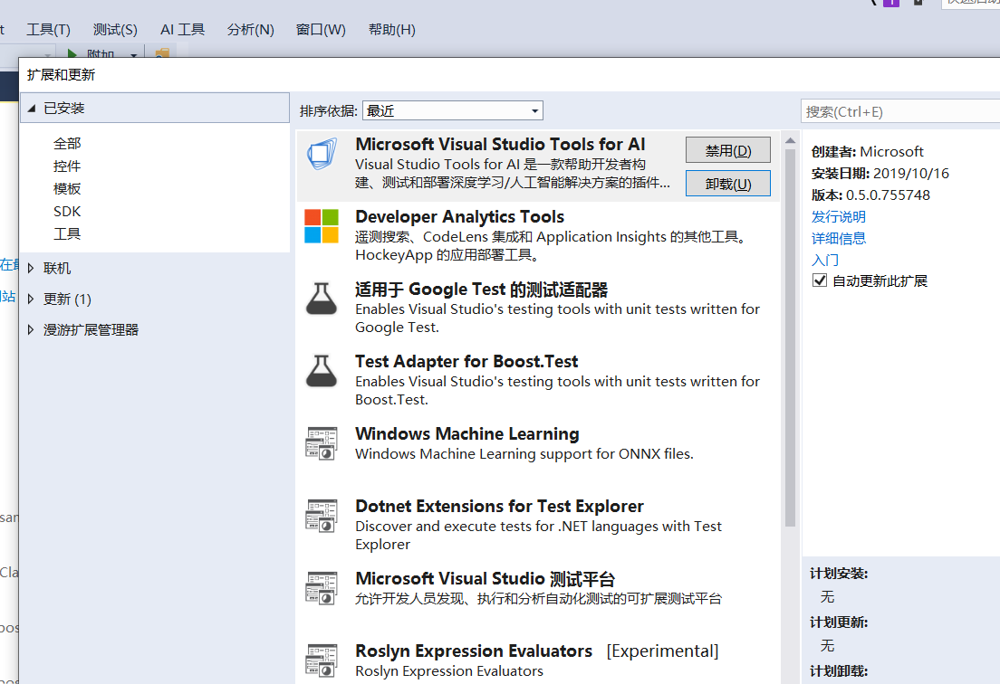
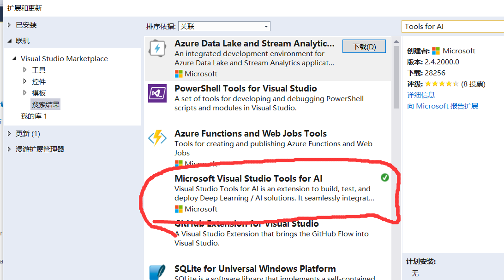
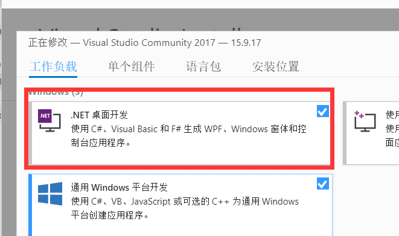
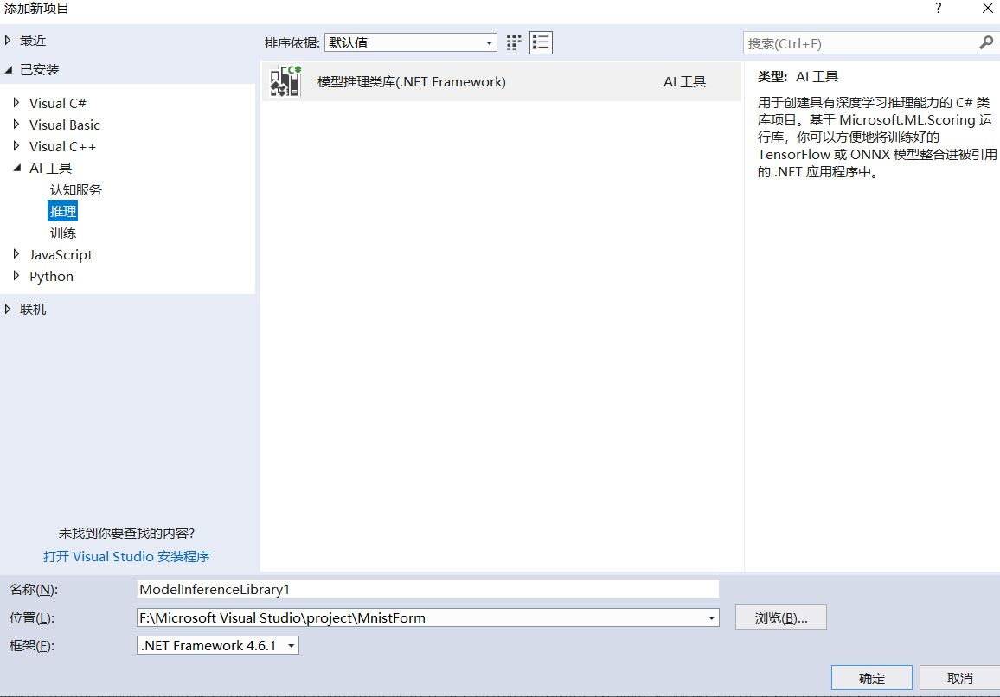
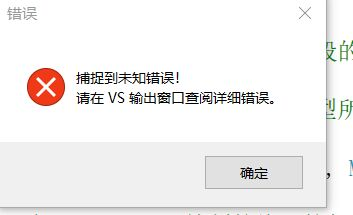
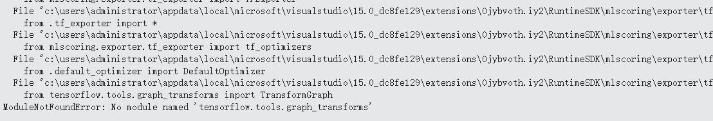
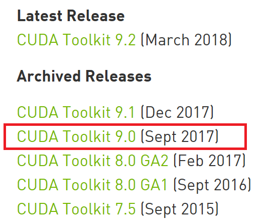
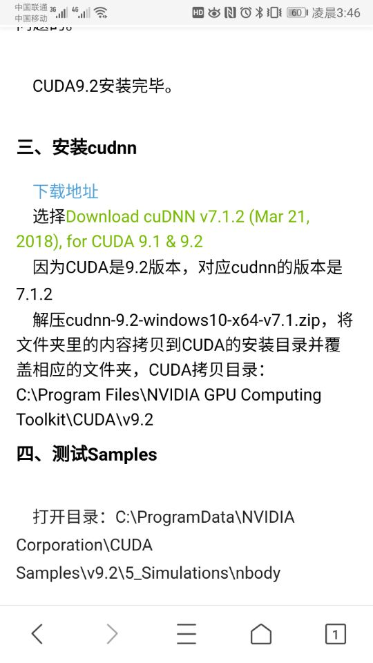

# 第五次作业
## tools for ai的安装
1. 打开vs，工具->扩展和更新
   
2. 点击联机,并且在右边的输入框中安装输入Tools for AI。
   

## 项目的建立 参考[AI应用开发实战系列之三：手写识别应用入门](https://blog.csdn.net/SoftwareTeacher/article/details/80770347)
>打开新建项目,选择windows窗体应用（一定要选择.NET Framework），名称按照我的图片取。（其实名字可以随便取，不过要记得名字）
   
`如果没有windows窗体应用就在，install程序里面修改`

## tensorflow的安装
>tensorflow 是个坑，如果正常安装，我们用pip install tensorflow.

**当你到这一步**

**如果你出现这个错误**

**来看一下错误**

>会发现tensorflow少了一些东西。经过我两个小时的折腾，我终于知道，这个tools for ai只支持tensorflow1.5版本的。所以要输入 `pip install tensorflow==1.5.0`

当改好的时候，会发现onnx的版本不对，会说你的onnx的1.6版本高了，我有试试1.5 ，1.4都不行。最后我用了1.0.1版本，输入`pip install onnx==1.0.1`。

## 模板的确立 [AI应用开发实战系列之一： 从零开始配置环境](https://blog.csdn.net/softwareteacher/article/details/80770079)
>这个教程，教你配所有的环境。

>这个教程会和我们的vs2017有点不匹配到了这一步

`如果安装9.0确实可以训练出自己的模板。但是，之后你的程序编译的话会出错的，他会要求你装9.2，所以可以直接装9.2`

**却得妈得**(等一下)

>你的CUDA改了9.0，那么对应的cuDNN也需要改。
得用7.1.2版本，**配置环境复杂到了，连高级教程都扶不住！！！！**

## 总结
* 配置环境真的难，出错容易心态爆炸，但是又不想放弃他，感觉和谈恋爱一样。
* 配环境是程序员的第一步，不想放弃，第一步就服输了，以后真的书步履艰难。
* 最近一直在搞环境的配置，软件的安装，代码没有看多少，也没有怎么细看代码，这是大忌，不能捡了芝麻丢了西瓜。
## 心得
* 这些天都很充实，很忙，觉睡少了，但是解决问题的能力有提高。
* 以前觉得自己还可以，在十堰的时候，感觉啥都会，有些找不着北了，最近然我清醒了。很多人都在努力，以前不努力的现在努力起来了，以前努力的现在更加努力了，每个人都在拼。我有一些配置环境的问题也是问的别人，真厉害。我也要加油，不然就要被超过了。