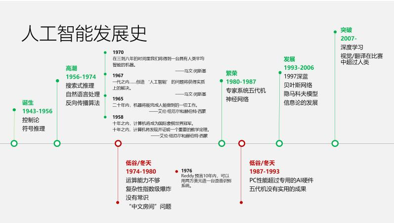
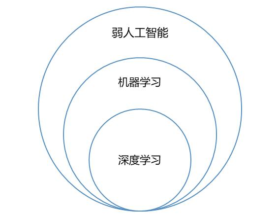
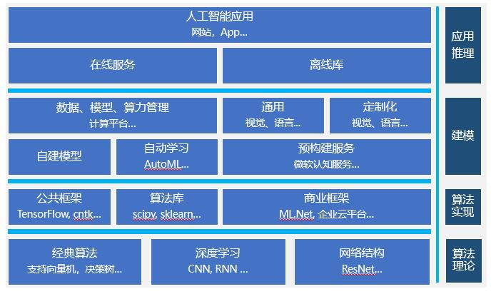

# 第五次作业
今天主要了解了微软的AZURE，人工智能的一些状况以及基于本地模型的手写数字识别应用开发案例使用。
## AZURE
主要介绍了Microsoft Azure的注册和一些相关类容，主要针对下个学期的学习，课下要有一些基本了解，对后面的学习有帮助。
## 人工智能
### 人工智能的发展史

1. 人工智能的起源：人工智能在五六十年代时正式提出，1950年，一位名叫马文·明斯基(后被人称为“人工智能之父”)的大四学生与他的同学邓恩·埃德蒙一起，建造了世界上第一台神经网络计算机。  
2. 人工智能的第一次高峰：1956年，在由达特茅斯学院举办的一次会议上，人工智能迎来了属于它的第一段Happy Time。在这段长达十余年的时间里，计算机被广泛应用于数学和自然语言领域，用来解决代数、几何和英语问题。这让很多研究学者看到了机器向人工智能发展的信心。甚至在当时，有很多学者认为：“二十年内，机器将能完成人能做到的一切。”
3. 人工智能第一次低谷：70年代，人工智能进入了一段痛苦而艰难岁月。由于科研人员在人工智能的研究中对项目难度预估不足，不仅导致与美国国防高级研究计划署的合作计划失败，还让大家对人工智能的前景蒙上了一层阴影。与此同时，社会舆论的压力也开始慢慢压向人工智能这边,导致很多研究经费被转移到了其他项目上。
4. 人工智能的繁荣：1980年，卡内基梅隆大学为数字设备公司设计了一套名为XCON的“专家系统”。这是一种，采用人工智能程序的系统，可以简单的理解为“知识库+推理机”的组合，XCON是一套具有完整专业知识和经验的计算机智能系统。这套系统在1986年之前能为公司每年节省下来超过四千美元经费。有了这种商业模式后，衍生出了像Symbolics、Lisp Machines等和IntelliCorp、Aion等这样的硬件，软件公司。在这个时期，仅专家系统产业的价值就高达5亿美元。
5. 人工智能第二次低谷：可怜的是，命运的车轮再一次碾过人工智能，让其回到原点。仅仅在维持了7年之后，这个曾经轰动一时的人工智能系统就宣告结束历史进程。到1987年时，苹果和IBM公司生产的台式机性能都超过了Symbolics等厂商生产的通用计算机。从此，专家系统风光不再。
6. 人工智能再次崛起及发展：上世纪九十年代中期开始，随着AI技术尤其是神经网络技术的逐步发展，以及人们对AI开始抱有客观理性的认知，人工智能技术开始进入平稳发展时期。1997年5月11日，IBM的计算机系统“深蓝”战胜了国际象棋世界冠军卡斯帕罗夫，又一次在公众领域引发了现象级的AI话题讨论。这是人工智能发展的一个重要里程。
7. 人工智能的突破：2015-2017：谷歌DeepMind的AlphaGo，一个玩棋盘游戏Go的计算机程序，击败了各种（人类）冠军。谷歌、微软、百度等互联网巨头，还有众多的初创科技公司，纷纷加入人工智能产品的战场，掀起又一轮的智能化狂潮，而且随着技术的日趋成熟和大众的广泛接受，这一次狂潮也许会架起一座现代文明与未来文明的桥梁。
### 人工智能的范围

我们大致可以把广义人工智能分为弱人工智能和强人工智能。   
1. 弱人工智能：

处理特定的问题，并不具有人类的感知能力。前两年名噪一时的AlphaGo 程序并不知道自己在下 “围棋”，它只是忙着处理矩阵运算…

弱人工智能包括了包含机器学习（Machine Learning)， 机器学习又包括了深度学习（Deep Learning）

2. 强人工智能：

是具备与人类同等智慧、或超越人类的人工智能，能表现正常人类所具有的所有智能行为。 

3.  弱AI 理论 – 算法 – 框架 – 应用
   

## 基于本地模型的手写数字识别应用开发案例
通过这一入门级案例展示人工智能应用开发中的典型元素，如准备人工智能应用开发所需的软件环境，使用Visual Studio Tools for AI快速集成模型、加速人工智能应用开发，以及在代码中处理用户输入，以便人工智能模型能正确地接受输入的数据等等。  
效果如图：

# 总结
通过今天的学习，对人工智能有了许多了解，同时也看了很多人工智能的发展，经过几次高潮和低谷，人工智能最终开始飞速的发展，越来越多的人开始从事这方面的学习和研究，国家也大力支持这个方向，政策：为推动我国人工智能规模化应用，全面提升产业发展智能化水平，2017年7月20日，国务院印发了《新一代人工智能发展规划》，并将在制造、金融、农业、物流、商务、家居等重点行业和领域开展人工智能应用试点示范工作。就金融行业而言，《规划》指出，要在智能金融方面，建立金融大数据系统，提升金融多媒体数据处理与理解能力；创新智能金融产品和服务，发展金融新业态；鼓励金融行业应用智能客服、智能监控等技术和装备；建立金融风险智能预警与防控系统。
现在人工智能步入了爆发期，各个方面都需要发展，尤其是辅助驾驶，自动驾驶一直是人工智能领域最热门的应用，但是由于之前特斯拉的自动驾驶功能造成了致命事故，谷歌又放弃了自己生产自动驾驶汽车，转而和成熟的汽车厂商合作，这些事实都说明，完全实现自动驾驶，还有很长的一段路要走。学习基础知识对我们至关重要。
