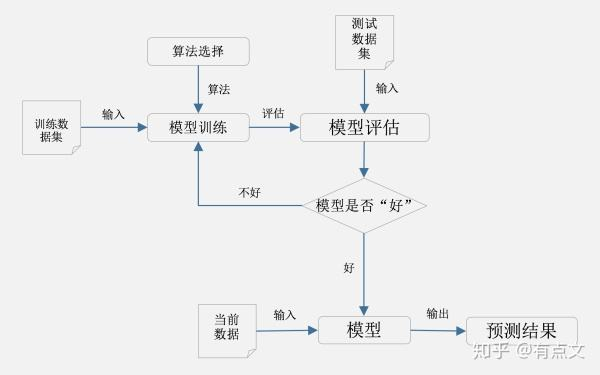

# 学习笔记及心得体会  
一、云服务  
* 云服务简介  
云服务是基于互联网的相关服务的增加、使用和交互模式，通常涉及通过互联网来提供动态易扩展且经常是虚拟化的资源。云是网络、互联网的一种比喻说法。过去在图中往往用云来表示电信网，后来也用来表示互联网和底层基础设施的抽象。云服务指通过网络以按需、易扩展的方式获得所需服务。这种服务可以是IT和软件、互联网相关，也可是其他服务。它意味着计算能力也可作为一种商品通过互联网进行流通。  

* 背景  
  国内而言起步较早的云服务是百度旗下的产品例如百度云，最近几年阿里的阿里云服务后来居上，另外腾讯的云服务也做的不错，华为也有自己的云服务例如华为云电脑。

* 二、机器学习平台建设  
>近几年，机器学习平台获得了飞速发展，积累了大量高效的机器学习算法组件，基于这些组件可以快速实现业务流程、解决具体问题。阿里云机器学习平台的丰富算法功能可以在线使用，不需要购买硬件，不需要安装配置各种环境；数据和计算资源一直处在“在线”状态，不必担心数据太大或计算资源不足的问题。  
 机器学习的几个步骤这是我在网上查找的资料

一个完整的机器学习项目一般流程包括： 
1、抽象成数学问题  

　　首先要明确问题，分类还是回归，尽量避免胡乱尝试；

2、数据获取及分析

　　获取的数据要有代表性，否则必然会过拟合。

　　而且对于分类问题，数据偏斜不能过于严重，不同类别的数据数量不要有数个数量级的差距。 而且还要对数据的量级有一个评估，多少个样本，多少个特征，可以估算出其对内存的消耗程度，判断训练过程中内存是否能够放得下。如果放不下就得考虑改进算法或者使用一些降维的技巧了。如果数据量实在太大，那就要考虑分布式了。

3、数据预处理
　　数据清洗、数据归一化、扩充等。归一化、离散化、因子化、缺失值处理、去除共线性等，数据挖掘过程中很多时间就花在它们上面。这些工作简单可复制，收益稳定可预期，是机器学习的基础必备步骤。 

4、特征工程
　　筛选出显著特征、摒弃非显著特征，需要机器学习工程师反复理解业务。这对很多结果有决定性的影响。特征选择好了，非常简单的算法也能得出良好、稳定的结果。这需要运用特征有效性分析的相关技术，如相关系数、卡方检验、平均互信息、条件熵、后验概率、逻辑回归权重等方法。

5、训练模型选择与调优
　　要根据数据的实际情况和具体要解决的问题来选择模型，比如样本数、特征维度，数据特征综合考虑；要解决的问题是分类还是回归，问题需要网络去关注哪方面，结合实际情况选择网络。
　　调优问题，可以采用交差验证，观察损失曲线，测试结果曲线等分析原因，调节参数：优化器、学习率、batchsize等
　　可以尝试多模型融合，来提高效果。

6、后处理
　　网络的到的结果一般不直接使用，通过一些后处理方案，不如加入先验约束，一些处理，将明显错误去除。

7、模型评估
　　从各个方面评估，模型准确率、误差，时间、空间复杂度，稳定性、迁移性等.   

机器学习的过程图

# 三、人工智能发展史
1.人工智能的介绍  
* 人工智能（Artificial Intelligence），英文缩写为AI。它是研究、开发用于模拟、延伸和扩展人的智能的理论、方法、技术及应用系统的一门新的技术科学。  
人工智能是计算机科学的一个分支，它企图了解智能的实质，并生产出一种新的能以人类智能相似的方式做出反应的智能机器，该领域的研究包括机器人、语言识别、图像识别、自然语言处理和专家系统等。人工智能从诞生以来，理论和技术日益成熟，应用领域也不断扩大，可以设想，未来人工智能带来的科技产品，将会是人类智慧的“容器”。人工智能可以对人的意识、思维的信息过程的模拟。人工智能不是人的智能，但能像人那样思考、也可能超过人的智能。  

2.人工智能的范围及难题  
人工智能的五大难题   
理解人类语言，机器人附能，防黑客，玩游戏，辨别是非，
  

弱人工智能  
例如apple公司的Siri，百度的小度，华为的小艺，小米的小爱同学，此类人工智能不能制造出真正地推理（Reasoning）和解决问题（Problem_solving）的智能机器，这些机器只不过看起来像是智能的，但是并不真正拥有智能，也不会有自主意识。

机器学习  
如Google的AlphaGo可以通过对比棋谱自主学习围棋。

  
3.智能家具也是人工智能的一个应用，极大的方便了人们的生活。  

4.智能驾驶，环境感知是人工智能应用到车上面的知识。
近来AI+汽车这个概念特别火，相应的技术也发展十分迅速。  
底层支撑技术：opencv、以及弱AI理论-算法-框架-应用

四基于MNIST数据集的手写数字识别应用开发案例  

五.心得体会  
今天我了解到了云服务的原理，及其行业的发展历史，和背景，
同时初步的了解了机器学习的几个步骤，还有机器学习平台建设。同时根据机器学习，扩宽到人工智能方面的知识，对人工智能的分级，和人工智能的范围，以及现如今人工智能所面临的几个难题，还有就是一些人工智能的运用范围。  
了解这些知识有利于让我们了解计算机应用的前瞻技术，便于我们拓宽视野，加深我们对以后学习的方向的理解，在今天的学习中也遇到了不少问题，都是因为自己的不细心导致的，自己却不能发现这些错误，最后是同学的帮助下，我才发现了这些错误。以后做练习的时候得更加的深入的去了解问题，注重细节，不烦简单的错误。