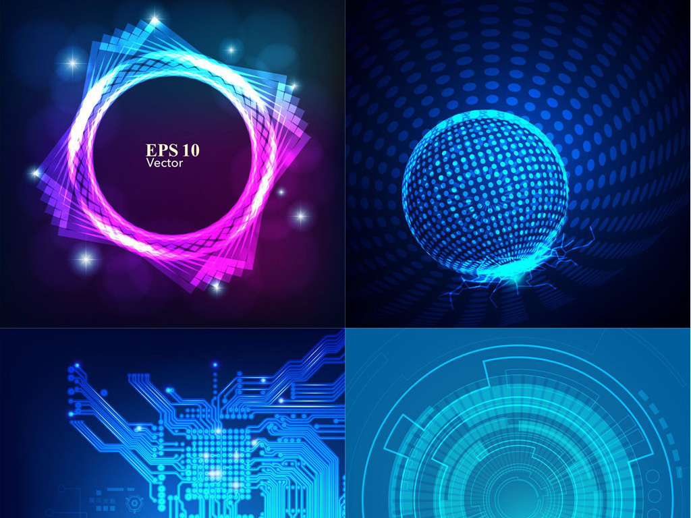
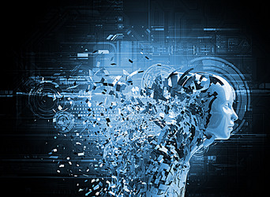
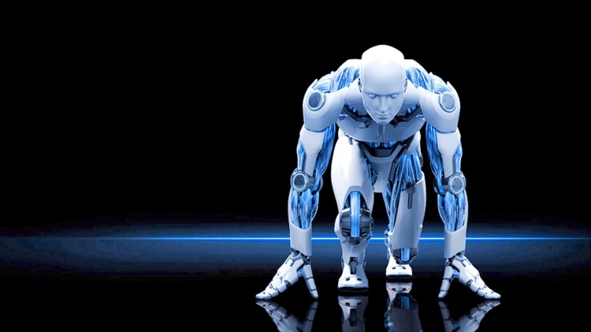
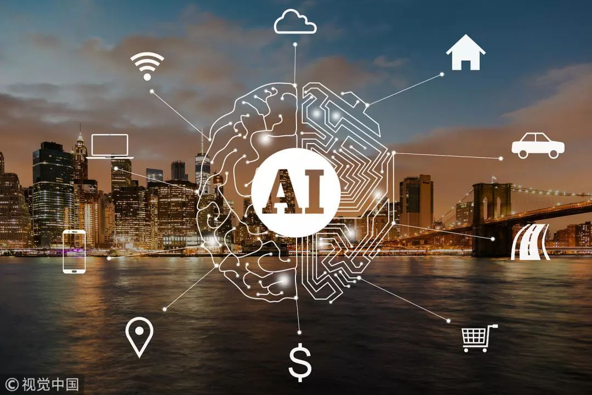
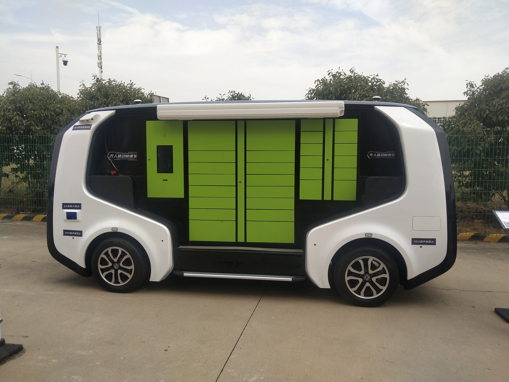
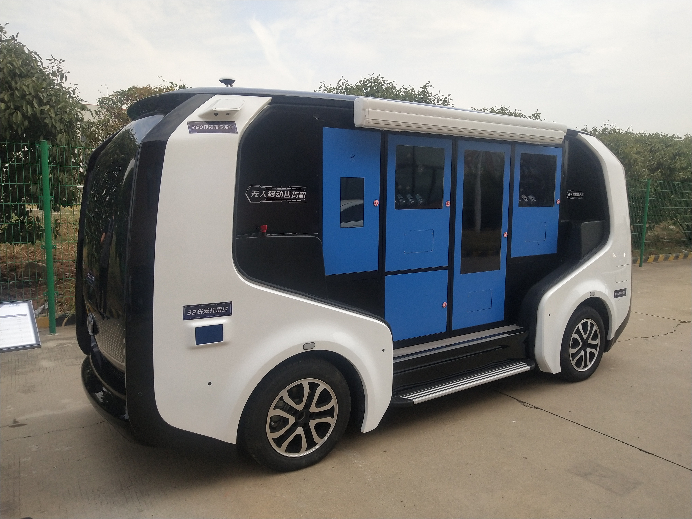

                浅提人工智能
1、课堂主题

今天的课堂上我们再次提到了人工智能，而这也不是我第一次听说或者说是接触了。因为专业性质的原因，我们真得接触许多前沿的科技以及人工智能的领域。当然多多接触对于我们来说是有极大益处的，不仅会对我们学习生活有个良性引导，对我们以后就业工作等也十分有帮助，最重要的是视野与眼界的开阔。
 
2、简单说明

人工智能（Artificial Intelligence），英文缩写为AI。它是研究、开发用于模拟、延伸和扩展人的智能的理论、方法、技术及应用系统的一门新的技术科学。
人工智能是计算机科学的一个分支，它企图了解智能的实质，并生产出一种新的能以人类智能相似的方式做出反应的智能机器，该领域的研究包括机器人、语言识别、图像识别、自然语言处理和专家系统等。人工智能从诞生以来，理论和技术日益成熟，应用领域也不断扩大，可以设想，未来人工智能带来的科技产品，将会是人类智慧的“容器”。人工智能可以对人的意识、思维的信息过程的模拟。人工智能不是人的智能，但能像人那样思考、也可能超过人的智能。
人工智能是一门极富挑战性的科学，从事这一方面工作就要求我们必须懂得计算机知识，心理学和哲学。人工智能是一门包括十分广泛的科学，它由不同的领域组成，如机器学习，计算机视觉等等，总的说来，人工智能研究的一个主要目标是使机器能够胜任一些通常需要人类智能才能完成的复杂工作。 2017年12月，人工智能入选“2017年度中国媒体十大流行语”。
1956年夏季，以麦卡赛、明斯基、罗切斯特和申农等为首的一批有远见卓识的年轻科学家在一起聚会，共同研究和探讨用机器模拟智能的一系列有关问题，并首次提出了“人工智能”这一术语，它标志着“人工智能”这门新兴学科的正式诞生。IBM公司“深蓝”电脑击败了人类的世界国际象棋冠军更是人工智能技术的一个完美表现。
从1956年正式提出人工智能学科算起，50多年来，取得长足的发展，成为一门广泛的交叉和前沿科学。总的说来，人工智能的目的就是让计算机这台机器能够像人一样思考。

3、人工智能展示

多维化:

智慧城市：

无人流动售货车：

4、小小感悟

然而在我们身边就有许多人工智能相关的，例如当下十分火热的智能无人驾驶网联汽车，智慧城市交通等都与之息息相关。希望我们不仅能够做人工智能时代的见证者，还能够成为参与者，甚至是深度参与者。