#
# **第五次课堂总结**
>### 人工智能

人工智能（Aritificial Intelligence， AI）是一门融合了计算机科学、统学、脑神经学和社会科学的前沿综合性学科。它的目标是希望计算机拥有像人一样的智力能力，可以替代人类实现识别、认知、分类和决策等多种功能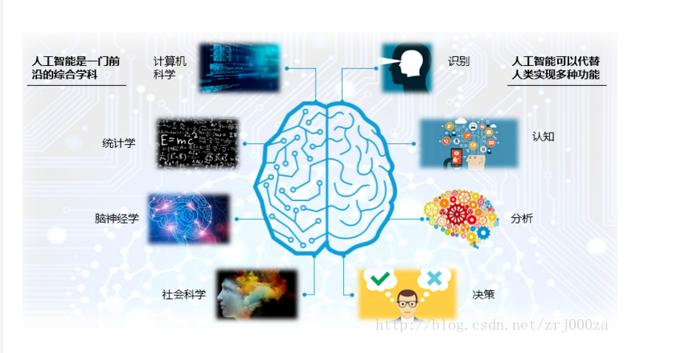

>#### 人工智能的现状，难题与影响
```
- 专用人工智能取得重要突破    
- 人工智能创新创业如火如荼  
- 从“人工+智能”向自主智能系统发展
 ```
 ``` 
- 处理特定的问题，并不具有人类的感知能力
- 自然语言处理：机器欠缺对语意理解能力，包括对口语不规范的用于识别和认知等
```

>#### 目前人工智能的领域
- 交叉应用层：和其他学科的交叉融合
   
  人工智能要和其他学科的知识结合起来，才能发挥实际的作用
#
- 平台系统：机器学习平台，工具，AI 程序设计

  人类需要一个平台来作为训练的模型

  
 -  支撑技术：模式识别，计算机视觉，语音信息处理，启发式搜索，自动规划，多智能体系统
      
  人工智能以及有很多比较成熟的子领域，这些技术能让我们在其基础上构建更复杂和丰富的应用 
      
 - 核心基础：机器学习，知识表示与处理
   


#    
# **AI应用开发实战**
**一、Windows下开发环境搭建**
### **1.安装Git**
- 访问（<font color="#cf6923" size=4 face="黑体">https://git-scm.com/download/win</font>）并下载64-bit
- 添加Git至环境变量

### **2.VS安装**
- 访问（<font color="#cf6923" size=4 face="黑体">https://docs.microsoft.com/zh-cn/visualstudio/productinfo/vs2017-system-requirements-vs</font>）  
  下载并安装Visual studio 2017 community
打开并选择配置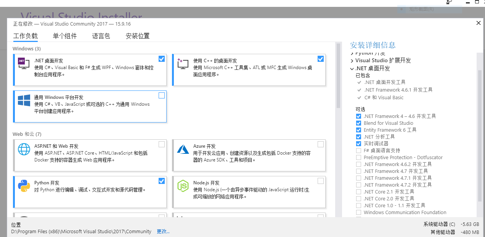
- 打开Visual Studio，```选择工具->扩展和更新->选择“联机”->搜索“AI”```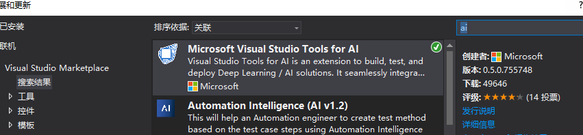
- 安装完毕重启即可，安装速度太慢的可以访问此网址下载（<font color="#cf6923" size=4 face="黑体">https://marketplace.visualstudio.com/items?itemName=ms-toolsai.vstoolsai-vs2017</font>）

### **3.python安装**
- 访问   （<font color="#cf6923" size=4 face="黑体">https://www.python.org/downloads/</font>）   
  选择版本3.5.4或3.6.5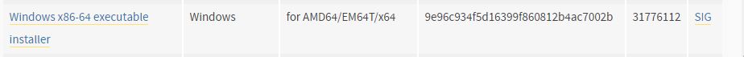
 
- 勾选如图所示选项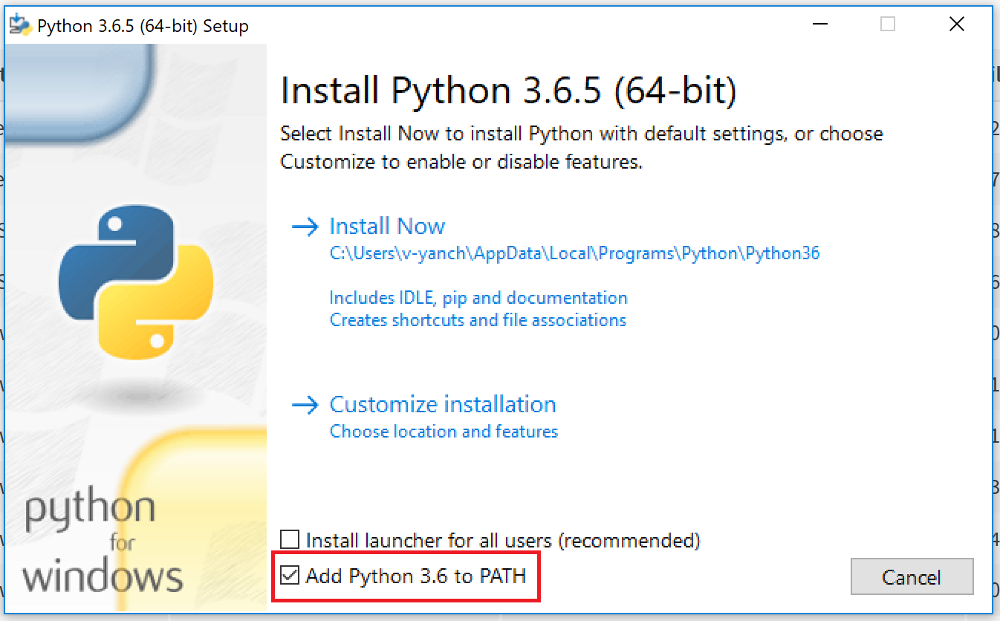
- 在cmd中输入python检车是否安装成功
- 输入python -m pip install -U pip以更新pip到最新版本
 
### **4.CUDA和CUDNN安装**
如果你的电脑装有NVIDIA的显卡则进行此步骤，没有则跳过

- 访问（<font color="#cf6923" size=4 face="黑体">https://developer.nvidia.com/cuda-toolkit-archive</font>）  
并下载CUDA 9.2版本进行安装，经本人测试，9.0版本会有不匹配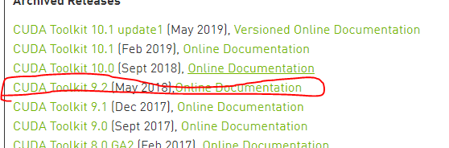
- 访问 （<font color="#cf6923" size=4 face="黑体">https://developer.nvidia.com/rdp/cudnn-archive</font>）  
找到  
```
cuDNN v7.0.5 (Dec 5, 2017), for CUDA 9.0
cuDNN v7.0.5 Library for Windows 10
```
  
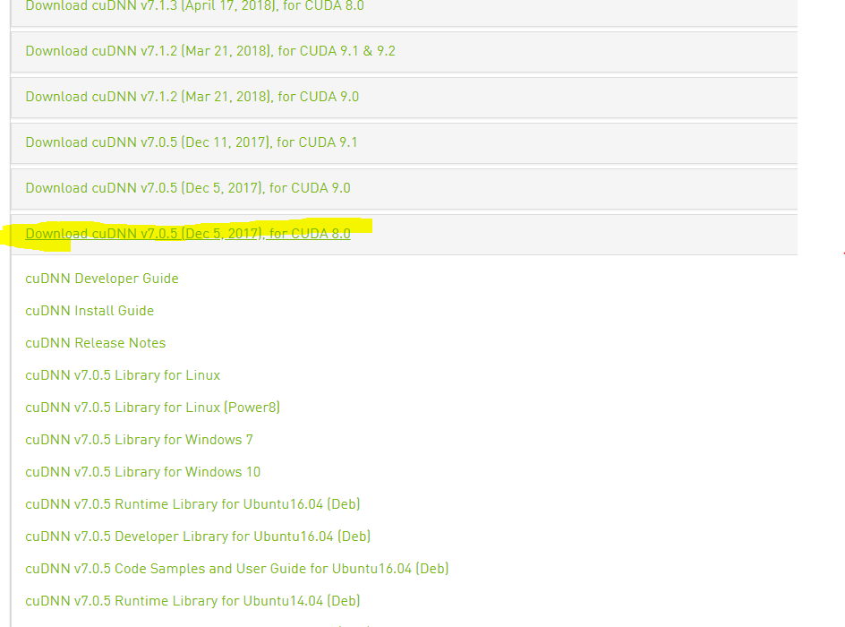

- 注册并登录，下载并解压，取出这个路径的**cudnn64_7.dll**,复制到CUDA的bin目录下即可
默认的地址是：
```
C:\Program Files\NVIDIA GPU Computing Toolkit\CUDA\v9.0\bin
```
### **5.机器学习软件及依赖**
```
win + R ，打开cmd，在命令行中输入：
cd c:\  //选择一个你喜欢的路径
md  AI  //在这里创建一个AI目录
cd AI   //打开这个目录
//克隆仓库到本地
git clone https://github.com/Microsoft/samples-for-ai.git
cd samples-for-ai //打开这个目录
cd installer //还有这个目录
python.exe install.py //开始安装
```
等待结束即可，中间调试可能会出现N多错误亦或是一次通过，耐心解决即可

**二、离线模型训练**
- 打开这个路径：```C:\AI\samples-for-ai\examples\tensorflow```  

- 然后双击```TensorflowExamples.sln```  

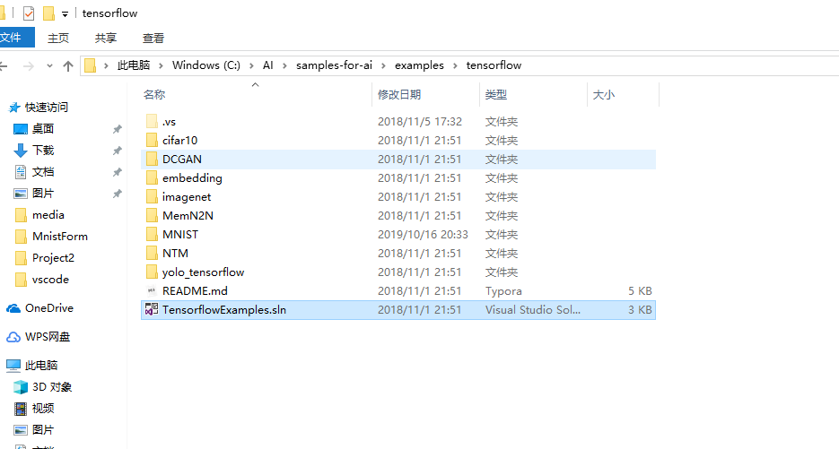
- 然后在```解决方案资源管理器```中，选择```MNIST```，单击右键，选择设为```启动项目```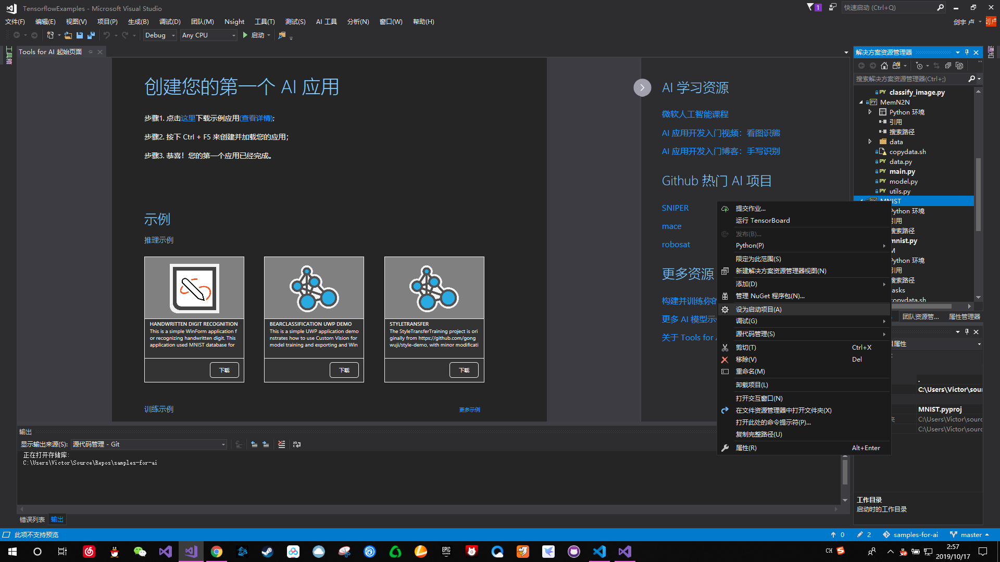
- 选择```MNIST```中的```mnist.py```，单击右键，选择在```不调试的情况下启动```
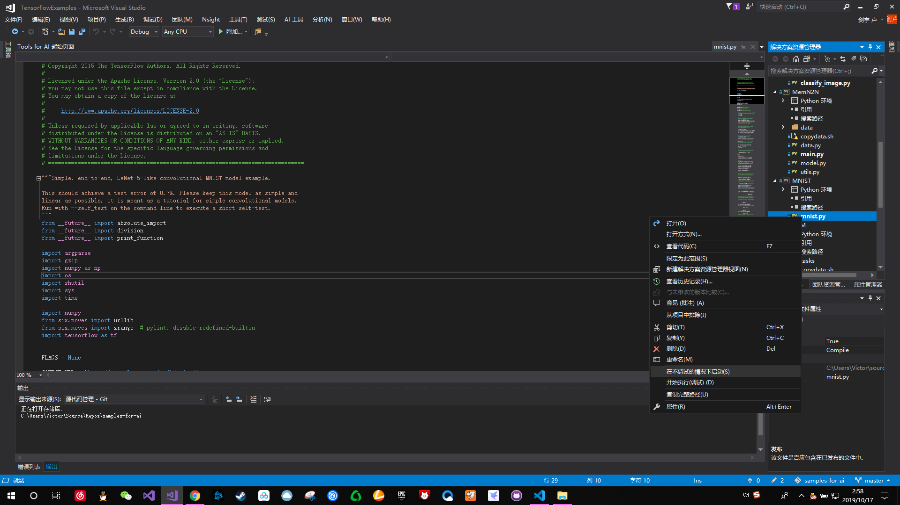
-然后等待程序响应，并等待模型训练
- 程序成功执行后会得到如下模型文件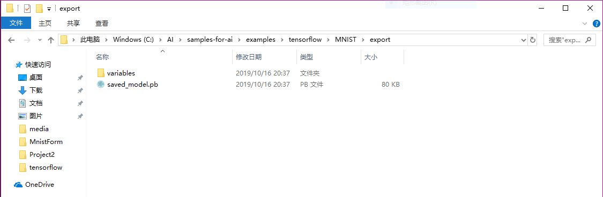

# **可能存在的问题**
- 在本次实验过程中，使用CUDA9.0版本，但是到后期进行手写数字识别会报9.2版本缺失的问题
```
Failed to initialize the model: Cannot load:cublas64_92.dll. CUDA 9.2 requir
```
- 但是提前在第四步更换会引起模型训练错误
-
# **解决方法** 
- 访问 （<font color="#cf6923" size=4 face="黑体">https://developer.nvidia.com/rdp/cudnn-archive</font>）下载  
```Download cuDNN v7.2.1 (August 7, 2018), for CUDA 9.2```版本
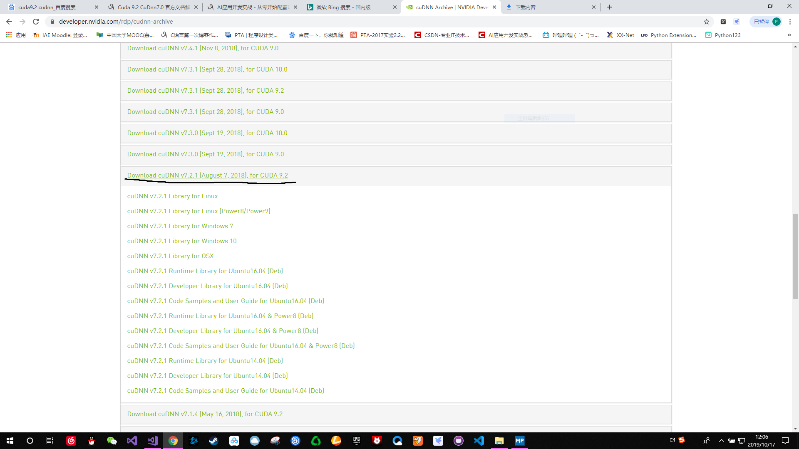
- 问题解决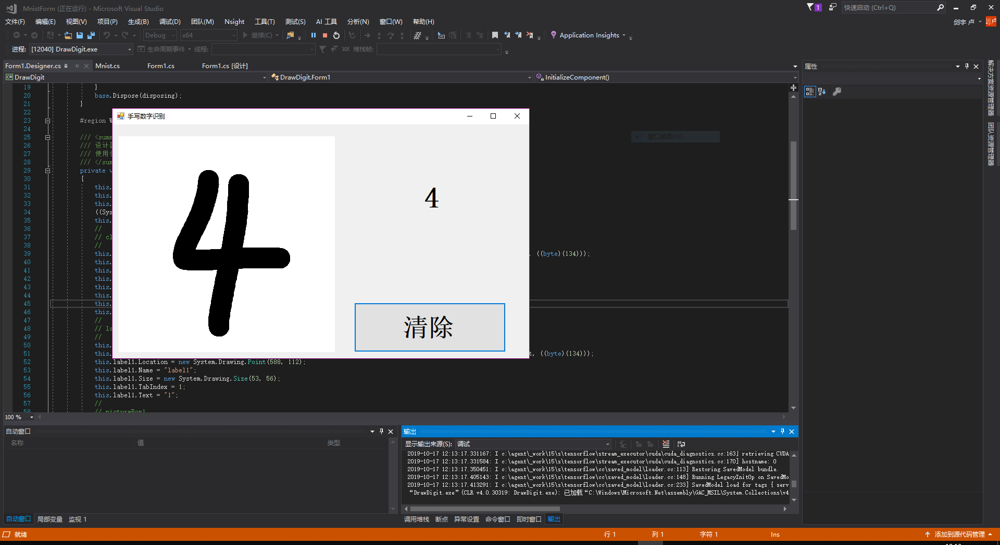