# 第五次课堂总结
&emsp;今天上课学习了人工智能的范围，分为弱人工智能和强人工智能。
弱人工智能：

处理特定的问题，并不具有人类的感知能力。

弱人工智能包括了包含机器学习（Machine Learning)， 机器学习又包括了深度学习（Deep Learning）

强人工智能：

是具备与人类同等智慧、或超越人类的人工智能，能表现正常人类所具有的所有智能行为。

随后又学习了基于本地模型的手写数字识别应用开发相关的一个案例，具体操作分为以下几个步骤:

1. 下载AI Tools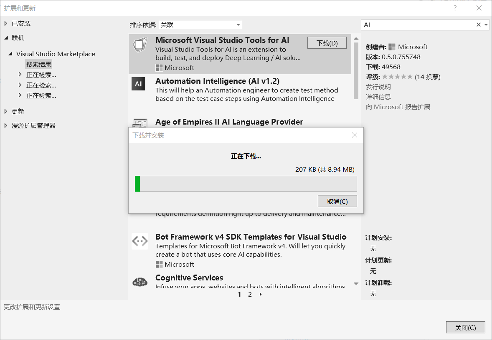
2. 安装tensorflow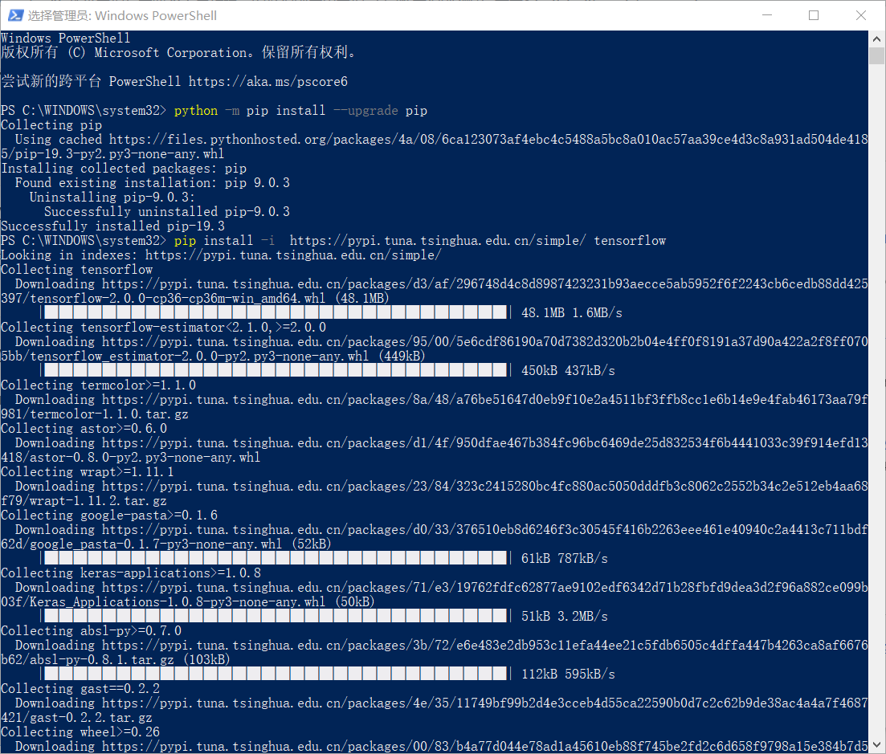
3. 新建项目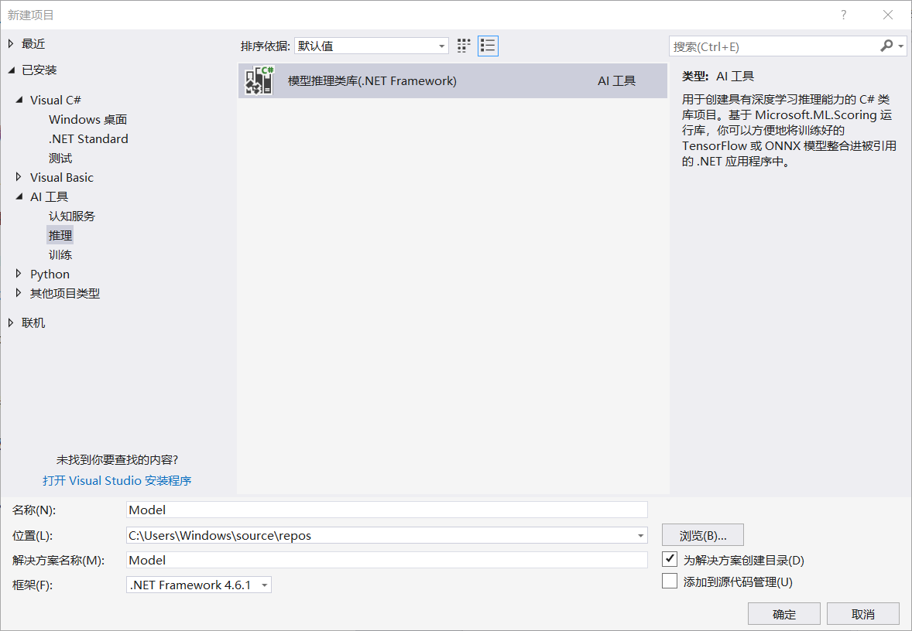
4. clone samples-for-ai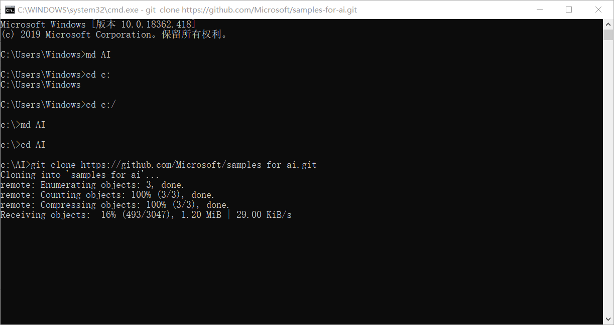
5. 安装机器学习的软件及依赖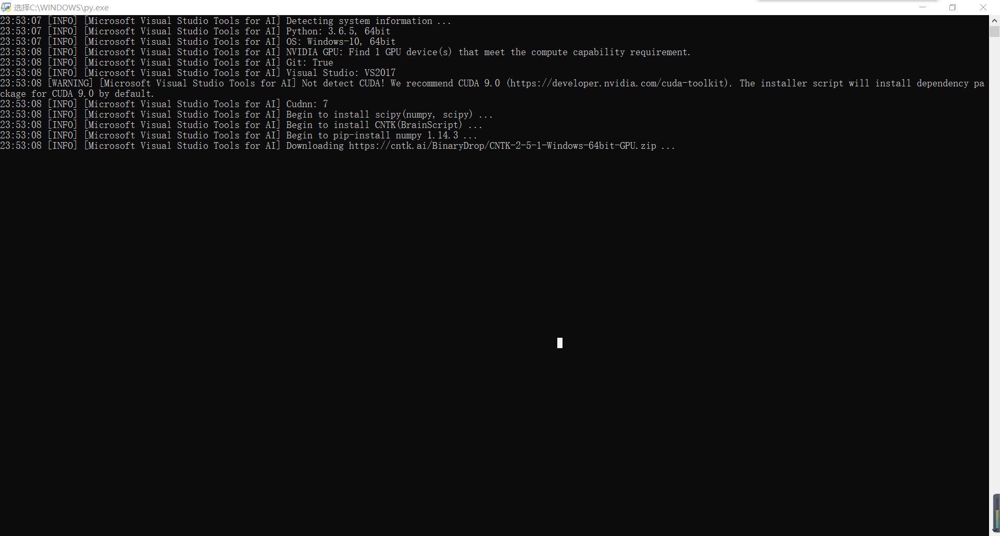
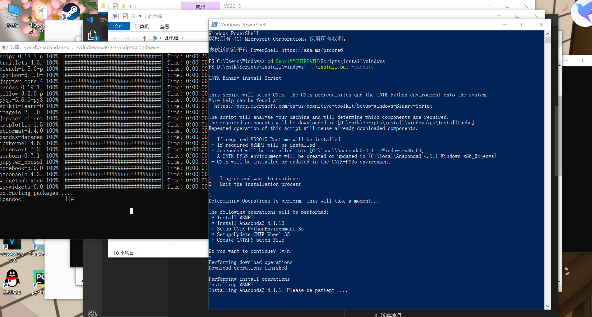
6. 模型训练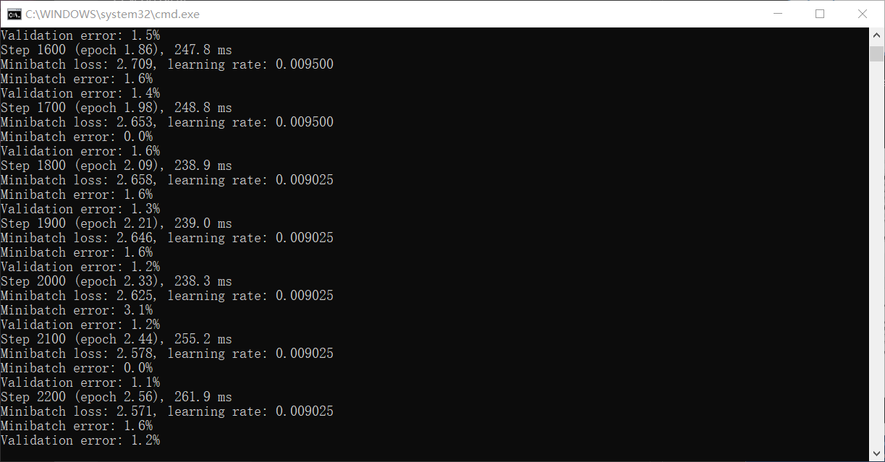
7. 导入模型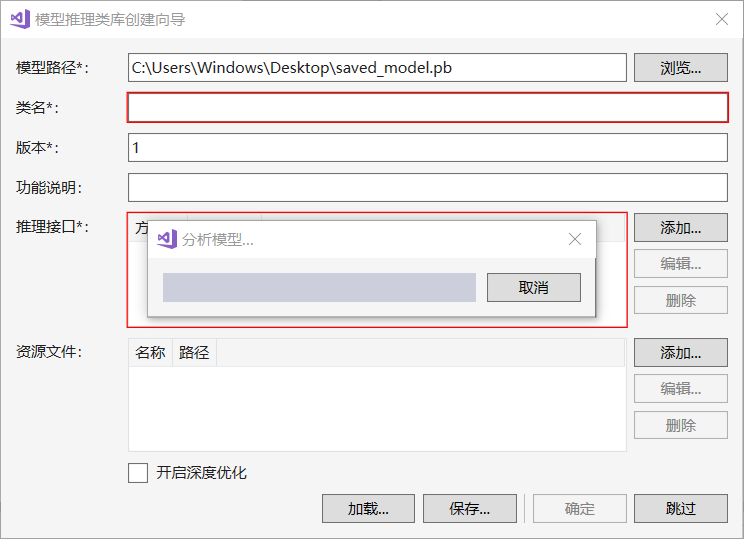
8. 修改版本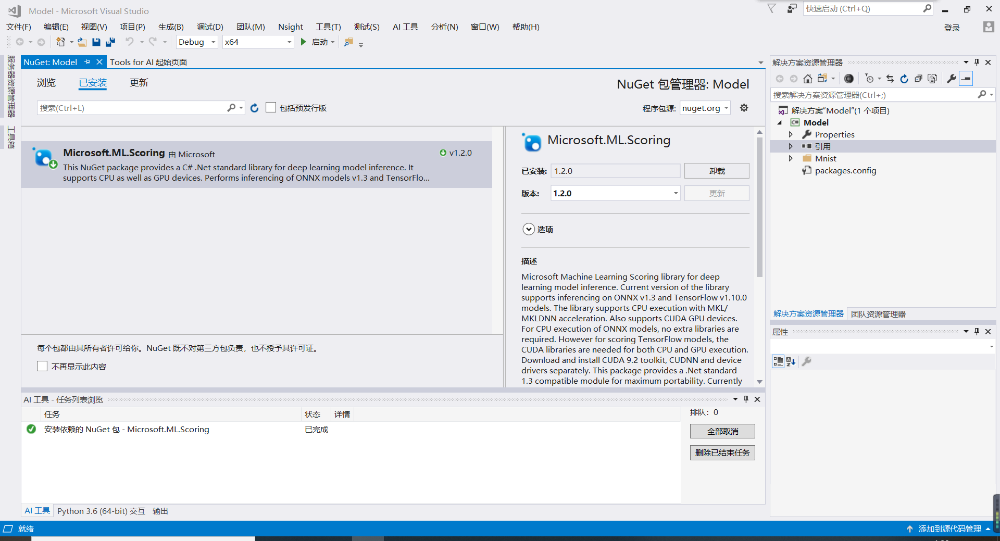
9. 引用model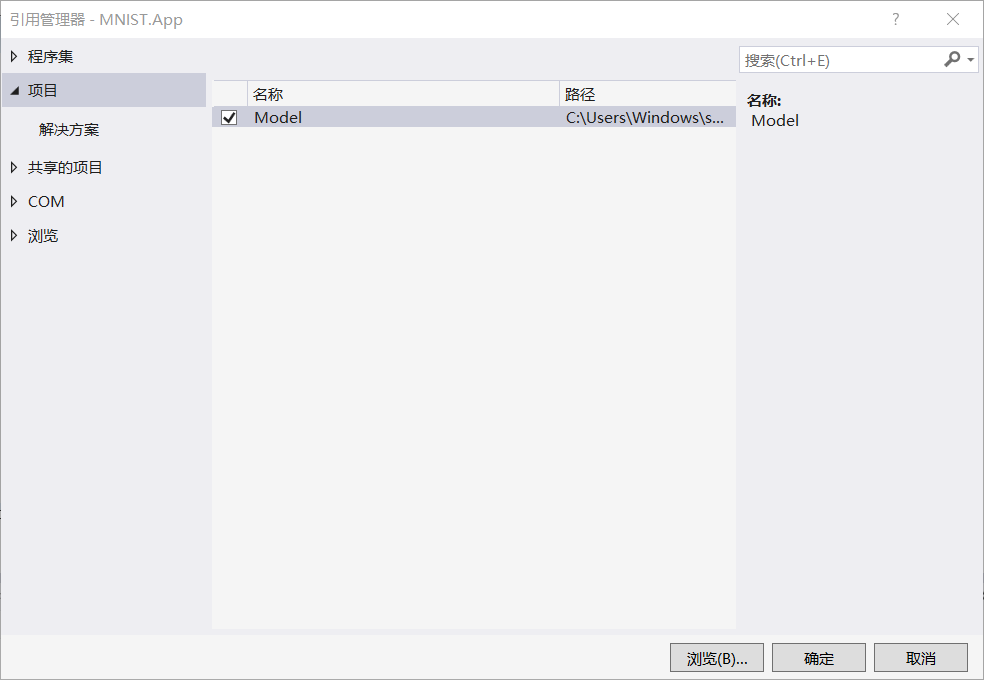
10. 运行成功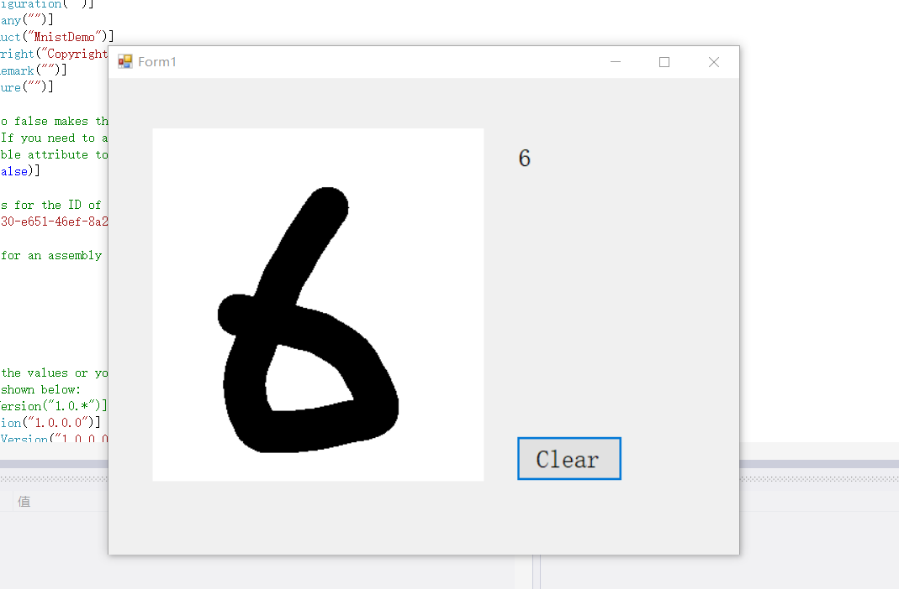

&emsp;心得体会:通过这次课程的学习，我初步学习了人工智能应用的有关内容，实现了一个最基本的手写输入功能和图像识别功能，在配置环境的过程中遇到了各种各样的bug，经过努力最终克服了困难，成功运行了程序。