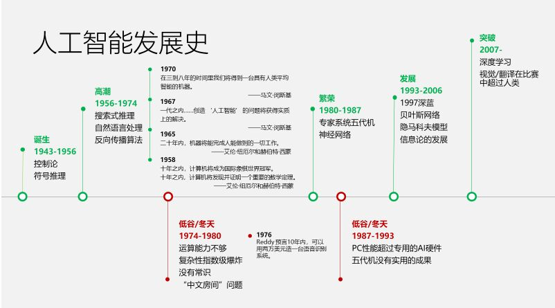
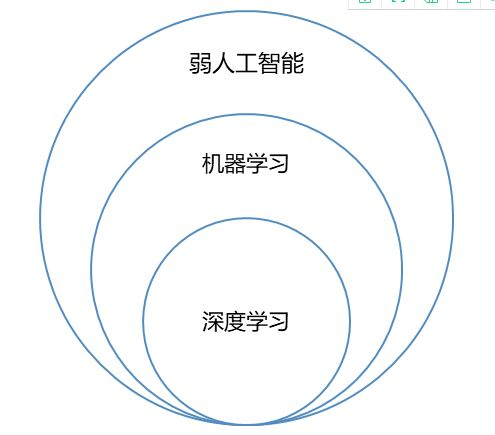
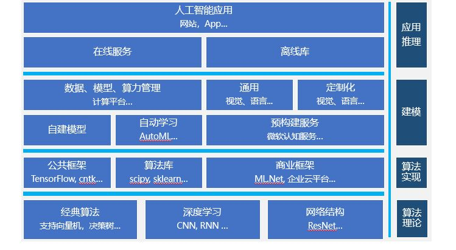
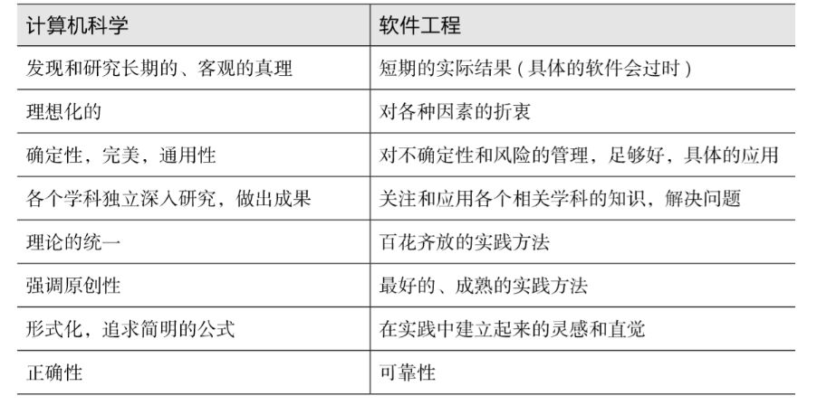
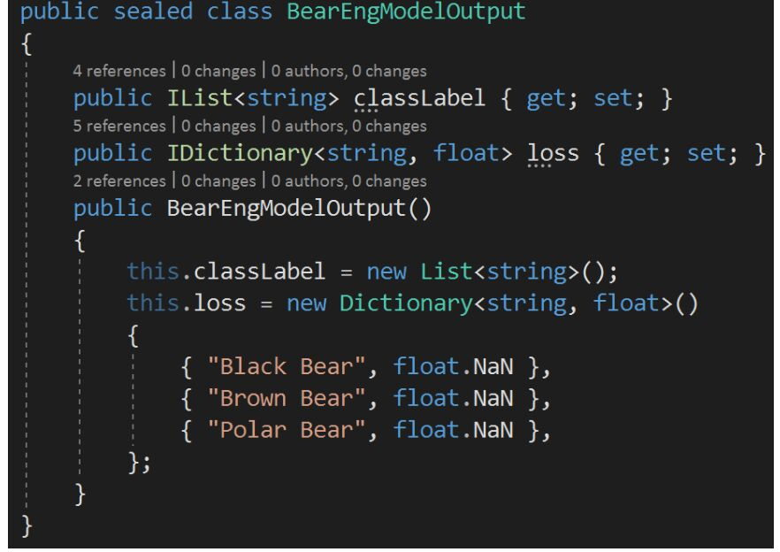

# 第五次作业
## 云计算
云计算是一种基于互联网的相关服务的增加、使用和交付模式的一种技术，它通常涉及通过互联网来提供动态扩展，且经常是虚拟化的资源。
# 人工智能
对人工智能的定义大多可划分为四类，即机器“像人一样思考”、“像人一样行动”、“理性地思考”和“理性地行动”。
人工智能发展史：
1. 强人工智能————强人工智能观点认为有可能制造出真正能推理（REASONING）和解决问题（PROBLEM_SOLVING）的智能机器，并且，这样的机器能将被认为是有知觉的，有自我意识的。强人工智能可以有两类：类人的人工智能，即机器的思考和推理就像人的思维一样。
非类人的人工智能，即机器产生了和人完全不一样的知觉和意识，使用和人完全不一样的推理方式 
2. 弱人工智能————弱人工智能观点认为不可能制造出能真正地推理（REASONING）和解决问题（PROBLEM_SOLVING）的智能机器，这些机器只不过看起来像是智能的，但是并不真正拥有智能，也不会有自主意识。

3. 人工智能的专业领域：交叉应用层：和其他学科的交叉融合、平台系统：机器学习平台，工具，AI 程序设计、支撑技术：模式识别，计算机视觉，语音信息处理，启发式搜索，自动规划，多智能体系统、核心基础：机器学习，知识表示与处理。
4. 人工智能的方向：方法论 - 逻辑、方法论 - 仿人类智能、方法论 - 智慧基础设施）和智慧增强。
5. 弱ai理论的应用：
6. AI,计算机科学和软工工程的比较：

7. 
## 基于本地模型的手写数字识别应用开发案例

# 总结
今天，通过老师的讲解，我对人工智能有了一些感性认识，我知道了人工智能从诞生，发展到今天经历一个漫长的过程，许多人为此做出了不懈的努力。我觉得人工智能真的是一门富有挑战性的科学，但人唯一了解的智能是人本身的智能，所以对人工智能普遍定义为计算机科学、逻辑学、认知科学交叉形成的一门科学，简称ai。人工智能在很多领域得到了发展，在我们的日常生活和学习中发挥了重要的作用。同时，我明白了人工智能发展的历史和所处的地位，它始终处于计算机发展的最前沿。我相信人工智能在不久的将来将会得到更深一步的实现，会创造出一个全新的人工智能世界。

