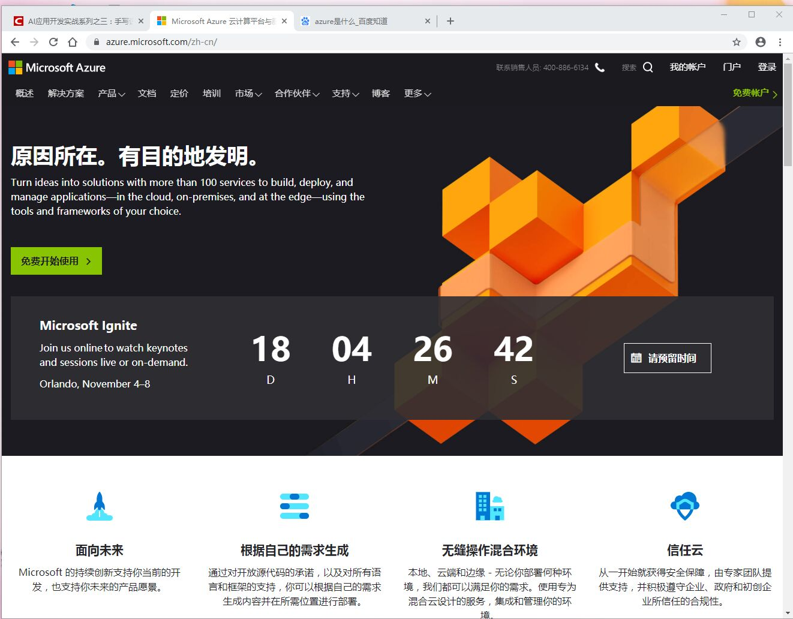
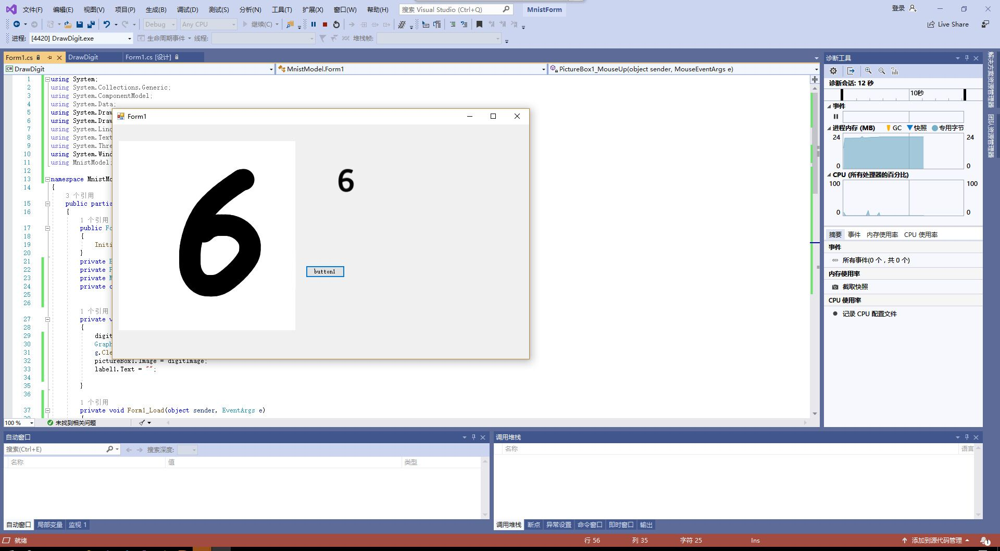

###     20191017第五次作业
姓名：bxr      学号：201702061

    今天的主要内容是了解微软的各种云计算服务AZURE，阿里云，
    paddle paddle，华为云，了解人工智能的发展，以及基于本地模型
    Visual Studio Tools for AI的手写数字识别应用开发。
    我将其分为三个部分一一讲解。

#### 一 了解微软的各种云计算服务
关于云计算，相信大家最近几年经常听到有人提起这个概念，很多大公司比如阿里、亚马逊等互联网巨头都在云计算或者云服务这块下足了功夫。那么云计算究竟是什么意思呢？它是如何起源的，又将如何发展呢？
云计算的概念最早是由Google、IBM和亚马逊在2005年提出来的概念，但是他们三家所提出的云计算的本质却不尽相同，主要原因在于他们三家公司的核心商业模式不同，利益侧重点不同，所以对于云计算的理解也有很大差异。

IBM主要业务是卖硬件设备的，并且IBM的主要服务对象是企业级用户，直到2012年，IBM的主要商业模式依旧是出售服务器等硬件设备来获取利润，所以IBM对于云计算的理解就是多个大型服务器组成的计算网络。人们可以通过互联网享用一个或者多个大型数据中心的计算或者存储功能，而每个家庭的PC仅仅只是作为一个终端，重要性远没有数据中心高。
所以，根据上面三个典型的公司所提出的云计算的服务，我们可以总结出云计算的本质。首先，云计算必须要保证用户可以随时随地地处理信息，非常方便的在互联网上进行信息共享。第二，云计算必须要保证用户可以非常方便地使用大量的非本地计算资源或者数据资源，包括处理器和储存设备，无需自己购买这些设备或资源，而储存数据和资源的地方，我们称之为“云端”。

现在，云计算或者云服务基本上已经在我们身边普及了，现在的个人或者公司想要建立一个网站或者平台软件，不需要像以前那样非要有自己的服务器等硬件工具了，完全可以租用阿里云的服务器，调用阿里云的计算资源等。工作会变得比以前方便许多，这就是云计算和云服务给我们的生活和工作带来的便利，这大大提高效率。
 
 其中老师着重向我们介绍了AZURE这个微软基于云计算的操作系统，我自己也尝试注册了一下，没有成功，因为我的邮箱被人占用了所以就没用用啦。

#### 二 人工智能的发展
人工智能是现在非常热门的流行词，人工智能的迅速发展将深刻改变人类社会生活、改变世界。人工智能发展的不确定性带来新挑战。人工智能是影响面广的颠覆性技术，可能带来改变就业结构、冲击法律与社会伦理、侵犯个人隐私、挑战国际关系准则等问题，将对政府管理、经济安全和社会稳定乃至全球治理产生深远影响。在大力发展人工智能的同时，必须高度重视可能带来的安全风险挑战，加强前瞻预防与约束引导，最大限度降低风险，确保人工智能安全、可靠、可控发展。同时，也要清醒地看到，我国人工智能整体发展水平与发达国家相比仍存在差距，缺少重大原创成果，在基础理论、核心算法以及关键设备、高端芯片、重大产品与系统、基础材料、元器件、软件与接口等方面差距较大；科研机构和企业尚未形成具有国际影响力的生态圈和产业链，缺乏系统的超前研发布局；人工智能尖端人才远远不能满足需求；适应人工智能发展的基础设施、政策法规、标准体系亟待完善。

#### 三 手写数字识别应用开发
   
    首先使用模型搭建应该的基本步骤是：
    1.实现简单的界面，将用户用鼠标或者触屏的输入变成图片。
    2.将生成的模型包装起来，成为有公开数据接口的类。
    3.将输入的图片进行规范化，成为数据接口能够使用的格式。
    4.最后通过模型来推理(inference)出图片应该是哪个数字，并显示出来。
* 那我们要怎么获取手写的数字呢？我这里做出一些总结
首先，我们打开Visual Studio，选择文件->新建->项目。
在弹出的窗口里选择Visual C#->Windows窗体应用，项目名称不妨叫做DrawDigit，解决方案名称不妨叫做MnistForm，点击确定。
此时，Visual Studio也自动弹出了一个窗口的设计图。
在DrawDigit项目上点击右键，选择属性，在生成一栏将平台目标从Any CPU改为x64。
然后我们对这个窗口做一些简单的修改：

首先我们打开VS窗口左侧的工具箱，这个窗口程序需要以下三种组件：
1. PictureBox：用来手写数字，并且把数字保存成图片
2. Label：用来显示模型的识别结果
3. Button：用来清理PictureBox的手写结果

     * 一些注意事项：
      这些组件都可以通过右键->查看属性，在属性里修改它们的设置
      为了方便把PictureBox里的图片转化成Mnist能识别的格式，PictureBox的需要是正方形
      可以给这些控件起上有意义的名称。
      可以调整一下label控件大小、字体等，让它更美观。

还是在属性窗口，我们选择某个组件，右键->查看属性，点击闪电符号，给组件绑定对应的事件。每次绑定后，会跳到代码部分，生成一个空函数。点回设计视图继续操作即可。
然后我们开始补全对应的函数体内容。

注意，如果在上面改变了控件的名称，下面的代码需要做对应的更改。
我们在解决方案MnistForm下点击鼠标右键，选择添加->新建项目，在弹出的窗口里选择AI Tools->Inference->模型推理类库，名称不妨叫做MnistModel，点击确定，于是我们又多了一个项目
然后自己配置好这个项目的名称、位置，点击确定。

然后弹出一个模型推理类库创建向导，这个时候就需要我们选择自己之前训练好的模型了。最后将两部分进行连接，就可以运行啦~

运行结果如下：
