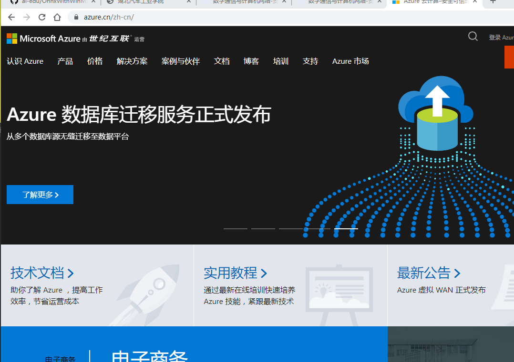
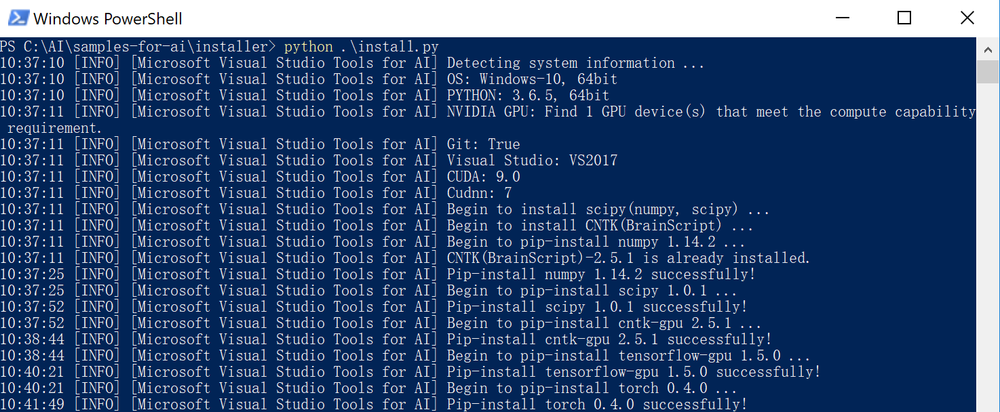

学习总结：
今天主要了解了微软的AZURE（云计算服务）和了解人工智能的发展以及基于本地模型的手写数字识别应用开发案例使用Visual Studio Tools for AI加速桌面智能应用开发
1. azure(云计算服务)注册和了解:

2. 人工智能的发展史和简介：
广义的人工智能是指“通过计算机实现人类思维的效果，能从环境中获取感知并行动“ 的现象。我们大致可以把广义人工智能分为弱人工智能和强人工智能。
弱人工智能：
处理特定的问题，并不具有人类的感知能力。前两年名噪一时的AlphaGo 程序并不知道自己在下 “围棋”，它只是忙着处理矩阵运算…弱人工智能包括了包含机器学习（Machine Learning)， 机器学习又包括了深度学习（Deep Learning）
强人工智能：
是具备与人类同等智慧、或超越人类的人工智能，能表现正常人类所具有的所有智能行为。
它们的关系如图：
目前人工智能的专业领域:
(1). 交叉应用层：和其他学科的交叉融合
(2). 平台系统：机器学习平台，工具，AI 程序设计
(3). 支撑技术：模式识别，计算机视觉，语音信息处理，启发式搜索，自动规划，多智能体系统
(4).核心基础：机器学习，知识表示与处理
(5)方法论 - 逻辑-仿人类智能- 智慧基础设施（Intelligent Infrastructure）和智慧增强（Intelligence Augmentation）
弱AI 理论 – 算法 – 框架 – 应用：

3. 基于本地模型的手写数字识别应用开发案例使用Visual Studio Tools for AI加速桌面智能应用开发
下载TensorFlow模型和python来配置环境：

配置好环境后根据github网站中的ai-edu/B-教学案例与实践/B7-自构建－图像识别应用案例-手写数字识别/微软-方案1/来意义操作。结果如下：

