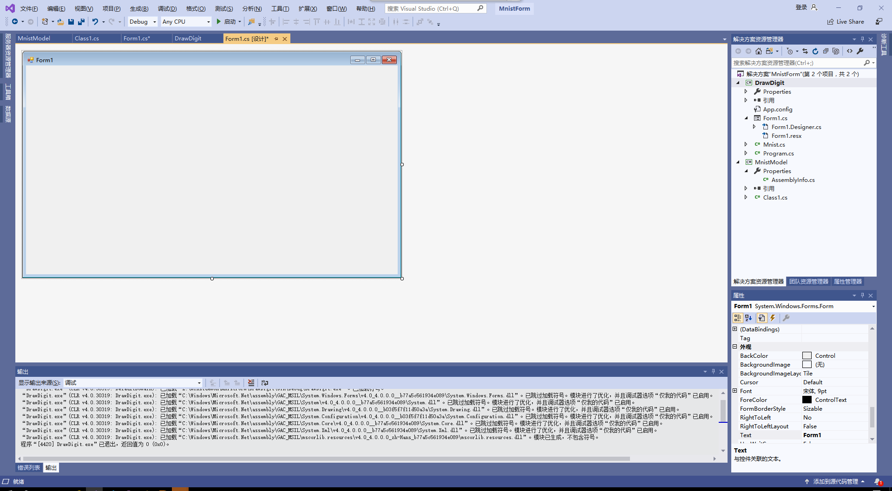
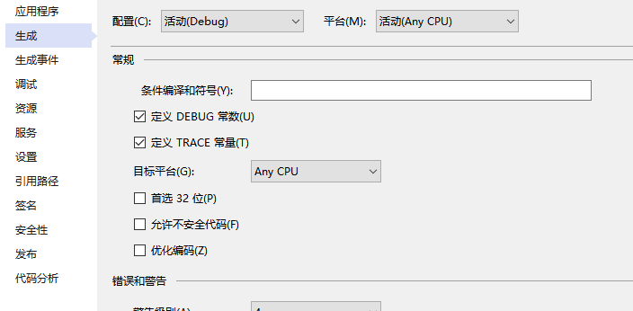

## 第五次作业
### 机器学习平台建设
本节课我们学了了机器学习平台的主要功能和就流程。机器学习最主要的三个步骤为数据处理，建模以及部署。

数据处理将数据在不同的数据源间导入导出，并对数据进行聚合、变形、清洗等操作。数据采集，即从外部系统获得数据，包括通过网络爬虫来采集数据。数据标记，是将人类的知识附加到数据上，产生样本数据，以便训练出模型能对新数据推理预测。

建模，即创建模型的过程，包括特征工程、试验、训练及评估模型。特征工程，即通过数据科学家（也称为算法工程师）的知识来挖掘出数据更多的特征，将数据进行相应的转换后，作为模型的输入。

部署，是将模型部署到生产环境中进行推理应用，真正发挥模型的价值。

### 手写识别应用入门
先打开Visual Studio，选择文件->新建->项目。在弹出的窗口里选择Visual C#->Windows窗体应用，项目名称叫做DrawDigit，解决方案名称叫做MnistForm，点击确定。

此时，Visual Studio也自动弹出了一个窗口的设计图。

在DrawDigit项目上点击右键，选择属性，在生成一栏将平台目标从Any CPU改为x64。

然后对这个窗口做一些修改：
打开VS窗口左侧的工具箱，这个窗口程序需要以下三种组件：
1. PictureBox：用来手写数字，并且把数字保存成图片
2. Label：用来显示模型的识别结果
3. Button：用来清理PictureBox的手写结果

那经过一些简单的选择与拖动还有调整大小，这个窗口现在是这样的：

再给组件添加时间，在属性窗口，选择某个组件，右键->查看属性，点击闪电符号，给组件绑定对应的事件，每次绑定后，会跳到代码部分，生成一个空函数，pictureBox1 对应的事件在Mouse下双击MouseDown、MouseUp、MouseMove来生成对应的响应事件函数。button1对应的事件，在Action 下双击Click。Form1对应的事件在Behavior下双击load.

再补充对应的函数内容即可
运行结果为：

### 总结

通过本次课的学习，我掌握了手动识别应用的知识，知道了机器建设平台的主要功能并加以理解。虽然工程建设途中遇到了不少问题，但在自己细心的检查下最终将问题解决，并且这节课中，老师还向我们介绍了人工智能的应用和发展，了解了人工智能的伦理知识，例如人类将来是否会面临失业问题，以及机器在未来如何影响我们的行为和互动。不过我们还是在具体了解人类如何做到智能化发展，通过本次课的学习，我对人工智能也有了初步的了解以及对未来局势的发展有了初步的见解。

