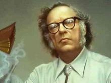
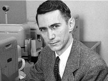
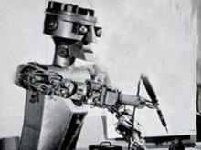
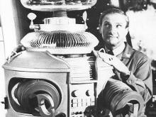
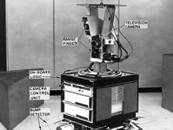
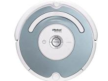
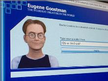
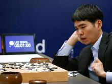

第五次作业：人工智能
人工智能（Artificial Intelligence），英文缩写为AI。它是研究、开发用于模拟、延伸和扩展人的智能的理论、方法、技术及应用系统的一门新的技术科学。
* 1942年  “机器人三定律”提出
美国科幻巨匠阿西莫夫提出“机器人三定律”，后来成为学术界默认的研发原则。

* 1956年 人工智能的诞生
达特茅斯会议上，科学家们探讨用机器模拟人类智能等问题，并首次提出了人工智能的术语，AI（人工智能）的名称和任务得以确定，同时出现了最初的成就和最早的一批研究者。

* 1959年 第一代机器人出现
德沃尔与美国发明家约瑟夫·英格伯格联手制造出第一台工业机器人。随后，成立了世界上第一家机器人制造工厂——Unimation公司。

* 1965年 兴起研究“有感觉”的机器人
约翰·霍普金斯大学应用物理实验室研制出Beast机器人。Beast已经能通过声纳系统、光电管等装置，根据环境校正自己的位置。兴起研究“有感觉”的机器人约翰·霍普金斯大学应用物理实验室研制出Beast机器人。Beast已经能通过声纳系统、光电管等装置，根据环境校正自己的位置

* 1968年 世界第一台智能机器人诞生
美国斯坦福研究所公布他们研发成功的机器人Shakey。它带有视觉传感器，能根据人的指令发现并抓取积木，不过控制它的计算机有一个房间那么大，可以算是世界第一台智能机器人。

* 2002年 家用机器人的诞生
美国iRobot公司推出了吸尘器机器人Roomba，它能避开障碍，自动设计行进路线，还能在电量不足时，自动驶向充电座。Roomba是目前世界上销量较大的家用机器人。

* 2014年 机器人首次通过图灵测试
在英国皇家学会举行的“2014图灵测试”大会上，聊天程序“尤金·古斯特曼”（Eugene Goostman）首次通过了图灵测试，预示着人工智能进入全新时代。

* 2016年 AlphaGo打败人类
2016年3月，AlphaGo对战世界围棋冠军、职业九段选手李世石，并以4:1的总比分获胜 。这并不是首次出现机器人打败人类的事件。

### 总结：人工智能在人的生活运用中越来越广泛，在今后的生活中也会运用的越来越广泛。人工智能的一大优势在于其“大数据分析”的能力。其可以通过对某一消费者的日常生活的研究，推测出他对哪种商品需求最大，从而通过某种渠道推荐给此人最优的选择。这种功能还可以用于指导企业的生产，在拥有更为充分的市场信息后，企业便可以更好的优化其生产资料的投入，减少浪费。一言以蔽之，人工智能将削弱厂商与消费者之间的信息壁垒。但是，我仍认为未来世界还是由人类主导的。其一是所谓“需求”或“使用价值”难以量化，人工智能的分析也只能做到缩小目标范围，不可能完全打破信息壁垒。第二，虽然人工智能拥有强大的计算能力，但其核心的算法却是由人类创造的。未来的竞争可能会趋于“谁能写出更优的算法”。所以，世界仍会由人主导。