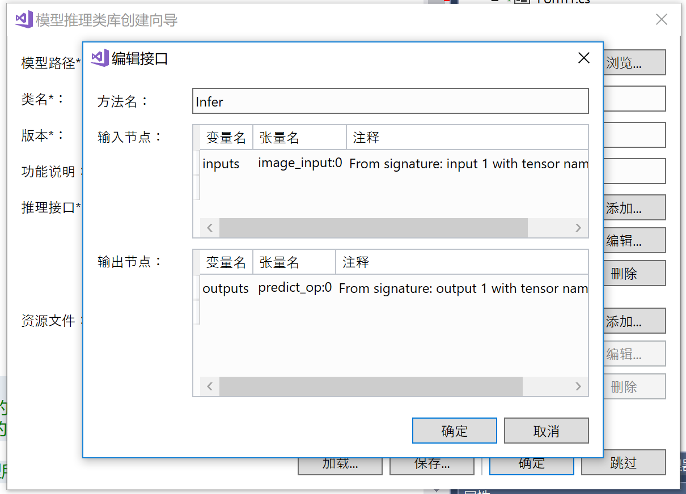
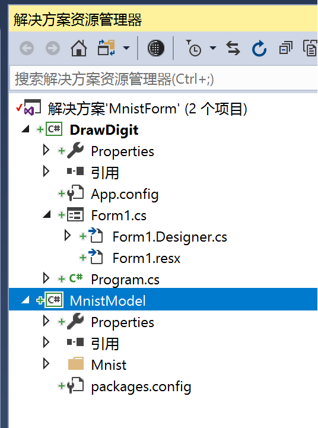
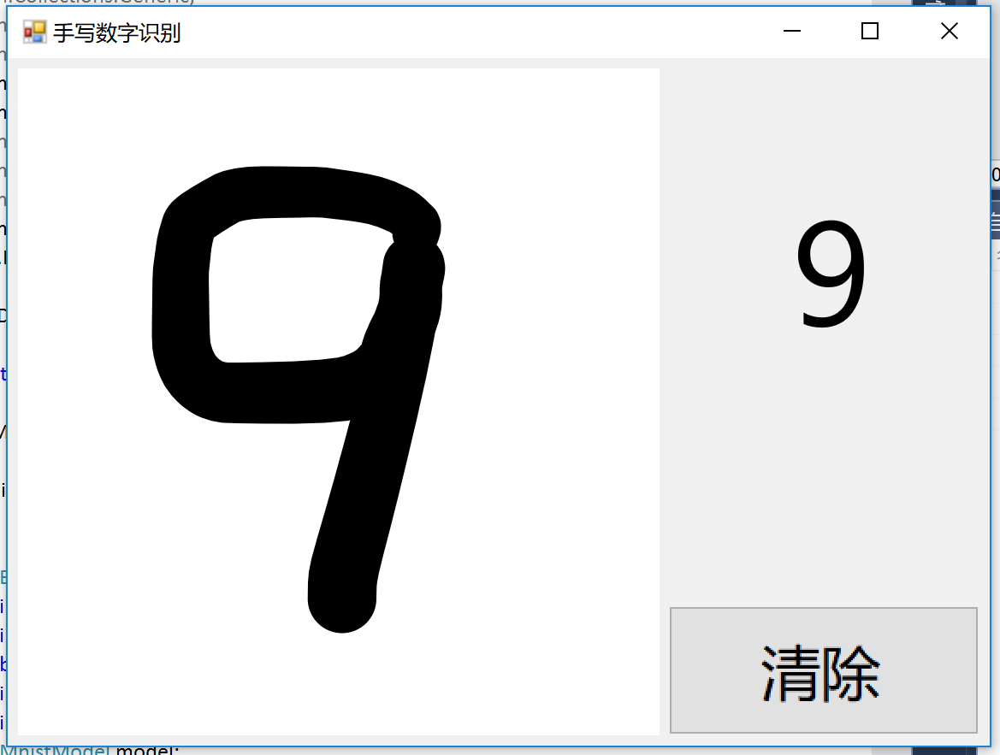
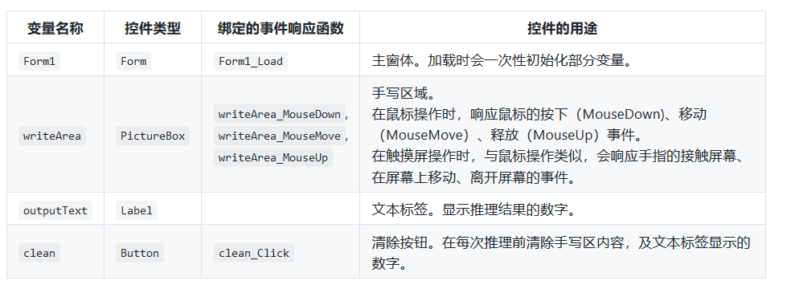

>>>>>>>>># 第五次作业
## 第五次上课讲解了智能驾驶这个方面，也就是我们一直研究的方向。

### 一、基于本地模型的手写数字识别应用开发案件

#### 1、 使用Visual Studio Tools for AI加速桌面智能应用开发

#### （1）主要知识点：
  * 典型的AI应用的代码结构和功能。
  * 使用Visual Studio Tool for AI进行TensorFlow模型到NetFrameWork应用环境的快速集成。
#### （2）简介：
  * 本文将介绍一例“手写数字识别应用”的开发过程。
  * 本文将通过这一入门级案例展示人工智能应用开发中的典型元素。（如准备人工智能应用开发所需的软件环境，使用Visual Studio Tools for AI快速集成模型、加速人工智能应用开发，以及在代码中处理用户输入，以便人工智能模型能正确地接受输入的数据等等。）
  * 本文将对这些工作和该应用的主要代码逻辑进行分析、讲解。
  * 本文还将解答手写数字识别应用开发的一些常见问题，并介绍现实场景中的一些可能需求。开发将基于桌面.Net Framework环境和训练好的MNIST手写数字分类模型完成。

#### 2.目标应用介绍
#### （1）背景：
  * 手写输入已经成为了一种非常常见的输入方式。然而手写输入和传统的鼠标、键盘输入方式有很大的不同，相对于传统输入方式生产的数据，手写输入的内容（也是数据）----在很多场景下都不是计算机能直接处理的。
  * 本文将介绍一款“手写数字识别应用”的开发和其代码结构。这款应用通过借力MNIST数据集，具备了最基本的手写输入功能和图像识别功能，能将用户手写的0，1，2，…，9数字单个地识别出来。
#### （2）开发环境
  * 本文采取.Net Framework桌面环境作为开发环境，基于WPF框架实现用户界面，并依赖TensorFlow和VS Tools for AI等组件来完成人工智能模型的创建和集成。

#### 3.训练模型
#### （1）模型介绍
  * 之前下载的samples-for-ai样例库中包含了大量的机器学习训练和应用的示例，其中就有针对MNIST数据集的人工智能模型（下称MNIST模型）训练程序。
  * MNIST数据集包含了大量单个手写数字的位图数据，包含各种手写风格，并且这些位图数据都已经被很好地标记过了。即每一张手写数字的位图都存在一个对应的数字，并且这个数字是可以以数据的形式被访问的。
  * MNIST数据集为本文中识别手写数字的问题提供了大量素材，利用这些素材我们可以训练出专门用于识别单个手写数字的人工智能模型。
  * 同时，我们选择使用TensorFlow来训练MNIST模型。TensorFlow是一款使用非常普遍、很有代表性的机器学习框架。
#### （2）实际训练
  * 大致的步骤如下：
   1. 实现简单的界面，将用户用鼠标或者触屏的输入变成图片。
   2. 将生成的模型包装起来，成为有公开数据接口的类。
   3. 将输入的图片进行规范化，成为数据接口能够使用的格式。
   4. 最后通过模型来推理(inference)出图片应该是哪个数字，并显示出来。
  * 实行步骤：
   1. 获取手写数字
    * 创建项目（Windows窗体应用）；

    * 在项目上右键，选择属性，在生成一栏将平台从Any CPU 改为x64.（ps：否则，DrawDigit（首选32位）与它引用的MnistForm（64位）的编译平台不一致会引发System.BadImageFormatException的异常。）
     
    * 打开工具箱，选择三个组件PictuBox（用来手写数字，并把数字保存成图片）、Label（用来显示模型的识别结果）和Button（用来清理PictureBox的手写结果）
    * 一些注意事项
     * （1）这些组件都可以通过右键->查看属性，在属性里修改它们的设置
     * （2） 为了方便把PictureBox里的图片转化成Mnist能识别的格式，PictureBox的需要是正方形
     * （3）可以给这些控件起上有意义的名称。
     * （4）可以调整一下label控件大小、字体等，让它更美观。
     * 写入代码
   
   
   2. 把模型包装成一个类：将模型包装成一个C#是整个过程中比较麻烦的一步。
    * 我们在解决方案MnistForm下点击鼠标右键，添加新项目，在弹出的窗口里选择AI Tools->Inference->模型推理类库。

    *  自己配置好这个项目的名称、位置，点击确定。
    * 弹出一个模型推理类库创建向导，选择自己之前的模型。
    
    *  首先在模型路径里选择保存的模型文件的路径。
    *  对于TensorFlow，可以选择检查点的.meta文件，或者是保存的模型的.pb文件
   
    *  类名可以自己定义，因为用的是MNIST，那么类名就叫Mnist好了，然后点击确定。这样，在解决方案资源管理器里，在解决方案MnistForm下，就多了一个MnistModel
      
    * 双击Mnist.cs，我们可以看到项目自动把模型进行了封装，生成了一个公开的infer函数。然后我们在MnistModel上右击，再选择生成.
   
   
   3. 连接两个部分
    * 在DrawDigit项目的引用上点击鼠标右键，点击添加引用，在弹出的窗口中选择MnistModel，点击确定。
 
 
    * 由于MNIST的模型的输入是一个28×28的白字黑底的灰度图，对图片进行处理。将图片改为28*28的大小，将RGB图片转化为灰阶图，将灰阶图标准化到[-0.5,0.5]区间内，转为黑底白字。最后将图片用mnist模型要求的格式包装起来，并传送给他进行推理。
    * 写上代码
    * 效果展示

  4. 补充：
  * 界面逻辑的一些重要信息如下:
  
  * 数据预处理:
  
    + 数据预处理是 AI 应用的重要一环。在大部分 AI 应用中，特别是本文的图片分类应用中，通过监督学习来训练模型。即先提供一些标记过分类的图片来训练出模型，然后输入未知的图片，推理预测出此图片的类别。因此，在训练和推理过程中，每次输入模型的数据格式必须完全一致，这样才能保证预测推理的效果。
    
    + 在 AI 的实际应用中，一定要了解模型输入数据的格式细节，严格的实现它。如果数据格式细节不一致，通常会降低推理结果的正确率。而这类问题几乎不会产生编译或运行错误，而且数据是不易直观理解的浮点数组，所以对此类问题的诊断和修正较困难。
    
    + 数据预处理的第一步，在窗体设计时，手写区域调整为了正方形，和训练数据的形状保持一致。
    
    + 定义了类变量 ImageSize 常量等于 28。这是训练数据的实际图片尺寸。界面上的正方形最终会缩小为 28x28。
  >>>>>private const int ImageSize = 28;

    + clear_Click 函数中设置了手写区域的背景为白色。训练数据是黑白的，需要将前景、背景颜色同样设置，而与训练数据一样，达到最大的对比度。
  >>>>>graphics.Clear(Color.White);

    + writeArea_MouseMove 事件中设置了手写笔风格。手写笔迹宽度是40，颜色为黑色，开始、结束位置设成圆头。笔迹宽度与图片尺寸的比例基本匹配了训练数据的比例。但无法控制用户输入的文字大小，还会有一些误差。好在深度学习的模型适应性较强，对识别准确率的影响不太大。黑色笔迹配合了白色背景，形成最大的对比度。笔迹的开始、结束位置为圆头。在书写过程中会多次调用到鼠标移动事件中，每次根据上一次的结束位置到当前位置画了一条直线。
  >>>>> Pen penStyle = new Pen(Color.Blace,40)
    {
      StartCap = LineCap.Round,
      EndCap = LineCap.Round
    };

    + writeArea_MouseUp 事件中包含了其它的数据处理逻辑。
 >>>>>Bitmap clonedBmp = new Bitmap(writeArea.Image,ImageSize,ImageSize);

    + 按行、列遍历了 28x28 位图中的所有节点，并取出了每个像素，处理后存入数组中。
  >>>>>for(int y = 0;y < ImageSize;y++)
    {
      for(int x = 0;x < ImageSize;x++)
       {
         Color color = clonedBmp.GetPixel(x,y);
         image.Add((float)reversed);
       }
    }

    + 将红绿蓝通道加和并平均，完成了像素灰度化。手写识别模型的输入数据是黑白图。手写区是白底黑字，每个颜色通道的值其实是一样的。为了逻辑上的严密和便于理解，所以对值取了均值，进行灰度化。
  >>>>double average = (color.R + color.G + color.B) / 3.0;

    + 将取值范围变换到了 0~1。机器学习中取值范围变化很大，因此绝大部分机器学习模型都用浮点数进行计算。
  >>>>> double oneValue = average / 255;

    + 将数值翻转，并做+0.5 的位移。这一步可以减少输入数据中零值的数量。过多的零，会让中间结果也出现更多的零，使得神经网络容易丢失信息。白色背景通过灰度化之后灰度值是 255，经变换后为 -0.5；黑色笔迹灰度化之后灰度值是0，经变换后为 0.5。这样处理后，大部分值都成为了非零值。最重要的是我们所依赖的模型（衍生自mnist.py脚本），对输入数据的处理也是如此。对于数据的取反，是经验的做法。通过试验，在很多情况下取反后的训练效果会更好。MNIST数据集的数据也是取反保存的。
   >>>>double reversed = 0.5 - oneValue;
  
## 二、总结

##### 这个实验在制作过程中特别曲折，可以这么说，因为就自动更新了，成为了Visual Studio 2019，就制作不出来，在找工具口的是就找了很久，一直无法实现。问过陈少辉之后才知道用2017能做出来，又下了一遍2017，这个实验才成功。最近的实验有些过程都是很曲折的，但是看到结果的时候，心情是很愉悦，很开心，那些曲折时候的暴躁、烦恼的心情都会被喜悦代替。
##### 今天下午和陈少辉、王景楠做识别熊的合作的时候，虽然下午我什么都没有付出，但是我挺认真的看了文档，并且还帮陈少辉写了一点，在代码出错的时候，也提出了自己觉得可能出现的问题，最后也确实是我的想法，怪开心的。好歹还是贡献了一点点嗷。
##### 在学习的过程，有和朋友的合作，和自己的摸索都是重要的，合作比自己一个人去完成会效率高，准确率高并且时间短。团队合作是必要的事情。包括每一次做实验都是可以说有同学的帮助，自己遇到问题也是向同学求助，他们给出建议，有时候我们的解决方案都不对，那我们就一个一个试，试到自己的方案是对的时候，那种愉悦感是形容不出来的。期待以后的每一次和同学们的合作。

    