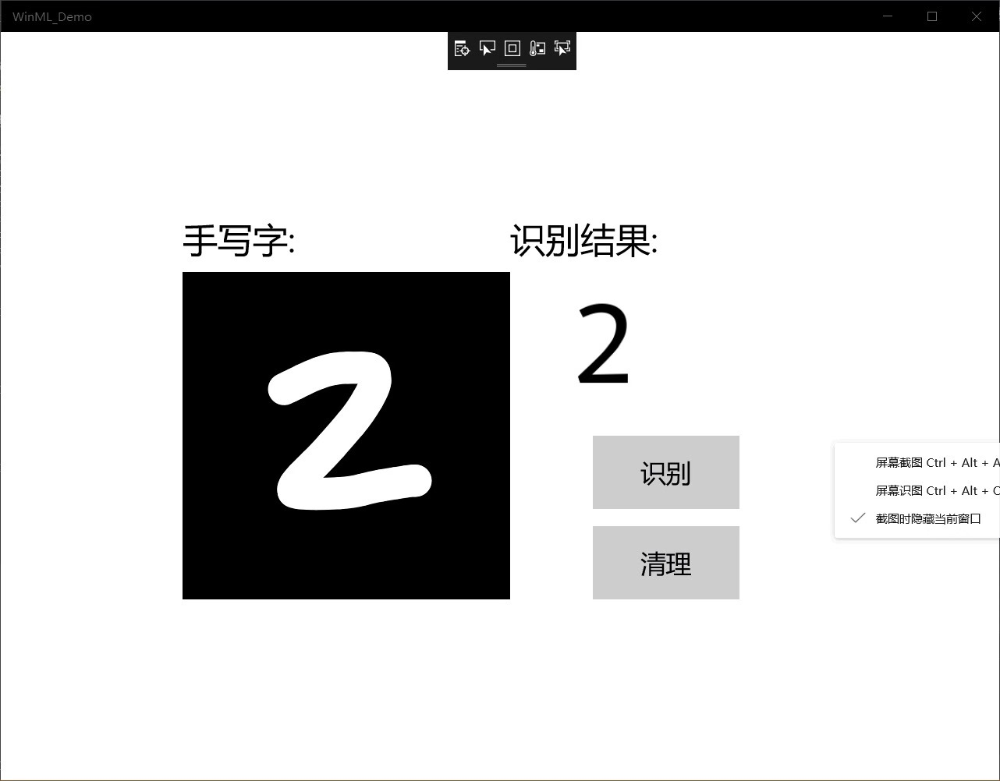

# 第六次作业
本次学习基于 MNIST 数据集的手写数字识别，使用window Machine Learning来实现。
## 基于 MNIST 数据集的手写数字识别
1. 模型介绍：
MNIST数据集包含了大量单个手写数字的位图数据，包含各种手写风格，并且这些位图数据都已经被很好地标记过了。即每一张手写数字的位图都存在一个对应的数字，并且这个数字是可以以数据的形式被访问的。这极大地简化了我们的准备工作。MNIST数据集为本文中识别手写数字的问题提供了大量素材，利用这些素材我们可以训练出专门用于识别单个手写数字的人工智能模型。
2. 开发环境：
 本文采取Net.Framework桌面环境作为开发环境，基于WPF框架实现用户界面，依赖window Machine Learning等组件来完成人工智能模型的创建和集成。
3. 启动UWP：
在github官网上下载项目，启动VS2019并在电脑上找到下载项目打开MNIST_Demo.sln文件。如果解决方案显示为不可用，则需要在解决方案资源管理器中右键单击该项目，然后选择Reload Project。下载的项目中带有已实现的XAML控件和事件的模板，如下所示：

    InkCanvas绘制数字。 用于解释数字并清除画布的按钮。 帮助程序将InkCanvas输出转换为VideoFrame的例程。 在解决方案资源管理器内部，该项目具有三个主要代码文件：

    MainPage.xaml-我们所有的XAML代码都为InkCanvas，按钮和标签创建UI 。

    MainPage.xaml.cs-我们的应用程序代码所在的位置。

    Helper.cs-裁剪和转换图像格式的帮助程序例程。

4. 构建并运行项目：
   在Visual Studio工具栏中，将解决方案平台更改为x64，然后运行项目开始调试，然后应用程序会显示一个InkCanvas，用户可以在其中写一个数字，一个Recognize按钮来解释该数字，一个空标签字段，其中解释后的数字将以文本形式显示，以及一个Clear Digit按钮来清除InkCanvas。
5. 添加模型：
   在解决方案管理器中的Assets添加现有项ONNX模型，有两个新文件：mnist.onnx-训练的模型。 mnist.cs -Windows ML生成的代码

   mnist.cs文件中新生成的代码分为三类：

   1. mnistModel创建机器学习模型表示，在系统默认设备上创建会话，将特定的输入和输出绑定到模型，并异步评估模型。
   2. mnistInput初始化模型期望的输入类型。在这种情况下，输入需要一个ImageFeatureValue
   3. mnistOutput初始化模型将输出的类型。在这种情况下，输出将是TensorFloat类型的名为Plus214_Output_0的列表。
6. 加载，绑定和评估模型：
对于Windows ML应用程序，遵循的模式是：“加载”>“绑定”>“求值”。
   1. 加载机器学习模型。 将输入和输出绑定到模型。 评估模型并查看结果。 我们将使用mnist.cs中生成的接口代码来加载，绑定和评估应用程序中的模型。
   
      MainPage.xaml.cs：实例化模型，输入和输出。

      LoadModelAsync：加载模型。mnistModel类表示MNIST模式并创建系统默认设备上的会话。要加载模型，我们调用CreateFromStreamAsync方法，并传入ONNX文件作为参数。

    2. 输入和输出绑定到模型：mnistInput类表示该模型的预期输入，并且mnistOutput类表示该模型的预期的输出。
    3. 求值：首先要将其转换为友好的数据类型，解析返回的列表以确定哪个数字具有最高的概率并显示该数字。最后，要清除InkCanvas，以允许用户绘制另一个数字
7. 启动程序
   启动后能够识别在InkCanvas的数字

## 总结
本次学习基于 MNIST 数据集的手写数字识别，跟上次老师讲的不一样，这次用的是Windows Machine Learning来实现的，两种方法都可以实现，但是在操作时步骤是不同的，有好多不相同的地方。在这次中，老师直接给了代码，我们只要将项目下载打开运行即可。当然，在操作的时候难免会出现错误，比如代码复制错误·，然后运行不出来等等，但是经过同学帮助，这些问题一一解决。这次课让我学会了怎么用MINIST手写数字识别，对我以后的学习有了很大的帮助，并且使我的知识领域更加丰富。 