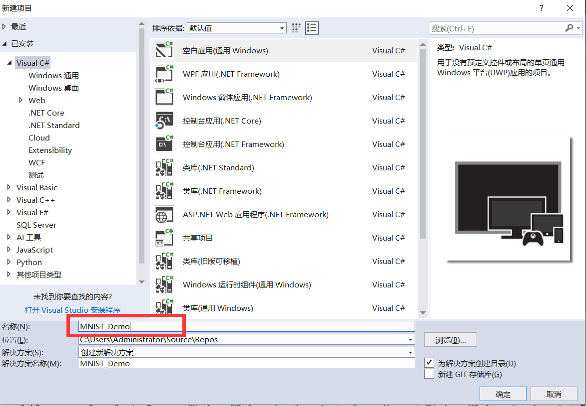
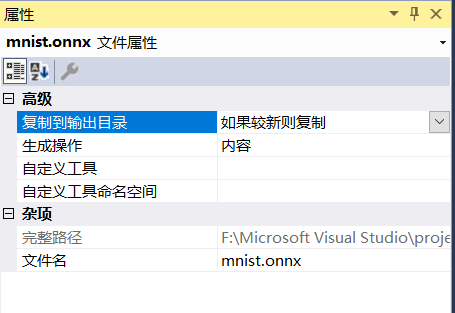
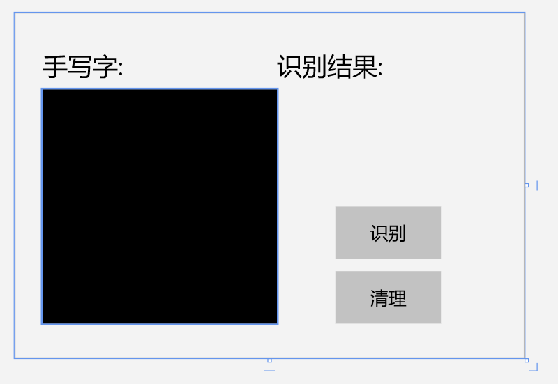

# WinML

## 创建UWP项目 

打开Visual Studio 2017，新建项目，在Visual C#分类中选择空白应用(通用 Windows)，填写项目名称为MNIST_Demo，点击确定
在弹出的对话框中，设置目标版本和最低版本都是17763
**如果系统等级低了升级windows系统**

-----------

## 添加模型文件到项目中
打开解决方案资源管理器中，在项目中的Assets目录上点右键->添加->现有项，添加模型文件mnist.onnx。在模型文件上点右键，属性，然后在属性面板上，将生成操作属性改为内容，将复制到输出目录属性改为如果较新则复制。
打开解决方案资源管理器，应该可以看到在项目根目录自动生成了和模型同名的代码文件mnist.cs，里面就是对该模型的一层封装，包括了输入输出的定义、加载模型的方法以及推理的方法。

## 界面设计
    <Grid
            x:Name="parentGrid"
            Margin="40">
            <Grid.RowDefinitions>
                <RowDefinition Height="70" />
                <RowDefinition Height="336" />
            </Grid.RowDefinitions>
            <Grid.ColumnDefinitions>
                <ColumnDefinition Width="336" />
                <ColumnDefinition Width="336" />
            </Grid.ColumnDefinitions>

            <TextBlock Text="手写字:"
                FontSize="36"
                VerticalAlignment="Center"
                Grid.Row="0"
                Grid.Column="0" />
            <TextBlock Text="识别结果:"
                FontSize="36"
                VerticalAlignment="Center"
                Grid.Column="1" Margin="0,0,142,0" />
            <Button 
                Name="recognizeButton"
                Content="识别"
                Click="recognizeButton_Click"
                FontSize="26"
                Grid.Column="1" 
                Grid.Row="1" 
                Height="75" 
                Width="150"
                Margin="85,168,0,0" 
                VerticalAlignment="Top"/>
            <Button 
                Name="clearButton"
                Content="清理"
                Click="clearButton_Click"
                FontSize="26"
                Grid.Column="1" 
                Grid.Row="1" 
                Height="75" 
                Width="150"
                Margin="85,261,0,0" 
                VerticalAlignment="Top"/>
            <TextBlock Name="numberLabel"
                FontSize="100" 
                Grid.Column="1" 
                Margin="60,0,100,192"
                Text="" VerticalAlignment="Bottom" Grid.Row="1"/>
            <Border BorderThickness="4"
                BorderBrush="Black"
                Margin="0,0,0,0"
                Grid.Row="1"
                Grid.Column="0"/>

            <Grid Name="inkGrid" 
                Background="Black"
                Grid.Row="1"
                Grid.Column="0">
                <InkCanvas 
                        Name="inkCanvas"
                        Height="336" 
                        Width="336"/>
            </Grid>
            
    </Grid>

效果图如下

## 添加按钮的事件响应
前面XAML文件中给按钮添加事件，这里在MainPage.xaml.cs中完成对应的实现。

**recognizeButton_Click**识别数字

    private async void recognizeButton_Click(object sender, RoutedEventArgs e)
            {
                //Bind model input with contents from InkCanvas
                VideoFrame vf = await helper.GetHandWrittenImage(inkGrid);
                mnistInput.Input3 = ImageFeatureValue.CreateFromVideoFrame(vf);
                
                //Evaluate the model
                mnistOutput = await modelGen.EvaluateAsync(mnistInput);

                //Convert output to datatype
                IReadOnlyList<float> vectorImage = mnistOutput.Plus214_Output_0.GetAsVectorView();
                IList<float> imageList = vectorImage.ToList();

                //LINQ query to check for highest probability digit
                var maxIndex = imageList.IndexOf(imageList.Max());

                //Display the results
                numberLabel.Text = maxIndex.ToString();
            }

**clearButton_Click**清空内容

    private void clearButton_Click(object sender, RoutedEventArgs e)
            {
                inkCanvas.InkPresenter.StrokeContainer.Clear();
                numberLabel.Text = "";
            }

## 加载模型并推理

在自动生成的模型封装文件BearModel.cs中已经封装了加载模型的方法和推理的方法，直接调用就可以。

    
# 总结
这个实验我用WinML,onnxRuntime和AI tools都做了一遍，在我看来，AI tools是非常复杂的，而另外两个简单很多。onnxRuntime的界面更加漂亮，也是最容易操作的，其模板的cs文件是自动生成其中代码也不用改。onnxRuntime也很简单，但是其界面不是很好看，可能需要很好的布局编程基础。

我目前只会简单的布局添加和颜色修改。可以在这里学习[WPF InkCanvas基本操作代码演示](https://blog.csdn.net/u012366767/article/details/81265922)。