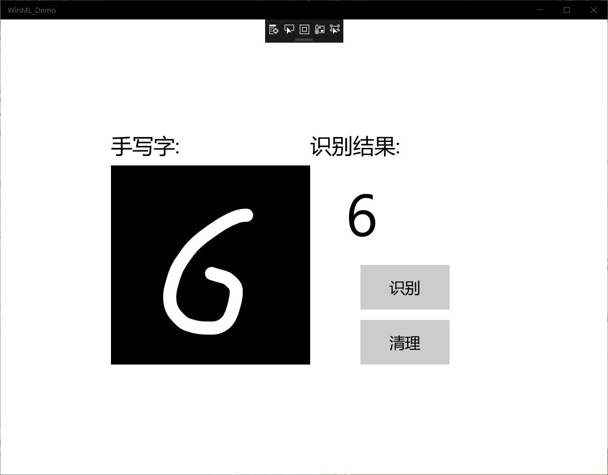
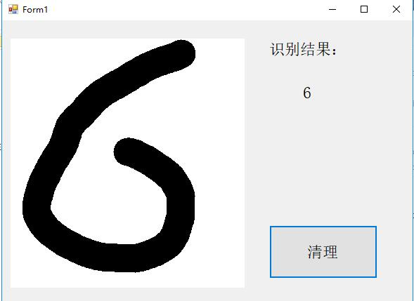

 # MNIST 手写数字
 ## 实验过程
  
 ### 启动UWP

从GitHub下载项目后，启动Visual Studio并打开MNIST_Demo.sln文件.如果解决方案显示为不可用，则需要在解决方案资源管理器中右键单击该项目，然后选择Reload Project。

我们提供了带有已实现的XAML控件和事件的模板，包括：

    InkCanvas绘制数字。 用于解释数字并清除画布的按钮。 帮助程序将InkCanvas输出转换为VideoFrame的例程。 在解决方案资源管理器内部，该项目具有三个主要代码文件：

    MainPage.xaml-我们所有的XAML代码都为InkCanvas，按钮和标签创建UI 。

    MainPage.xaml.cs-我们的应用程序代码所在的位置。

    Helper.cs-裁剪和转换图像格式的帮助程序例程。

### 构建并运行项目  

在Visual Studio工具栏中，将解决方案平台更改为x64，以在您的设备为64位时在本地计算机上运行该项目，如果设备为32位，则在x86上运行。（您可以在Windows设置应用中检入：“ 系统”>“关于”>“设备规格”>“系统类型”。）

要运行项目，请单击工具栏上的“ 开始调试”按钮，或按F5键。该应用程序应该显示一个InkCanvas，用户可以在其中写一个数字，一个Recognize按钮来解释该数字，一个空标签字段，其中解释后的数字将以文本形式显示，以及一个Clear Digit按钮来清除InkCanvas。
 
### 添加模型  

右键单击解决方案资源管理器中的Assets文件夹，然后选择“ 添加” >“ 现有项”。将文件选择器指向ONNX模型的位置，然后单击添加。

该项目现在应该有两个新文件： mnist.onnx-训练的模型。 mnist.cs -Windows ML生成的代码
为了确保在编译应用程序时能够构建模型，请右键单击mnist.onnx文件，然后选择Properties。对于Build Action，选择Content。
现在，让我们看一下mnist.cs文件中新生成的代码。我们分为三类：
mnistModel创建机器学习模型表示，在系统默认设备上创建会话，将特定的输入和输出绑定到模型，并异步评估模型。 mnistInput初始化模型期望的输入类型。在这种情况下，输入需要一个ImageFeatureValue。 mnistOutput初始化模型将输出的类型。在这种情况下，输出将是TensorFloat类型的名为Plus214_Output_0的列表。然后进行加载，绑定和评估模型。

### 加载，绑定和评估模型

MainPage.xaml.cs的代码如下

        using System;
        using System.Collections.Generic;
        using System.Linq;
        using Windows.Foundation;
        using Windows.UI.Xaml;
        using Windows.UI.Xaml.Controls;
        using Windows.Storage;
        using Windows.UI.Xaml.Media.Imaging;
        using Windows.AI.MachineLearning;
        using Windows.Media;
        using Windows.Storage.Streams;
        using System.Threading.Tasks;

        namespace MNIST_Demo
        {
            public sealed partial class MainPage : Page
            {
                private mnistModel modelGen;
                private mnistInput mnistInput = new mnistInput();
                private mnistOutput mnistOutput;
                //private LearningModelSession    session;
                private Helper helper = new Helper();
                RenderTargetBitmap renderBitmap = new RenderTargetBitmap();

                public MainPage()
                {
                    this.InitializeComponent();

                    // Set supported inking device types.
                    inkCanvas.InkPresenter.InputDeviceTypes = Windows.UI.Core.CoreInputDeviceTypes.Mouse | Windows.UI.Core.CoreInputDeviceTypes.Pen | Windows.UI.Core.CoreInputDeviceTypes.Touch;
                    inkCanvas.InkPresenter.UpdateDefaultDrawingAttributes(
                        new Windows.UI.Input.Inking.InkDrawingAttributes()
                        {
                            Color = Windows.UI.Colors.White,
                            Size = new Size(22, 22),
                            IgnorePressure = true,
                            IgnoreTilt = true,
                        }
                    );
                    LoadModelAsync();
                }

                private async Task LoadModelAsync()
                {
                    //Load a machine learning model
                    StorageFile modelFile = await StorageFile.GetFileFromApplicationUriAsync(new Uri($"ms-appx:///Assets/mnist.onnx"));
                    modelGen = await mnistModel.CreateFromStreamAsync(modelFile as IRandomAccessStreamReference);
                }

                private async void recognizeButton_Click(object sender, RoutedEventArgs e)
                {
                    //Bind model input with contents from InkCanvas
                    VideoFrame vf = await helper.GetHandWrittenImage(inkGrid);
                    mnistInput.Input3 = ImageFeatureValue.CreateFromVideoFrame(vf);
                    
                    //Evaluate the model
                    mnistOutput = await modelGen.EvaluateAsync(mnistInput);

                    //Convert output to datatype
                    IReadOnlyList<float> vectorImage = mnistOutput.Plus214_Output_0.GetAsVectorView();
                    IList<float> imageList = vectorImage.ToList();

                    //LINQ query to check for highest probability digit
                    var maxIndex = imageList.IndexOf(imageList.Max());

                    //Display the results
                    numberLabel.Text = maxIndex.ToString();
                }

                private void clearButton_Click(object sender, RoutedEventArgs e)
                {
                    inkCanvas.InkPresenter.StrokeContainer.Clear();
                    numberLabel.Text = "";
                }
            }
        }

### 运行结果
   基于Windows Machine Learning的手写数字推理识别
   
   基于ONNX Runtime的手写数字推理识别
   

## 实验总结
Windows Machine Learning 需要win10版本在1809以上，由于我的电脑版本不够，与其他同学一起完成。这两个方法都可以达到目的，通过这半天的学习，我了解到一些关于c#的知识，两个方法都是在给定的代码上做了一点修改完成的，自己完成的话就无从下手，在今后的学习中要加强编程的学习，对集中编程语言要有更多的理解，还要学会如何调试代码，对将来都很受益。
